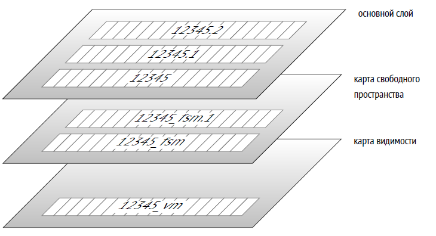

## 1. Базы данных и кластеры

### Основы

- **PostgreSQL** — это СУБД, которая при запуске работает как сервер (экземпляр сервера). Сервер управляет **кластером баз данных** —
  набором нескольких баз данных, которые хранятся в одном каталоге, называемом **PGDATA**.
- **PGDATA** — это каталог файловой системы, содержащий все данные кластера (таблицы, индексы, конфигурации). Он задается переменной
  окружения **PGDATA** или параметрами при запуске сервера.
- Перед использованием кластер должен быть **инициализирован** с помощью утилиты `initdb`, которая создает структуру каталогов и базовые
  файлы.

### Базы данных по умолчанию

При инициализации кластера создаются три базы данных:

1. **template0**:
    - Используется для восстановления из логических резервных копий или создания баз с другой кодировкой.
    - Не подлежит изменениям, чтобы сохранить чистую копию начального состояния.
    - Пример использования: создание базы с кодировкой, отличной от кластера (`CREATE DATABASE newdb TEMPLATE template0 ENCODING 'UTF8';`).
2. **template1**:
    - Служит шаблоном для новых баз данных, создаваемых командой `CREATE DATABASE`.
    - Может быть модифицирована пользователем для добавления стандартных объектов (таблиц, функций и т.д.) в новые базы.
    - Пример: добавление таблицы в `template1` делает её доступной во всех новых базах.
3. **postgres**:
    - Обычная база данных для общего использования.
    - Подходит для хранения пользовательских данных, если не требуется создание специализированных баз.

### Кластер баз данных

- Один экземпляр PostgreSQL управляет несколькими базами одновременно, образующими кластер.
- Каждая база изолирована: объекты (таблицы, схемы) в одной базе не видны в другой, если не настроено иное.
- Пример структуры кластера:
  ```
  PGDATA/
  --- base/         # Каталог для баз данных
  ------ 16384/    # Каталог для базы postgres (OID=16384)
  ------ 1/        # Каталог для template1
  ------ 2/        # Каталог для template0
  --- global/       # Общие объекты кластера
  --- pg_tblspc/    # Символьные ссылки на табличные пространства
  ```

---

## 2. Системный каталог

### Описание

- **Системный каталог** — это набор таблиц и представлений, хранящих метаданные обо всех объектах кластера: базах данных, таблицах,
  индексах, типах, функциях и т.д.
- Каждая база данных имеет собственный системный каталог, описывающий её объекты. Также существуют общие таблицы кластера, доступные из
  любой базы (формально хранятся в базе с OID=0).

### Структура

- Таблицы системного каталога имеют префикс **pg_** (например, `pg_database`, `pg_class`, `pg_attribute`).
- Столбцы в этих таблицах начинаются с трехбуквенного кода, соответствующего имени таблицы (например, `datname` в `pg_database` для имени
  базы).
- Первичный ключ — столбец **oid** (тип `oid`, 32-битное целое число), уникально идентифицирующий объект.
- Пример: запрос для получения списка баз данных:
  ```sql
  SELECT oid, datname FROM pg_database;
  ```

### Механизм OID

- **OID** (Object Identifier) — это уникальный идентификатор, генерируемый единым счетчиком для всех объектов кластера.
- Особенности:
    - Используется в разных таблицах системного каталога.
    - Если диапазон значений (2??) исчерпан, счетчик обнуляется, а уникальность проверяется индексами.
    - Пример: таблица `pg_class` хранит `oid` для каждой таблицы или индекса.
- Запрос для проверки OID таблицы:
  ```sql
  SELECT oid, relname FROM pg_class WHERE relname = 'my_table';
  ```

### Доступ

- К системному каталогу можно обращаться через SQL-запросы.
- В клиенте `psql` доступны специальные команды, такие как `\dt` (список таблиц) или `\d` (описание объекта), которые упрощают просмотр
  метаданных.
- Пример: просмотр структуры таблицы `pg_database`:
  ```sql
  \d pg_database
  ```

---

## 3. Схемы

### Определение

- **Схемы** — это пространства имен внутри базы данных, позволяющие группировать объекты (таблицы, индексы, функции).
- Схемы помогают организовать данные и избежать конфликтов имен.

### Основные схемы

1. **public**:
    - Используется по умолчанию для пользовательских объектов, если схема не указана.
    - Пример: `CREATE TABLE my_table (...)` создает таблицу в схеме `public`.
2. **pg_catalog**:
    - Хранит таблицы и представления системного каталога.
    - Всегда включена в путь поиска (`search_path`).
3. **information_schema**:
    - Предоставляет стандартизированное (SQL) представление метаданных.
    - Пример: запрос списка таблиц:
      ```sql
      SELECT table_name FROM information_schema.tables WHERE table_schema = 'public';
      ```
4. **pg_toast**:
    - Используется для хранения данных, вынесенных по технологии TOAST (см. ниже).
5. **pg_temp**:
    - Содержит временные таблицы, создаваемые в схемах `pg_temp_N` для каждого пользователя.
    - Пример: временная таблица `temp_table` видна пользователю как `pg_temp.temp_table`.

### Путь поиска

- Параметр `search_path` определяет порядок поиска схем для объектов, если схема не указана явно.
- По умолчанию: `search_path = "$user", public`, где `"$user"` — схема с именем текущего пользователя.
- Схемы `pg_catalog` и `pg_temp` добавляются неявно.
- Пример настройки:
  ```sql
  SET search_path TO my_schema, public;
  ```

---

## 4. Табличные пространства

### Определение

- **Табличные пространства** — это физические каталоги в файловой системе, где хранятся данные базы.
- Позволяют разделять данные по типу носителей (например, медленные HDD для архивов, быстрые SSD для активных данных).

### По умолчанию

- **pg_default**:
    - Расположен в `PGDATA/base`.
    - Используется для объектов, если не указано иное.
- **pg_global**:
    - Расположен в `PGDATA/global`.
    - Хранит общие объекты системного каталога, доступные всему кластеру.

### Пользовательские табличные пространства

- Создаются с указанием каталога, на который в `PGDATA/pg_tblspc` создается символьная ссылка.
- Пример создания:
  ```sql
  CREATE TABLESPACE fast_space LOCATION '/mnt/fast_storage';
  ```
- Использование:
  ```sql
  CREATE TABLE my_table (id integer) TABLESPACE fast_space;
  ```

### Логическая и физическая структура

- Логическая структура (базы, схемы) независима от физической (табличные пространства).
- Одна база может использовать несколько табличных пространств, и одно пространство — несколько баз.

---

## 5. Отношения

### Определение

- **Отношения** — это объекты базы данных, состоящие из строк: таблицы, индексы, последовательности, материализованные представления.
- Термин происходит от реляционной теории, но в PostgreSQL охватывает больше объектов, чем классические таблицы.
- Хранятся в таблице `pg_class`, где столбцы начинаются с префикса `rel` (например, `relname`, `relfilenode`).

### Примеры

- **Таблицы**: хранят пользовательские данные.
- **Индексы**: содержат строки с индексированными значениями (например, B-дерево).
- **Последовательности**: однострочные таблицы для генерации уникальных чисел.
- **Материализованные представления**: хранят результат запроса как таблицу.
- Пример создания отношения:
  ```sql
  CREATE TABLE my_table (id integer, name text);
  SELECT relname, relkind FROM pg_class WHERE relname = 'my_table';
  -- relkind: 'r' (таблица)
  ```

---

## 6. Слои и файлы

### Слои

Каждое отношение делится на **слои** (forks), каждый из которых хранит определенный тип данных:

1. **Основной слой** (main fork):
    - Содержит данные таблицы или индекса.
    - Имя файла — числовой идентификатор (`relfilenode` из `pg_class`).
    - Пример: файл `16385` для таблицы с `relfilenode = 16385`.
2. **Карта свободного пространства** (free space map, `_fsm`):
    - Отслеживает свободное место на страницах для оптимизации вставки данных.
    - Создается после операций, таких как `VACUUM`.
    - Пример: файл `16385_fsm`.
3. **Карта видимости** (visibility map, `_vm`):
    - Хранит информацию о страницах, требующих очистки или заморозки.
    - Используется для ускорения `VACUUM` и индексного сканирования.
    - Пример: файл `16385_vm` (только для таблиц).
4. **Слой инициализации** (init fork, `_init`):
    - Создается для нежурналируемых таблиц (`UNLOGGED`) и их индексов.
    - Используется для восстановления пустого состояния после сбоя.
    - Пример: файл `16385_init`.



### Файлы

- Каждый слой представлен одним или несколькими файлами.
- Если файл превышает 1 ГБ, создается новый сегмент (например, `16385.1`, `16385.2`).
- Ограничение в 1 ГБ можно изменить при сборке PostgreSQL (`--with-segsize`).
- Файлы хранятся в подкаталогах табличных пространств, организованных по базам данных (например, `PGDATA/base/16384/` для базы с OID=16384).

### Пример

Создание и проверка файлов таблицы:

```sql
CREATE
UNLOGGED TABLE t (a integer, b numeric, c text, d json);
INSERT INTO t
VALUES (1, 2.0, 'foo', '{}');
SELECT pg_relation_filepath('t'); -- Вывод: base/16384/16385
SELECT size
FROM pg_stat_file('/usr/local/pgsql/data/base/16384/16385'); -- Размер основного слоя
VACUUM
t;
SELECT size
FROM pg_stat_file('/usr/local/pgsql/data/base/16384/16385_fsm'); -- Размер карты свободного пространства
```

---

## 7. Страницы

### Описание

- Файлы делятся на **страницы** (обычно 8 КБ) — минимальные единицы ввода-вывода.
- Размер страницы задается при сборке PostgreSQL (`--with-blocksize`, до 32 КБ).
- Страницы кэшируются в **буферном кэше** для ускорения доступа.

### Использование

- Алгоритмы PostgreSQL (например, `VACUUM`, вставка данных) ориентированы на работу со страницами.
- Пример: карта видимости использует 2 бита на страницу для отслеживания актуальности строк.

---

## 8. TOAST

### Определение

- **TOAST** (The Oversized Attributes Storage Technique) — технология для хранения длинных строк, которые не помещаются на одной странице (~
  2000 байт после вычета заголовка).
- Цель: обеспечить размещение строки на одной странице или вынести её части в отдельную таблицу.

### Стратегии

1. **plain**:
    - TOAST не используется (для коротких типов, например, `integer`).
2. **extended**:
    - Сначала сжатие, затем, если нужно, хранение в `pg_toast`.
3. **external**:
    - Хранение в `pg_toast` без сжатия (например, для JPEG).
4. **main**:
    - Сжатие, затем хранение в `pg_toast`, если сжатие не помогло.

### Алгоритм

1. Если строка превышает ~2000 байт, применяются стратегии `extended` и `external`:
    - Сжимаются атрибуты `extended`, выносятся в `pg_toast`, если всё ещё длинные.
    - Атрибуты `external` выносятся без сжатия.
2. Если строка всё ещё велика, сжимаются атрибуты `main`.
3. Если нужно, атрибуты `main` выносятся в `pg_toast`.

### TOAST-таблицы

- Создаются автоматически для таблиц с длинными типами (`text`, `json`, `numeric`).
- Хранятся в схеме `pg_toast` (или `pg_toast_temp_N` для временных таблиц).
- Структура: столбцы `chunk_id` (oid), `chunk_seq` (integer), `chunk_data` (bytea).
- Имеют индекс для быстрого доступа (например, `pg_toast_16385_index`).


### Сжатие

- Используются алгоритмы **PGLZ** (по умолчанию) или **LZ4** (более эффективный, с версии 15).
- Настройка: параметр `default_toast_compression` или `COMPRESSION` в `CREATE TABLE`.
- Пример изменения стратегии:
  ```sql
  ALTER TABLE t ALTER COLUMN c SET STORAGE external;
  ```

---

## 9. Процессы и память

### Процессы

- **Postmaster**:
    - Главный процесс, запускает и контролирует другие процессы.
    - Перезапускает процессы при сбоях.
- **Фоновые процессы**:
    - **startup**: восстанавливает данные после сбоев.
    - **autovacuum**: очищает устаревшие версии строк.
    - **wal writer**: записывает журнал предзаписи (WAL).
    - **checkpointer**: создает контрольные точки.
    - **writer**: записывает измененные страницы на диск.
    - **wal sender/receiver**: обеспечивают репликацию.
- **Backend**: обслуживает клиентские соединения.

### Память

- **Общая память**:
    - **Буферный кэш**: хранит страницы для ускорения ввода-вывода.
    - Другие буферы для оптимизации операций.
- **Журнал предзаписи (WAL)**:
    - Гарантирует согласованность данных при сбоях.
    - Записывает операции перед их применением.
- Двойное кэширование: PostgreSQL использует кэш операционной системы и собственный буферный кэш.

---

## 10. Клиент-серверный протокол

### Соединения

- **Postmaster** принимает клиентские подключения и создает процесс **backend** для каждого клиента.
- Проблемы большого числа соединений:
    - Высокое потребление памяти.
    - Затраты на установку соединений.
    - Снижение производительности из-за множества процессов.
- Решение: пулы соединений (например, **PgBouncer**, **Odyssey**).

### Протокол

- Реализуется через библиотеку **libpq** (или независимые реализации).
- Клиент подключается к базе под определенной ролью (пользователем).
- Аутентификация проверяет права доступа.
- SQL-запросы передаются в текстовом виде и обрабатываются backend-процессом.
- Пример подключения:
  ```sql
  psql -U username -d postgres
  ```

---

# Глава 2. Изоляция

---

## 2.1. Согласованность

### Основы

- **Согласованность** (consistency) — это корректность данных, обеспечиваемая реляционными СУБД. Она шире, чем **целостность** (integrity),
  которая поддерживается ограничениями, такими как `NOT NULL`, `UNIQUE`, `CHECK`, `FOREIGN KEY`.
- Ограничения целостности задаются на уровне базы данных, и СУБД гарантирует их соблюдение. Например:
  ```sql
  ALTER TABLE accounts ADD CONSTRAINT positive_balance CHECK (amount >= 0);
  ```
- Однако согласованность включает более сложные правила, которые не всегда можно выразить ограничениями (например, правила, охватывающие
  несколько таблиц). Такие правила контролируются приложением, и СУБД не знает о них.
- Пример: правило «сумма на всех счетах клиента не может быть отрицательной» сложно выразить как ограничение, но оно критично для
  согласованности.

### Роль СУБД

- Если приложение выполняет корректные операции, СУБД обеспечивает согласованность через **транзакции** — неделимые наборы операций,
  переводящие базу из одного корректного состояния в другое.
- **Пример с переводом денег**:
    - Правило: сумма денег на всех счетах не меняется при переводе.
    - Операции:
        1. `UPDATE accounts SET amount = amount - 100 WHERE id = 1;` (нарушение согласованности)
        2. `UPDATE accounts SET amount = amount + 100 WHERE id = 2;` (восстановление согласованности)
    - Если вторая операция не выполнится (например, из-за сбоя), согласованность нарушится. Транзакции решают эту проблему, гарантируя
      атомарность (все операции или ни одной).

### Проблема конкурентного выполнения

- Транзакции, корректные по отдельности, могут вести к некорректным результатам при одновременном (конкурентном) выполнении из-за
  перемешивания операций.
- **Аномалии одновременного выполнения** возникают, когда порядок операций разных транзакций нарушает согласованность.
- Пример аномалии: **грязное чтение** — чтение незафиксированных изменений другой транзакции, которые могут быть отменены.
- СУБД изолирует транзакции, чтобы результат конкурентного выполнения соответствовал какому-либо последовательному выполнению, минимизируя
  аномалии.

### ACID

- Согласованность связана с тремя свойствами транзакций из акронима **ACID**:
    - **Atomicity** (атомарность): все операции транзакции выполняются или ни одна.
    - **Consistency** (согласованность): база остается в корректном состоянии.
    - **Isolation** (изоляция): транзакции не мешают друг другу.
- **Durability** (долговечность) также связана: после сбоя система восстанавливает согласованность, удаляя изменения незафиксированных
  транзакций.

### Проблема полной изоляции

- Полная изоляция (отсутствие всех аномалий) сложна технически и снижает производительность, так как требует строгой синхронизации
  транзакций.
- На практике используются ослабленные уровни изоляции, допускающие некоторые аномалии, что перекладывает часть ответственности за
  согласованность на приложение.

---

## 2.2. Уровни изоляции и аномалии в стандарте SQL

### Уровни изоляции

Стандарт SQL определяет четыре уровня изоляции, различающиеся по допустимым аномалиям:

1. **Read Uncommitted**
2. **Read Committed**
3. **Repeatable Read**
4. **Serializable**

### Аномалии

1. **Потерянное обновление** (lost update):
    - Две транзакции читают одну строку, обновляют её, и вторая перезаписывает изменения первой.
    - Пример: две транзакции увеличивают баланс с 1000 ? на 100 ?, но итог — 1100 ? вместо 1200 ?.
    - Запрещено на всех уровнях изоляции.
2. **Грязное чтение** (dirty read):
    - Чтение незафиксированных изменений, которые могут быть отменены.
    - Пример: транзакция А переводит 100 ?, транзакция Б видит это до фиксации, но А откатывается.
    - Допустимо только на **Read Uncommitted**.
3. **Неповторяющееся чтение** (non-repeatable read):
    - Транзакция читает строку дважды, но между чтениями другая транзакция изменяет строку.
    - Пример: транзакция А проверяет баланс (1000 ?), транзакция Б уменьшает его до 0, и А продолжает с устаревшими данными.
    - Допустимо на **Read Uncommitted** и **Read Committed**.
4. **Фантомное чтение** (phantom read):
    - Транзакция читает набор строк по условию дважды, но между чтениями другая транзакция добавляет новые строки.
    - Пример: транзакция А проверяет количество счетов клиента (2), транзакция Б добавляет счёт, и А видит 3.
    - Допустимо на **Read Uncommitted**, **Read Committed**, **Repeatable Read**.
5. **Другие аномалии**:
    - Стандарт не перечисляет все возможные аномалии (например, несогласованное чтение).
    - **Serializable** устраняет все аномалии, включая неизвестные.

### Таблица аномалий

| Уровень изоляции | Потерянное обновление | Грязное чтение | Неповторяющееся чтение | Фантомное чтение | Другие аномалии |
|------------------|-----------------------|----------------|------------------------|------------------|-----------------|
| Read Uncommitted | —                     | Да             | Да                     | Да               | Да              |
| Read Committed   | —                     | —              | Да                     | Да               | Да              |
| Repeatable Read  | —                     | —              | —                      | Да               | Да              |
| Serializable     | —                     | —              | —                      | —                | —               |

### Почему эти аномалии?

- Выбор аномалий в стандарте исторический: в 1970–80-х годах теория баз данных отставала от практики.
- Уровни изоляции основаны на **двухфазном блокировании** (2PL):
    - Транзакция блокирует строки на чтение или запись.
    - Больше блокировок — выше изоляция, но ниже производительность.
    - **Read Uncommitted**: блокировки только на запись.
    - **Read Committed**: блокировки на чтение и запись для изменяемых строк.
    - **Repeatable Read**: блокировки на все читаемые и изменяемые строки.
    - **Serializable**: требует блокировки предикатов (условий), что сложно реализовать.
- Предикатные блокировки (для предотвращения фантомов) были предложены в 1976 году, но их практическая реализация ограничена.

---

## 2.3. Уровни изоляции в PostgreSQL

PostgreSQL использует **изоляцию на основе снимков** (Snapshot Isolation, SI) с многоверсионной моделью (MVCC), где строки хранятся в
нескольких версиях. Это отличается от стандартного подхода, основанного на блокировках, и обеспечивает более высокую производительность.

### Особенности

- **Снимок данных**: каждая транзакция видит согласованное состояние базы на момент начала (или первого запроса).
- **Многоверсионность**: разные версии строки сосуществуют, позволяя читать устаревшие данные без конфликтов.
- **Блокировки**: минимальны, только для одновременных изменений одной строки.
- **Read Uncommitted** в PostgreSQL работает как **Read Committed**, поэтому не рассматривается отдельно.
- Уровни изоляции:
    - **Read Committed**: допускает потерянное обновление, неповторяющееся и фантомное чтение, а также несогласованное чтение.
    - **Repeatable Read**: предотвращает все стандартные аномалии, но допускает несогласованную запись и аномалию только читающей
      транзакции.
    - **Serializable**: устраняет все аномалии, но с накладными расходами.

### Таблица аномалий в PostgreSQL

| Уровень изоляции | Потерянное обновление | Грязное чтение | Неповторяющееся чтение | Фантомное чтение | Другие аномалии |
|------------------|-----------------------|----------------|------------------------|------------------|-----------------|
| Read Committed   | Да                    | —              | Да                     | Да               | Да              |
| Repeatable Read  | —                     | —              | —                      | —                | Да              |
| Serializable     | —                     | —              | —                      | —                | —               |

## 2.4. Какой уровень изоляции использовать?

### Read Committed

- **Плюсы**:
    - По умолчанию, минимальные накладные расходы.
    - Нет ошибок сериализации, не требует повторов транзакций.
- **Минусы**:
    - Допускает множество аномалий (неповторяющееся чтение, фантомное чтение, несогласованное чтение, потерянное обновление).
    - Требует осторожного написания кода: использовать один SQL-оператор или блокировки.
    - Сложно тестировать и отлаживать аномалии.
- **Применение**: подходит для простых приложений, где аномалии редки или контролируются кодом.

### Repeatable Read

- **Плюсы**:
    - Устраняет стандартные аномалии (грязное, неповторяющееся, фантомное чтение).
    - Идеально для читающих транзакций (например, отчеты).
- **Минусы**:
    - Допускает несогласованную запись и аномалию читающей транзакции.
    - Пишущие транзакции требуют обработки ошибок сериализации.
- **Применение**: для читающих транзакций или приложений, где важна стабильность данных.

### Serializable

- **Плюсы**:
    - Устраняет все аномалии, упрощает разработку.
    - Требует только обработки ошибок сериализации.
- **Минусы**:
    - Накладные расходы на обнаружение аномалий.
    - Возможны ложноположительные ошибки, увеличивающие повторы.
    - Не работает на репликах, требует единообразного использования.
- **Применение**: для критически важных приложений, где согласованность приоритетна.

---

# 3 Страницы и версии строк в PostgreSQL

---

## 3.1. Структура страниц

### Основы

- **Страницы** — минимальные единицы ввода-вывода в PostgreSQL (обычно 8 КБ, задается при сборке параметром `--with-blocksize`).
- Каждая страница имеет фиксированную внутреннюю разметку, содержащую:
    1. **Заголовок** (в младших адресах).
    2. **Массив указателей на версии строк**.
    3. **Свободное пространство**.
    4. **Версии строк** (данные).
    5. **Специальная область** (в старших адресах).

### Заголовок страницы

- Расположен в начале страницы, фиксированного размера (обычно 24 байта).
- Содержит:
    - Контрольную сумму.
    - Указатели на начало и конец других областей (`lower`, `upper`, `special`).
    - Дополнительные метаданные (например, флаги страницы).
- Пример анализа с использованием расширения `pageinspect`:
  ```sql
  CREATE EXTENSION pageinspect;
  SELECT lower, upper, special, pagesize
  FROM page_header(get_raw_page('accounts', 0));
  ```
  Вывод:
  ```
  lower | upper | special | pagesize
  ------+-------+---------+---------
  152   | 6904  | 8192    | 8192
  ```
    - `lower`: начало массива указателей (152 байта от начала страницы).
    - `upper`: конец свободного пространства (6904 байта).
    - `special`: начало специальной области (8192 байта, конец страницы).
    - `pagesize`: размер страницы (8192 байт = 8 КБ).

### Специальная область

- Расположена в конце страницы (старшие адреса).
- Используется для индексов (например, B-дерево хранит метаданные или ссылки на дочерние узлы).
- Для таблиц обычно имеет нулевой размер.
- Пример: в B-дереве нулевая страница хранит метаданные, а обычные страницы — индексные записи.

### Версии строк

- **Версии строк** (row versions, tuples) — это данные таблицы с добавленной служебной информацией.
- Многоверсионность (MVCC) позволяет хранить несколько версий одной строки для поддержки конкурентного доступа.
- В отличие от таблиц, индексы не содержат версий строк, а ссылаются на все табличные версии через идентификаторы (`tid`).

### Указатели на версии строк

- Массив указателей (line pointers) — это оглавление страницы, расположенное после заголовка.
- Каждый указатель (4 байта) содержит:
    - Смещение версии строки относительно начала страницы.
    - Длину версии строки.
    - Статус (например, `normal`, `unused`, `redirect`, `dead`).
- Идентификатор версии строки (`tid`) состоит из:
    - Номера страницы в файле основного слоя.
    - Номера указателя в массиве (не смещения, для избежания фрагментации при перемещении строк).
- Пример: `tid = (0,1)` указывает на первую строку на странице 0.

### Свободное пространство

- Расположено между указателями и версиями строк.
- Всегда представлено одним непрерывным фрагментом (без фрагментации).
- Отслеживается в карте свободного пространства (`_fsm`) для оптимизации вставки данных.

### Схема страницы

```
0          24         lower         upper         special       pagesize
|----------|----------|-------------|-------------|-------------|
| Заголовок| Указатели| Свободное   | Версии строк| Специальная |
|          |          | пространство |             | область     |
```

---

## 3.2. Структура версий строк

### Основы

- Версия строки состоит из:
    - **Заголовка** (минимально 23 байта).
    - **Данных** (собственно значения столбцов).
- Заголовок содержит:
    - `xmin`: номер транзакции, создавшей строку (`INSERT`).
    - `xmax`: номер транзакции, удалившей или обновившей строку.
    - `infomask`: биты, определяющие свойства версии (например, статус `xmin` и `xmax`).
    - `ctid`: ссылка на следующую версию строки (тип `tid`, например, `(0,2)`).
    - Битовую карту `NULL`-значений (для столбцов, допускающих `NULL`).
- Данные выровнены по границам машинных слов (например, 4 или 8 байт в зависимости от архитектуры).


## 3.3. Выполнение операций над версиями строк

- Каждая версия строки имеет поля `xmin` и `xmax`, использующие номера транзакций (`xid`) для определения видимости.
- Номера транзакций — 32-битные счетчики, увеличивающиеся последовательно.
- **Операции**:
    - `INSERT`: создает новую версию строки с `xmin = текущий xid`.
    - `DELETE`: устанавливает `xmax = текущий xid` в текущей версии.
    - `UPDATE`: комбинация `DELETE` (установка `xmax`) и `INSERT` (новая версия с `xmin = текущий xid`).
    - `MERGE` (с версии 15): разбивается на `INSERT`, `UPDATE`, `DELETE`.


## 3.4. Индексы

- Индексы не содержат версий строк, только ссылки (`tid`) на все версии строк в таблице.
- Транзакция проверяет видимость версии строки в таблице с учетом `xmin`, `xmax` и карты видимости.

---

## 3.5. TOAST

- **TOAST** — технология для хранения длинных значений (более ~2000 байт).
- TOAST-таблицы:
    - Хранятся в схеме `pg_toast`, имеют собственную многоверсионность.
    - Строки только добавляются или удаляются, не обновляются.
- При обновлении:
    - Если длинное значение не изменилось, новая версия строки ссылается на старое значение в TOAST.
    - Если изменилось, создается новая версия в TOAST.

---

## 3.6. Виртуальные транзакции

- **Виртуальные номера транзакций** (`virtual xid`):
    - Используются для читающих транзакций, чтобы экономить реальные номера (`xid`).
    - Формат: идентификатор процесса + последовательный номер.
    - Хранятся только в памяти, не записываются на диск.

---

## 3.7. Вложенные транзакции

### Точки сохранения

- **Точки сохранения** (`SAVEPOINT`) позволяют откатить часть транзакции без её завершения.
- Реализуются через **вложенные транзакции** (`subtransactions`):
    - Каждая имеет собственный номер (`xid`), больший, чем у основной транзакции.
    - Статус хранится в `clog` и `PGDATA/pg_subtrans`.
    - Если основная транзакция откатывается, все вложенные считаются отмененными.


# 4. Снимки данных


## 4.1. Что такое снимок данных

### Основы

- **Снимок данных** (snapshot) — это согласованное представление данных базы на определенный момент времени, соответствующее свойствам *
  *ACID** (в частности, согласованности и изоляции).
- Снимок включает только **актуальные версии строк**, зафиксированные к моменту его создания.
- **Многоверсионность** (MVCC): физически в таблицах могут существовать несколько версий одной строки, но каждая транзакция видит максимум
  одну из них, определенную снимком.
- **Изоляция**: каждая транзакция работает со своим снимком, что обеспечивает независимость от других транзакций и согласованность данных на
  разные моменты времени.

### Создание снимков

- **Read Committed**:
    - Новый снимок создается для **каждого оператора** в транзакции.
    - Активен только во время выполнения оператора.
- **Repeatable Read и Serializable**:
    - Один снимок создается в начале **первого оператора** транзакции.
    - Остается активным до конца транзакции.
- **Графическое представление**:
  ```
  Read Committed:
  xid:       |------|------|
             | снимок1 | снимок2 |
             | оператор1 | оператор2 |

  Repeatable Read/Serializable:
  xid:       |-------------|
             |   снимок    |
             | оператор1 | оператор2 |
  ```

---

## 4.2. Видимость версий строк в снимке

### Основы

- Снимок не является физической копией данных, а задается **набором параметров**, определяющих, какие версии строк видны.
- Видимость зависит от полей заголовка версии строки:
    - `xmin`: номер транзакции, создавшей строку (`INSERT`).
    - `xmax`: номер транзакции, удалившей или обновившей строку.
    - Информационные биты (`infomask`): статус транзакций (`xmin_committed`, `xmin_aborted`, `xmax_committed`, `xmax_aborted`).
- **Правило видимости** (упрощенно):
    - Версия строки видна, если:
        - Изменения транзакции `xmin` видны (транзакция зафиксирована до создания снимка или это собственные изменения текущей транзакции).
        - Изменения транзакции `xmax` не видны (транзакция не завершена, началась после снимка или отменена).
- Интервалы `xmin`–`xmax` не пересекаются, поэтому в снимке видна максимум одна версия строки.

### Пример видимости

- Сценарий:
    - Транзакция 1 (`xid=1`) активна.
    - Транзакция 2 (`xid=2`) завершилась до создания снимка.
    - Транзакция 3 (`xid=3`) началась после снимка.
- Графически:
  ```
  xid:    1       2       3
         |-------|-------|-------|
                | снимок |
  ```
    - Транзакция 2: изменения видны (завершилась до снимка).
    - Транзакция 1: изменения не видны (активна на момент снимка).
    - Транзакция 3: изменения не видны (началась после снимка).

---

## 4.3. Из чего состоит снимок

### Проблема времени фиксации

- PostgreSQL не отслеживает момент фиксации транзакций (кроме случаев, когда включен параметр `track_commit_timestamp`, используемый для
  репликации).
- Доступна информация:
    - Номер транзакции (`xid`) — момент начала.
    - Текущий статус транзакции (активна, зафиксирована, отменена) через структуру `ProcArray` в общей памяти.
- Для определения видимости снимок должен содержать статусы транзакций на момент его создания.

### Состав снимка

Снимок включает:

1. **Нижняя граница (`xmin`)**:
    - Номер самой старой активной транзакции на момент создания снимка.
    - Все транзакции с `xid < xmin` либо зафиксированы (видны), либо отменены (не видны).
2. **Верхняя граница (`xmax`)**:
    - Значение на 1 больше номера последней зафиксированной транзакции.
    - Транзакции с `xid >= xmax` не видны (не завершены или не существуют).
3. **Список активных транзакций (`xip_list`)**:
    - Номера всех активных транзакций (`xmin <= xid < xmax`), кроме виртуальных.
4. Дополнительные параметры (например, `cmin` для учета операций внутри транзакции).

### Графическое представление

```
xid:    1       2       3
       |-------|-------|-------|
       |<-- снимок -->|
       xmin           xmax
       xip_list: [1]
```

---

## 4.4. Видимость собственных изменений

- Транзакция должна видеть свои изменения, даже если они не зафиксированы.
- Однако некоторые изменения (например, сделанные после открытия курсора) могут быть не видны.

### Поле `cmin`/`cmax`

- В заголовке версии строки есть поле для хранения **порядкового номера операции** внутри транзакции:
    - `cmin`: номер операции вставки.
    - `cmax`: номер операции удаления.
    - Для экономии места используется одно поле, а при совпадении операций (`INSERT` и `DELETE` в одной транзакции) создается «комбо-номер»
      с отображением в памяти процесса.
- Курсоры учитывают только версии строк с `cmin` меньше номера операции открытия курсора.

---

## 4.5. Горизонт транзакции


- **Горизонт транзакции** — это нижняя граница снимка (`xmin`), определяющая самую старую активную транзакцию.
- Транзакции с `xid < xmin`:
    - Либо зафиксированы (видны).
    - Либо отменены (не видны).
- **Горизонт базы данных**:
    - Наименьший `xmin` среди всех активных транзакций в базе.
    - Определяет, какие версии строк можно безопасно удалить (очистка, `VACUUM`).
- **Виртуальные транзакции**:
    - Имеют горизонт только при активном снимке.
    - Без снимка (например, в `Read Committed` между операторами) горизонт не определен.

- Долгие транзакции (`Repeatable Read`, `Serializable`, или `Read Committed` в состоянии `idle in transaction`) удерживают горизонт,
  препятствуя очистке.
- Долгие транзакции увеличивают объем неактуальных версий строк, вызывая раздувание таблиц и индексов.
- **Графическое представление**:
  ```
  xid:  1  2  3  4  5  6  7  8  9 10
       |-------------------|
       | горизонт базы данных |
       | неактуальные версии можно вычищать |
  ```

---

## 4.6. Снимок данных для системного каталога


- Системный каталог (таблицы в схеме `pg_catalog`) использует **отдельные снимки**, чтобы всегда видеть последние изменения (например, новые
  столбцы или ограничения).
- Обычный снимок транзакции может быть устаревшим, что недопустимо для каталога.
- Реализация:
    - Создается «свежий» снимок для каждого обращения к каталогу.
    - Кэширование объектов каталога оптимизирует производительность.


---

## 4.7. Экспорт снимка данных

- **Экспорт снимка** позволяет нескольким транзакциям видеть одну и ту же согласованную картину данных.
- Используется, например, в `pg_dump` для параллельного резервного копирования.
- Механизм:
    - Функция `pg_export_snapshot()` возвращает идентификатор снимка.
    - Команда `SET TRANSACTION SNAPSHOT` импортирует снимок в другую транзакцию (требуется `Repeatable Read` или `Serializable`).

---

# 5. Внутристраничная очистка и hot-обновления

### Проблема стандартного `UPDATE`

Чтобы понять гениальность HOT-обновлений, нужно знать, как работает обычный `UPDATE` в PostgreSQL из-за его MVCC-архитектуры (многоверсионность):

1.  **`UPDATE` — это `DELETE` + `INSERT`.** Когда вы делаете `UPDATE users SET balance = balance + 10 WHERE id = 123;`, PostgreSQL не перезаписывает старую строку. Он:
    *   Помечает старую версию строки как "мертвую" (dead tuple).
    *   Создает **новую версию** строки с новым значением `balance` и вставляет её в **новое физическое место** на диске.
2.  **Индексы тоже обновляются.** Поскольку новая версия строки находится в новом месте (у неё новый TID — Tuple ID), PostgreSQL обязан обновить **каждый индекс** на этой таблице, чтобы он указывал на новую строку.

**Последствия:**
*   **Раздувание таблицы (Table Bloat):** "Мертвые" строки занимают место, пока их не уберет `VACUUM`.
*   **Раздувание индексов (Index Bloat):** Обновление даже одного неиндексированного столбца приводит к созданию новых записей во всех индексах. Это очень дорого.
*   **Высокие издержки:** Множество операций записи на диск (в таблицу, во все индексы) и в журнал предзаписи (WAL).

---

###  HOT-обновления (Heap-Only Tuple Updates)

**Суть в одном предложении:** Это супероптимизированный `UPDATE`, который позволяет создать новую версию строки на той же странице данных, что и старая, **без необходимости обновлять индексы**.

**Как это работает (магия PostgreSQL):**

1.  **Главное условие:** HOT-обновление возможно только тогда, когда:
    *   Новая версия строки может поместиться на **той же странице данных**, что и старая.
    *   Значения в **индексированных столбцах не изменяются**.

2.  **Процесс HOT-обновления:**
    *   PostgreSQL создает новую версию строки, как обычно.
    *   Он размещает её на **той же самой странице** данных (в "куче" — heap).
    *   **Ключевой момент:** Он НЕ обновляет записи в индексах. Индексы по-прежнему указывают на **физическое местоположение старой, "мертвой" строки**.
    *   В заголовке старой строки устанавливается специальный флаг, который перенаправляет любой запрос, пришедший по старому адресу, на новую версию строки (которая лежит рядом на той же странице).

**Преимущества:**
*   **Нет затрат на обновление индексов.** Это главное. Если у вас 10 индексов на таблице, вы экономите 10 операций записи в индекс. Производительность `UPDATE` возрастает в разы.
*   **Значительно меньше раздувание индексов.** Индексы остаются компактными и быстрыми.
*   **Меньше записей в WAL**, что снижает общую нагрузку на систему.

*   **`FILLFACTOR`:** Установка `FILLFACTOR` для таблицы меньше 100 (например, 90) оставляет на каждой странице 10% свободного места. Это повышает вероятность того, что новая версия строки поместится на ту же страницу и `UPDATE` станет HOT-обновлением.

---

### Внутристраничная очистка (In-page cleanup)

**Проблема:** HOT-обновления оставляют на странице "мертвые" версии строк (HOT-tuples). Кто их уберет? Ждать глобальный `VACUUM` для очистки одной страницы — неэффективно.

**Решение — внутристраничная очистка:**

**Суть в одном предложении:** Это легковесный, "ленивый" механизм, который удаляет "мертвые" HOT-tuples прямо в момент обращения к странице, не дожидаясь `VACUUM`.

**Как это работает:**
1.  **Триггер:** Любая последующая операция (`SELECT`, `INSERT`, `UPDATE`), которая обращается к странице данных, где лежат "мертвые" HOT-tuples.
2.  **Проверка:** Прежде чем выполнить свою основную работу, запрос проверяет: "А есть ли на этой странице мертвые HOT-версии, которые уже не видит ни одна активная транзакция?"
3.  **Очистка:** Если такие версии найдены, они **немедленно удаляются**, а освободившееся место становится доступным для новых строк на этой же странице.

**Это очень важно:**
*   **Оппортунистический процесс:** Очистка происходит "попутно", почти бесплатно.
*   **Локальный:** Работает только в пределах одной страницы, не блокируя всю таблицу.
*   **Эффективность:** Позволяет многократно использовать пространство на странице без раздувания и без вызова тяжелого `VACUUM`.

---

# 6. Очистка и автоочистка


Как мы уже выяснили, из-за MVCC (многоверсионности) операции `DELETE` и `UPDATE` не удаляют строки физически, а лишь помечают их как "мертвые" (dead tuples). Это приводит к двум проблемам:
1.  **Раздувание (Bloat):** Таблицы и индексы разрастаются, занимая лишнее место и замедляя работу.
2.  **Устаревшая статистика:** Планировщик запросов не знает об актуальном состоянии данных и может строить неэффективные планы.

`VACUUM` и `ANALYZE` решают эти проблемы. `AUTOVACUUM` делает это автоматически.


### `VACUUM`: Ручная уборка

Это команда, которую вы можете запустить вручную. Её главная задача — сделать "мертвое" пространство **повторно используемым**. Стандартный `VACUUM` не блокирует таблицу для чтения и записи.

#### Этапы выполнения `VACUUM`:

1.  **Поиск "мертвых" строк:** `VACUUM` последовательно сканирует файл таблицы (heap), находя строки, помеченные как удаленные и уже невидимые для любой активной транзакции.
2.  **Очистка индексов:** Для каждой найденной "мертвой" строки `VACUUM` удаляет соответствующие ей указатели из **всех** индексов таблицы. Это критически важно для поддержания производительности и компактности индексов.
3.  **Обновление Карты Свободного Пространства (FSM):** Освободившееся место помечается в специальной карте (Free Space Map). Теперь PostgreSQL знает, что сюда можно быстро вставлять новые строки, не ища место по всей таблице.
4.  **Обновление Карты Видимости (VM):** Если страница была полностью очищена и все строки на ней "видны всем", она помечается в Карте Видимости (Visibility Map). Это необходимо для сверхбыстрых **Index-Only Scans**.
5.  **Защита от зацикливания ID транзакций (TXID Wraparound):** Самая важная, невидимая задача. `VACUUM` "замораживает" ID очень старых транзакций, чтобы после переполнения 32-битного счетчика они не стали ошибочно считаться новыми. Это предотвращает катастрофическую потерю данных.


### `ANALYZE`: Сбор разведданных

`VACUUM` убирает мусор, а `ANALYZE` составляет отчет о том, что осталось.

**Что делает:**
*   Проходит по таблице и собирает статистику о распределении данных в столбцах.
*   Он узнает: количество уникальных значений, самые частые значения, гистограмму распределения, среднюю ширину строк и т.д.
*   Записывает эту информацию в системные таблицы (`pg_statistic`).

**Зачем нужно:**
Эта статистика — **"пища для ума" планировщика запросов**. Без нее планировщик слеп. Он не сможет правильно оценить, сколько строк вернет условие `WHERE city = 'Москва'`, и может выбрать медленный `Seq Scan` вместо быстрого `Index Scan`, или неверный тип соединения таблиц.

**Важно:** `VACUUM` и `ANALYZE` — разные задачи, но они настолько важны вместе, что почти всегда выполняются в паре: `VACUUM ANALYZE`.


### `AUTOVACUUM`: Автоматический уборщик и аналитик

Запускать `VACUUM ANALYZE` вручную утомительно и непрактично. `AUTOVACUUM` — это встроенный фоновый процесс (демон) PostgreSQL, который делает эту работу за вас. Это одна из лучших функций СУБД.

**Как он решает, когда запускаться?**

`AUTOVACUUM` не работает по расписанию. Он срабатывает на основе **пороговых значений**, которые рассчитываются для каждой таблицы индивидуально.

1.  **Триггер для `AUTOVACUUM` (очистки):**
    Процесс запускается для таблицы, если количество "мертвых" строк в ней превышает:
    `autovacuum_vacuum_threshold + (autovacuum_vacuum_scale_factor * количество_строк_в_таблице)`
    *   `autovacuum_vacuum_threshold` (по умолчанию `50`) — минимальное количество мертвых строк.
    *   `autovacuum_vacuum_scale_factor` (по умолчанию `0.2` или 20%) — процент от размера таблицы.

    **Пример:** Для таблицы в 10 000 строк `AUTOVACUUM` сработает при `50 + (0.2 * 10000) = 2050` мертвых строк.

2.  **Триггер для `AUTOANALYZE` (анализа):**
    Логика та же, но с другими параметрами. Запускается, если количество измененных (`INSERT`, `UPDATE`, `DELETE`) строк превышает:
    `autovacuum_analyze_threshold + (autovacuum_analyze_scale_factor * количество_строк_в_таблице)`
    *   По умолчанию это `50` строк + `10%` от размера таблицы.

**Ключевые особенности `AUTOVACUUM`:**
*   **Он "вежливый":** Он работает в фоновом режиме с низкой приоритетностью и автоматически приостанавливается, если видит высокую нагрузку на систему, чтобы не мешать пользовательским запросам.
*   **Он обязателен:** Отключение `AUTOVACUUM` — верный путь к серьезным проблемам с производительностью и, в конечном итоге, к остановке базы данных из-за TXID Wraparound.

    
# 7 Заморозка

### Заморозка (Freezing) в PostgreSQL: Невидимый страж вашей базы данных

**Суть в одном предложении:** Это превентивный механизм, который защищает базу данных от катастрофической потери данных из-за исчерпания и "зацикливания" идентификаторов транзакций (TXID).

---

### Проблема: Зацикливание ID Транзакций (TXID Wraparound)

Чтобы понять заморозку, нужно понять проблему, которую она решает.

*   **Каждая транзакция имеет номер:** Когда вы делаете `INSERT`, `UPDATE` или `DELETE`, эта операция выполняется внутри транзакции, которой присваивается уникальный номер — **Transaction ID (TXID)**.
*   **Счетчик не бесконечен:** TXID — это 32-битное число. Это значит, что существует всего около 4 миллиардов уникальных номеров. В активно используемой базе этот счетчик может "обнулиться" (пройти полный круг) за несколько недель или месяцев.
*   **MVCC и сравнение:** Механизм многоверсионности (MVCC) работает, сравнивая TXID текущей транзакции с TXID, записанными в строках (`xmin` - кем создана, `xmax` - кем удалена). Логика сравнения хитрая: она понимает, что TXID 10 "новее", чем TXID 4,000,000,000, если счетчик только что "зациклился".

**Катастрофа:** Что произойдет со строкой, которая была создана очень-очень давно, например, 3 миллиарда транзакций назад? Когда счетчик TXID пройдет полный круг, эта "древняя" транзакция внезапно станет выглядеть как "будущая" транзакция. С точки зрения MVCC, данные из будущего невидимы. **В результате очень старые, но абсолютно валидные строки просто исчезнут из результатов запросов.** Это и есть **TXID Wraparound Failure** — тихая потеря данных.

---

### Решение: Заморозка (Freezing)

Заморозка — это процесс замены обычного числового TXID в заголовке строки на специальное, зарезервированное значение — `FrozenTransactionId`.

*   **Что означает `FrozenTransactionId`?** Он говорит системе: "Эта строка настолько стара, что она гарантированно была создана до начала любой возможной активной транзакции в этой базе данных. **Считай её видимой всегда и для всех**, не утруждай себя сравнением TXID."

Это полностью решает проблему зацикливания для этой конкретной строки. Она становится "вечной" с точки зрения видимости.

---

###  Кто и как выполняет заморозку? `VACUUM`!

Заморозка — это неотъемлемая и важнейшая часть работы `VACUUM`.

**Как это происходит:**
1.  При своем обычном сканировании таблицы `VACUUM` проверяет не только "мертвые" строки, но и возраст "живых".
2.  Для каждой "живой" строки он вычисляет её возраст (`age`): `текущий_TXID - TXID_создания_строки`.
3.  Если возраст строки превышает определенный порог (`vacuum_freeze_min_age`, по умолчанию 150 млн транзакций), `VACUUM` **перезаписывает эту строку**, заменяя её `xmin` на `FrozenTransactionId`.

**Важные моменты:**
*   **Заморозка — это операция записи.** Хоть данные и не меняются, перезапись строки генерирует запись в WAL (журнал предзаписи) и может создавать нагрузку на дисковую систему.
*   **Процесс ленивый.** `VACUUM` не замораживает все строки подряд, а только те, которые "состарились" достаточно сильно.

---

### Защитные механизмы: `AUTOVACUUM` как страж

Что если какая-то таблица очень редко обновляется, и обычный `AUTOVACUUM` на ней никогда не запускается? Строки в ней будут стареть, приближая базу к катастрофе. Для этого есть два уровня защиты:

1.  **Агрессивный Autovacuum (`autovacuum_freeze_max_age`):**
    *   PostgreSQL постоянно отслеживает возраст самой старой, еще не замороженной транзакции во всей базе данных.
    *   Если этот возраст превышает порог `autovacuum_freeze_max_age` (по умолчанию 200 млн), PostgreSQL принудительно запускает **агрессивный `AUTOVACUUM`** на таблице, содержащей эту старую строку. Этот `AUTOVACUUM` будет более настойчивым и менее "вежливым", чем обычный.

2.  **Аварийная остановка (`vacuum_failsafe_age`):**
    *   Если по какой-то причине (например, `AUTOVACUUM` отключен или не справляется) возраст транзакции достигнет критического порога `vacuum_failsafe_age` (по умолчанию 2.1 млрд), PostgreSQL примет экстренные меры.
    *   Он **запретит запуск новых транзакций и, в конечном итоге, остановит работу базы данных**, чтобы предотвратить потерю данных. В логах появится страшное сообщение `WARNING: database is approaching transaction ID wraparound limit`. Этого нужно избегать любой ценой.


---
# 8 Перестроение таблиц и индексов
---

## 8.1. Полная очистка

### Необходимость

- **Обычная очистка** (`VACUUM`) освобождает место внутри страниц, но не уменьшает число страниц, кроме случаев с пустыми "хвостовыми"
  страницами (см. раздел 6.3).
- **Проблемы излишнего размера**:
    - Замедление полного сканирования таблицы/индекса.
    - Увеличение потребности в буферном кэше.
    - Дополнительный уровень в B-дереве, замедляющий индексный доступ.
    - Лишнее место на диске и в резервных копиях.
- **Решение**: `VACUUM FULL` перестраивает таблицу и индексы, компактно упаковывая данные (с учетом `fillfactor`).

### Особенности

- Требует монопольной блокировки таблицы (чтение и запись недоступны).
- Создает новые файлы, удваивая потребность в дисковом пространстве во время выполнения.
- Автоматически замораживает строки.

---

## 8.2. Другие способы перестроения

### Аналоги `VACUUM FULL`

1. **CLUSTER**:
    - Перестраивает таблицу, упорядочивая строки по индексу (см. раздел 10.2).
    - Монопольно блокирует таблицу.
    - Является частным случаем `VACUUM FULL` без упорядочивания.
2. **REINDEX**:
    - Перестраивает индексы, используется в `VACUUM FULL` и `CLUSTER`.
3. **TRUNCATE**:
    - Удаляет все строки, создавая новый файл (быстрее, чем `DELETE`).

### Перестроение без долгих блокировок

- **pg_repack**:
    - Перестраивает таблицы/индексы с минимальными блокировками (только в начале и конце).
    - Использует триггеры для сохранения изменений, затем подменяет таблицы в каталоге.
- **pgcompacttable**:
    - Многократные фиктивные обновления перемещают актуальные строки к началу файла.
    - Очистка усекает файл постепенно.
    - Требует больше времени, но не создает пиковых нагрузок и не требует дополнительного места.

---

# 9 Буферный кеш

---

### 9.1. Кеширование

Кеширование компенсирует разницу в производительности между быстрой (дорогой, малой по объему) и медленной (дешевой, большой по объему)
памятью. Активные ("горячие") данные хранятся в кеше, минимизируя обращения к медленной памяти. Буферный кеш PostgreSQL хранит страницы
отношений, сглаживая разницу во времени доступа: оперативная память — наносекунды, диски — миллисекунды. PostgreSQL использует
буферизованные операции ввода-вывода через кеш ОС, а не прямой ввод-вывод, что упрощает код, но исключает прямое управление записью и
предвыборкой. Прямой ввод-вывод использует DMA, избегая копирования через кеш ОС, но требует асинхронного ввода-вывода и учета различий в
ОС. Работа над этим ведется (параметр `debug_io_direct`).

### 9.2. Устройство буферного кеша

Буферный кеш — массив буферов в общей памяти, доступный всем процессам. Каждый буфер содержит страницу данных (8 КБ) и заголовок:

- Физическое расположение (файл, слой, номер блока).
- Флаг "грязной" страницы (`isdirty`) — требует записи на диск.
- Счетчик обращений (`usage count`) — число использований.
- Счетчик закреплений (`pin count`) — число процессов, удерживающих буфер.

Процесс запрашивает страницу у менеджера буферов, получает номер буфера, закрепляет его для работы, избегая замены. Изменения происходят в
кеше без немедленного ввода-вывода. Расширение `pg_buffercache` позволяет анализировать кеш.

### 9.3. Попадание в кеш

Менеджер ищет страницу в хеш-таблице (`buf_table.c`) по ключу: идентификатор файла, слой, номер страницы. Хеш-таблица динамически
расширяется, коллизии разрешаются цепочками (`dynahash.c`). При нахождении буфер закрепляется, `usagecount` увеличивается, работа идет без
ввода-вывода. Закрепление предотвращает замену страницы, но допускает обновления строк. Закрепленные буферы могут блокировать операции,
например, `VACUUM`. Хеш-таблица неэффективна для операций `DROP` или `TRUNCATE`.

### 9.4. Промах кеша

Если страница отсутствует, выбирается новый буфер:

1. **Свободные буферы**: при старте кеш содержит пустые буферы в списке (`freelist.c`). Первый свободный используется.
2. **Занятые буферы**: при их отсутствии применяется алгоритм "часовой стрелки" (`clock sweep`):
    - Уменьшает `usagecount` буферов.
    - Выбирает незакрепленный буфер с `usagecount=0`.
    - Грязные страницы записываются на диск перед вытеснением.
    - Максимальный `usagecount=5`.

Новая страница читается через буферизованный ввод-вывод, добавляется в хеш-таблицу, `usagecount=1`. Кеш ОС может смягчить промахи.
Статистика доступна через `pg_statio_all_tables`.

### 9.5. Массовое вытеснение

Массовые операции используют буферные кольца, ограничивающие вытеснение внутри кольца (`GetBufferFromRing`). Стратегии:

- **bulkread**: для таблиц >1/4 кеша, кольцо 256 КБ (32 страницы), грязные буферы заменяются без записи.
- **bulkwrite**: для `COPY`, `CREATE TABLE AS`, кольцо до 16 МБ (2048 страниц, ?1/8 кеша).
- **vacuum**: для очистки/анализа, размер кольца — `vacuum_buffer_usage_limit`.

Кольца не всегда эффективны, например, при массовых `UPDATE`/`DELETE` или доступе к TOAST-таблицам по индексу. Статистика в `pg_stat_io`
показывает операции по стратегиям.

### 9.6. Настройка размера

Параметр `shared_buffers` (по умолчанию 128 МБ) задает размер кеша, требует перезапуска. Оптимальный размер зависит от памяти, данных и
нагрузки. Рекомендация: ~1/4 оперативной памяти. Маленький кеш вызывает избыточный ввод-вывод, большой — увеличивает накладные расходы. Кеш
ОС смягчает промахи, но использует другую стратегию вытеснения. Анализ
через `pg_buffercache`, `pg_buffercache_summary`, `pg_buffercache_usage_counts` помогает оценить использование.

### 9.7. Прогрев кеша

После перезапуска кеш заполняется постепенно. Расширение `pg_prewarm` загружает таблицы в кеш. При включении в `shared_preload_libraries`
процесс `autoprewarm leader` сохраняет кеш в файл `autoprewarm.blocks` каждые `pg_prewarm.autoprewarm_interval` (300 с) и восстанавливает
его после перезапуска.

### 9.8. Локальный кеш

Временные таблицы используют локальный кеш в памяти процесса. Особенности:

- Собственная хеш-таблица, алгоритм вытеснения без колец.
- Нет блокировок (один процесс) и защиты от сбоев (данные до конца сеанса).
- Размер — `temp_buffers` (по умолчанию 8 МБ).

Статистика доступна через `pg_stat_io`.

---

# 10 Журнал предзаписи

---

#### 10.1. Журналирование

Журнал предзаписи (WAL, write-ahead log) обеспечивает согласованность данных после сбоев (например, отключения питания или отказа СУБД/ОС),
когда содержимое оперативной памяти теряется. Данные на диске рассогласованы, так как страницы записываются отложенно. WAL фиксирует каждое
действие (например, изменение страницы в буферном кеше) в виде журнальной записи, которая сохраняется на диск до записи измененной страницы.
Это позволяет восстановить пропавшие изменения после сбоя. Журналирование эффективнее записи отдельных страниц, так как записи небольшие и
пишутся последовательно. Журналируются:

- Изменения страниц в буферном кеше.
- Фиксация/отмена транзакций (в буферах clog).
- Файловые операции (создание/удаление файлов).

Не журналируются:

- Операции с нежурналируемыми (`UNLOGGED`) таблицами и последовательностями.
- Операции с временными таблицами и последовательностями.

WAL используется для восстановления после сбоя, восстановления из резервной копии и репликации.

#### 10.2. Устройство журнала

**Логическая структура**:  
Журнал — последовательность записей разной длины, каждая с заголовком, содержащим:

- Номер транзакции.
- Менеджер ресурсов (интерпретирует запись).
- Контрольная сумма.
- Длина записи.
- Ссылка на предыдущую запись.

Данные записи зависят от менеджера ресурсов (таблицы, индексы, статус транзакций). Журнальный кеш в разделяемой памяти (размер
задается `wal_buffers`, по умолчанию ~16 МБ) работает как кольцевой буфер: записи добавляются в "голову", сбрасываются на диск с "хвоста".
Позиция записи обозначается `pg_lsn` (64-битное смещение, формат: два 32-битных числа через "/"). LSN страницы хранит последнюю связанную
запись WAL. Функции `pg_current_wal_lsn()` и `pg_current_wal_insert_lsn()` показывают позиции сохраненных и вставленных записей.

**Физическая структура**:  
Журнал хранится в каталоге `PGDATA/pg_wal` как файлы-сегменты (по умолчанию 16 МБ, параметр `wal_segment_size`). При заполнении сегмента
создается новый. Имя файла включает номер ветви времени и старшие разряды LSN. Функция `pg_walfile_name_offset` возвращает имя файла и
смещение для LSN. Расширение `pg_walinspect` и утилита `pg_waldump` анализируют записи.

#### 10.3. Контрольная точка

Контрольная точка определяет момент, с которого начинается восстановление, позволяя удалять старые записи WAL. Процесс `checkpointer`
выполняет контрольную точку:

- **Начало**: сбрасываются небольшие структуры (clog, вложенные транзакции).
- **Выполнение**: помечаются грязные буферы, постепенно записываются на диск по порядку номеров для последовательной записи. Чередуется
  запись в разные табличные пространства. Другие процессы могут сбрасывать помеченные буферы.
- **Завершение**: создается запись WAL о завершении, обновляется `PGDATA/global/pg_control` с LSN начала точки. Старые записи WAL становятся
  ненужными.

#### 10.4. Восстановление

При старте процесс `postmaster` запускает `startup`, который проверяет статус кластера в `pg_control` ("in production" указывает на сбой).
Восстановление начинается с LSN последней контрольной точки (или из `backup_label` при восстановлении из копии). Записи WAL применяются к
страницам в буферном кеше, если LSN страницы меньше LSN записи. Полные образы страниц (FPI) и изменения статуса транзакций идемпотентны.
После восстановления нежурналируемые отношения перезаписываются, выполняется контрольная точка. PostgreSQL не требует отката транзакций —
незавершенные считаются оборванными.

#### 10.5. Фоновая запись

Процесс `bgwriter` асинхронно сбрасывает грязные буферы, снижая нагрузку на обслуживающие процессы. Использует алгоритм "часовой стрелки",
но не уменьшает `usagecount` и сбрасывает незакрепленные буферы с нулевым `usagecount`. Это увеличивает вероятность, что вытесняемые буферы
не будут грязными.

---

## 11. Режимы журнала

### 11.1. Производительность

WAL записывается последовательно, что эффективно даже для HDD, но SSD ускоряет операции. Размещение `pg_wal` на отдельном диске снижает
конкуренцию за I/O, особенно при высокой нагрузке.

**Синхронный режим** (`synchronous_commit = on`):

- Ждет синхронизации WAL (`fsync`), гарантируя надежность (ACID).
- `commit_delay` группирует записи, если есть `commit_siblings` транзакций, сокращая `fsync`.
- Плюсы: надежность для критичных систем (финансы). Минусы: высокая задержка, низкий TPS.

**Асинхронный режим** (`synchronous_commit = off`):

- Фиксация без ожидания записи. `walwriter` пишет каждые `wal_writer_delay` (200 мс).
- Плюсы: высокий TPS. Минусы: риск потери данных (до 0.6 с).
- Для некритичных приложений (логи, аналитика).

**Оптимизация**:

- Используйте SSD для WAL.
- Настройте `wal_writer_delay` и `commit_delay` для OLTP.
- Мониторьте I/O через `pg_stat_io` и отставание реплики через `pg_stat_replication`.

### 11.2. Надежность

**Кеширование и синхронизация**:

- WAL проходит через кеши ОС и дисков. `fsync` или `fdatasync` обеспечивают надежность.
- Выберите `wal_sync_method` по оборудованию (RAID с батареей использует кеш).
- `fsync = off` недопустим в производстве — риск потери данных.

**Повреждение данных**:

- WAL защищен контрольными суммами. Страницы данных — при `data_checksums = on`.
- Проверка только при чтении, не защищает `clog` или нулевые страницы.
- Включите `data_checksums` в производстве.

**Неатомарность записи**:

- Страницы (8 КБ) могут записываться частично. `full_page_writes = on` сохраняет FPI.
- `wal_compression` (`zstd` лучше) сокращает объем FPI, снижая I/O, но нагружает CPU.

### 11.3. Уровни журнала

**Minimal**:

- Только восстановление после сбоя. Не журналирует `CREATE TABLE AS`, `TRUNCATE` (> `wal_skip_threshold`).
- Требует `max_wal_senders = 0`. Для систем без репликации.

**Replica**:

- Для физической репликации и PITR. Добавляет `LOCK`, `RUNNING_XACTS`.
- По умолчанию с версии 10. Для большинства систем.

**Logical**:

- Для логической репликации. Добавляет записи для декодирования каталога.
- Используйте только при необходимости.

**Рекомендации**:

- `minimal` для производительности без репликации.
- `replica` для физической репликации.
- `logical` для логической репликации.
- Мониторьте WAL через `pg_stat_io`, `pg_walinspect`.

---

# Глава 12. Блокировки

Представьте, что несколько человек пытаются одновременно отредактировать один и тот же документ. Если не будет правил, кто и когда может
вносить правки, получится полная неразбериха. В мире баз данных эту проблему решают **блокировки** (locks).

Это механизм, который упорядочивает доступ к общим ресурсам, когда несколько процессов или потоков хотят с ними поработать. Неважно,
работают ли они по-настоящему параллельно на разных ядрах процессора или поочередно в режиме разделения времени — как только появляется
конкуренция за ресурс, нужны блокировки. Если же ресурс у каждого свой (например, локальный кеш процесса), то и делить нечего, а значит,
блокировки не требуются.

Правило простое: хочешь поработить с ресурсом — сначала **захвати** (acquire) для него блокировку. Закончил — **освободи** (release), чтобы
другие тоже могли им воспользоваться. В СУБД вроде PostgreSQL этот процесс в основном автоматизирован. Система сама следит за порядком. Но
если вы решите управлять блокировками из своего приложения, вся ответственность ложится на ваши плечи.

#### Как это работает «под капотом»?

Если копнуть глубже, блокировка — это просто кусочек **общей памяти**, где хранится её статус (свободна/занята) и, возможно, какая-то
дополнительная информация: кто её захватил, когда и т.д. Но ведь и сама эта ячейка памяти — общий ресурс! Доступ к ней тоже нужно
регулировать. Для этого используются **примитивы синхронизации** операционной системы:

* **Семафоры** — чтобы ограничить число одновременных пользователей ресурса.
* **Мьютексы** — чтобы гарантировать, что в один момент времени с ресурсом работает только один процесс.

А они, в свою очередь, построены на **атомарных инструкциях процессора** (типа `Test-and-set` или `Compare-and-swap`), которые выполняются
как одна неделимая операция. Это и есть самый нижний уровень, гарантирующий порядок и отсутствие хаоса.

Блокировать можно что угодно, лишь бы это «что-то» можно было однозначно опознать:

* **Объекты базы данных**: таблица, страница данных, конкретная строка.
* **Структуры в памяти**: хеш-таблица или буфер.
* **Абстрактные сущности**: иногда блокировки нужны просто для координации процессов, а не для защиты конкретного объекта.

Если вы пытаетесь захватить блокировку, а она уже занята, придётся подождать. Процесс либо встаёт в **очередь ожидания**, либо раз за разом
пытается снова захватить ресурс. В любом случае, это простой, который влияет на производительность.

#### Ключевые моменты, которые нужно понимать

1. **Гранулярность блокировки**
   Это, по сути, «масштаб» блокировки.
    * **Крупная** (например, блокировка всей таблицы): легко управлять, но страдает параллельность. Вы блокируете всю таблицу, даже если
      хотели изменить всего одну строку, мешая другим работать с остальными данными.
    * **Мелкая** (например, блокировка одной строки): отлично для параллельной работы, но создаёт кучу самих блокировок, что отъедает память
      и усложняет управление.
    * **Эскалация блокировок**: умный компромисс. Если система видит, что вы наставили слишком много мелких блокировок (например, на тысячи
      строк в одной таблице), она может заменить их все одной крупной — на всю таблицу. Это экономит ресурсы, но ценой снижения
      параллелизма.

2. **Режимы блокировки**
   Определяют, какие операции можно выполнять одновременно.
    * **Исключительный (exclusive)**: монопольный режим. Никто другой не может получить доступ. Нужен для изменения данных.
    * **Разделяемый (shared)**: режим «для чтения». Несколько процессов могут одновременно получить такую блокировку и читать данные.
      В PostgreSQL режимов гораздо больше, и их совместимость определяется **матрицей конфликтов**. Чем больше совместимых режимов, тем
      шустрее система работает под нагрузкой.

#### Какие блокировки бывают в PostgreSQL?

Условно их можно поделить на два типа по времени жизни:

* **Длительные блокировки**: Живут долго, обычно до конца транзакции. Применяются к объектам вроде таблиц и строк. У них сложная
  инфраструктура с очередями ожидания и поиском взаимных блокировок (deadlocks), потому что ожидание здесь — норма.
* **Короткие блокировки**: Живут доли секунды. Нужны для защиты структур в оперативной памяти (например, буферного кеша). У них всё просто:
  минимум режимов, никакой сложной логики, ведь главное — скорость.

В PostgreSQL мы столкнемся с разными их видами: тяжёлыми блокировками, блокировками строк, а также особыми — предикатными. Давайте
разбираться.

---

### Тяжёлые блокировки (Heavyweight Locks)

Это длительные блокировки, которые вешаются на объекты БД: таблицы, индексы, последовательности и т.д. Они нужны, чтобы защитить структуру
объектов от одновременных изменений (`TRUNCATE`, `VACUUM FULL`) или скоординировать другие операции.

Хранятся они в **общей памяти сервера**, и их можно посмотреть через представление `pg_locks`. Их общее количество ограничено
настройками `max_locks_per_transaction` и `max_connections`. Пул блокировок общий, так что если одна транзакция не жадничает, другая может
взять больше своего лимита.

Если ресурс занят в несовместимом режиме, процесс не тратит процессорное время впустую, а засыпает в **очереди ожидания**. Как только ресурс
освободится, система его разбудит.

Иногда случаются **взаимоблокировки (deadlocks)** — это когда две транзакции ждут друг друга по кругу (А ждёт ресурс Б, а Б ждёт ресурс А).
PostgreSQL умеет находить такие ситуации и автоматически «убивает» одну из транзакций, чтобы остальные могли продолжить работу.

### Блокировки отношений (таблиц, индексов и т.д.)

Для таблиц и индексов в PostgreSQL существует аж **восемь режимов** блокировок. Такое разнообразие позволяет максимально распараллелить
работу. Вот основные идеи:

* `Access Share`: самая слабая, для простого чтения (`SELECT`). Совместима почти со всем.
* `Row Exclusive`: нужна для изменения данных (`INSERT`, `UPDATE`, `DELETE`). Конфликтует с другими режимами, которые тоже хотят что-то
  менять.
* `Share`: нужна для операций типа `CREATE INDEX`. Позволяет другим читать данные, но не менять их.
* `Access Exclusive`: самая сильная. Несовместима ни с чем. Используется для серьезных структурных изменений, вроде `DROP TABLE`.

Чем больше режимов и чем тоньше их настройка, тем меньше процессы мешают друг другу.

### Очередь ожидания

PostgreSQL реализует **честную очередь**: кто раньше пришёл, тот первым и получит доступ. Процесс встаёт в очередь, если запрашиваемый им
режим несовместим не только с текущим захваченным режимом, но и с теми, что уже запрошены другими процессами в очереди.

Это важный момент: даже если вы запрашиваете совместимую блокировку, вам придётся подождать, если перед вами в очереди стоит кто-то с
несовместимым запросом. Это предотвращает ситуацию, когда «тяжёлые» операции могут ждать вечно, пока мимо них пролетают «лёгкие».

Когда транзакция завершается (коммитом или откатом), все её блокировки снимаются, и первый процесс из очереди получает свой доступ.

---

### Блокировки строк: особый случай

Блокировать строки так же, как и таблицы («тяжёлыми» блокировками), было бы слишком накладно. Каждая такая блокировка — это сотни байт в
общей памяти. На таблице с миллионами строк память бы кончилась очень быстро.

#### Как поступает PostgreSQL?

Он идёт на хитрость. Вместо того чтобы хранить информацию о блокировке строк в отдельном месте, он записывает её **прямо в заголовок самой
версии строки** на странице данных.

Когда транзакция обновляет или удаляет строку, она не ставит полноценную блокировку. Она просто помечает старую версию строки как
«неактуальную» и записывает в её служебное поле `xmax` номер своей транзакции. Другая транзакция, увидев это, понимает: «Ага, с этой строкой
сейчас работает другая транзакция, надо подождать её завершения».

**Плюсы такого подхода:**

* Не тратится дорогая общая память на миллионы блокировок.
* Количество заблокированных строк не ограничено ничем, кроме размера самой таблицы.

**Минусы:**

* Нет централизованного списка заблокированных строк, а значит, нет и классической очереди ожидания за конкретной строкой. Процесс ждёт не
  освобождения строки, а завершения транзакции, которая её заблокировала.

#### Режимы блокировки строк

Тут их четыре:

* **Update**: для изменения строки или её удаления.
* **No Key Update**: для изменения полей, которые не являются частью уникального ключа. PostgreSQL умён и использует этот более «лёгкий»
  режим, когда это возможно, чтобы уменьшить конфликты.
* **Share**: защищает строку от любых изменений, но позволяет её читать.
* **Key Share**: используется для проверки внешних ключей. Защищает только ключевые поля, но позволяет менять остальные. Это позволяет
  одновременно обновлять неключевые поля и проверять ссылочную целостность.

#### А что, если строку блокируют несколько транзакций?

Разделяемые режимы (`Share`, `Key Share`) позволяют нескольким транзакциям блокировать одну строку. Но как записать несколько ID транзакций
в одно поле `xmax`? Для этого существуют **мультитранзакции (MultiXact)**.

Мультитранзакция — это, по сути, группа транзакций, которой присваивается один общий ID. Информация о том, кто именно входит в эту группу,
хранится в отдельных служебных файлах.

**Проблема переполнения номеров**

Как и у обычных номеров транзакций, у мультитранзакций есть своя «ахиллесова пята» — **переполнение счётчика**. Их номера тоже 32-битные, и
если их не чистить, рано или поздно они начнут повторяться, что приведёт к хаосу и остановке работы базы.

Чтобы этого не случилось, существует механизм **«заморозки» мультитранзакций**. Специальный процесс (обычно автовакуум) периодически
проходит по таблицам и заменяет старые, уже завершившиеся мультитранзакции на более свежие или на ID одной оставшейся транзакции. За этот
процесс отвечают отдельные параметры конфигурации (например, `autovacuum_multixact_freeze_max_age`). Это гарантирует, что система не
остановится из-за переполнения счётчика.

#### Очередь ожидания за строкой: как она устроена?

Хорошо, мы поняли, что процесс ждёт завершения другой транзакции. Но как это ожидание организовано? Ведь простого списка «кто за кем» для
строк нет.

PostgreSQL использует хитрую комбинацию: чтобы организовать очередь за «лёгкой» блокировкой строки, он использует «тяжёлые» блокировки! Вот
как это работает:

1. Транзакция видит, что строка заблокирована другой транзакцией (смотрит на `xmax`).
2. Чтобы «встать в очередь», она сначала пытается захватить специальную **тяжёлую блокировку на саму версию строки** (`tuple lock`). Это как
   взять талончик в электронной очереди.
3. Захватив талончик, она засыпает, ожидая завершения транзакции-блокировщика (через блокировку её `transactionid`).

Эта блокировка на версию строки (`tuple lock`) нужна, чтобы не началась «гонка», когда первая транзакция-блокировщик завершится. Без неё все
ожидающие процессы проснулись бы одновременно и бросились обновлять строку. А так — только тот, кто первым взял `tuple lock`.

Но есть нюанс. Эта идеальная очередь работает до тех пор, пока не завершится *первая* блокирующая транзакция. После того как она освободит
строку и первый «очередник» её обработает, строгая очередь может нарушиться. Следующие ожидающие транзакции могут начать «гонку» за строкой
между собой.

**Вывод:** очередь ожидания за строкой работает надёжно, но при высокой конкуренции за одну и ту же «горячую» строку могут начаться проблемы
с производительностью. Лучше избегать сценариев, где десятки транзакций одновременно пытаются обновить одну и ту же запись.

#### Взаимоблокировки (Deadlocks)

Классическая ситуация:

* Транзакция T1 заблокировала строку А и хочет заблокировать строку Б.
* Транзакция T2 в это же время заблокировала строку Б и хочет заблокировать строку А.
  Обе встали и ждут друг друга. Это и есть взаимоблокировка.

Чаще всего это происходит, когда разные части приложения обновляют одни и те же строки, но **в разном порядке**. PostgreSQL отслеживает
такие циклы и прерывает одну из транзакций с ошибкой.

**Главное правило профилактики**: всегда блокируйте ресурсы в одном и том же, строго определённом порядке (например, по возрастанию `id`).

#### Как не ждать блокировку?

Иногда лучше получить ошибку, чем висеть в ожидании. Для этого есть несколько инструментов:

1. **`NOWAIT`**: в команде `SELECT ... FOR UPDATE` можно добавить `NOWAIT`. Если строка заблокирована, команда не будет ждать, а сразу же
   вернёт ошибку.
2. **`SKIP LOCKED`**: тоже для `SELECT ... FOR UPDATE`. Если строка заблокирована, она будет просто пропущена. Идеально для реализации
   очередей задач, когда несколько воркеров разбирают задачи из одной таблицы.
3. **`lock_timeout`**: можно установить максимальное время ожидания блокировки (`SET lock_timeout = '1s'`). Если за это время блокировка не
   будет получена, команда завершится с ошибкой.

---

### А что ещё можно заблокировать?

Помимо таблиц и строк, блокировки применяются и к другим объектам.

* **Не-отношения (объекты каталога)**: схемы, роли, табличные пространства и т.д. тоже блокируются, чтобы их нельзя было, например, удалить,
  пока они используются в транзакции.
* **Расширение отношения (`extend`)**: когда в таблице заканчивается место, PostgreSQL добавляет в конец файла новый кусок. Эта операция
  защищена короткой блокировкой `extend`, чтобы два процесса не делали это одновременно.
* **Страницы (`page`)**: используется очень редко, в основном для GIN-индексов, чтобы скоординировать внутренние операции по обновлению
  индекса.
* **Рекомендательные блокировки (`advisory locks`)**: это блокировки «сделай сам». PostgreSQL не использует их автоматически. Вы сами можете
  захватывать и освобождать их в коде приложения, чтобы синхронизировать какую-то свою, прикладную логику, не привязанную к конкретным
  объектам БД.

---

### За кулисами: быстрые блокировки в памяти

Помимо «тяжёлых» блокировок, о которых мы говорили, есть и «лёгкие», которые защищают структуры данных в общей памяти сервера. Они живут
очень недолго и для пользователя почти незаметны.

* **Спин-блокировки (spinlocks)**: самый простой и быстрый вид. Если блокировка занята, процесс не засыпает, а крутится в цикле (`spin`),
  постоянно проверяя, не освободилась ли она. Это эффективно, если ожидание очень короткое.
* **Лёгкие блокировки (lwlocks)**: чуть более сложный механизм. У них есть два режима (разделяемый и исключительный) и даже простая очередь
  ожидания. Они используются для защиты буферов, хеш-таблиц и других внутренних структур на время чуть более долгих операций.

Эти блокировки — внутренняя кухня PostgreSQL. Разработчикам приложений не нужно ими управлять, но полезно знать об их существовании, чтобы
понимать, откуда могут браться задержки на низком уровне.

# **16. Этапы выполнения запросов**

### Этап 1: Парсинг (Parsing / Синтаксический анализ)

**Суть в одном предложении:** Проверка синтаксической корректности SQL-запроса, без понимания его смысла.

**Что происходит:**
1.  **Лексический анализ:** Запрос разбивается на отдельные "слова" — токены (`SELECT`, `*`, `FROM`, `users`, `WHERE`, `id`, `=`, `10`).
2.  **Синтаксический анализ:** Проверяется, что токены расположены в правильном порядке, согласно грамматике SQL. Конструкция `SELECT ... FROM ... WHERE` корректна, а `FROM ... SELECT ... WHERE` — нет.

**Результат этапа:** **Дерево разбора (Parse Tree).** Это иерархическая структура, которая просто представляет синтаксис вашего запроса. На этом этапе PostgreSQL еще не знает, существует ли таблица `users` или столбец `id`.


### Этап 2: Анализ и Переписывание (Analysis & Rewrite)

**Суть в одном предложении:** Проверка смысловой корректности запроса и его преобразование в стандартную внутреннюю форму.

**Что происходит:**
1.  **Семантический анализ:** PostgreSQL обращается к системному каталогу и проверяет:
    *   Существуют ли таблицы и представления (views), упомянутые в запросе (`users`).
    *   Существуют ли столбцы (`id`).
    *   Совпадают ли типы данных (например, что `id` можно сравнить с числом `10`).
2.  **Разрешение имен:** Символ `*` заменяется на реальный список столбцов таблицы. Имена без указания таблицы (просто `id`) соотносятся с конкретной таблицей.
3.  **Переписывание (Rewrite):** Это очень важный шаг. Если ваш запрос обращается к представлению (`VIEW`), то здесь его определение подставляется в основной запрос. Также на этом этапе применяются правила (Rules), если они созданы в базе.

**Результат этапа:** **Дерево запроса (Query Tree).** Это детальное, семантически проверенное представление того, **ЧТО** нужно сделать. Оно содержит всю информацию об объектах, операциях и условиях.


### Этап 3: Планирование и Оптимизация (Planning & Optimization)

**Суть в одном предложении:** Найти самый дешевый способ выполнить запрос. Это "мозг" всей системы.

**Что происходит:**
1.  **Генерация планов:** Планировщик берет Дерево запроса и генерирует множество **возможных планов выполнения**. Например, для соединения двух таблиц он рассмотрит `Nested Loop`, `Hash Join` и `Merge Join`. Для фильтрации он рассмотрит `Seq Scan` и различные виды `Index Scan`.
2.  **Оценка стоимости:** Для **каждого** сгенерированного плана планировщик рассчитывает его **оценочную стоимость**. Он использует статистику, собранную командой `ANALYZE` (размер таблиц, распределение данных в столбцах, наличие индексов), чтобы предсказать, сколько операций чтения с диска и процессорного времени потребует каждый шаг плана.
3.  **Выбор лучшего плана:** Выбирается план с **наименьшей итоговой стоимостью**.

**Результат этапа:** **План выполнения (Execution Plan).** Это пошаговая инструкция для исполнителя, как именно, в каком порядке и какими методами получить данные. Это именно то, что вы видите в выводе `EXPLAIN`.


### Этап 4: Исполнение (Execution)

**Суть в одном предложении:** Механическое выполнение инструкций из плана.

**Что происходит:**
*   Модуль-исполнитель (Executor) берет План выполнения и просто следует ему, как рецепту.
*   Он не принимает никаких решений. Если план говорит "использовать `Seq Scan`", он будет использовать `Seq Scan`, даже если это очевидно неэффективно.
*   Он выполняет сканирование таблиц, строит хэш-таблицы, сортирует данные, объединяет строки и, наконец, формирует итоговый набор данных.

**Результат этапа:** **Набор строк (Result Set),** который отправляется клиенту.


**17. Статистика**

**Статистика** — это метаданные о содержимом базы данных, которые PostgreSQL использует для оценки характеристик данных

## Как собирается статистика?

Статистика в PostgreSQL собирается с помощью команды `ANALYZE` или автоматически процессом **autovacuum**.

### Команда `ANALYZE`
- **Описание**: `ANALYZE` сканирует таблицу или её часть, собирает статистику о содержимом и обновляет системный каталог `pg_statistic`.
- **Синтаксис**:
  ```sql
  ANALYZE [VERBOSE] [table_name [(column_name, ...)]];
  ```
    - Без указания таблицы `ANALYZE` обновляет статистику для всей базы данных.
    - Можно указать конкретные таблицы или столбцы.
    - `VERBOSE` выводит подробный отчёт о процессе.

- **Что собирается**:
    - Количество строк (`pg_class.reltuples`).
    - Размер таблицы (`pg_class.relpages`).
    - Гистограммы распределения значений для столбцов.
    - Наиболее частые значения (MCV, Most Common Values) и их частоты.
    - Количество уникальных значений (`n_distinct`).
    - Корреляция между физическим порядком строк и значениями столбца (для оценки эффективности индексов).


### Autovacuum и статистика
- Процесс `autovacuum` автоматически запускает `ANALYZE` для таблиц, в которых произошли значительные изменения (например, после множества `INSERT`, `UPDATE`, `DELETE`).
- Порог для запуска определяется параметрами:
    - `autovacuum_analyze_scale_factor`: Доля изменённых строк (по умолчанию 0.1, т.е. 10%).
    - `autovacuum_analyze_threshold`: Минимальное количество изменённых строк (по умолчанию 50).

## Где хранится статистика?

Статистика сохраняется в системных каталогах:
- **`pg_statistic`**: Основной каталог, содержащий детализированные данные о распределении значений, гистограммах и MCV. Доступен только суперпользователям.
- **`pg_stats`**: Представление, упрощающее доступ к статистике для обычных пользователей. Содержит человеко-читаемые данные

## Как используется статистика?

Оптимизатор запросов PostgreSQL (query planner) использует статистику для:
1. **Оценки стоимости запроса**:
    - Выбор между последовательным сканированием (`Seq Scan`), индексным сканированием (`Index Scan`) или другими методами.
    - Оценка количества строк, которые вернёт запрос (селективность).
2. **Выбора алгоритма соединения**:
    - Например, если статистика показывает, что в таблице мало уникальных значений, оптимизатор может выбрать Hash Join вместо Nested Loop.
3. **Оптимизации условий**:
    - Для условий в `WHERE` или `JOIN` статистика помогает оценить, сколько строк будет отфильтровано.
    - Например, для `WHERE age > 30` гистограмма значений столбца `age` покажет, сколько строк удовлетворяет условию.

    
##  Типы статистических данных

PostgreSQL собирает следующие типы статистики для каждого столбца:
- **Доля строк с `NULL`** (`null_frac`): Показывает, насколько часто столбец содержит `NULL`.
- **Средняя длина значений** (`avg_width`): Используется для оценки затрат на чтение данных.
- **Количество уникальных значений** (`n_distinct`):
    - Положительное значение: Оценка числа уникальных значений.
    - Отрицательное значение (например, `-0.5`): Доля строк с уникальными значениями (50% строк уникальны).
- **Наиболее частые значения** (`most_common_vals`, `most_common_freqs`): Список самых популярных значений и их частота.
- **Гистограмма** (`histogram_bounds`): Распределение значений для столбцов с непрерывными данными (например, числовых или временных).
- **Корреляция** (`correlation`): Оценивает, насколько физический порядок строк соответствует порядку значений в столбце (от -1 до 1). Важно для индексов B-tree.


**18. Табличные методы доступа**

### Последовательное сканирование (Sequential Scan / Seq Scan)

**Суть в одном предложении:** Это самый простой и прямолинейный способ прочитать таблицу — от самого первого байта до самого последнего, строка за строкой.

**Аналогия:** Чтение книги от первой до последней страницы без использования оглавления.

**Как работает:**
1.  Один рабочий процесс (backend process) PostgreSQL находит первый блок данных (страницу) таблицы на диске.
2.  Он загружает этот блок в память.
3.  Он проверяет каждую строку на этой странице, соответствует ли она условиям `WHERE` вашего запроса (если они есть).
4.  Подходящие строки возвращаются.
5.  Процесс переходит к следующему блоку и повторяет шаги 2-4, пока не достигнет конца файла таблицы.

**Когда используется (и это эффективно):**
*   **Когда нужно прочитать всю таблицу или большую её часть.** Например, для запроса `SELECT sum(amount) FROM payments`. Нет смысла использовать индекс, если нужно обработать все записи.
*   **Когда условие `WHERE` очень неселективно.** Например, `WHERE active = true`, если 95% пользователей активны. Прочитать всю таблицу один раз последовательно гораздо быстрее, чем миллионы раз прыгать между индексом и таблицей.
*   **На очень маленьких таблицах.** Если таблица занимает всего несколько страниц на диске, PostgreSQL почти всегда выберет `Seq Scan`, так как накладные расходы на использование индекса будут выше, чем простое чтение всей таблицы.

**Сильные стороны:**
*   **Эффективное чтение с диска:** Последовательное чтение — самая быстрая операция для жестких дисков (HDD) и достаточно быстрая для SSD.
*   **Простота и надежность:** Нет сложных алгоритмов, предсказуемое поведение.

**Слабые стороны:**
*   **Катастрофически неэффективен для поиска малого числа строк** в большой таблице (`WHERE id = 12345`).

###  Параллельное последовательное сканирование (Parallel Sequential Scan)

**Суть в одном предложении:** Разделение работы по чтению одной большой таблицы между несколькими рабочими процессами для ускорения выполнения.

**Аналогия:** Вы даете одну большую книгу не одному человеку, а **четырем**, и просите каждого прочитать свою четверть книги (главы 1-5, 6-10, 11-15, 16-20) **одновременно**. Общее время чтения сокращается почти в 4 раза.

**Как работает:**
1.  **Лидер (Leader Process):** Основной процесс, который получил ваш запрос, становится "лидером".
2.  **Запуск рабочих (Workers):** Лидер запрашивает у PostgreSQL несколько дополнительных **параллельных рабочих процессов** (parallel workers) из специального пула. Количество рабочих определяется настройками (`max_parallel_workers_per_gather`).
3.  **Разделение работы:** Таблица динамически "разрезается" на несколько частей (диапазонов блоков). Каждый рабочий процесс (включая лидера) получает свою часть для сканирования.
4.  **Одновременное сканирование:** Все рабочие **одновременно** выполняют `Seq Scan` на своем участке таблицы.
5.  **Сбор результатов (`Gather`):** Лидер ожидает, пока все рабочие закончат свою работу, и **собирает** (`Gather` или `Gather Merge`) результаты от них в единый поток, который затем возвращается клиенту.

**Когда используется:**
*   Только для **достаточно больших таблиц**. Запускать параллельное выполнение для маленькой таблицы не имеет смысла — накладные расходы на запуск рабочих и координацию будут выше выгоды. Порог определяется параметром `min_parallel_table_scan_size` (по умолчанию 8 МБ).
*   Когда запрос потребляет значительное количество CPU. Параллелизм в первую очередь ускоряет задачи, ограниченные процессорной мощностью (CPU-bound), а не дисковым вводом-выводом (I/O-bound).
*   Внутри запроса не должно быть функций, помеченных как `PARALLEL UNSAFE`.

**Сильные стороны:**
*   **Значительное ускорение:** Может сократить время выполнения долгих аналитических запросов на больших таблицах в несколько раз (почти линейно от количества ядер CPU).

**Слабые стороны:**
*   **Потребление ресурсов:** Каждый рабочий процесс — это полноценный процесс ОС, который потребляет память и CPU. Агрессивный параллелизм на системе с высокой нагрузкой может ухудшить общую производительность.
*   **Накладные расходы:** Есть издержки на запуск, координацию и сбор результатов.


**Вывод:**
*   `Seq Scan` — это базовый, но очень эффективный инструмент для чтения больших объемов данных.
*   `Parallel Seq Scan` — это его "турбированная" версия для больших таблиц на многоядерных системах, которая является основой для быстрого выполнения аналитических запросов в PostgreSQL.


**19. Индексные методы доступа**

#### Что такое индекс и зачем он нужен?

**Индекс** — это специальная структура данных, которая создаётся для ускорения поиска и обработки запросов в базе данных. Он хранит
отсортированные значения одного или нескольких столбцов таблицы и указатели на соответствующие строки.

- **Аналогия**: Индекс похож на алфавитный указатель в книге. Без него поиск термина (например, в таблице с миллионом строк) требует полного
  просмотра всех данных (это **Full Table Scan** или **Seq Scan**). С индексом СУБД сразу находит нужные строки, как по указателю в книге.
- **Зачем нужен**: Ускоряет операции чтения (**SELECT**) с условиями (**WHERE**), объединениями (**JOIN**) и сортировкой (**ORDER BY**).
  Например, поиск по `WHERE user_id = 123` без индекса может быть медленным, а с индексом — почти мгновенным.

#### Главный компромисс (Trade-Off)

Индексы — не бесплатное решение, они имеют свои издержки:

- **Ускорение чтения vs. замедление записи**:
    - Индексы значительно ускоряют **SELECT**, но замедляют операции **INSERT**, **UPDATE** и **DELETE**, так как СУБД должна обновлять не
      только таблицу, но и все связанные индексы.
    - Например, при добавлении новой строки в таблицу нужно также добавить её в каждый индекс, что требует дополнительных вычислений.
- **Затраты на хранение**: Индексы — это отдельные структуры, которые занимают место на диске. Чем больше индексов и чем шире индексируемые
  столбцы, тем больше дискового пространства требуется.
- **Когда не нужны**: Если таблица редко используется для чтения или часто обновляется (например, логи операций), индексы могут быть
  неэффективны.

#### Базовый синтаксис

Создание и удаление индексов в SQL (на примере PostgreSQL):

- **Создание индекса**:
  ```sql
  CREATE INDEX my_idx ON my_table (my_column);
  ```
  Создаёт индекс с именем `my_idx` для столбца `my_column` в таблице `my_table`.
- **Удаление индекса**:
  ```sql
  DROP INDEX my_idx;
  ```
  Удаляет индекс `my_idx`.

#### Типы индексов

- **B-Tree (B-дерево)**
    - **Как устроен**: Сбалансированное дерево с корневым узлом, промежуточными узлами и листовыми узлами, где хранятся
      пары `(ключ, указатель на строку)`. Это обеспечивает логарифмическую сложность поиска.
    - **Когда использовать**: Индекс по умолчанию, подходит для большинства сценариев. Эффективен для операций
      сравнения (`=`, `>`, `<`, `>=`, `<=`, `BETWEEN`, `IN`, `IS NULL`) и сортировки (`ORDER BY`). Также поддерживает `LIKE 'префикс%'` (
      например, `LIKE 'abc%'`).
    - **Пример**: Индекс на столбец `user_id` для быстрого поиска пользователей по ID.

- **Hash**
    - **Как устроен**: Хеш-таблица, где значение преобразуется в хеш, а хеш указывает на строки. Компактнее B-Tree, но менее универсален.
    - **Когда использовать**: Только для операций точного равенства (`=`). Подходит для столбцов с высокой селективностью, где не нужны
      диапазонные запросы. В PostgreSQL до версии 10 были проблемы с надёжностью, но теперь они решены. Однако B-Tree чаще предпочтительнее.
    - **Пример**: Индекс на `email` для точного поиска.

- **GIN (Generalized Inverted Index)**
    - **Как устроен**: Инвертированный индекс, где хранится `(значение -> список строк)`, а не `(строка -> значение)`. Это идеально для
      данных, где одно значение связано с множеством строк.
    - **Когда использовать**: Для сложных типов данных:
        - Полнотекстовый поиск с `tsvector` (например, поиск по ключевым словам в тексте).
        - Массивы (операторы `@>`, `<@`, `&&`, например, поиск по тегам).
        - JSONB (операторы `?`, `?|`, `?&`, `@>`, например, поиск в JSON-полях).
    - **Пример**: Индекс на `tags` (массив) для поиска записей с определёнными тегами.

- **GiST (Generalized Search Tree)**
    - **Как устроен**: Гибкое дерево, группирующее "похожие" значения. Позволяет индексировать сложные типы данных, учитывая их
      семантическую "близость".
    - **Когда использовать**: Для данных, где важны геометрические или логические отношения:
        - Геометрические типы (поиск пересекающихся фигур, например, полигонов).
        - Полнотекстовый поиск (в некоторых случаях).
        - Данные с "пересечением" (например, диапазоны времени).
    - **Пример**: Индекс на поле `geometry` для поиска объектов в заданной области.

- **BRIN (Block Range Index)**
    - **Как устроен**: Лёгкий индекс, хранящий минимальное и максимальное значение для диапазонов физических блоков таблицы. Занимает мало
      места, но менее точен.
    - **Когда использовать**: Для очень больших таблиц с естественным порядком данных (например, временные метки или автоинкрементные ID).
      Эффективен, если данные физически упорядочены (например, новые записи добавляются в конец).
    - **Пример**: Индекс на `created_at` в таблице логов для фильтрации по датам.

#### Селективность (Selectivity)

- **Что это**: Показатель уникальности значений в столбце. Чем выше селективность, тем эффективнее индекс.
    - **Высокая селективность**: Значения почти уникальны (например, `id`, `email`). Индексы B-Tree или Hash на таких столбцах очень
      эффективны, так как возвращают мало строк.
    - **Низкая селективность**: Мало уникальных значений (например, `пол` или `is_deleted`). Индексы на таких столбцах часто бесполезны, так
      как планировщик запросов предпочтёт **Seq Scan** (полный просмотр таблицы).
- **Почему важно**: Планировщик PostgreSQL оценивает селективность, чтобы решить, использовать индекс или нет. Например, индекс на булево
  поле `is_active` (true/false) редко будет полезен, если половина строк имеет значение `true`.

#### Составные (многоколоночные) индексы

- **Что это**: Индекс, охватывающий несколько столбцов.
  ```sql
  CREATE INDEX idx_users_name ON users (last_name, first_name);
  ```
- **Особенности**:
    - **Порядок столбцов важен**: Индекс `(A, B)` эффективен для запросов `WHERE A = ?`, `WHERE A = ? AND B = ?`, но не для `WHERE B = ?`,
      так как индекс строится по `A` в первую очередь.
    - Используется для запросов с фильтрацией, сортировкой или объединением по нескольким столбцам.
- **Пример**: Для запроса `SELECT * FROM users WHERE last_name = 'Smith' AND first_name = 'John'` индекс `(last_name, first_name)` будет
  оптимален.
- **Совет**: Размещайте в начале столбцы с более высокой селективностью или те, которые чаще используются в фильтрах.
- **Важен порядок колонок**: Порядок важен потому что, при доступе мы сначала сортируем по первой колонке, а потом только по второй. При доступе
  только по первой колонке, индекс сможет увидеть данные и они будут находиться близко друг к другу. При доступе только во второй колонке,
  данные будут находится в разных блоках и непонятно где, поэтому это не эффективно и оптимизатор не возьмёт его.

#### Кластерный индекс

- **Что это**: В PostgreSQL нет "кластерного индекса" в классическом смысле (как в SQL Server), но есть команда `CLUSTER`, которая физически
  переупорядочивает строки таблицы в порядке указанного индекса.
- **Как работает**:
    - `CLUSTER my_table USING my_idx;` сортирует строки таблицы по индексу `my_idx`.
    - Улучшает производительность для запросов, читающих данные в порядке индекса, за счёт минимизации дисковых операций.
- **Ограничения**: Таблица не остаётся кластеризованной навсегда — новые вставки/обновления нарушают порядок. Требуется периодический
  вызов `CLUSTER`.
- **Пример**: Подходит для таблиц, где данные часто читаются в порядке определённого столбца, например, `created_at`.

#### Покрывающие индексы (Covering Indexes) и Index-Only Scans

- **Index-Only Scan**: Самый быстрый способ чтения, когда PostgreSQL получает все данные из индекса, не обращаясь к таблице (heap).
- **Клауза `INCLUDE`**:
  ```sql
  CREATE INDEX idx_my_table ON my_table (col_a) INCLUDE (col_b, col_c);
  ```
    - `col_a`: ключ для поиска и сортировки.
    - `col_b`, `col_c`: дополнительные столбцы, хранящиеся в листовых узлах индекса для поддержки Index-Only Scan. Они не участвуют в
      структуре дерева.
- **Когда использовать**: Если запрос запрашивает только столбцы, входящие в индекс (
  например, `SELECT col_a, col_b FROM my_table WHERE col_a = 42`).
- **Польза**: Ускоряет запросы, минимизируя доступ к таблице, особенно для больших таблиц.

#### Частичные индексы (Partial Indexes)

- **Что это**: Индекс, охватывающий только строки, удовлетворяющие заданному условию.
  ```sql
  CREATE INDEX idx_completed_orders ON orders (order_id) WHERE status = 'completed';
  ```
- **Польза**:
    - Меньший размер индекса, так как индексируется только часть данных.
    - Быстрее обновляется, так как изменения в строках, не соответствующих условию, не затрагивают индекс.
    - Идеально для полей с низкой селективностью (например, `status`, `is_deleted`), где обычный индекс был бы неэффективен.
- **Пример**: Запрос `SELECT * FROM orders WHERE status = 'completed' AND order_id = 123` использует частичный индекс, ускоряя выполнение.

#### Индексы по выражениям (Expression/Functional Indexes)

- **Что это**: Индекс на результат функции или выражения, а не на сам столбец.
  ```sql
  CREATE INDEX idx_lower_email ON users (lower(email));
  ```
- **Когда использовать**: Для запросов с выражениями, например, `WHERE lower(email) = 'test@example.com'`. Обычный индекс на `email` в таких
  случаях не сработает.
- **Пример**: Индекс на `upper(name)` для регистронезависимого поиска или на `date_trunc('day', created_at)` для группировки по дням.
- **Совет**: Убедитесь, что запрос точно повторяет выражение в индексе, иначе он не будет использован.

#### Обслуживание индексов

- **Раздувание (Bloat)**:
    - Удаление или обновление строк оставляет "мёртвые" записи в индексах, увеличивая их размер и снижая эффективность.
    - Раздувание замедляет поиск и увеличивает затраты на хранение.
- **VACUUM**:
    - Очищает мёртвые записи в таблицах и индексах.
    - **Autovacuum** автоматически запускается в PostgreSQL, но важно мониторить его настройки для больших таблиц.
    - Используйте `VACUUM FULL` для полной очистки, но это блокирует таблицу.
- **REINDEX**:
    - Перестраивает индекс, устраняя раздувание и восстанавливая эффективность.
    - Пример: `REINDEX INDEX idx_name;` или `REINDEX TABLE my_table;`.
    - Используйте с осторожностью, так как это может быть ресурсоёмкой операцией.
- **Совет**: Мониторьте раздувание с помощью `pgstattuple` или аналогичных расширений и регулярно выполняйте `VACUUM` и `REINDEX` для
  нагруженных баз.

---


**20. Индексное сканирование**

**20.1. Index Scan (Классическое индексное сканирование)**

**Суть в одном предложении:** Поочередная работа: найти одну запись в индексе, затем найти соответствующую ей строку в таблице, и так для каждого совпадения.

**Как работает:**
1.  PostgreSQL обращается к индексу (например, B-Tree) и находит в нем первую запись, удовлетворяющую условию `WHERE`.
2.  Из этой записи он извлекает **TID** — физический адрес строки в основной таблице (в файле "кучи").
3.  Он "прыгает" по этому адресу в файл таблицы и извлекает оттуда полную строку.
4.  Затем он возвращается в индекс, чтобы найти **следующую** подходящую запись, и повторяет шаги 2 и 3.

**Ключевая особенность:** Это похоже на то, как человек ищет слова в словаре: нашел слово, прочитал определение, вернулся к списку слов.

*   **Сильная сторона:** Очень низкая "цена запуска". Он начинает возвращать первые строки почти мгновенно, что идеально для запросов с `LIMIT 1` или для быстрого поиска уникального значения (`WHERE id = 123`).
*   **Слабая сторона:** Если по условию находится много строк (например, тысячи), это приводит к тысячам хаотичных "прыжков" между файлом индекса и файлом таблицы. Такое **случайное чтение с диска** очень неэффективно.

**Когда используется:** Когда нужно найти очень небольшое количество строк, и селективность запроса высока.

**20.2. Index-Only Scan (Сканирование только по индексу)**

**Суть в одном предложении:** Получить все необходимые данные напрямую из индекса, полностью игнорируя основную таблицу.

**Как работает:**
1.  Планировщик видит, что все столбцы, запрашиваемые в `SELECT` и используемые в `WHERE`, **уже содержатся в самом индексе**. (Это возможно для составных индексов или с помощью `INCLUDE`).
2.  Он находит нужные данные, как в обычном Index Scan, но вместо того, чтобы брать TID и идти в таблицу...
3.  ...он проверяет **карту видимости (Visibility Map)**. Это специальная структура, которая сообщает, все ли строки на данной странице диска "стары" и точно видны всем транзакциям.
4.  Если карта видимости это подтверждает, PostgreSQL просто возвращает данные прямо из индекса. Ходить в основную, "тяжелую" таблицу не нужно.

**Ключевая особенность:** Это вершина оптимизации чтения. Читается только компактная структура индекса.

*   **Сильная сторона:** Максимальная производительность. Исключаются любые обращения к основной таблице, что экономит огромное количество дисковых операций.
*   **Слабая сторона:** Требует специальной подготовки — индекс должен "покрывать" запрос. Если карта видимости устарела (из-за недавних `UPDATE` или `DELETE`), PostgreSQL может быть вынужден всё же обращаться к таблице для проверки видимости строк, и сканирование "деградирует" до обычного Index Scan.

**Когда используется:** Для идеально оптимизированных запросов, где индекс полностью покрывает все потребности запроса.

**20.3. Bitmap Index Scan (Сканирование по битовой карте)**

**Суть в одном предложении:** Двухэтапная стратегия: сначала составить в памяти "карту" всех нужных строк, а затем за один последовательный проход собрать их из таблицы.

Это всегда процесс из двух частей:

**Шаг 1: Bitmap Index Scan**
1.  PostgreSQL сканирует один или **несколько** индексов.
2.  Вместо того чтобы сразу извлекать строки, он создает в памяти **битовую карту (bitmap)**. Это массив битов, где каждый бит соответствует странице данных в таблице. Если на странице есть нужная строка, бит устанавливается в '1'.
3.  **Главное преимущество:** Если в `WHERE` есть несколько условий по разным индексам (`col1 > 100 AND col2 = 'A'`), PostgreSQL может построить две битовые карты и мгновенно объединить их в памяти с помощью логической операции `AND`.

**Шаг 2: Bitmap Heap Scan**
1.  PostgreSQL берет итоговую битовую карту.
2.  Теперь он сканирует **основную таблицу**, но не целиком, а только те страницы, которые отмечены в карте.
3.  Важно, что он читает эти страницы **в физическом порядке, как они лежат на диске**.

**Ключевая особенность:** Этот метод превращает множество медленных случайных чтений (как в Index Scan) в одно быстрое последовательное чтение.

*   **Сильная сторона:** Идеален для запросов, которые возвращают "среднее" количество строк (слишком много для Index Scan, но слишком мало для Seq Scan). Незаменим для сложных условий `WHERE` с `AND`/`OR` по разным индексам.
*   **Слабая сторона:** Есть накладные расходы на создание битовой карты. Он не начнет возвращать строки, пока вся карта не будет построена, поэтому для `LIMIT 1` он медленнее, чем обычный Index Scan.

**Когда используется:** Когда запрос не очень селективен или содержит сложные комбинации условий по разным индексированным столбцам.

**21. Вложенный цикл**

**21.1. Виды и способы соединений**  
Соединения — ключевая операция SQL, позволяющая объединять пары наборов строк (таблиц или результатов операций).

**Виды соединений**:
1. **Внутренние соединения** (`INNER JOIN` или `JOIN`):
    - Включают пары строк, удовлетворяющие условию соединения.
    - **Эквисоединение**: условие требует равенства столбцов (наиболее частый случай).
    - **Декартово произведение** (`CROSS JOIN`): все возможные пары строк (условие всегда истинно).
2. **Внешние соединения**:
    - **Левое внешнее** (`LEFT OUTER JOIN`): включает строки левого набора, даже без соответствия в правом (столбцы правого набора — `NULL`).
    - **Правое внешнее** (`RIGHT JOIN`): аналогично, для правого набора.
    - **Полное внешнее** (`FULL JOIN`): объединяет левое и правое, включая строки без соответствия с обеих сторон.
3. **Полусоединения**: строки первого набора, для которых есть хотя бы одно соответствие во втором (например, `EXISTS`).
4. **Антисоединения**: строки первого набора, для которых нет соответствия во втором (например, `NOT EXISTS`).

**Способы соединений** (алгоритмы в PostgreSQL):
- Вложенный цикл (`Nested Loop`).
- Соединение хешированием (`Hash Join`).
- Соединение слиянием (`Merge Join`).
- Каждый способ поддерживает разные виды соединений:
    - `Nested Loop`: внутренние, левые внешние, полу- и антисоединения.
    - Не поддерживает полные и правые внешние соединения.
- Планировщик выбирает способ по стоимости (`backend/optimizer/path/joinpath.c`).

Отлично, давайте разберем три основных способа соединения таблиц в PostgreSQL — кратко, по сути и с акцентом на то, почему планировщик выбирает тот или иной метод.

Это не команды, которые вы пишете (`LEFT JOIN` и т.д.), а внутренние **алгоритмы**, которые PostgreSQL использует для выполнения этих команд. Выбор алгоритма — ключевой фактор производительности запроса.

### 1. Nested Loop Join (Соединение вложенными циклами)

**Суть в одном предложении:** Самый простой и интуитивный способ, похожий на два вложенных цикла `for` в программировании.

**Как работает:**
1.  Берется **первая** строка из внешней таблицы (обычно той, что меньше).
2.  Для этой строки **полностью сканируется** вся внутренняя (вторая) таблица в поиске совпадений по условию `JOIN`.
3.  Найденные совпадения возвращаются.
4.  Процесс повторяется для **каждой** строки из внешней таблицы.

**Ключевая оптимизация (Index Nested Loop):** Если на столбце соединения во **внутренней** таблице есть **индекс**, то вместо полного сканирования (шаг 2) происходит сверхбыстрый поиск по индексу. Это превращает неэффективный алгоритм в очень эффективный.

**Когда используется:**
*   **Идеальный сценарий:** Одна из таблиц очень маленькая (например, 1-10 строк), а на второй есть индекс по ключу соединения.
*   Когда нужно очень быстро получить первые несколько строк результата (например, с `LIMIT 10`), так как Nested Loop начинает выдавать результат сразу, не дожидаясь полной обработки.

---

### 2. Hash Join (Соединение через хэш-таблицу)

**Суть в одном предложении:** Создание в памяти "картотеки" (хэш-таблицы) для одной таблицы, чтобы потом быстро находить в ней записи из второй таблицы.

**Как работает (два этапа):**
1.  **Фаза построения (Build):**
    *   PostgreSQL выбирает **меньшую** из двух таблиц.
    *   Он считывает её целиком и на основе ключа соединения строит в оперативной памяти **хэш-таблицу**. Ключ — это хэш от значения в столбце, а значение — сама строка.
2.  **Фаза проверки (Probe):**
    *   PostgreSQL начинает считывать **вторую (большую) таблицу** строка за строкой.
    *   Для каждой строки он вычисляет хэш от её ключа соединения и моментально проверяет, есть ли такой хэш в построенной таблице.
    *   Если есть — строки совпадают и возвращаются как результат.

**Ключевые особенности:**
*   **Требование к памяти:** Эффективность напрямую зависит от того, поместится ли хэш-таблица от меньшей таблицы в память, выделенную для операций (`work_mem`). Если нет, таблица сбрасывается на диск, что сильно замедляет процесс.
*   **Только для равенства:** Работает только для операций экви-соединения (`table1.id = table2.id`). Не работает для `>` или `<`.
*   **Высокая цена запуска:** Результат не будет возвращен, пока вся хэш-таблица не будет построена (фаза 1). Поэтому для запросов с `LIMIT` он может быть медленнее, чем Nested Loop.

**Когда используется:**
*   **Идеальный сценарий:** Соединение двух больших таблиц, где нет подходящих индексов, но меньшая из таблиц помещается в `work_mem`. Это самый частый тип соединения для аналитических запросов.

---

### 3. Merge Join (Соединение слиянием)

**Суть в одном предложении:** Эффективное слияние двух **уже отсортированных** списков (таблиц).

**Как работает:**
1.  **Фаза сортировки (если необходимо):** Обе таблицы должны быть отсортированы по ключу соединения. PostgreSQL может получить отсортированные данные двумя путями:
    *   **Бесплатно:** Если данные уже отсортированы благодаря сканированию по B-Tree индексу.
    *   **Платно:** Если индексов нет, PostgreSQL сначала выполняет явную сортировку обеих таблиц, что является дорогой операцией.
2.  **Фаза слияния (Merge):**
    *   Берутся два "указателя", по одному на начало каждой отсортированной таблицы.
    *   Указатели одновременно движутся вперед. Сравниваются значения, на которые они указывают.
    *   Если значения равны — найдено совпадение, строки возвращаются.
    *   Если нет — указатель в таблице с меньшим значением сдвигается вперед.
    *   Процесс продолжается, пока один из списков не закончится.

**Ключевые особенности:**
*   **Эффективность при больших объемах:** Лучший выбор для соединения двух **очень больших** таблиц, которые не помещаются в память для Hash Join. Сортировка больших объемов данных на диске часто эффективнее, чем дисковый Hash Join.
*   **Универсальность:** В отличие от Hash Join, поддерживает не только равенство (`=`), но и другие операторы (`>`, `<`, `>=` и т.д.).

**Когда используется:**
*   **Идеальный сценарий:** Соединение двух очень больших таблиц, особенно если на ключах соединения уже есть индексы (что дает "бесплатную" сортировку).

### Сводка и как на это влиять

| Способ | Принцип работы | Сильные стороны | Слабые стороны | Главный сценарий использования |
| :--- | :--- | :--- | :--- | :--- |
| **Nested Loop** | Цикл в цикле | Быстрый старт (для `LIMIT`), идеален с индексом на внутренней таблице. | Катастрофически медленный без индекса на больших таблицах (O(N*M)). | Одна из таблиц очень маленькая. |
| **Hash Join** | Хэш-таблица в памяти | Очень быстрый для больших объемов, не требует сортировки. | Требует много памяти (`work_mem`), медленный старт, только для `=`. | Соединение больших таблиц по равенству. |
| **Merge Join** | Слияние 2-х отсортированных наборов | Экономичен по памяти, работает с очень большими данными, поддерживает `>` и `<`. | Требует предварительной сортировки, которая может быть дорогой. | Соединение гигантских таблиц или данных, уже отсортированных по индексу. |

