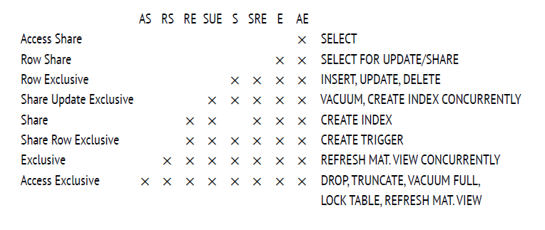
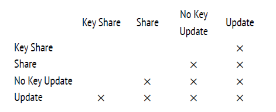

# Глава 1. Введение
---

## 1. Базы данных и кластеры

### Основы

- **PostgreSQL** — это СУБД, которая при запуске работает как сервер (экземпляр сервера). Сервер управляет **кластером баз данных** —
  набором нескольких баз данных, которые хранятся в одном каталоге, называемом **PGDATA**.
- **PGDATA** — это каталог файловой системы, содержащий все данные кластера (таблицы, индексы, конфигурации). Он задается переменной
  окружения **PGDATA** или параметрами при запуске сервера.
- Перед использованием кластер должен быть **инициализирован** с помощью утилиты `initdb`, которая создает структуру каталогов и базовые
  файлы.

### Базы данных по умолчанию

При инициализации кластера создаются три базы данных:

1. **template0**:
    - Используется для восстановления из логических резервных копий или создания баз с другой кодировкой.
    - Не подлежит изменениям, чтобы сохранить чистую копию начального состояния.
    - Пример использования: создание базы с кодировкой, отличной от кластера (`CREATE DATABASE newdb TEMPLATE template0 ENCODING 'UTF8';`).
2. **template1**:
    - Служит шаблоном для новых баз данных, создаваемых командой `CREATE DATABASE`.
    - Может быть модифицирована пользователем для добавления стандартных объектов (таблиц, функций и т.д.) в новые базы.
    - Пример: добавление таблицы в `template1` делает её доступной во всех новых базах.
3. **postgres**:
    - Обычная база данных для общего использования.
    - Подходит для хранения пользовательских данных, если не требуется создание специализированных баз.

### Кластер баз данных

- Один экземпляр PostgreSQL управляет несколькими базами одновременно, образующими кластер.
- Каждая база изолирована: объекты (таблицы, схемы) в одной базе не видны в другой, если не настроено иное.
- Пример структуры кластера:
  ```
  PGDATA/
  ??? base/         # Каталог для баз данных
  ?   ??? 16384/    # Каталог для базы postgres (OID=16384)
  ?   ??? 1/        # Каталог для template1
  ?   ??? 2/        # Каталог для template0
  ??? global/       # Общие объекты кластера
  ??? pg_tblspc/    # Символьные ссылки на табличные пространства
  ```

---

## 2. Системный каталог

### Описание

- **Системный каталог** — это набор таблиц и представлений, хранящих метаданные обо всех объектах кластера: базах данных, таблицах,
  индексах, типах, функциях и т.д.
- Каждая база данных имеет собственный системный каталог, описывающий её объекты. Также существуют общие таблицы кластера, доступные из
  любой базы (формально хранятся в базе с OID=0).

### Структура

- Таблицы системного каталога имеют префикс **pg_** (например, `pg_database`, `pg_class`, `pg_attribute`).
- Столбцы в этих таблицах начинаются с трехбуквенного кода, соответствующего имени таблицы (например, `datname` в `pg_database` для имени
  базы).
- Первичный ключ — столбец **oid** (тип `oid`, 32-битное целое число), уникально идентифицирующий объект.
- Пример: запрос для получения списка баз данных:
  ```sql
  SELECT oid, datname FROM pg_database;
  ```

### Механизм OID

- **OID** (Object Identifier) — это уникальный идентификатор, генерируемый единым счетчиком для всех объектов кластера.
- Особенности:
    - Используется в разных таблицах системного каталога.
    - Если диапазон значений (2??) исчерпан, счетчик обнуляется, а уникальность проверяется индексами.
    - Пример: таблица `pg_class` хранит `oid` для каждой таблицы или индекса.
- Запрос для проверки OID таблицы:
  ```sql
  SELECT oid, relname FROM pg_class WHERE relname = 'my_table';
  ```

### Доступ

- К системному каталогу можно обращаться через SQL-запросы.
- В клиенте `psql` доступны специальные команды, такие как `\dt` (список таблиц) или `\d` (описание объекта), которые упрощают просмотр
  метаданных.
- Пример: просмотр структуры таблицы `pg_database`:
  ```sql
  \d pg_database
  ```

---

## 3. Схемы

### Определение

- **Схемы** — это пространства имен внутри базы данных, позволяющие группировать объекты (таблицы, индексы, функции).
- Схемы помогают организовать данные и избежать конфликтов имен.

### Основные схемы

1. **public**:
    - Используется по умолчанию для пользовательских объектов, если схема не указана.
    - Пример: `CREATE TABLE my_table (...)` создает таблицу в схеме `public`.
2. **pg_catalog**:
    - Хранит таблицы и представления системного каталога.
    - Всегда включена в путь поиска (`search_path`).
3. **information_schema**:
    - Предоставляет стандартизированное (SQL) представление метаданных.
    - Пример: запрос списка таблиц:
      ```sql
      SELECT table_name FROM information_schema.tables WHERE table_schema = 'public';
      ```
4. **pg_toast**:
    - Используется для хранения данных, вынесенных по технологии TOAST (см. ниже).
5. **pg_temp**:
    - Содержит временные таблицы, создаваемые в схемах `pg_temp_N` для каждого пользователя.
    - Пример: временная таблица `temp_table` видна пользователю как `pg_temp.temp_table`.

### Путь поиска

- Параметр `search_path` определяет порядок поиска схем для объектов, если схема не указана явно.
- По умолчанию: `search_path = "$user", public`, где `"$user"` — схема с именем текущего пользователя.
- Схемы `pg_catalog` и `pg_temp` добавляются неявно.
- Пример настройки:
  ```sql
  SET search_path TO my_schema, public;
  ```

---

## 4. Табличные пространства

### Определение

- **Табличные пространства** — это физические каталоги в файловой системе, где хранятся данные базы.
- Позволяют разделять данные по типу носителей (например, медленные HDD для архивов, быстрые SSD для активных данных).

### По умолчанию

- **pg_default**:
    - Расположен в `PGDATA/base`.
    - Используется для объектов, если не указано иное.
- **pg_global**:
    - Расположен в `PGDATA/global`.
    - Хранит общие объекты системного каталога, доступные всему кластеру.

### Пользовательские табличные пространства

- Создаются с указанием каталога, на который в `PGDATA/pg_tblspc` создается символьная ссылка.
- Пример создания:
  ```sql
  CREATE TABLESPACE fast_space LOCATION '/mnt/fast_storage';
  ```
- Использование:
  ```sql
  CREATE TABLE my_table (id integer) TABLESPACE fast_space;
  ```

### Логическая и физическая структура

- Логическая структура (базы, схемы) независима от физической (табличные пространства).
- Одна база может использовать несколько табличных пространств, и одно пространство — несколько баз.

---

## 5. Отношения

### Определение

- **Отношения** — это объекты базы данных, состоящие из строк: таблицы, индексы, последовательности, материализованные представления.
- Термин происходит от реляционной теории, но в PostgreSQL охватывает больше объектов, чем классические таблицы.
- Хранятся в таблице `pg_class`, где столбцы начинаются с префикса `rel` (например, `relname`, `relfilenode`).

### Примеры

- **Таблицы**: хранят пользовательские данные.
- **Индексы**: содержат строки с индексированными значениями (например, B-дерево).
- **Последовательности**: однострочные таблицы для генерации уникальных чисел.
- **Материализованные представления**: хранят результат запроса как таблицу.
- Пример создания отношения:
  ```sql
  CREATE TABLE my_table (id integer, name text);
  SELECT relname, relkind FROM pg_class WHERE relname = 'my_table';
  -- relkind: 'r' (таблица)
  ```

---

## 6. Слои и файлы

### Слои

Каждое отношение делится на **слои** (forks), каждый из которых хранит определенный тип данных:

1. **Основной слой** (main fork):
    - Содержит данные таблицы или индекса.
    - Имя файла — числовой идентификатор (`relfilenode` из `pg_class`).
    - Пример: файл `16385` для таблицы с `relfilenode = 16385`.
2. **Карта свободного пространства** (free space map, `_fsm`):
    - Отслеживает свободное место на страницах для оптимизации вставки данных.
    - Создается после операций, таких как `VACUUM`.
    - Пример: файл `16385_fsm`.
3. **Карта видимости** (visibility map, `_vm`):
    - Хранит информацию о страницах, требующих очистки или заморозки.
    - Используется для ускорения `VACUUM` и индексного сканирования.
    - Пример: файл `16385_vm` (только для таблиц).
4. **Слой инициализации** (init fork, `_init`):
    - Создается для нежурналируемых таблиц (`UNLOGGED`) и их индексов.
    - Используется для восстановления пустого состояния после сбоя.
    - Пример: файл `16385_init`.


### Файлы

- Каждый слой представлен одним или несколькими файлами.
- Если файл превышает 1 ГБ, создается новый сегмент (например, `16385.1`, `16385.2`).
- Ограничение в 1 ГБ можно изменить при сборке PostgreSQL (`--with-segsize`).
- Файлы хранятся в подкаталогах табличных пространств, организованных по базам данных (например, `PGDATA/base/16384/` для базы с OID=16384).

### Пример

Создание и проверка файлов таблицы:

```sql
CREATE
UNLOGGED TABLE t (a integer, b numeric, c text, d json);
INSERT INTO t
VALUES (1, 2.0, 'foo', '{}');
SELECT pg_relation_filepath('t'); -- Вывод: base/16384/16385
SELECT size
FROM pg_stat_file('/usr/local/pgsql/data/base/16384/16385'); -- Размер основного слоя
VACUUM
t;
SELECT size
FROM pg_stat_file('/usr/local/pgsql/data/base/16384/16385_fsm'); -- Размер карты свободного пространства
```

---

## 7. Страницы

### Описание

- Файлы делятся на **страницы** (обычно 8 КБ) — минимальные единицы ввода-вывода.
- Размер страницы задается при сборке PostgreSQL (`--with-blocksize`, до 32 КБ).
- Страницы кэшируются в **буферном кэше** для ускорения доступа.

### Использование

- Алгоритмы PostgreSQL (например, `VACUUM`, вставка данных) ориентированы на работу со страницами.
- Пример: карта видимости использует 2 бита на страницу для отслеживания актуальности строк.

---

## 8. TOAST

### Определение

- **TOAST** (The Oversized Attributes Storage Technique) — технология для хранения длинных строк, которые не помещаются на одной странице (~
  2000 байт после вычета заголовка).
- Цель: обеспечить размещение строки на одной странице или вынести её части в отдельную таблицу.

### Стратегии

1. **plain**:
    - TOAST не используется (для коротких типов, например, `integer`).
2. **extended**:
    - Сначала сжатие, затем, если нужно, хранение в `pg_toast`.
3. **external**:
    - Хранение в `pg_toast` без сжатия (например, для JPEG).
4. **main**:
    - Сжатие, затем хранение в `pg_toast`, если сжатие не помогло.

### Алгоритм

1. Если строка превышает ~2000 байт, применяются стратегии `extended` и `external`:
    - Сжимаются атрибуты `extended`, выносятся в `pg_toast`, если всё ещё длинные.
    - Атрибуты `external` выносятся без сжатия.
2. Если строка всё ещё велика, сжимаются атрибуты `main`.
3. Если нужно, атрибуты `main` выносятся в `pg_toast`.

### TOAST-таблицы

- Создаются автоматически для таблиц с длинными типами (`text`, `json`, `numeric`).
- Хранятся в схеме `pg_toast` (или `pg_toast_temp_N` для временных таблиц).
- Структура: столбцы `chunk_id` (oid), `chunk_seq` (integer), `chunk_data` (bytea).
- Имеют индекс для быстрого доступа (например, `pg_toast_16385_index`).
- Пример:
  ```sql
  SELECT relnamespace::regnamespace, relname FROM pg_class 
  WHERE oid = (SELECT reltoastrelid FROM pg_class WHERE relname = 't');
  -- Вывод: pg_toast | pg_toast_16385
  ```

### Пример работы

```sql
CREATE TABLE t
(
    c text
);
UPDATE t
SET c = repeat('A', 5000); -- Сжимается и помещается на страницу
UPDATE t
SET c = (SELECT string_agg(chr(trunc(65 + random() * 26)::integer), '')
         FROM generate_series(1, 5000)); -- Не сжимается, выносится в pg_toast
SELECT chunk_id, chunk_seq, length(chunk_data)
FROM pg_toast.pg_toast_16385;
-- Вывод: фрагменты данных
```

### Сжатие

- Используются алгоритмы **PGLZ** (по умолчанию) или **LZ4** (более эффективный, с версии 15).
- Настройка: параметр `default_toast_compression` или `COMPRESSION` в `CREATE TABLE`.
- Пример изменения стратегии:
  ```sql
  ALTER TABLE t ALTER COLUMN c SET STORAGE external;
  ```

---

## 9. Процессы и память

### Процессы

- **Postmaster**:
    - Главный процесс, запускает и контролирует другие процессы.
    - Перезапускает процессы при сбоях.
- **Фоновые процессы**:
    - **startup**: восстанавливает данные после сбоев.
    - **autovacuum**: очищает устаревшие версии строк.
    - **wal writer**: записывает журнал предзаписи (WAL).
    - **checkpointer**: создает контрольные точки.
    - **writer**: записывает измененные страницы на диск.
    - **wal sender/receiver**: обеспечивают репликацию.
- **Backend**: обслуживает клиентские соединения.

### Память

- **Общая память**:
    - **Буферный кэш**: хранит страницы для ускорения ввода-вывода.
    - Другие буферы для оптимизации операций.
- **Журнал предзаписи (WAL)**:
    - Гарантирует согласованность данных при сбоях.
    - Записывает операции перед их применением.
- Двойное кэширование: PostgreSQL использует кэш операционной системы и собственный буферный кэш.

---

## 10. Клиент-серверный протокол

### Соединения

- **Postmaster** принимает клиентские подключения и создает процесс **backend** для каждого клиента.
- Проблемы большого числа соединений:
    - Высокое потребление памяти.
    - Затраты на установку соединений.
    - Снижение производительности из-за множества процессов.
- Решение: пулы соединений (например, **PgBouncer**, **Odyssey**).

### Протокол

- Реализуется через библиотеку **libpq** (или независимые реализации).
- Клиент подключается к базе под определенной ролью (пользователем).
- Аутентификация проверяет права доступа.
- SQL-запросы передаются в текстовом виде и обрабатываются backend-процессом.
- Пример подключения:
  ```sql
  psql -U username -d postgres
  ```

---

# Глава 2. Изоляция

---

## 2.1. Согласованность

### Основы

- **Согласованность** (consistency) — это корректность данных, обеспечиваемая реляционными СУБД. Она шире, чем **целостность** (integrity),
  которая поддерживается ограничениями, такими как `NOT NULL`, `UNIQUE`, `CHECK`, `FOREIGN KEY`.
- Ограничения целостности задаются на уровне базы данных, и СУБД гарантирует их соблюдение. Например:
  ```sql
  ALTER TABLE accounts ADD CONSTRAINT positive_balance CHECK (amount >= 0);
  ```
- Однако согласованность включает более сложные правила, которые не всегда можно выразить ограничениями (например, правила, охватывающие
  несколько таблиц). Такие правила контролируются приложением, и СУБД не знает о них.
- Пример: правило «сумма на всех счетах клиента не может быть отрицательной» сложно выразить как ограничение, но оно критично для
  согласованности.

### Роль СУБД

- Если приложение выполняет корректные операции, СУБД обеспечивает согласованность через **транзакции** — неделимые наборы операций,
  переводящие базу из одного корректного состояния в другое.
- **Пример с переводом денег**:
    - Правило: сумма денег на всех счетах не меняется при переводе.
    - Операции:
        1. `UPDATE accounts SET amount = amount - 100 WHERE id = 1;` (нарушение согласованности)
        2. `UPDATE accounts SET amount = amount + 100 WHERE id = 2;` (восстановление согласованности)
    - Если вторая операция не выполнится (например, из-за сбоя), согласованность нарушится. Транзакции решают эту проблему, гарантируя
      атомарность (все операции или ни одной).

### Проблема конкурентного выполнения

- Транзакции, корректные по отдельности, могут вести к некорректным результатам при одновременном (конкурентном) выполнении из-за
  перемешивания операций.
- **Аномалии одновременного выполнения** возникают, когда порядок операций разных транзакций нарушает согласованность.
- Пример аномалии: **грязное чтение** — чтение незафиксированных изменений другой транзакции, которые могут быть отменены.
- СУБД изолирует транзакции, чтобы результат конкурентного выполнения соответствовал какому-либо последовательному выполнению, минимизируя
  аномалии.

### ACID

- Согласованность связана с тремя свойствами транзакций из акронима **ACID**:
    - **Atomicity** (атомарность): все операции транзакции выполняются или ни одна.
    - **Consistency** (согласованность): база остается в корректном состоянии.
    - **Isolation** (изоляция): транзакции не мешают друг другу.
- **Durability** (долговечность) также связана: после сбоя система восстанавливает согласованность, удаляя изменения незафиксированных
  транзакций.

### Проблема полной изоляции

- Полная изоляция (отсутствие всех аномалий) сложна технически и снижает производительность, так как требует строгой синхронизации
  транзакций.
- На практике используются ослабленные уровни изоляции, допускающие некоторые аномалии, что перекладывает часть ответственности за
  согласованность на приложение.

---

## 2.2. Уровни изоляции и аномалии в стандарте SQL

### Уровни изоляции

Стандарт SQL определяет четыре уровня изоляции, различающиеся по допустимым аномалиям:

1. **Read Uncommitted**
2. **Read Committed**
3. **Repeatable Read**
4. **Serializable**

### Аномалии

1. **Потерянное обновление** (lost update):
    - Две транзакции читают одну строку, обновляют её, и вторая перезаписывает изменения первой.
    - Пример: две транзакции увеличивают баланс с 1000 ? на 100 ?, но итог — 1100 ? вместо 1200 ?.
    - Запрещено на всех уровнях изоляции.
2. **Грязное чтение** (dirty read):
    - Чтение незафиксированных изменений, которые могут быть отменены.
    - Пример: транзакция А переводит 100 ?, транзакция Б видит это до фиксации, но А откатывается.
    - Допустимо только на **Read Uncommitted**.
3. **Неповторяющееся чтение** (non-repeatable read):
    - Транзакция читает строку дважды, но между чтениями другая транзакция изменяет строку.
    - Пример: транзакция А проверяет баланс (1000 ?), транзакция Б уменьшает его до 0, и А продолжает с устаревшими данными.
    - Допустимо на **Read Uncommitted** и **Read Committed**.
4. **Фантомное чтение** (phantom read):
    - Транзакция читает набор строк по условию дважды, но между чтениями другая транзакция добавляет новые строки.
    - Пример: транзакция А проверяет количество счетов клиента (2), транзакция Б добавляет счёт, и А видит 3.
    - Допустимо на **Read Uncommitted**, **Read Committed**, **Repeatable Read**.
5. **Другие аномалии**:
    - Стандарт не перечисляет все возможные аномалии (например, несогласованное чтение).
    - **Serializable** устраняет все аномалии, включая неизвестные.

### Таблица аномалий

| Уровень изоляции | Потерянное обновление | Грязное чтение | Неповторяющееся чтение | Фантомное чтение | Другие аномалии |
|------------------|-----------------------|----------------|------------------------|------------------|-----------------|
| Read Uncommitted | —                     | Да             | Да                     | Да               | Да              |
| Read Committed   | —                     | —              | Да                     | Да               | Да              |
| Repeatable Read  | —                     | —              | —                      | Да               | Да              |
| Serializable     | —                     | —              | —                      | —                | —               |

### Почему эти аномалии?

- Выбор аномалий в стандарте исторический: в 1970–80-х годах теория баз данных отставала от практики.
- Уровни изоляции основаны на **двухфазном блокировании** (2PL):
    - Транзакция блокирует строки на чтение или запись.
    - Больше блокировок — выше изоляция, но ниже производительность.
    - **Read Uncommitted**: блокировки только на запись.
    - **Read Committed**: блокировки на чтение и запись для изменяемых строк.
    - **Repeatable Read**: блокировки на все читаемые и изменяемые строки.
    - **Serializable**: требует блокировки предикатов (условий), что сложно реализовать.
- Предикатные блокировки (для предотвращения фантомов) были предложены в 1976 году, но их практическая реализация ограничена.

---

## 2.3. Уровни изоляции в PostgreSQL

PostgreSQL использует **изоляцию на основе снимков** (Snapshot Isolation, SI) с многоверсионной моделью (MVCC), где строки хранятся в
нескольких версиях. Это отличается от стандартного подхода, основанного на блокировках, и обеспечивает более высокую производительность.

### Особенности

- **Снимок данных**: каждая транзакция видит согласованное состояние базы на момент начала (или первого запроса).
- **Многоверсионность**: разные версии строки сосуществуют, позволяя читать устаревшие данные без конфликтов.
- **Блокировки**: минимальны, только для одновременных изменений одной строки.
- **Read Uncommitted** в PostgreSQL работает как **Read Committed**, поэтому не рассматривается отдельно.
- Уровни изоляции:
    - **Read Committed**: допускает потерянное обновление, неповторяющееся и фантомное чтение, а также несогласованное чтение.
    - **Repeatable Read**: предотвращает все стандартные аномалии, но допускает несогласованную запись и аномалию только читающей
      транзакции.
    - **Serializable**: устраняет все аномалии, но с накладными расходами.

### Таблица аномалий в PostgreSQL

| Уровень изоляции | Потерянное обновление | Грязное чтение | Неповторяющееся чтение | Фантомное чтение | Другие аномалии |
|------------------|-----------------------|----------------|------------------------|------------------|-----------------|
| Read Committed   | Да                    | —              | Да                     | Да               | Да              |
| Repeatable Read  | —                     | —              | —                      | —                | Да              |
| Serializable     | —                     | —              | —                      | —                | —               |

## 2.4. Какой уровень изоляции использовать?

### Read Committed

- **Плюсы**:
    - По умолчанию, минимальные накладные расходы.
    - Нет ошибок сериализации, не требует повторов транзакций.
- **Минусы**:
    - Допускает множество аномалий (неповторяющееся чтение, фантомное чтение, несогласованное чтение, потерянное обновление).
    - Требует осторожного написания кода: использовать один SQL-оператор или блокировки.
    - Сложно тестировать и отлаживать аномалии.
- **Применение**: подходит для простых приложений, где аномалии редки или контролируются кодом.

### Repeatable Read

- **Плюсы**:
    - Устраняет стандартные аномалии (грязное, неповторяющееся, фантомное чтение).
    - Идеально для читающих транзакций (например, отчеты).
- **Минусы**:
    - Допускает несогласованную запись и аномалию читающей транзакции.
    - Пишущие транзакции требуют обработки ошибок сериализации.
- **Применение**: для читающих транзакций или приложений, где важна стабильность данных.

### Serializable

- **Плюсы**:
    - Устраняет все аномалии, упрощает разработку.
    - Требует только обработки ошибок сериализации.
- **Минусы**:
    - Накладные расходы на обнаружение аномалий.
    - Возможны ложноположительные ошибки, увеличивающие повторы.
    - Не работает на репликах, требует единообразного использования.
- **Применение**: для критически важных приложений, где согласованность приоритетна.

---

# 3 Страницы и версии строк в PostgreSQL

---

## 3.1. Структура страниц

### Основы

- **Страницы** — минимальные единицы ввода-вывода в PostgreSQL (обычно 8 КБ, задается при сборке параметром `--with-blocksize`).
- Каждая страница имеет фиксированную внутреннюю разметку, содержащую:
    1. **Заголовок** (в младших адресах).
    2. **Массив указателей на версии строк**.
    3. **Свободное пространство**.
    4. **Версии строк** (данные).
    5. **Специальная область** (в старших адресах).

### Заголовок страницы

- Расположен в начале страницы, фиксированного размера (обычно 24 байта).
- Содержит:
    - Контрольную сумму.
    - Указатели на начало и конец других областей (`lower`, `upper`, `special`).
    - Дополнительные метаданные (например, флаги страницы).
- Пример анализа с использованием расширения `pageinspect`:
  ```sql
  CREATE EXTENSION pageinspect;
  SELECT lower, upper, special, pagesize
  FROM page_header(get_raw_page('accounts', 0));
  ```
  Вывод:
  ```
  lower | upper | special | pagesize
  ------+-------+---------+---------
  152   | 6904  | 8192    | 8192
  ```
    - `lower`: начало массива указателей (152 байта от начала страницы).
    - `upper`: конец свободного пространства (6904 байта).
    - `special`: начало специальной области (8192 байта, конец страницы).
    - `pagesize`: размер страницы (8192 байт = 8 КБ).

### Специальная область

- Расположена в конце страницы (старшие адреса).
- Используется для индексов (например, B-дерево хранит метаданные или ссылки на дочерние узлы).
- Для таблиц обычно имеет нулевой размер.
- Пример: в B-дереве нулевая страница хранит метаданные, а обычные страницы — индексные записи.

### Версии строк

- **Версии строк** (row versions, tuples) — это данные таблицы с добавленной служебной информацией.
- Многоверсионность (MVCC) позволяет хранить несколько версий одной строки для поддержки конкурентного доступа.
- В отличие от таблиц, индексы не содержат версий строк, а ссылаются на все табличные версии через идентификаторы (`tid`).

### Указатели на версии строк

- Массив указателей (line pointers) — это оглавление страницы, расположенное после заголовка.
- Каждый указатель (4 байта) содержит:
    - Смещение версии строки относительно начала страницы.
    - Длину версии строки.
    - Статус (например, `normal`, `unused`, `redirect`, `dead`).
- Идентификатор версии строки (`tid`) состоит из:
    - Номера страницы в файле основного слоя.
    - Номера указателя в массиве (не смещения, для избежания фрагментации при перемещении строк).
- Пример: `tid = (0,1)` указывает на первую строку на странице 0.

### Свободное пространство

- Расположено между указателями и версиями строк.
- Всегда представлено одним непрерывным фрагментом (без фрагментации).
- Отслеживается в карте свободного пространства (`_fsm`) для оптимизации вставки данных.

### Схема страницы

```
0          24         lower         upper         special       pagesize
|----------|----------|-------------|-------------|-------------|
| Заголовок| Указатели| Свободное   | Версии строк| Специальная |
|          |          | пространство |             | область     |
```

---

## 3.2. Структура версий строк

### Основы

- Версия строки состоит из:
    - **Заголовка** (минимально 23 байта).
    - **Данных** (собственно значения столбцов).
- Заголовок содержит:
    - `xmin`: номер транзакции, создавшей строку (`INSERT`).
    - `xmax`: номер транзакции, удалившей или обновившей строку.
    - `infomask`: биты, определяющие свойства версии (например, статус `xmin` и `xmax`).
    - `ctid`: ссылка на следующую версию строки (тип `tid`, например, `(0,2)`).
    - Битовую карту `NULL`-значений (для столбцов, допускающих `NULL`).
- Данные выровнены по границам машинных слов (например, 4 или 8 байт в зависимости от архитектуры).

### Совместимость

- Формат данных на диске идентичен формату в памяти, что исключает преобразования при чтении/записи.
- Несовместимость между платформами возникает из-за:
    - Порядка байтов (`little-endian` в x86, `big-endian` в z/Architecture, переключаемый в ARM).
    - Выравнивания данных (например, `integer` выравнивается по 4 байтам, `double precision` — по 8 байтам в 64-битной системе).

### Оптимизация

- Столбцы фиксированного размера без `NULL` (например, `integer`, `boolean`) в начале таблицы ускоряют доступ за счет кэширования смещений.

---

## 3.3. Выполнение операций над версиями строк

### Основы многоверсионности

- Каждая версия строки имеет поля `xmin` и `xmax`, использующие номера транзакций (`xid`) для определения видимости.
- Номера транзакций — 32-битные счетчики, увеличивающиеся последовательно.
- **Операции**:
    - `INSERT`: создает новую версию строки с `xmin = текущий xid`.
    - `DELETE`: устанавливает `xmax = текущий xid` в текущей версии.
    - `UPDATE`: комбинация `DELETE` (установка `xmax`) и `INSERT` (новая версия с `xmin = текущий xid`).
    - `MERGE` (с версии 15): разбивается на `INSERT`, `UPDATE`, `DELETE`.

### Фиксация

- Статус транзакции записывается в **clog** (commit log, файлы в `PGDATA/pg_xact`):
    - Два бита на транзакцию: `committed` или `aborted`.
    - Доступ через буферы в общей памяти.
- Проверка статуса:
    - **ProcArray**: список активных транзакций в памяти.
    - Если транзакция завершена, статус берется из `clog`.
    - После проверки статус записывается в биты-подсказки (`xmin_committed`, `xmin_aborted`).
- Пример:
  ```sql
  COMMIT;
  SELECT * FROM t; -- id=1, s='FOO'
  SELECT * FROM heap_page('t', 0);
  ```
  Вывод:
  ```
  ctid   | state  | xmin   | xmax
  -------+--------+--------+------
  (0,1)  | normal | 773 c  | 0 a
  ```
    - Бит `xmin_committed` установлен после первого обращения.

### Удаление

- Устанавливает `xmax = текущий xid`, сбрасывает `xmax_aborted`.
- `xmax` блокирует строку до завершения транзакции.
- Пример:
  ```sql
  BEGIN;
  DELETE FROM t;
  SELECT pg_current_xact_id(); -- 774
  SELECT * FROM heap_page('t', 0);
  ```
  Вывод:
  ```
  ctid   | state  | xmin   | xmax
  -------+--------+--------+------
  (0,1)  | normal | 773 c  | 774
  ```

### Отмена

- Устанавливает бит `aborted` в `clog`, данные в странице не изменяются.
- При обращении к странице устанавливается бит `xmax_aborted`.
- Пример:
  ```sql
  ROLLBACK;
  SELECT * FROM t; -- id=1, s='FOO'
  SELECT * FROM heap_page('t', 0);
  ```
  Вывод:
  ```
  ctid   | state  | xmin   | xmax
  -------+--------+--------+------
  (0,1)  | normal | 773 c  | 774 a
  ```

### Обновление

- Эквивалентно `DELETE` + `INSERT`:
    - В старой версии: `xmax = текущий xid`.
    - Новая версия: `xmin = текущий xid`, `ctid` указывает на неё.
- Пример:
  ```sql
  BEGIN;
  UPDATE t SET s = 'BAR';
  SELECT pg_current_xact_id(); -- 775
  SELECT * FROM t; -- id=1, s='BAR'
  SELECT * FROM heap_page('t', 0);
  ```
  Вывод:
  ```
  ctid   | state  | xmin   | xmax
  -------+--------+--------+------
  (0,1)  | normal | 773 c  | 775
  (0,2)  | normal | 775    | 0 a
  ```
    - После `COMMIT`, `xmin=775 c`.

---

## 3.4. Индексы

- Индексы не содержат версий строк, только ссылки (`tid`) на все версии строк в таблице.
- Транзакция проверяет видимость версии строки в таблице с учетом `xmin`, `xmax` и карты видимости.
- Пример проверки индекса:
  ```sql
  CREATE FUNCTION index_page(relname text, pageno integer)
  RETURNS TABLE(itemoffset smallint, htid tid) AS $$
      SELECT itemoffset, htid FROM bt_page_items(relname, pageno);
  $$ LANGUAGE sql;
  SELECT * FROM index_page('t_s_idx', 1);
  ```
  Вывод:
  ```
  itemoffset | htid
  -----------+-------
  1          | (0,2)
  2          | (0,1)
  ```
    - Ссылки на обе версии строки (`BAR` и `FOO`), упорядоченные по значению `s`.

---

## 3.5. TOAST

- **TOAST** — технология для хранения длинных значений (более ~2000 байт).
- TOAST-таблицы:
    - Хранятся в схеме `pg_toast`, имеют собственную многоверсионность.
    - Строки только добавляются или удаляются, не обновляются.
- При обновлении:
    - Если длинное значение не изменилось, новая версия строки ссылается на старое значение в TOAST.
    - Если изменилось, создается новая версия в TOAST.

---

## 3.6. Виртуальные транзакции

- **Виртуальные номера транзакций** (`virtual xid`):
    - Используются для читающих транзакций, чтобы экономить реальные номера (`xid`).
    - Формат: идентификатор процесса + последовательный номер.
    - Хранятся только в памяти, не записываются на диск.

---

## 3.7. Вложенные транзакции

### Точки сохранения

- **Точки сохранения** (`SAVEPOINT`) позволяют откатить часть транзакции без её завершения.
- Реализуются через **вложенные транзакции** (`subtransactions`):
    - Каждая имеет собственный номер (`xid`), больший, чем у основной транзакции.
    - Статус хранится в `clog` и `PGDATA/pg_subtrans`.
    - Если основная транзакция откатывается, все вложенные считаются отмененными.

### Снимки данных в PostgreSQL (подробное изложение)

Этот раздел охватывает концепцию снимков данных в PostgreSQL, их роль в обеспечении согласованности и изоляции транзакций, правила видимости
строк, а также механизмы экспорта и импорта снимков. Материал основан на предоставленном тексте и дополнен для большей ясности.

---

# 4. Снимки данных

---

## 4.1. Что такое снимок данных

### Основы

- **Снимок данных** (snapshot) — это согласованное представление данных базы на определенный момент времени, соответствующее свойствам *
  *ACID** (в частности, согласованности и изоляции).
- Снимок включает только **актуальные версии строк**, зафиксированные к моменту его создания.
- **Многоверсионность** (MVCC): физически в таблицах могут существовать несколько версий одной строки, но каждая транзакция видит максимум
  одну из них, определенную снимком.
- **Изоляция**: каждая транзакция работает со своим снимком, что обеспечивает независимость от других транзакций и согласованность данных на
  разные моменты времени.

### Создание снимков

- **Read Committed**:
    - Новый снимок создается для **каждого оператора** в транзакции.
    - Активен только во время выполнения оператора.
- **Repeatable Read и Serializable**:
    - Один снимок создается в начале **первого оператора** транзакции.
    - Остается активным до конца транзакции.
- **Графическое представление**:
  ```
  Read Committed:
  xid:       |------|------|
             | снимок1 | снимок2 |
             | оператор1 | оператор2 |

  Repeatable Read/Serializable:
  xid:       |-------------|
             |   снимок    |
             | оператор1 | оператор2 |
  ```

---

## 4.2. Видимость версий строк в снимке

### Основы

- Снимок не является физической копией данных, а задается **набором параметров**, определяющих, какие версии строк видны.
- Видимость зависит от полей заголовка версии строки:
    - `xmin`: номер транзакции, создавшей строку (`INSERT`).
    - `xmax`: номер транзакции, удалившей или обновившей строку.
    - Информационные биты (`infomask`): статус транзакций (`xmin_committed`, `xmin_aborted`, `xmax_committed`, `xmax_aborted`).
- **Правило видимости** (упрощенно):
    - Версия строки видна, если:
        - Изменения транзакции `xmin` видны (транзакция зафиксирована до создания снимка или это собственные изменения текущей транзакции).
        - Изменения транзакции `xmax` не видны (транзакция не завершена, началась после снимка или отменена).
- Интервалы `xmin`–`xmax` не пересекаются, поэтому в снимке видна максимум одна версия строки.

### Пример видимости

- Сценарий:
    - Транзакция 1 (`xid=1`) активна.
    - Транзакция 2 (`xid=2`) завершилась до создания снимка.
    - Транзакция 3 (`xid=3`) началась после снимка.
- Графически:
  ```
  xid:    1       2       3
         |-------|-------|-------|
                | снимок |
  ```
    - Транзакция 2: изменения видны (завершилась до снимка).
    - Транзакция 1: изменения не видны (активна на момент снимка).
    - Транзакция 3: изменения не видны (началась после снимка).

---

## 4.3. Из чего состоит снимок

### Проблема времени фиксации

- PostgreSQL не отслеживает момент фиксации транзакций (кроме случаев, когда включен параметр `track_commit_timestamp`, используемый для
  репликации).
- Доступна информация:
    - Номер транзакции (`xid`) — момент начала.
    - Текущий статус транзакции (активна, зафиксирована, отменена) через структуру `ProcArray` в общей памяти.
- Для определения видимости снимок должен содержать статусы транзакций на момент его создания.

### Состав снимка

Снимок включает:

1. **Нижняя граница (`xmin`)**:
    - Номер самой старой активной транзакции на момент создания снимка.
    - Все транзакции с `xid < xmin` либо зафиксированы (видны), либо отменены (не видны).
2. **Верхняя граница (`xmax`)**:
    - Значение на 1 больше номера последней зафиксированной транзакции.
    - Транзакции с `xid >= xmax` не видны (не завершены или не существуют).
3. **Список активных транзакций (`xip_list`)**:
    - Номера всех активных транзакций (`xmin <= xid < xmax`), кроме виртуальных.
4. Дополнительные параметры (например, `cmin` для учета операций внутри транзакции).

### Графическое представление

```
xid:    1       2       3
       |-------|-------|-------|
       |<-- снимок -->|
       xmin           xmax
       xip_list: [1]
```

---

## 4.4. Видимость собственных изменений

### Проблема

- Транзакция должна видеть свои изменения, даже если они не зафиксированы.
- Однако некоторые изменения (например, сделанные после открытия курсора) могут быть не видны.

### Поле `cmin`/`cmax`

- В заголовке версии строки есть поле для хранения **порядкового номера операции** внутри транзакции:
    - `cmin`: номер операции вставки.
    - `cmax`: номер операции удаления.
    - Для экономии места используется одно поле, а при совпадении операций (`INSERT` и `DELETE` в одной транзакции) создается «комбо-номер»
      с отображением в памяти процесса.
- Курсоры учитывают только версии строк с `cmin` меньше номера операции открытия курсора.

### Пример

```sql
BEGIN;
INSERT INTO accounts
VALUES (3, 'charlie', 100.00);
SELECT pg_current_xact_id(); -- 790
DECLARE
c CURSOR FOR
SELECT count(*)
FROM accounts;
INSERT INTO accounts
VALUES (4, 'charlie', 200.00);
SELECT xmin, CASE WHEN xmin = 790 THEN cmin END cmin, *
FROM accounts;
```

Вывод:

```
xmin | cmin | id | client  | amount
-----+------+----+---------+--------
787  |      | 1  | alice   | 1000.00
789  |      | 2  | bob     | 200.00
790  | 0    | 3  | charlie | 100.00
790  | 1    | 4  | charlie | 200.00
```

- Проверка курсора:
  ```sql
  FETCH c;
  ```
  Вывод: `count = 3` (строка с `cmin=1` не видна).

---

## 4.5. Горизонт транзакции

### Основы

- **Горизонт транзакции** — это нижняя граница снимка (`xmin`), определяющая самую старую активную транзакцию.
- Транзакции с `xid < xmin`:
    - Либо зафиксированы (видны).
    - Либо отменены (не видны).
- **Горизонт базы данных**:
    - Наименьший `xmin` среди всех активных транзакций в базе.
    - Определяет, какие версии строк можно безопасно удалить (очистка, `VACUUM`).
- **Виртуальные транзакции**:
    - Имеют горизонт только при активном снимке.
    - Без снимка (например, в `Read Committed` между операторами) горизонт не определен.

- Долгие транзакции (`Repeatable Read`, `Serializable`, или `Read Committed` в состоянии `idle in transaction`) удерживают горизонт,
  препятствуя очистке.
- Долгие транзакции увеличивают объем неактуальных версий строк, вызывая раздувание таблиц и индексов.
- **Графическое представление**:
  ```
  xid:  1  2  3  4  5  6  7  8  9 10
       |-------------------|
       | горизонт базы данных |
       | неактуальные версии можно вычищать |
  ```

---

## 4.6. Снимок данных для системного каталога

### Особенности

- Системный каталог (таблицы в схеме `pg_catalog`) использует **отдельные снимки**, чтобы всегда видеть последние изменения (например, новые
  столбцы или ограничения).
- Обычный снимок транзакции может быть устаревшим, что недопустимо для каталога.
- Реализация:
    - Создается «свежий» снимок для каждого обращения к каталогу.
    - Кэширование объектов каталога оптимизирует производительность.

### Пример

```sql
BEGIN
TRANSACTION ISOLATION LEVEL REPEATABLE READ;
SELECT 1; -- Создан снимок
ALTER TABLE accounts
    ALTER amount SET NOT NULL;
INSERT INTO accounts(client, amount)
VALUES ('alice', NULL);
-- Ошибка: violates not-null constraint
ROLLBACK;
```

- `INSERT` видит новое ограничение, несмотря на снимок `Repeatable Read`, так как каталог использует свежий снимок.
- Если транзакция уже обращалась к таблице, `ALTER TABLE` блокируется до её завершения.

---

## 4.7. Экспорт снимка данных

### Основы

- **Экспорт снимка** позволяет нескольким транзакциям видеть одну и ту же согласованную картину данных.
- Используется, например, в `pg_dump` для параллельного резервного копирования.
- Механизм:
    - Функция `pg_export_snapshot()` возвращает идентификатор снимка.
    - Команда `SET TRANSACTION SNAPSHOT` импортирует снимок в другую транзакцию (требуется `Repeatable Read` или `Serializable`).

### Пример

- Транзакция 1:
  ```sql
  BEGIN ISOLATION LEVEL REPEATABLE READ;
  SELECT count(*) FROM accounts; -- 4
  SELECT pg_export_snapshot(); -- 00000004-0000006E-1
  ```
- Транзакция 2 (после удаления строк):
  ```sql
  DELETE FROM accounts;
  BEGIN ISOLATION LEVEL REPEATABLE READ;
  SET TRANSACTION SNAPSHOT '00000004-0000006E-1';
  SELECT count(*) FROM accounts; -- 4
  ```
- Изменения после экспорта не видны в импортированном снимке.
- Время жизни экспортированного снимка совпадает с транзакцией-источником.

---

# 5. Внутристраничная очистка и hot-обновления

---

## 5.1. Внутристраничная очистка

### Основы

- **Внутристраничная очистка** — это процесс удаления неактуальных версий строк (находящихся за горизонтом базы данных) внутри одной
  табличной страницы.
- Выполняется быстро, так как ограничена одной страницей, и не затрагивает другие страницы или индексы.
- Условия срабатывания:
    1. **Предыдущее обновление** (`UPDATE`) не нашло достаточно места на странице для новой версии строки, что отмечено в заголовке
       страницы.
    2. Страница заполнена больше, чем на значение параметра хранения `fillfactor`.

### Параметр `fillfactor`

- `fillfactor` (по умолчанию 100%) определяет максимальный процент заполнения страницы для новых строк (`INSERT`).
- Оставшееся место резервируется для новых версий строк, создаваемых при `UPDATE`.
- Пример: если `fillfactor = 75`, то 75% страницы доступно для вставки строк, а 25% — для обновлений.

### Особенности очистки

- Удаляет версии строк, невидимые ни в одном снимке (за горизонтом базы данных, см. раздел 4.5).
- **Указатели** на вычищенные версии строк сохраняются (статус `dead`), так как на них могут ссылаться индексы.
- Не обновляет:
    - Карту видимости (`visibility map`).
    - Карту свободного пространства (`free space map`, FSM).
- Освобожденное место используется только для обновлений (`UPDATE`), а не для вставок (`INSERT`).
- Чтение (`SELECT`) может вызывать очистку, изменяя страницу (как и установка битов-подсказок, см. раздел 3.3).

---

## 5.2. HOT-обновления

### Основы

- **HOT-обновления** (Heap-Only Tuple updates) — оптимизация, минимизирующая обновления индексов при `UPDATE`.
- Условия выполнения HOT-обновления:
    1. На таблице нет индексов.
    2. Обновляемые столбцы не входят ни в один индекс.
    3. Обновляемые столбцы входят в индекс, но их значения не изменились.
- Исключение: индексы **BRIN** (с версии 16) не содержат ссылок на строки и не препятствуют HOT-обновлениям.

### Механизм

- При HOT-обновлении:
    - Новая версия строки создается на той же странице.
    - В индексах остается **одна ссылка** на первую версию строки (`head` цепочки).
    - Версии связаны цепочкой через поле `t_ctid` в заголовке.
- Флаги в заголовке версии строки:
    - **Heap Hot Updated** (`hhu`): версия является частью цепочки обновлений.
    - **Heap Only Tuple** (`hot`): на версию нет прямых ссылок из индексов.
- При сканировании индекса PostgreSQL следует по цепочке `t_ctid`, проверяя видимость каждой версии.

---

## 5.3. Внутристраничная очистка при HOT-обновлениях

### Особенности

- При HOT-обновлениях внутристраничная очистка учитывает цепочку обновлений.
- **Голова цепочки** (первая версия, на которую ссылается индекс) сохраняется, получая статус `redirect`.
- Остальные версии в цепочке удаляются, а их указатели помечаются как `unused`.

---

## 5.4. Разрыв HOT-цепочки

### Основы

- Если на странице не хватает места для новой версии строки, HOT-цепочка разрывается.
- Новая версия размещается на другой странице, и в индексы добавляется новая ссылка.

### Оптимизация

- Уменьшение `fillfactor` увеличивает вероятность HOT-обновлений, но увеличивает размер таблицы за счет незанятого пространства.

---

## 5.5. Внутристраничная очистка индексов

### Основы

- Индексы (например, B-дерево) также поддерживают внутристраничную очистку, ограниченную одной индексной страницей.
- Срабатывает при нехватке места для новой записи, чтобы отложить **расщепление страницы** (split).
- Расщепление создает две страницы, но обратное объединение страниц не происходит, что приводит к раздуванию индекса.

### Типы удаляемых строк

1. **Мертвые строки**:
    - Помечены как `dead` при индексном доступе, если ссылаются на несуществующие или невидимые версии строк.
2. **Дублирующие версии** (с версии 14):
    - Ссылаются на разные версии одной строки (из-за многоверсионности).
    - Проверяется видимость табличных строк, чтобы удалить неактуальные ссылки перед расщеплением.

### Пример

- После HOT-обновлений индекс содержит ссылки на неактуальные версии, которые помечаются как `dead` при доступе.
- При вставке новой записи, если места не хватает, PostgreSQL:
    1. Удаляет строки с `dead = true`.
    2. Проверяет дублирующие версии, обращаясь к таблице для оценки их видимости.

---

# 6. Очистка и автоочистка

---

## 6.1. Очистка вручную

### Основы

- **Внутристраничная очистка** (см. главу 5) ограничена одной страницей и не затрагивает индексы. **Обычная очистка** (`VACUUM`)
  обрабатывает всю таблицу и связанные индексы, удаляя:
    - Неактуальные версии строк (за горизонтом базы данных, см. раздел 4.5).
    - Ссылки на эти версии из индексов.
- **Особенности**:
    - Работает параллельно с другими операциями (чтение и изменение данных возможны).
    - Блокирует команды, такие как `CREATE INDEX` или `ALTER TABLE` (см. раздел 7.3).
    - Использует **карту видимости** (см. раздел 2.2) для пропуска страниц с актуальными строками.
    - Обновляет **карту видимости** и **карту свободного пространства** (FSM) после очистки.

---

## 6.2. Еще раз о горизонте базы данных

### Основы

- **Горизонт базы данных** (см. раздел 4.5) — минимальный `xmin` среди всех активных транзакций, определяющий, какие версии строк можно
  удалить.
- Версии строк с `xmin` или `xmax` меньше горизонта либо зафиксированы (видны), либо отменены (не видны).
- Долгие транзакции удерживают горизонт, препятствуя удалению версий строк.

---

## 6.3. Этапы выполнения очистки

### Этапы

1. **Сканирование таблицы**:
    - Пропускаются страницы, помеченные в карте видимости как содержащие только актуальные строки.
    - Идентификаторы (`tid`) мертвых версий строк (за горизонтом) записываются в массив в памяти (`maintenance_work_mem`, по умолчанию 64
      МБ).
    - Массив выделяется полностью сразу, но не превышает размера, необходимого для таблицы.

2. **Очистка индексов**:
    - Каждый индекс сканируется для удаления ссылок на мертвые версии строк.
    - Ограничение: нет быстрого способа найти индексную запись по `tid`, поэтому индексы сканируются полностью.
    - С версии 13: для больших индексов (> `min_parallel_index_scan_size`, 512 КБ) возможно параллельное сканирование с использованием
      нескольких процессов (ограничено `autovacuum_max_workers` и параметром `VACUUM (PARALLEL N)`).
    - Если в таблице нет мертвых версий (например, только вставки), очистка индексов выполняется один раз в конце («уборка»).

3. **Очистка таблицы**:
    - Повторное сканирование таблицы для удаления запомненных мертвых версий.
    - Указатели переходят в статус `unused`.
    - Обновляются карта свободного пространства и карта видимости (для страниц с актуальными строками).

4. **Усечение таблицы**:
    - Если в конце файла таблицы есть пустые страницы, они удаляются, возвращая место операционной системе.
    - Требует кратковременной исключительной блокировки (до 5 секунд).
    - Условие: минимум 1/16 файла или 1000 страниц.
    - Отключается параметрами `vacuum_truncate` или `toast.vacuum_truncate`.

### Особенности

- Если массив `tid` заполняется до завершения сканирования, процесс возвращается к этапу очистки индексов, затем продолжает сканирование
  таблицы.
- Очистка минимизирует блокировки, но может быть прервана конфликтующими операциями.

---

## 6.4. Анализ

### Основы

- **Анализ** (`ANALYZE`) собирает статистику для планировщика запросов:
    - Количество строк (`pg_class.reltuples`) и страниц (`pg_class.relpages`).
    - Распределение данных по столбцам.
- Выполняется отдельно (`ANALYZE`) или с очисткой (`VACUUM ANALYZE`).
- **Историческая справка**:
    - В PostgreSQL до версии 7.2 анализ выполнялся через `VACUUM ANALYZE` или скрипты на TCL.
    - С версии 7.2 появилась команда `ANALYZE`.

### Особенности

- Выполняется последовательно с очисткой (без экономии времени).
- Необходим для актуализации статистики после значительных изменений данных.

---

## 6.5. Автоматическая очистка и анализ

### Устройство автоочистки

- **Механизм**:
    - Процесс `autovacuum launcher` (включен параметром `autovacuum=on`) запускает рабочие процессы (`autovacuum worker`)
      каждые `autovacuum_naptime` (по умолчанию 1 минута) для каждой активной базы данных.
    - Количество рабочих процессов ограничено `autovacuum_max_workers` (по умолчанию 3).
    - Статистика активности собирается при `track_counts=on`.
- **Процесс**:
    - Рабочий процесс подключается к базе, создает списки таблиц для очистки и анализа, затем выполняет задачи.
    - Очистка аналогична ручной (`VACUUM`), но использует `autovacuum_work_mem` (по умолчанию `-1`, т.е. `maintenance_work_mem`).

### Какие таблицы требуют очистки

- **Условия**:
    1. **Неактуальные версии строк**:
        - Очистка срабатывает, если `n_dead_tup > autovacuum_vacuum_threshold + autovacuum_vacuum_scale_factor ? reltuples`.
        - По умолчанию: `autovacuum_vacuum_threshold=50`, `autovacuum_vacuum_scale_factor=0.2` (20% строк).
    2. **Вставленные строки** (с версии 13):
        - Очистка для замораживания строк и обновления карты видимости,
          если `n_ins_since_vacuum > autovacuum_vacuum_insert_threshold + autovacuum_vacuum_insert_scale_factor ? reltuples`.
        - По умолчанию: `autovacuum_vacuum_insert_threshold=1000`, `autovacuum_vacuum_insert_scale_factor=0.2`.
- **Настройка**:
    - Параметры переопределяются для отдельных таблиц через `autovacuum_vacuum_threshold`, `autovacuum_vacuum_scale_factor`, и аналогичные
      для `toast`-таблиц.
    - Отключение: `autovacuum_enabled=off`, `toast.autovacuum_enabled=off`.

### Какие таблицы требуют анализа

- **Условие**:
    - Анализ срабатывает, если `n_mod_since_analyze > autovacuum_analyze_threshold + autovacuum_analyze_scale_factor ? reltuples`.
    - По умолчанию: `autovacuum_analyze_threshold=50`, `autovacuum_analyze_scale_factor=0.1` (10% строк).
- **Настройка**:
    - Переопределяется через `autovacuum_analyze_threshold`, `autovacuum_analyze_scale_factor`.
    - `toast`-таблицы не анализируются (доступ только по индексу).

---

## 6.6. Регулирование нагрузки

### Управление ручной очисткой

- **Механизм**:
    - Очистка чередует работу и паузы: выполняет `vacuum_cost_limit` (по умолчанию 200) условных единиц работы, затем
      спит `vacuum_cost_delay` (по умолчанию 0 мс).
    - Стоимость операций:
        - Чтение страницы из кэша: `vacuum_cost_page_hit=1`.
        - Чтение с диска: `vacuum_cost_page_miss=2`.
        - Изменение страницы: `vacuum_cost_page_dirty=20`.
    - При `vacuum_cost_delay=0` очистка выполняется максимально быстро.
- **Пример**:
    - При `vacuum_cost_limit=200` за цикл обрабатывается от 9 (все страницы читаются с диска и изменяются) до 200 страниц (все в кэше, без
      изменений).

### Управление автоочисткой

- **Параметры**:
    - `autovacuum_vacuum_cost_limit` (по умолчанию `-1`, использует `vacuum_cost_limit`).
    - `autovacuum_vacuum_cost_delay` (по умолчанию 2 мс, до версии 12 — 20 мс).
    - Переопределяются для таблиц через `autovacuum_vacuum_cost_delay`, `autovacuum_vacuum_cost_limit` (и для `toast`).
- **Особенности**:
    - Лимит `autovacuum_vacuum_cost_limit` распределяется между всеми рабочими процессами, поддерживая стабильную нагрузку.
    - Для ускорения автоочистки увеличивают `autovacuum_max_workers` и пропорционально `autovacuum_vacuum_cost_limit`.

---

## 6.7. Мониторинг очистки

### Ручная очистка

- **Инструменты**:
    - `VACUUM VERBOSE`: выводит детальный отчет.
    - `pg_stat_progress_vacuum`: показывает прогресс текущей очистки.

### Автоочистка

- **Инструменты**:
    - Представления `need_vacuum` и `need_analyze` показывают таблицы, требующие обработки.
    - Логи сервера с `log_autovacuum_min_duration=0` записывают все запуски автоочистки.

- **Рекомендации**:
    - Если `index_vacuum_count > 1`, увеличьте `maintenance_work_mem` или `autovacuum_work_mem`.
    - Если таблицы часто появляются в `need_vacuum`/`need_analyze`, уменьшите `autovacuum_vacuum_cost_delay` или
      увеличьте `autovacuum_vacuum_cost_limit` и `autovacuum_max_workers`.

---

# 7 Заморозка

---

## 7.1. Переполнение счетчика транзакций

### Проблема

- В PostgreSQL номера транзакций (`xid`) — 32-битные, что дает диапазон ~4 миллиарда транзакций.
- При нагрузке 1000 транзакций в секунду (без учета виртуальных транзакций) счетчик исчерпается за ~1.5 месяца.
- Переполнение (`wraparound`) требует специальной обработки, так как сравнение номеров транзакций (`xmin`, `xmax`) предполагает их
  монотонный рост.

### Почему не 64 бита?

- В заголовке каждой версии строки хранятся `xmin` и `xmax` (см. раздел 4.2), занимая минимум 24 байта с учетом выравнивания.
- Использование 64-битных номеров добавило бы 8 байт на строку, увеличивая объем данных.
- Вместо этого используется 32-битная арифметика с учетом возраста транзакций, а также 64-битный `FullTransactionId` (с 32-битной эпохой)
  для служебных целей, не попадающий в страницы данных.

### Решение

- PostgreSQL использует **возраст транзакции** (разница между текущим `xid` и `xid` транзакции) вместо прямого сравнения номеров.
- Возраст вычисляется 32-битной арифметикой с учетом закольцовки:
    - Половина номеров (2 миллиарда) — в прошлом (старше).
    - Половина — в будущем (младше).
- Проблема: старая транзакция (например, `T1`) через время может попасть в "будущее" для новых транзакций, что нарушит видимость данных (см.
  рисунок в тексте).

---

## 7.2. Заморозка версий и правила видимости

### Заморозка

- **Цель**: предотвратить проблемы переполнения счетчика, делая старые версии строк видимыми во всех снимках без привязки к `xmin`.
- **Процесс**:
    - Очистка (`VACUUM`) помечает версии строк за горизонтом базы данных (видимые во всех снимках, см. раздел 4.5) как **замороженные**.
    - Замороженные строки имеют биты-подсказки (`HEAPTUPLE_COMMITTED` и `HEAPTUPLE_MOVED_OFF`) в `t_infomask`, что эквивалентно
      замене `xmin` на условную "минус бесконечность".
    - До версии 9.4 использовался специальный `FrozenTransactionId = 2`, но теперь применяются биты, сохраняя исходный `xmin` для отладки.
- **Особенности**:
    - Замороженные строки не зависят от `xmin`, что позволяет повторно использовать их номера транзакций.
    - `xmax` не участвует в заморозке, так как неактуальные версии удаляются при очистке.

---

## 7.3. Управление заморозкой

### Параметры

1. **`vacuum_freeze_min_age`** (по умолчанию 50 млн):
    - Минимальный возраст `xmin`, при котором строка может быть заморожена.
    - Большое значение снижает частоту заморозки, но может увеличить риск агрессивной заморозки.
2. **`vacuum_freeze_table_age`** (по умолчанию 150 млн):
    - Возраст `relfrozenxid`, при котором запускается агрессивная заморозка (игнорируется карта видимости, сканируется вся таблица).
3. **`autovacuum_freeze_max_age`** (по умолчанию 200 млн, максимум 2 млрд):
    - Возраст `datfrozenxid`, при котором автоочистка запускается принудительно для предотвращения переполнения.
    - Определяет размер `clog` (см. раздел 4.3).
4. **`vacuum_failsafe_age`** (по умолчанию 1.6 млрд, с версии 14):
    - Возраст, при котором автоочистка переходит в приоритетный режим (игнорирует задержки и очистку индексов для ускорения заморозки).

### Аварийная и приоритетная заморозка

- **Аварийная автоочистка**:
    - Запускается, если `age(datfrozenxid) > autovacuum_freeze_max_age`.
    - Работает даже при отключенной автоочистке.
    - Удаляет старые сегменты `clog`.
- **Приоритетный режим** (с версии 14):
    - Включается, если `age(datfrozenxid) > vacuum_failsafe_age`.
    - Игнорирует `autovacuum_vacuum_cost_delay` и очистку индексов для ускорения.

---

## 7.4. Заморозка вручную

### Команда `VACUUM FREEZE`

- Замораживает все версии строк, игнорируя `vacuum_freeze_min_age`.
- С версии 12: можно отключить очистку индексов (`VACUUM (FREEZE, INDEX_CLEANUP FALSE)`) или через параметр `vacuum_index_cleanup`.
- **Пример**:
  ```sql
  VACUUM (FREEZE, INDEX_CLEANUP FALSE) tfreeze;
  ```

### Заморозка при загрузке (`COPY FREEZE`)

- Замораживает строки при загрузке в таблицу, созданную или очищенную (`TRUNCATE`) в той же транзакции.
- Требует монопольной блокировки.

- **Ограничение**: для `toast`-таблиц заморозка не проставляет признаки видимости в заголовках страниц (требуется дополнительная очистка).

---
# 8 Перестроение таблиц и индексов
---

## 8.1. Полная очистка

### Необходимость

- **Обычная очистка** (`VACUUM`) освобождает место внутри страниц, но не уменьшает число страниц, кроме случаев с пустыми "хвостовыми"
  страницами (см. раздел 6.3).
- **Проблемы излишнего размера**:
    - Замедление полного сканирования таблицы/индекса.
    - Увеличение потребности в буферном кэше.
    - Дополнительный уровень в B-дереве, замедляющий индексный доступ.
    - Лишнее место на диске и в резервных копиях.
- **Решение**: `VACUUM FULL` перестраивает таблицу и индексы, компактно упаковывая данные (с учетом `fillfactor`).

### Особенности

- Требует монопольной блокировки таблицы (чтение и запись недоступны).
- Создает новые файлы, удваивая потребность в дисковом пространстве во время выполнения.
- Автоматически замораживает строки.

---

## 8.2. Другие способы перестроения

### Аналоги `VACUUM FULL`

1. **CLUSTER**:
    - Перестраивает таблицу, упорядочивая строки по индексу (см. раздел 10.2).
    - Монопольно блокирует таблицу.
    - Является частным случаем `VACUUM FULL` без упорядочивания.
2. **REINDEX**:
    - Перестраивает индексы, используется в `VACUUM FULL` и `CLUSTER`.
3. **TRUNCATE**:
    - Удаляет все строки, создавая новый файл (быстрее, чем `DELETE`).

### Перестроение без долгих блокировок

- **pg_repack**:
    - Перестраивает таблицы/индексы с минимальными блокировками (только в начале и конце).
    - Использует триггеры для сохранения изменений, затем подменяет таблицы в каталоге.
- **pgcompacttable**:
    - Многократные фиктивные обновления перемещают актуальные строки к началу файла.
    - Очистка усекает файл постепенно.
    - Требует больше времени, но не создает пиковых нагрузок и не требует дополнительного места.

---

## 8.3. Профилактика

### Читающие транзакции

- **Проблема**: Долгие транзакции удерживают горизонт базы данных, препятствуя очистке.
- **Решения**:
    - Перенос OLAP-транзакций на реплики, оставляя OLTP на основном сервере.
    - Установка `idle_in_transaction_session_timeout` для прерывания бездействующих транзакций.

---

# 9 Буферный кеш

---

### 9.1. Кеширование

Кеширование компенсирует разницу в производительности между быстрой (дорогой, малой по объему) и медленной (дешевой, большой по объему)
памятью. Активные ("горячие") данные хранятся в кеше, минимизируя обращения к медленной памяти. Буферный кеш PostgreSQL хранит страницы
отношений, сглаживая разницу во времени доступа: оперативная память — наносекунды, диски — миллисекунды. PostgreSQL использует
буферизованные операции ввода-вывода через кеш ОС, а не прямой ввод-вывод, что упрощает код, но исключает прямое управление записью и
предвыборкой. Прямой ввод-вывод использует DMA, избегая копирования через кеш ОС, но требует асинхронного ввода-вывода и учета различий в
ОС. Работа над этим ведется (параметр `debug_io_direct`).

### 9.2. Устройство буферного кеша

Буферный кеш — массив буферов в общей памяти, доступный всем процессам. Каждый буфер содержит страницу данных (8 КБ) и заголовок:

- Физическое расположение (файл, слой, номер блока).
- Флаг "грязной" страницы (`isdirty`) — требует записи на диск.
- Счетчик обращений (`usage count`) — число использований.
- Счетчик закреплений (`pin count`) — число процессов, удерживающих буфер.

Процесс запрашивает страницу у менеджера буферов, получает номер буфера, закрепляет его для работы, избегая замены. Изменения происходят в
кеше без немедленного ввода-вывода. Расширение `pg_buffercache` позволяет анализировать кеш.

### 9.3. Попадание в кеш

Менеджер ищет страницу в хеш-таблице (`buf_table.c`) по ключу: идентификатор файла, слой, номер страницы. Хеш-таблица динамически
расширяется, коллизии разрешаются цепочками (`dynahash.c`). При нахождении буфер закрепляется, `usagecount` увеличивается, работа идет без
ввода-вывода. Закрепление предотвращает замену страницы, но допускает обновления строк. Закрепленные буферы могут блокировать операции,
например, `VACUUM`. Хеш-таблица неэффективна для операций `DROP` или `TRUNCATE`.

### 9.4. Промах кеша

Если страница отсутствует, выбирается новый буфер:

1. **Свободные буферы**: при старте кеш содержит пустые буферы в списке (`freelist.c`). Первый свободный используется.
2. **Занятые буферы**: при их отсутствии применяется алгоритм "часовой стрелки" (`clock sweep`):
    - Уменьшает `usagecount` буферов.
    - Выбирает незакрепленный буфер с `usagecount=0`.
    - Грязные страницы записываются на диск перед вытеснением.
    - Максимальный `usagecount=5`.

Новая страница читается через буферизованный ввод-вывод, добавляется в хеш-таблицу, `usagecount=1`. Кеш ОС может смягчить промахи.
Статистика доступна через `pg_statio_all_tables`.

### 9.5. Массовое вытеснение

Массовые операции используют буферные кольца, ограничивающие вытеснение внутри кольца (`GetBufferFromRing`). Стратегии:

- **bulkread**: для таблиц >1/4 кеша, кольцо 256 КБ (32 страницы), грязные буферы заменяются без записи.
- **bulkwrite**: для `COPY`, `CREATE TABLE AS`, кольцо до 16 МБ (2048 страниц, ?1/8 кеша).
- **vacuum**: для очистки/анализа, размер кольца — `vacuum_buffer_usage_limit`.

Кольца не всегда эффективны, например, при массовых `UPDATE`/`DELETE` или доступе к TOAST-таблицам по индексу. Статистика в `pg_stat_io`
показывает операции по стратегиям.

### 9.6. Настройка размера

Параметр `shared_buffers` (по умолчанию 128 МБ) задает размер кеша, требует перезапуска. Оптимальный размер зависит от памяти, данных и
нагрузки. Рекомендация: ~1/4 оперативной памяти. Маленький кеш вызывает избыточный ввод-вывод, большой — увеличивает накладные расходы. Кеш
ОС смягчает промахи, но использует другую стратегию вытеснения. Анализ
через `pg_buffercache`, `pg_buffercache_summary`, `pg_buffercache_usage_counts` помогает оценить использование.

### 9.7. Прогрев кеша

После перезапуска кеш заполняется постепенно. Расширение `pg_prewarm` загружает таблицы в кеш. При включении в `shared_preload_libraries`
процесс `autoprewarm leader` сохраняет кеш в файл `autoprewarm.blocks` каждые `pg_prewarm.autoprewarm_interval` (300 с) и восстанавливает
его после перезапуска.

### 9.8. Локальный кеш

Временные таблицы используют локальный кеш в памяти процесса. Особенности:

- Собственная хеш-таблица, алгоритм вытеснения без колец.
- Нет блокировок (один процесс) и защиты от сбоев (данные до конца сеанса).
- Размер — `temp_buffers` (по умолчанию 8 МБ).

Статистика доступна через `pg_stat_io`.

---

# 10 Журнал предзаписи

---

#### 10.1. Журналирование

Журнал предзаписи (WAL, write-ahead log) обеспечивает согласованность данных после сбоев (например, отключения питания или отказа СУБД/ОС),
когда содержимое оперативной памяти теряется. Данные на диске рассогласованы, так как страницы записываются отложенно. WAL фиксирует каждое
действие (например, изменение страницы в буферном кеше) в виде журнальной записи, которая сохраняется на диск до записи измененной страницы.
Это позволяет восстановить пропавшие изменения после сбоя. Журналирование эффективнее записи отдельных страниц, так как записи небольшие и
пишутся последовательно. Журналируются:

- Изменения страниц в буферном кеше.
- Фиксация/отмена транзакций (в буферах clog).
- Файловые операции (создание/удаление файлов).

Не журналируются:

- Операции с нежурналируемыми (`UNLOGGED`) таблицами и последовательностями.
- Операции с временными таблицами и последовательностями.

WAL используется для восстановления после сбоя, восстановления из резервной копии и репликации.

#### 10.2. Устройство журнала

**Логическая структура**:  
Журнал — последовательность записей разной длины, каждая с заголовком, содержащим:

- Номер транзакции.
- Менеджер ресурсов (интерпретирует запись).
- Контрольная сумма.
- Длина записи.
- Ссылка на предыдущую запись.

Данные записи зависят от менеджера ресурсов (таблицы, индексы, статус транзакций). Журнальный кеш в разделяемой памяти (размер
задается `wal_buffers`, по умолчанию ~16 МБ) работает как кольцевой буфер: записи добавляются в "голову", сбрасываются на диск с "хвоста".
Позиция записи обозначается `pg_lsn` (64-битное смещение, формат: два 32-битных числа через "/"). LSN страницы хранит последнюю связанную
запись WAL. Функции `pg_current_wal_lsn()` и `pg_current_wal_insert_lsn()` показывают позиции сохраненных и вставленных записей.

**Физическая структура**:  
Журнал хранится в каталоге `PGDATA/pg_wal` как файлы-сегменты (по умолчанию 16 МБ, параметр `wal_segment_size`). При заполнении сегмента
создается новый. Имя файла включает номер ветви времени и старшие разряды LSN. Функция `pg_walfile_name_offset` возвращает имя файла и
смещение для LSN. Расширение `pg_walinspect` и утилита `pg_waldump` анализируют записи.

#### 10.3. Контрольная точка

Контрольная точка определяет момент, с которого начинается восстановление, позволяя удалять старые записи WAL. Процесс `checkpointer`
выполняет контрольную точку:

- **Начало**: сбрасываются небольшие структуры (clog, вложенные транзакции).
- **Выполнение**: помечаются грязные буферы, постепенно записываются на диск по порядку номеров для последовательной записи. Чередуется
  запись в разные табличные пространства. Другие процессы могут сбрасывать помеченные буферы.
- **Завершение**: создается запись WAL о завершении, обновляется `PGDATA/global/pg_control` с LSN начала точки. Старые записи WAL становятся
  ненужными.

#### 10.4. Восстановление

При старте процесс `postmaster` запускает `startup`, который проверяет статус кластера в `pg_control` ("in production" указывает на сбой).
Восстановление начинается с LSN последней контрольной точки (или из `backup_label` при восстановлении из копии). Записи WAL применяются к
страницам в буферном кеше, если LSN страницы меньше LSN записи. Полные образы страниц (FPI) и изменения статуса транзакций идемпотентны.
После восстановления нежурналируемые отношения перезаписываются, выполняется контрольная точка. PostgreSQL не требует отката транзакций —
незавершенные считаются оборванными.

#### 10.5. Фоновая запись

Процесс `bgwriter` асинхронно сбрасывает грязные буферы, снижая нагрузку на обслуживающие процессы. Использует алгоритм "часовой стрелки",
но не уменьшает `usagecount` и сбрасывает незакрепленные буферы с нулевым `usagecount`. Это увеличивает вероятность, что вытесняемые буферы
не будут грязными.

#### 10.6. Настройка

**Контрольная точка**:

- `checkpoint_completion_target` (0.9): доля времени между точками, отводимая на запись буферов. Не рекомендуется ставить 1.
- `checkpoint_timeout` (5 мин): интервал между точками. Обычно увеличивают (например, до 30 мин).
- `max_wal_size` (1 ГБ): предел объема WAL, при превышении инициируется внеплановая точка. Общий объем
  WAL: `max_wal_size ? (1 + checkpoint_completion_target)`.
- `min_wal_size` (80 МБ): минимальный объем файлов WAL.
- `wal_recycle` (on): переименование файлов WAL для повторного использования.
- `wal_keep_size` (0 МБ): зарезервированный объем WAL для репликации.

Процесс `checkpointer` регулирует запись, приостанавливаясь, если опережает график, или ускоряясь, если отстает по времени или объему WAL.

**Фоновая запись**:

- `bgwriter_delay` (200 мс): интервал между циклами.
- `bgwriter_lru_multiplier` (2): коэффициент для расчета числа записываемых страниц.
- `bgwriter_lru_maxpages` (100): максимум страниц за цикл.

**Мониторинг**:

- Предупреждения о частых точках выводятся, если интервал меньше `checkpoint_warning` (30 с).
- `log_checkpoints` (on): логирование сведений о точках.
- `pg_stat_bgwriter`: статистика точек (`checkpoints_timed`, `checkpoints_req`) и
  записи (`buffers_checkpoint`, `buffers_clean`, `maxwritten_clean`).
- `pg_stat_io`: детальная статистика ввода-вывода по типам процессов.

---

## 11. Режимы журнала

### 11.1. Производительность

WAL записывается последовательно, что эффективно даже для HDD, но SSD ускоряет операции. Размещение `pg_wal` на отдельном диске снижает
конкуренцию за I/O, особенно при высокой нагрузке.

**Синхронный режим** (`synchronous_commit = on`):

- Ждет синхронизации WAL (`fsync`), гарантируя надежность (ACID).
- `commit_delay` группирует записи, если есть `commit_siblings` транзакций, сокращая `fsync`.
- Плюсы: надежность для критичных систем (финансы). Минусы: высокая задержка, низкий TPS.

**Асинхронный режим** (`synchronous_commit = off`):

- Фиксация без ожидания записи. `walwriter` пишет каждые `wal_writer_delay` (200 мс).
- Плюсы: высокий TPS. Минусы: риск потери данных (до 0.6 с).
- Для некритичных приложений (логи, аналитика).

**Оптимизация**:

- Используйте SSD для WAL.
- Настройте `wal_writer_delay` и `commit_delay` для OLTP.
- Мониторьте I/O через `pg_stat_io` и отставание реплики через `pg_stat_replication`.

### 11.2. Надежность

**Кеширование и синхронизация**:

- WAL проходит через кеши ОС и дисков. `fsync` или `fdatasync` обеспечивают надежность.
- Выберите `wal_sync_method` по оборудованию (RAID с батареей использует кеш).
- `fsync = off` недопустим в производстве — риск потери данных.

**Повреждение данных**:

- WAL защищен контрольными суммами. Страницы данных — при `data_checksums = on`.
- Проверка только при чтении, не защищает `clog` или нулевые страницы.
- Включите `data_checksums` в производстве.

**Неатомарность записи**:

- Страницы (8 КБ) могут записываться частично. `full_page_writes = on` сохраняет FPI.
- `wal_compression` (`zstd` лучше) сокращает объем FPI, снижая I/O, но нагружает CPU.

### 11.3. Уровни журнала

**Minimal**:

- Только восстановление после сбоя. Не журналирует `CREATE TABLE AS`, `TRUNCATE` (> `wal_skip_threshold`).
- Требует `max_wal_senders = 0`. Для систем без репликации.

**Replica**:

- Для физической репликации и PITR. Добавляет `LOCK`, `RUNNING_XACTS`.
- По умолчанию с версии 10. Для большинства систем.

**Logical**:

- Для логической репликации. Добавляет записи для декодирования каталога.
- Используйте только при необходимости.

**Рекомендации**:

- `minimal` для производительности без репликации.
- `replica` для физической репликации.
- `logical` для логической репликации.
- Мониторьте WAL через `pg_stat_io`, `pg_walinspect`.

---

**12. Блокировки отношений**

---

**12.1. Общие сведения о блокировках**  
Блокировки (locks, или замки) — механизм для упорядочивания конкурентного доступа к разделяемым ресурсам, когда несколько процессов или
потоков одновременно пытаются использовать один и тот же ресурс. Конкурентный доступ возникает при параллельном (на многоядерных системах)
или последовательном (в режиме разделения времени) выполнении процессов. Если конкуренции нет, блокировки не требуются: например, общий
буферный кеш нуждается в блокировках, а локальный кеш каждого процесса — нет.

Перед доступом к ресурсу процесс обязан **захватить (acquire)** связанную с ним блокировку, а после завершения работы — **освободить (
release)** её, чтобы другие процессы могли получить доступ. В системах управления базами данных (СУБД), таких как PostgreSQL, управление
блокировками обычно автоматизировано, и порядок их использования поддерживается системой. Если же блокировки устанавливаются приложением,
ответственность за соблюдение правил ложится на разработчика.

На низком уровне блокировка представляет собой участок **разделяемой памяти**, где хранится информация о её состоянии (свободна или
захвачена) и, при необходимости, дополнительные данные, такие как идентификатор процесса, время захвата или другие метаданные. Сам этот
участок памяти является ресурсом, и конкурентный доступ к нему регулируется с помощью **примитивов синхронизации**, предоставляемых
операционной системой, например:

- **Семафоры** — для ограничения числа процессов, имеющих доступ к ресурсу.
- **Мьютексы** — для обеспечения взаимного исключения.

Эти примитивы, в свою очередь, реализуются на основе **атомарных инструкций процессора**, таких как:

- **Test-and-set** — проверяет и устанавливает значение в одной операции.
- **Compare-and-swap** — сравнивает и заменяет значение атомарно.

Такие инструкции гарантируют строгую последовательность выполнения кода, обращающегося к разделяемому ресурсу, исключая состояния гонки.

**Ресурсы**, защищаемые блокировками, могут быть любыми, если их можно однозначно идентифицировать и связать с адресом блокировки. Примеры:

- **Объекты СУБД**:
    - Таблица (идентификатор — oid в системном каталоге).
    - Страница данных (идентификатор — имя файла и позиция в нём).
    - Версия строки (идентификатор — страница и смещение внутри неё).
- **Структуры в памяти**:
    - Хеш-таблица или буфер (идентификатор — заранее присвоенный номер).
- **Абстрактные ресурсы**: не связанные с физическими объектами, но используемые для координации процессов.

Если ресурс уже занят, процесс, пытающийся захватить блокировку, либо:

- Встаёт в **очередь ожидания** (если механизм это поддерживает).
- Повторяет попытку захвата через интервал времени (спинлок или повторные запросы).

В обоих случаях процесс может простаивать, ожидая освобождения ресурса, что влияет на производительность.

**Ключевые факторы, влияющие на эффективность блокировок:**

1. **Гранулярность блокировки** — уровень детализации ресурса, на который устанавливается блокировка:
    - **Крупная гранулярность** (например, блокировка всей таблицы): упрощает управление, но ограничивает параллелизм, так как блокирует
      доступ даже к неиспользуемым частям ресурса (например, другим строкам или страницам).
    - **Мелкая гранулярность** (например, блокировка отдельных строк): повышает параллелизм, позволяя процессам работать с разными частями
      ресурса, но увеличивает количество блокировок и объём памяти для их хранения.
    - **Эскалация блокировок**: при превышении определённого числа мелкогранулярных блокировок (например, на строки) система может заменить
      их одной крупногранулярной блокировкой (например, на таблицу), чтобы сократить накладные расходы. Это компромисс между памятью и
      производительностью.
2. **Режимы блокировки** — определяют, какие операции могут выполняться одновременно:
    - **Исключительный режим (exclusive)**: несовместим с любыми другими режимами, включая себя. Используется для операций, требующих
      монопольного доступа, например, для изменения данных.
    - **Разделяемый режим (shared)**: позволяет нескольким процессам одновременно захватывать блокировку, обычно для операций чтения.
    - Существуют и другие режимы, их совместимость определяется **матрицей конфликтов**. Чем больше совместимых режимов, тем выше
      возможности для распараллеливания.

**Классификация блокировок по времени использования:**

- **Длительные блокировки**:
    - Удерживаются на протяжении длительного времени, обычно до завершения транзакции.
    - Применяются к ресурсам, таким как отношения (таблицы, индексы) или строки.
    - Управляются PostgreSQL автоматически, но пользователь может частично влиять на их поведение.
    - Характеризуются большим числом режимов для поддержки различных операций и сложной инфраструктурой (очереди ожидания, обнаружение
      взаимоблокировок, мониторинг), так как стоимость операций над данными значительно превышает затраты на управление блокировками.
- **Короткие блокировки**:
    - Удерживаются на доли секунды, часто на время выполнения нескольких инструкций процессора.
    - Применяются к структурам данных в общей памяти, например, буферам или хеш-таблицам.
    - Полностью управляются PostgreSQL автоматически.
    - Имеют минимум режимов (обычно два) и простую инфраструктуру, часто без средств мониторинга, чтобы минимизировать накладные расходы.

**В PostgreSQL** используются различные виды блокировок:

- **Длительные**:
    - Тяжёлые блокировки (на уровне отношений и других объектов).
    - Блокировки на уровне строк.
- **Короткие**: блокировки структур данных в оперативной памяти.
- **Особые**: предикатные блокировки, которые, несмотря на название, не являются классическими блокировками.

**12.2. Тяжелые блокировки**  
Тяжёлые (heavyweight) блокировки относятся к длительным и устанавливаются на уровне объектов СУБД, преимущественно отношений (таблиц,
индексов), но также и других объектов, таких как последовательности или материализованные представления. Их назначение:

- Защита объектов от одновременных изменений.
- Обеспечение безопасности при реорганизации объектов (например, при `VACUUM FULL` или `TRUNCATE`).
- Координация других операций, зависящих от состояния объекта.

Тяжёлые блокировки хранятся в **общей памяти сервера** и доступны для анализа через системное представление `pg_locks`. Их общее количество
ограничено произведением параметров конфигурации сервера:

- `max_locks_per_transaction` — максимум блокировок на транзакцию.
- `max_connections` — максимум подключений к серверу.

Пул блокировок является общим для всех транзакций, что позволяет одной транзакции захватить больше блокировок, чем
задано `max_locks_per_transaction`, если другие транзакции используют меньше. Однако общее число блокировок не должно превышать
установленный лимит. Пул выделяется при запуске сервера, поэтому изменение указанных параметров требует перезагрузки.

Если ресурс занят в **несовместимом режиме**, процесс, пытающийся захватить блокировку, добавляется в очередь ожидания и переводится в
спящий режим, не тратя процессорное время. Когда ресурс освобождается, операционная система пробуждает ожидающий процесс.

**Взаимоблокировки (deadlocks)** возникают, когда два или более процесса блокируют друг друга, ожидая освобождения ресурсов. Например,
транзакция A удерживает блокировку ресурса X и ждёт Y, а транзакция B удерживает Y и ждёт X. PostgreSQL автоматически обнаруживает такие
ситуации и прерывает одну из транзакций, позволяя остальным продолжить работу.

**Типы тяжёлых блокировок** (по столбцу `locktype` в `pg_locks`):

- `transactionid`, `virtualxid`: блокировки идентификаторов транзакций (реальных или виртуальных).
- `relation`: блокировки отношений (таблиц, индексов и т.д.).
- `tuple`: блокировки версии строки.
- `object`: блокировки объектов, не являющихся отношениями (например, последовательности).
- `extend`: блокировки при добавлении файлов отношений для новых страниц.
- `page`: блокировки страниц данных (используются некоторыми индексами).
- `advisory`: рекомендательные блокировки, управляемые пользователем для собственных целей.

Большинство тяжёлых блокировок устанавливаются и освобождаются автоматически при выполнении SQL-команд, но некоторые можно запросить явно (
например, `LOCK TABLE` для отношений) или управлять вручную (рекомендательные блокировки).

**12.3. Блокировки номеров транзакций**  
Каждая транзакция в PostgreSQL всегда удерживает **исключительную блокировку** своего идентификатора — виртуального (`virtualxid`) и, если
назначен, реального (`transactionid`). Это необходимо для координации работы транзакций и предотвращения конфликтов.

**Режимы блокировки номеров транзакций:**

- **Разделяемый (shared)** — совместим только с самим собой, позволяет нескольким процессам ожидать завершения транзакции.
- **Исключительный (exclusive)** — несовместим с любыми режимами, включая себя.

**Матрица конфликтов:**  


Чтобы дождаться завершения транзакции, другой процесс запрашивает блокировку её номера в любом режиме. Так как транзакция уже удерживает
исключительную блокировку своего номера, запрос блокируется, и процесс засыпает до освобождения номера (то есть завершения транзакции).
После этого ресурс (номер) исчезает, но ожидающий процесс пробуждается, что сигнализирует о завершении целевой транзакции.

**12.4. Блокировки отношений**  
Для отношений (таблиц, индексов и других объектов) определено **восемь режимов** блокировок, чтобы максимизировать параллельное выполнение
операций. Режимы и их конфликты описаны в следующей **матрице конфликтов:**



- **Access Share**: самый слабый режим, совместимый со всеми, кроме Access Exclusive, используется для операций, не изменяющих данные.
- **Row Share**: допускает чтение и выборку строк с защитой от модификаций.
- **Row Exclusive**: позволяет изменять данные, но конфликтует с другими изменяющими режимами.
- **Share Update Exclusive**: для операций, которые изменяют структуру или данные, но допускают чтение.
- **Share**: для создания индексов, совместим с чтением, но не с модификацией.
- **Share Row Exclusive**: для операций, изменяющих структуру с ограничениями.
- **Exclusive**: для монопольных операций с изменением данных.
- **Access Exclusive**: самый строгий, несовместимый ни с чем, используется для операций, требующих полной изоляции (например, удаление
  таблицы).

Первые четыре режима поддерживают одновременное изменение данных, следующие четыре — нет. Разнообразие режимов позволяет минимизировать
блокировки и повышать производительность при параллельной работе.

**12.5. Очередь ожидания**  
Тяжёлые блокировки в PostgreSQL реализуют **честную очередь ожидания**, которая обеспечивает справедливый порядок доступа к ресурсам.
Процесс добавляется в очередь, если запрашивает блокировку в режиме, несовместимом с:

- Текущим режимом, в котором ресурс уже захвачен.
- Режимами, запрошенными другими процессами, уже стоящими в очереди.

Ожидающие процессы переводятся в спящее состояние, не потребляя процессорное время, и пробуждаются, когда ресурс освобождается.

**Особенности**:

- Даже совместимые режимы могут быть заблокированы, если в очереди есть несовместимый запрос. Например, запрос на `AccessShare` будет ждать,
  если в очереди уже стоит запрос на `AccessExclusive`, даже если текущая блокировка позволяет совместимость.
- При **завершении транзакции** (фиксация или откат) все её блокировки освобождаются, и первый процесс в очереди получает запрашиваемую
  блокировку.
- При **откате к точке сохранения** (`ROLLBACK TO SAVEPOINT` или в случае исключений в PL/pgSQL) снимаются все блокировки, захваченные после
  создания этой точки, так как это связано с откатом вложенной транзакции.

**Мониторинг очередей**:

- Функция `pg_blocking_pids` показывает идентификаторы процессов, которые блокируют указанный процесс, удерживая или запрашивая
  несовместимые блокировки.
- Таблица `pg_stat_activity` предоставляет информацию о текущем состоянии процессов, включая их запросы и события ожидания.
- Анализ `pg_locks` позволяет получить детальную картину зависимостей и блокировок в системе.

Эффективное управление блокировками и очередями в PostgreSQL минимизирует задержки и предотвращает бесконечные ожидания, обеспечивая высокую
производительность даже при высокой конкуренции за ресурсы.

---

**13. Блокировки строк**

**13.1. Устройство**  
В PostgreSQL блокировки строк реализованы с учётом изоляции на основе снимков (snapshot isolation), что исключает необходимость блокировать
строки при чтении. Это позволяет транзакциям читать данные, не мешая друг другу, так как каждая транзакция работает с собственной
моментальной копией данных. Однако для операций, изменяющих строки (например, `UPDATE` или `DELETE`), требуется защита от одновременных
изменений одной и той же строки несколькими транзакциями.

**Проблемы с тяжёлыми блокировками для строк**:  
Тяжёлые блокировки, описанные в разделе 12, не подходят для блокировки строк по следующим причинам:

- Каждая тяжёлая блокировка занимает значительный объём разделяемой памяти (сотни байт, плюс вспомогательная инфраструктура).
- Механизмы тяжёлых блокировок не рассчитаны на обработку огромного количества одновременно существующих блокировок, что типично для строк в
  больших таблицах.

В других СУБД проблема решается **эскалацией блокировок**: если число блокировок строк становится слишком большим, они заменяются одной
блокировкой более высокого уровня (например, на страницу или таблицу). Это упрощает реализацию, но снижает параллелизм, так как блокирует
доступ к данным, которые могли бы обрабатываться независимо.

**Подход PostgreSQL**:  
В PostgreSQL информация о блокировке строки хранится **непосредственно в заголовке версии строки** в страницах данных, а не в оперативной
памяти. Это не полноценные блокировки в традиционном смысле, а **признаки блокировки**, которые указывают на состояние строки. Основной
механизм:

- При изменении или удалении строки её актуальная версия помечается как удалённая.
- В поле `xmax` заголовка строки записывается номер транзакции, которая выполняет изменение.
- Дополнительные информационные биты в заголовке указывают, что строка заблокирована, а также режим блокировки.

Когда другая транзакция пытается изменить ту же строку и видит в `xmax` номер незавершённой транзакции, она обязана дождаться завершения
этой транзакции. После завершения блокирующей транзакции (фиксация или откат) все признаки блокировки снимаются, и ожидающая транзакция
может продолжить работу.

**Преимущества подхода**:

- Блокировка строк не требует дополнительной памяти в пуле тяжёлых блокировок, что позволяет масштабировать систему для таблиц с миллионами
  строк.
- Количество заблокированных строк не ограничено, так как данные хранятся в самих страницах таблицы.

**Недостатки**:

- Отсутствие информации о блокировках строк в оперативной памяти означает, что другие процессы не могут напрямую встать в очередь ожидания
  для конкретной строки.
- Для ожидания освобождения строки используется тяжёлая блокировка **номера транзакции** (`transactionid`), которая указана в `xmax`. Это
  означает, что число тяжёлых блокировок пропорционально количеству одновременно работающих транзакций, а не числу заблокированных строк.

Таким образом, PostgreSQL эффективно минимизирует затраты на управление блокировками строк, сохраняя высокую степень параллелизма.

**13.2. Режимы блокировки строки**  
PostgreSQL поддерживает **четыре режима блокировки строки**, которые делятся на:

- **Исключительные** (удерживаются только одной транзакцией):
    - **Update**: используется для изменения любых полей строки или её удаления.
    - **No Key Update**: используется для изменения полей, не входящих в уникальные индексы (например, поля, не связанные с внешними
      ключами).
- **Разделяемые** (могут удерживаться несколькими транзакциями одновременно):
    - **Share**: защищает строку от любых изменений, но позволяет чтение.
    - **Key Share**: защищает только ключевые поля (входящие в уникальные индексы), позволяя изменять неключевые поля.

**Матрица конфликтов режимов**:  


**Особенности режимов**:

- **Update**: применяется для операций, которые могут затрагивать ключевые поля, например, изменение первичного ключа или удаление строки.
- **No Key Update**: используется, если изменяются только неключевые поля, что чаще всего происходит при выполнении команды `UPDATE`.
  PostgreSQL автоматически выбирает этот режим, если изменение не затрагивает уникальные индексы, минимизируя конфликты.
- **Share**: используется для защиты строки от любых изменений, но допускает чтение. Применяется, например, командой `SELECT FOR SHARE`.
- **Key Share**: используется ядром PostgreSQL для проверки ссылочной целостности (внешних ключей). Этот режим совместим с `No Key Update`,
  что позволяет одновременно обновлять неключевые поля и проверять внешние ключи.

**Информация о блокировках**:

- Признак блокировки хранится в поле `xmax` версии строки, а режим определяется информационными битами в заголовке:
    - Бит `keys_updated` указывает на режим `Update` или `No Key Update`.
    - Бит `xmax_lock_only` указывает, что строка только заблокирована (например, командой `SELECT FOR`), но не помечена как удалённая.
    - Биты `xmax_keyshr_lock` и другие определяют разделяемые режимы (`Key Share`, `Share`).

Для анализа блокировок строк можно использовать расширение **pageinspect**, чтобы просмотреть заголовки строк, или **pgrowlocks**, которое
предоставляет удобный интерфейс для получения информации о блокировках строк.

**13.3. Мультитранзакции**  
Поскольку разделяемые режимы (`Share`, `Key Share`) могут удерживаться несколькими транзакциями одновременно, возникает проблема: как в одно
поле `xmax` (32 бита) записать номера нескольких транзакций? Для этого в PostgreSQL используются **мультитранзакции** (MultiXact).

**Мультитранзакция** — это группа транзакций, которой присваивается единый 32-битный идентификатор, аналогичный обычному номеру
транзакции (`xid`). Однако:

- Номера мультитранзакций выделяются из отдельного счётчика и могут пересекаться с номерами обычных транзакций.
- Для различения в заголовке строки устанавливается бит `xmax_is_multi`, указывающий, что `xmax` содержит номер мультитранзакции.
- Детальная информация о составе мультитранзакции (номера транзакций и их режимы) хранится в файлах каталога `PGDATA/pg_multixact`.
- Эти файлы кэшируются в общей памяти сервера для ускорения доступа и защищаются от сбоев с помощью журнала предзаписи (WAL).

**Пример работы мультитранзакций**:

- Если строка заблокирована в режиме `Key Share` одной транзакцией, а затем другая транзакция запрашивает совместимую блокировку (
  например, `Key Share` или `Share`), создаётся мультитранзакция, которая включает обе транзакции.
- Расширение `pgrowlocks` позволяет увидеть состав мультитранзакции: номера транзакций (`xids`), режимы блокировок (`modes`) и
  идентификаторы процессов (`pids`).

**Проблема переполнения номеров**:

- Как и обычные номера транзакций, мультитранзакции используют 32-битные идентификаторы, что приводит к риску **переполнения счётчика** (xid
  wraparound).
- Для предотвращения переполнения применяется **заморозка мультитранзакций**, аналогичная заморозке обычных транзакций. Заморозка заменяет
  старые номера мультитранзакций на новые или, если осталась только одна транзакция, на обычный номер (`xid`).
- Заморозка выполняется для поля `xmax`, так как актуальные версии строк могут постоянно блокироваться новыми транзакциями в разделяемых
  режимах.
- За процесс заморозки отвечают параметры:
    - `vacuum_multixact_freeze_min_age` — минимальный возраст мультитранзакций для заморозки.
    - `vacuum_multixact_freeze_table_age` — возраст таблицы, при котором запускается заморозка.
    - `autovacuum_multixact_freeze_max_age` — максимальный возраст мультитранзакций, при котором автоочистка принудительно запускает
      заморозку.
    - `vacuum_multixact_failsafe_age` (с версии 14) — возраст для экстренной заморозки во избежание сбоев.

**13.4. Очередь ожидания**  
Блокировка строки в PostgreSQL — это лишь признак в заголовке строки, поэтому организация очереди ожидания для строк сложнее, чем для
тяжёлых блокировок. Когда транзакция пытается изменить строку, уже заблокированную в несовместимом режиме, она выполняет следующую
последовательность действий:

1. **Проверка `xmax` и битов**: Если поле `xmax` и информационные биты указывают на несовместимую блокировку, транзакция захватывает *
   *тяжёлую блокировку версии строки** (`tuple lock`, тип `tuple` в `pg_locks`).
2. **Ожидание освобождения**: Транзакция запрашивает тяжёлую блокировку номера транзакции (или мультитранзакции) из `xmax`, чтобы дождаться
   завершения блокирующей транзакции.
3. **Установка новой блокировки**: После освобождения строки транзакция записывает свой номер в `xmax` и устанавливает необходимые
   информационные биты.
4. **Освобождение `tuple lock`**: Если на шаге 1 была захвачена блокировка версии строки, она освобождается.

**Особенности**:

- **Блокировка версии строки** (`tuple lock`) предотвращает состояние гонки, когда несколько транзакций одновременно пытаются обновить одну
  строку после завершения текущей блокирующей транзакции. Без неё могла бы возникнуть ситуация **ресурсного голодания** (starvation), когда
  некоторые транзакции ждут неопределённо долго.
- Очередь ожидания формируется за счёт тяжёлых блокировок типа `tuple` и `transactionid`, что обеспечивает строгую последовательность
  обработки.

**Сценарий работы очереди**:

- Первая транзакция удерживает блокировку строки в режиме `No Key Update`.
- Вторая транзакция, пытаясь обновить ту же строку, захватывает `tuple lock` и запрашивает тяжёлую блокировку номера первой
  транзакции (`ShareLock` на `transactionid`).
- Третья и последующие транзакции, желающие обновить строку, запрашивают `tuple lock`, но, поскольку он уже захвачен второй транзакцией,
  встают в очередь за ней.
- После завершения первой транзакции вторая получает доступ к строке, выполняет обновление и освобождает `tuple lock`.
- Третья транзакция пробуждается, но, если уровень изоляции `Read Committed`, она перечитывает строку и может обнаружить новый `xmax`. В
  этом случае она запрашивает тяжёлую блокировку номера второй транзакции, а `tuple lock` уже не используется. Это может привести к **гонке
  ** за строку между третьей и последующими транзакциями, разрушая строгую очередь.

**Вывод**:

- Очередь ожидания строк работает надёжно только до завершения первой блокирующей транзакции.
- При высокой конкуренции за одну строку (горячая точка) производительность может резко упасть из-за гонок и повторных попыток.
- Для избежания проблем рекомендуется минимизировать одновременные обновления одной строки в параллельных транзакциях.

**13.5. Блокировка без ожидания**  
Обычно команды SQL в PostgreSQL ожидают освобождения необходимых блокировок, что может привести к задержкам. Однако в некоторых случаях
требуется избежать ожидания:

1. **Предложение `NOWAIT`**:
    - Используется в командах `SELECT FOR`, `LOCK`, `ALTER` и других.
    - Если блокировка не может быть получена немедленно, команда завершается с ошибкой (`ERROR: could not obtain lock`).
    - Это полезно в приложениях, где требуется быстрая реакция, а ожидание нежелательно.
    - Для команд `UPDATE` и `DELETE` прямой поддержки `NOWAIT` нет, но можно сначала выполнить `SELECT FOR UPDATE NOWAIT`, а затем обновить
      или удалить строку, если блокировка получена.

2. **Предложение `SKIP LOCKED`**:
    - Используется в `SELECT FOR` для пропуска уже заблокированных строк и обработки только свободных.
    - Полезно для многопоточной обработки очередей или пакетной обработки строк, где не критично, какие именно строки обрабатываются.
    - Применение ограничено задачами обработки очередей; для других целей обычно есть более простые решения.

3. **Тайм-аут блокировки (`lock_timeout`)**:
    - Параметр `lock_timeout` задаёт максимальное время ожидания блокировки (например, `SET lock_timeout = '1s'`).
    - Если блокировка не получена в течение указанного времени, команда завершается с
      ошибкой (`ERROR: canceling statement due to lock timeout`).
    - Может устанавливаться на уровне сеанса, транзакции или отдельной команды.
    - Отличается от `statement_timeout`, который ограничивает общее время выполнения команды, а не только ожидание блокировки.
    - Полезно для предотвращения длительных блокировок в нагруженных системах, позволяя повторять команду позже.

**13.6. Взаимоблокировки**  
**Взаимоблокировка** (deadlock) возникает, когда несколько транзакций блокируют друг друга, образуя циклическую зависимость. Например:

- Транзакция T1 удерживает ресурс A и ждёт ресурс B.
- Транзакция T2 удерживает ресурс B и ждёт ресурс A.

В PostgreSQL взаимоблокировки отслеживаются с помощью **графа ожиданий**, где:

- Вершины — процессы (или транзакции, так как обычно процесс выполняет одну транзакцию).
- Рёбра — зависимости, где процесс ждёт ресурс, удерживаемый другим процессом.
- Цикл в графе указывает на взаимоблокировку.

**Обнаружение и обработка**:

- Когда процесс не может захватить блокировку, он встаёт в очередь и засыпает. При этом устанавливается таймер на `deadlock_timeout` (по
  умолчанию 1 секунда).
- Если по истечении времени ожидание продолжается, процесс инициирует проверку взаимоблокировок, строя граф ожиданий.
- Проверка требует остановки всех операций с тяжёлыми блокировками, чтобы зафиксировать текущее состояние.
- Если цикл обнаружен, одна из транзакций прерывается (обычно та, что инициировала проверку, но автоочистка имеет меньший приоритет, если не
  выполняет заморозку).
- Ошибка фиксируется в журнале сервера, а счётчик `deadlocks` в `pg_stat_database` увеличивается.

**Взаимоблокировки при обновлении строк**:

- Основная причина — **разный порядок блокировки строк**. Например, одна транзакция обновляет строки в порядке возрастания идентификаторов,
  а другая — в обратном порядке.
- Команды `UPDATE` и `DELETE` блокируют строки последовательно, а не все сразу, что может привести к взаимоблокировкам, если планы
  выполнения используют разные порядки сканирования (например, последовательное сканирование против индексного).

**Пример сценария**:

- Транзакция T1 обновляет строку `(0,1)`, затем пытается обновить `(0,2)`.
- Транзакция T2 обновляет строку `(0,2)`, затем пытается обновить `(0,1)`.
- Каждая транзакция ждёт завершения другой, формируя цикл.

**Профилактика**:

- Всегда блокируйте строки в одном и том же порядке (например, по возрастанию идентификаторов).
- Используйте `NOWAIT` или `lock_timeout` для избежания длительного ожидания.
- Мониторьте `pg_stat_database` и журнал сервера для выявления частых взаимоблокировок, что указывает на проблемы в дизайне приложения.

**14. Блокировки разных объектов**

**14.1. Блокировки неотношений**  
В PostgreSQL для ресурсов, не являющихся отношениями (таблицами, индексами и т.д.), используются **тяжёлые блокировки типа `object`**. Эти блокировки применяются к объектам системного каталога, таким как табличные пространства, подписки, схемы, роли, политики и перечислимые типы данных.

**Механизм**:
- Блокируемый ресурс идентифицируется тремя полями в представлении `pg_locks`:
    - `database`: OID базы данных (или 0 для общих объектов кластера).
    - `classid`: OID таблицы системного каталога (из `pg_class`), определяющей тип ресурса (например, `pg_namespace` для схем).
    - `objid`: OID конкретного объекта в указанной таблице системного каталога.
- Пример: создание таблицы в транзакции блокирует схему (например, `public`) в режиме `AccessShareLock`, чтобы предотвратить её удаление до завершения транзакции.
- При удалении объектов захватываются **исключительные блокировки** как самого объекта, так и всех зависимых объектов (см. `backend/catalog/dependency.c`).

**Пример**:
```sql
BEGIN;
CREATE TABLE example(n integer);
SELECT database, (SELECT datname FROM pg_database WHERE oid = database) AS dbname,
       classid, (SELECT relname FROM pg_class WHERE oid = classid) AS classname,
       objid, mode, granted
FROM pg_locks
WHERE locktype = 'object' AND pid = pg_backend_pid();
```
**Результат**:
```
database | 16391
dbname   | internals
classid  | 2615
classname | pg_namespace
objid    | 2200
mode     | AccessShareLock
granted  | t
```
Здесь заблокирована схема `public` (OID 2200 в `pg_namespace`). После завершения транзакции (`ROLLBACK`) блокировка снимается.

**14.2. Блокировки расширения отношения**  
Когда таблица или индекс растёт, PostgreSQL добавляет новые страницы в конец файла-сегмента. Чтобы предотвратить одновременное добавление страниц несколькими процессами, используется тяжёлая блокировка типа `extend`.

**Особенности**:
- Применяется для операций расширения таблиц и очистки индексов.
- Снимается сразу после завершения операции, не дожидаясь конца транзакции.
- Не участвует в графе ожиданий для обнаружения взаимоблокировок, чтобы избежать ненужных проверок.
- Однако, если ожидание блокировки `extend` превышает `deadlock_timeout` (по умолчанию 1 секунда), проверка взаимоблокировок всё равно запускается, что может замедлить систему при высокой нагрузке вставок.

**Оптимизация**:
- Таблицы расширяются сразу на несколько страниц (до 64, в зависимости от числа ожидающих процессов), чтобы уменьшить частоту блокировок (см. `backend/access/heap/hio.c`).
- Для B-дерева индексы расширяются по одной странице за раз (см. `backend/access/nbtree/nbtpage.c`).

**Проблемы**:
- При большом количестве параллельных вставок конкуренция за блокировку `extend` может стать узким местом, вызывая многократные проверки взаимоблокировок и снижая производительность.

**14.3. Блокировки страниц**  
Тяжёлая блокировка типа `page` используется только для **GIN-индексов** в специфическом сценарии.

**Контекст**:
- GIN-индексы (Generalized Inverted Index) оптимизированы для поиска элементов в составных значениях (например, слов в текстовых документах).
- При добавлении новой записи индекс перестраивается, добавляя каждое слово в структуру (B-дерево).
- Для повышения производительности используется **отложенная вставка** (`fastupdate = on`), где новые элементы сначала добавляются в неупорядоченный список ожидания (`pending list`), а затем переносятся в основную структуру индекса.

**Блокировка**:
- Чтобы предотвратить одновременный перенос данных из списка ожидания в индекс несколькими процессами, метастраница индекса блокируется в **исключительном режиме**.
- Эта блокировка не мешает обычному использованию индекса (поиск, вставка в список ожидания).
- Как и блокировка `extend`, она снимается сразу после завершения операции и не участвует в графе ожиданий для взаимоблокировок.

**14.4. Рекомендательные блокировки**  
**Рекомендательные блокировки** (`advisory locks`) — это тяжёлые блокировки, которые не устанавливаются автоматически PostgreSQL, а управляются разработчиком приложения. Они предназначены для реализации нестандартной логики блокирования ресурсов, не связанных с объектами базы данных.

**Особенности**:
- Ресурс идентифицируется числовым идентификатором, например, хеш-кодом имени ресурса (функция `hashtext`).
- Поддерживаются функции управления:
    - `pg_advisory_lock` — захват исключительной блокировки.
    - `pg_advisory_lock_shared` — захват разделяемой блокировки.
    - `pg_advisory_try_lock` — попытка захвата без ожидания.
    - `pg_advisory_unlock` — освобождение блокировки.
    - Суффикс `xact` указывает, что блокировка действует до конца транзакции (иначе — до конца сеанса).
- Блокировки отображаются в `pg_locks` с типом `advisory`.

**Пример**:
```sql
BEGIN;
SELECT pg_advisory_lock(hashtext('ресурс1'));
SELECT locktype, objid, mode, granted
FROM pg_locks WHERE locktype = 'advisory' AND pid = pg_backend_pid();
```
**Результат**:
```
locktype | objid      | mode           | granted
---------+------------+----------------+---------
advisory | 243773337  | ExclusiveLock  | t
```
- Блокировка сохраняется после `COMMIT`, если не использован суффикс `xact`.
- Освобождается явно с помощью `pg_advisory_unlock(hashtext('ресурс1'))`.

**Применение**:
- Рекомендательные блокировки полезны для синхронизации доступа к внешним ресурсам или для реализации пользовательской логики блокирования.
- Требуется, чтобы все процессы следовали единому порядку захвата блокировок, иначе синхронизация не гарантируется.

**14.5. Предикатные блокировки**  
**Предикатные блокировки** в PostgreSQL используются для реализации уровня изоляции **Serializable** на основе протокола **Serializable Snapshot Isolation (SSI)**. Они не блокируют данные в традиционном смысле, а отслеживают зависимости между транзакциями для предотвращения аномалий сериализации, таких как несогласованная запись и аномалия только читающей транзакции.

**Контекст**:
- На уровне `Repeatable Read` изоляция на основе снимков допускает некоторые аномалии, которые исключаются на уровне `Serializable`.
- Для этого SSI отслеживает два типа зависимостей:
    - **RW-зависимости** (чтение одной транзакцией строки, изменённой другой).
    - **WR-зависимости** (изменение строки одной транзакцией, прочитанной другой).
- WR-зависимости отслеживаются через обычные блокировки, а RW-зависимости — через предикатные блокировки.

**Механизм**:
- Предикатные блокировки устанавливаются автоматически при уровне изоляции `Serializable` и отображаются в `pg_locks` с режимом `SIReadLock`.
- Они не блокируют доступ, а лишь регистрируют, какие данные были прочитаны, чтобы при фиксации транзакции проверить граф зависимостей на наличие аномалий. Если аномалия обнаружена, транзакция прерывается с ошибкой сериализации.
- Для работы SSI важно, чтобы все взаимосвязанные транзакции использовали уровень `Serializable`, иначе защита от аномалий может быть нарушена (вырождение до `Repeatable Read`).

**15. Блокировки в памяти**

**15.1. Спин-блокировки**  
**Спин-блокировки** (spinlocks) — это простейший вид лёгких блокировок, используемых в PostgreSQL для защиты структур данных в разделяемой оперативной памяти.

**Особенности**:
- **Цель**: Защищают небольшие участки памяти от одновременного изменения, удерживаются на очень короткое время (несколько инструкций процессора).
- **Реализация**: Основаны на атомарных инструкциях процессора (например, `compare-and-swap`, см. `backend/storage/lmgr/s_lock.c`).
- **Режим**: Только исключительный (один процесс за раз).
- **Ожидание**: Если блокировка занята, процесс выполняет **активное ожидание** (цикл повторения попыток захвата, «спин»), пока блокировка не освободится. При длительном ожидании процесс временно приостанавливается.
- **Плюсы**: Минимальные накладные расходы, подходят для сценариев с низкой вероятностью конфликтов.
- **Минусы**:
    - Не поддерживают обнаружение взаимоблокировок.
    - Нет средств мониторинга (не отображаются в `pg_locks` или других представлениях).
- **Применение**: Ответственность за корректное использование лежит на разработчиках PostgreSQL, для прикладных разработчиков спинлоки прозрачны.

**15.2. Лёгкие блокировки**  
**Лёгкие блокировки** (lightweight locks, lwlocks) — более сложный механизм, используемый для защиты структур данных в разделяемой памяти на время операций, таких как доступ к хеш-таблицам или спискам указателей.

**Особенности**:
- **Время удержания**: Обычно короткое, но может быть дольше при операциях ввода-вывода.
- **Режимы**:
    - **Исключительный**: Для изменения данных.
    - **Разделяемый**: Для чтения данных, допускает одновременный доступ несколькими процессами.
- **Очередь ожидания**:
    - Поддерживается очередь для процессов, ожидающих исключительный режим.
    - Процессы, запрашивающие разделяемый режим, проходят **вне очереди**, что в системах с высокой нагрузкой может приводить к **ресурсному голоданию** (см. обсуждение на форуме PostgreSQL).
- **Мониторинг**: Лёгкие блокировки видны в представлении `pg_stat_activity` (столбцы `wait_event_type` и `wait_event`).
- **Ограничения**: Не поддерживают обнаружение взаимоблокировок, корректность использования обеспечивается разработчиками PostgreSQL.

**15.3. Примеры**  
Рассмотрим использование спин-блокировок и лёгких блокировок на примере двух структур в разделяемой памяти: **буферного кеша** и **буферов журнала предзаписи (WAL)**.

**Буферный кеш**:
- **Хеш-таблица буферов**:
    - Защищается лёгкой блокировкой `BufferMapping` (транш из 128 блокировок для повышения гранулярности, см. `backend/storage/buffer/bufmgr.c`).
    - Разделяемый режим для чтения, исключительный — для изменений.
    - Транш увеличен с 16 до 128 в версии PostgreSQL 9.5 (2006–2016), но на многоядерных системах этого может быть недостаточно при высокой нагрузке.
- **Заголовок буфера**:
    - Доступ защищён **спин-блокировкой** `buffer header` (см. `backend/storage/buffer/bufmgr.c`).
    - Некоторые операции (например, увеличение счётчика обращений) используют атомарные инструкции без явных блокировок.
- **Содержимое буфера**:
    - Чтение защищено лёгкой блокировкой `BufferContent` в разделяемом режиме (см. `include/storage/buf_internals.h`).
    - Изменение требует исключительного режима `BufferContent`.
    - Закрепление буфера (buffer pin) обеспечивает дополнительную защиту после чтения указателей на версии строк.
- **Ввод-вывод**:
    - Чтение/запись буфера с диска использует признак `BufferIO` (не полноценная блокировка, а индикатор для ожидания завершения ввода-вывода, см. `backend/storage/buffer/bufmgr.c`).
- **Свободные буферы и вытеснение**:
    - Указатель на свободные буферы и механизм «часовой стрелки» защищены общей **спин-блокировкой** `buffer strategy` (см. `backend/storage/buffer/freelist.c`).

**Буферы журнала предзаписи (WAL)**:
- **Хеш-таблица WAL**:
    - Защищена одной лёгкой блокировкой `WALBufMapping`, так как журнальный кеш небольшой (обычно один сегмент) и доступ более упорядочен (см. `backend/access/transam/xlog.c`).
- **Запись на диск**:
    - Защищена лёгкой блокировкой `WALWrite`, чтобы только один процесс мог выполнять запись журнала (см. `backend/access/transam/xlog.c`).
- **Резервирование места в WAL**:
    - Указатель вставки защищён **спин-блокировкой** `insert position` (см. `backend/access/transam/xlog.c`).
    - Заполнение зарезервированного места допускает параллельный доступ через транш из 8 лёгких блокировок `WALInsert` (см. `backend/access/transam/xlog.c`).

**15.4. Мониторинг ожиданий**  
Блокировки могут вызывать нежелательные ожидания, которые важно отслеживать для диагностики проблем производительности.

**Инструменты мониторинга**:
1. **Параметр `log_lock_waits`**:
    - При включении (`on`) в журнал сервера записываются сведения о тяжёлых блокировках, если ожидание превышает `deadlock_timeout` (по умолчанию 1 секунда).
    - Логирование происходит после проверки взаимоблокировок.
2. **Представление `pg_stat_activity`**:
    - Показывает текущие ожидания процессов в столбцах `wait_event_type` и `wait_event`.
    - Типы ожиданий:
        - `Lock`: Тяжёлые блокировки.
        - `LWLock`: Лёгкие блокировки (например, `WALWrite`, `BufferMapping`).
        - `BufferPin`: Ожидание закрепления буфера.
        - `IO`: Ожидание ввода-вывода (например, `DataFileRead`, `WALSync`).
        - `Client`: Ожидание данных от клиента (например, в `psql`).
        - `IPC`: Ожидание данных от другого процесса.
        - `Extension`: Ожидания, зарегистрированные расширениями.
        - `Activity`: Ожидание фоновых процессов в их основном цикле (например, `AutoVacuumMain`).
        - `Timeout`: Ожидание таймера.
    - Если `wait_event_type` пуст, процесс выполняет работу или находится в неучтённом состоянии (не обязательно отсутствие ожидания).

**Пример**:
```sql
SELECT backend_type, wait_event_type AS event_type, wait_event
FROM pg_stat_activity;
```
**Результат**:
```
backend_type            | event_type | wait_event
------------------------+------------+-------------------
logical replication launcher | Activity | LogicalLauncherMain
autovacuum launcher     | Activity | AutoVacuumMain
client backend          |            |
background writer       | Activity | BgWriterMain
checkpointer            | Activity | CheckpointerMain
walwriter               | Activity | WalWriterMain
```
- Фоновые процессы находятся в состоянии `Activity` (бездействие в основном цикле).
- `client backend` выполняет запрос и не ожидает событий.

**15.5. Семплирование**  
Представление `pg_stat_activity` показывает только моментальное состояние ожиданий, без накопления статистики. Для анализа ожиданий во времени используется **семплирование** — периодический сбор данных из `pg_stat_activity`.

**Ограничения семплирования**:
- **Вероятностный характер**: Короткие ожидания могут не попасть в выборку, если период семплирования больше их длительности.
- **Накладные расходы**: Высокая частота семплирования увеличивает нагрузку на систему.
- **Ограниченная применимость**: Неэффективно для короткоживущих сеансов.

**Инструмент**: Расширение `pg_wait_sampling` (требует добавления в `shared_preload_libraries` и перезапуска сервера).

**Установка**:
```sql
ALTER SYSTEM SET shared_preload_libraries = 'pg_wait_sampling';
pg_ctl restart -l /home/postgres/logfile
CREATE EXTENSION pg_wait_sampling;
```

**Функциональность**:
- Сохраняет историю ожиданий в кольцевом буфере.
- Формирует **профиль ожиданий** — накопленную статистику по типам и событиям ожиданий.

**Вывод**:
- Спин-блокировки и лёгкие блокировки обеспечивают защиту структур данных в памяти с минимальными накладными расходами, но требуют осторожного проектирования для избежания узких мест.
- Мониторинг через `pg_stat_activity` и `pg_wait_sampling` позволяет выявлять проблемные ожидания, но для коротких ожиданий требуется длительное семплирование.
- Анализ профилей ожиданий помогает оптимизировать производительность, особенно в сценариях с высокой нагрузкой на ввод-вывод или блокировки.

**16. Этапы выполнения запросов**

**16.1. Демонстрационная база данных**  
Для изучения выполнения запросов используется демонстрационная база данных авиаперевозок (версия большого объёма от 15.08.2017, доступна на `edu.postgrespro.ru/demo-big-20170815.zip`). Эта база данных создана для упрощения понимания запросов, но достаточно сложна, чтобы демонстрировать реальные сценарии.

**Основные сущности**:
- **bookings**: Бронирования (ключевое поле `book_ref`, дата бронирования, общая сумма).
- **tickets**: Электронные билеты, связанные с бронированием (`ticket_no`, `book_ref`, данные пассажира).
- **ticket_flights**: Перелёты в составе билета (`ticket_no`, `flight_id`, класс обслуживания, стоимость).
- **flights**: Рейсы (`flight_id`, номер рейса, аэропорты вылета/прибытия, время, модель самолёта).
- **airports**: Аэропорты (`airport_code`, название, город, координаты, часовой пояс).
- **aircrafts**: Модели самолётов (`aircraft_code`, модель, дальность полёта).
- **seats**: Места в самолёте (`aircraft_code`, `seat_no`, класс обслуживания).
- **boarding_passes**: Посадочные талоны (`ticket_no`, `flight_id`, номер посадки, место).
- **routes**: Представление маршрутов (извлекает из `flights` данные без привязки к датам).

**Особенности**:
- Используются как суррогатные, так и естественные ключи (включая составные).
- Данные реалистичны, база представляет моментальный снимок системы (время фиксируется в функции `bookings.now`).
- Названия в таблицах `airports_data` и `aircrafts_data` хранятся на русском и английском языках, представления `airports` и `aircrafts` выбирают перевод в зависимости от параметра `bookings.lang` (по умолчанию `ru`).

**ER-диаграмма**:
```
Bookings (#book_ref) ? Tickets (#ticket_no, book_ref) ? Ticket_flights (#ticket_no, #flight_id)
Flights (#flight_id, departure_airport, arrival_airport, aircraft_code) ? Airports (#airport_code)
Flights ? Aircrafts (#aircraft_code) ? Seats (#aircraft_code, #seat_no)
Ticket_flights ? Boarding_passes (#ticket_no, #flight_id, seat_no)
```

**16.2. Простой протокол запросов**  
**Простой протокол** PostgreSQL позволяет отправить SQL-запрос и получить полный результат (см. `postgrespro.ru/docs/postgresql/16/protocol`). Запрос проходит этапы: разбор, трансформация, планирование, исполнение.

**1. Разбор**:
- **Лексический и синтаксический анализ** (`backend/parser/scan.l`, `backend/parser/gram.y`):
    - Текст запроса разбивается на лексемы (ключевые слова, идентификаторы, литералы) с помощью инструментов Flex и Bison.
    - Синтаксический анализатор строит **абстрактное синтаксическое дерево** (AST), проверяя соответствие грамматике SQL.
    - Пример запроса:
      ```sql
      SELECT schemaname, tablename FROM pg_tables WHERE tableowner = 'postgres' ORDER BY tablename;
      ```
      AST включает узлы: `QUERY`, `TARGETENTRY` (цели выборки), `FROMEXPR` (таблицы), `OPEXPR` (условия), `SORTGROUPCLAUSE` (сортировка).
- **Семантический анализ** (`backend/parser/analyze.c`):
    - Проверяет существование объектов (таблиц, столбцов) в системном каталоге и права доступа.
    - Дополняет AST ссылками на объекты базы и типами данных.
    - Для отладки можно включить `debug_print_parse` для вывода полного AST в журнал.

**2. Трансформация** (`postgrespro.ru/docs/postgresql/16/rule-system`):
- Переписывает AST, заменяя представления их определениями или применяя политики (например, row-level security).
- Преобразует рекурсивные запросы (`SEARCH`, `CYCLE` с версии 14).
- Пример: представление `pg_tables` заменяется подзапросом с таблицами `pg_class`, `pg_namespace`, `pg_tablespace`.
- Для отладки: параметр `debug_print_rewritten` показывает дерево после трансформации.
- **Система правил** (`rules`): Позволяет пользователю задавать собственные трансформации, но сложна в отладке. Триггеры часто предпочтительнее.

**3. Планирование** (`postgrespro.ru/docs/postgresql/16/planner-optimizer`):
- **Задача**: SQL — декларативный язык, и планировщик выбирает оптимальный способ выполнения запроса.
- **Дерево плана**: Состоит из физических операций (например, `Seq Scan`, `Nested Loop`). Полное дерево можно увидеть с помощью `debug_print_plan`, текстовое — через `EXPLAIN`.
- **Пример плана**:
  ```sql
  EXPLAIN SELECT schemaname, tablename FROM pg_tables WHERE tableowner = 'postgres' ORDER BY tablename;
  ```
  **Результат**:
  ```
  Sort (cost=22.33..22.33 rows=1 width=128)
    Sort Key: c.relname
    -> Nested Loop Left Join (cost=0.00..22.32 rows=1 width=128)
         Join Filter: (n.oid = c.relnamespace)
         -> Seq Scan on pg_class c (cost=0.00..21.23 rows=1 width=72)
              Filter: ((relkind = ANY ('{r,p}'::"char"[])) AND (pg_get_userbyid(relowner) = 'postgres'::name))
         -> Seq Scan on pg_namespace n (cost=0.00..1.04 rows=4 width=68)
  ```
    - Планировщик исключил ненужную таблицу `pg_tablespace`.
    - Узлы содержат: `rows` (оценка числа строк), `cost` (стоимость: начальная и полная).

- **Перебор планов**:
    - Используется **стоимостной оптимизатор** (`backend/optimizer/README`).
    - Оценивает затраты (ввод-вывод, процессор) для каждого плана.
    - Для сложных запросов (много таблиц) применяет динамическое программирование и эвристики.
    - **Ограничения перебора**:
        - Параметр `join_collapse_limit` (по умолчанию 8): ограничивает уплощение дерева соединений. Если больше, сохраняется синтаксическая структура (например, порядок `JOIN`).
        - Параметр `from_collapse_limit` (по умолчанию 8): аналогично для подзапросов.
        - Параметр `geqo` (вкл. по умолчанию): при числе элементов ? `geqo_threshold` (по умолчанию 12) используется генетический алгоритм, который быстрее, но не гарантирует оптимальность.
    - **Риски**: Неполное уплощение или генетический алгоритм могут привести к неоптимальным планам.

- **Выбор плана**:
    - Без курсора: выбирается план с минимальной **полной стоимостью** (для получения всех строк).
    - С курсором: оптимизируется для первых `cursor_tuple_fraction` строк (по умолчанию 0.1), минимизируя `startup_cost + cursor_tuple_fraction * (total_cost - startup_cost)`.

- **Оценка кардинальности и селективности**:
    - **Кардинальность**: Оценка числа строк на входе и выходе узла.
        - Для листовых узлов: использует статистику таблиц (собирается автоанализом).
        - Для условий: селективность (доля строк, проходящих фильтр) от 0 (высокая) до 1 (низкая).
        - Формулы для логических операций:
            - `sel(x AND y) = sel(x) * sel(y)`
            - `sel(x OR y) = sel(x) + sel(y) - sel(x) * sel(y)`
            - Ограничение: предполагается независимость условий, корреляция приводит к ошибкам.
    - **Стоимость**: Суммирует затраты дочерних узлов и текущего узла. Начальная стоимость может быть 0 (например, для `Seq Scan`) или ненулевой (например, для `Sort`).
    - Ошибки в кардинальности (из-за устаревшей статистики или корреляции) приводят к выбору неоптимального плана.

**4. Исполнение** (`postgrespro.ru/docs/postgresql/16/executor`):
- План передаётся на выполнение, создаётся **портал** (`backend/utils/mmgr/portalmem.c`) — объект, хранящий состояние запроса.
- Дерево плана работает как конвейер: узлы запрашивают и передают строки.
    - Листовые узлы (`Seq Scan`) читают строки из таблиц.
    - Узлы соединения (`Nested Loop`) обрабатывают строки от дочерних узлов и передают результат выше.
    - Узлы, такие как `Sort`, требуют всех строк перед обработкой.
- **Память**: Узлы, хранящие данные (например, `Sort`), используют фрагменты памяти размером `work_mem` (по умолчанию 4 МБ). При нехватке памяти данные сбрасываются во временные файлы (`backend/utils/sort/tuplestore.c`).

**16.3. Расширенный протокол запросов**  
**Простой протокол** повторяет все этапы (разбор, трансформация, планирование, исполнение) для каждого запроса, что неэффективно для повторяющихся запросов. **Расширенный протокол** разделяет этапы, позволяя повторно использовать результаты разбора и планирования.

**1. Подготовка**:
- Запрос разбирается и трансформируется, AST сохраняется в памяти обслуживающего процесса.
- **Отсутствие глобального кеша**:
    - Плюс: нет конкуренции за кеш, локальный разбор не влияет на другие процессы.
    - Минус: каждый процесс разбирает запрос заново.
- Поддерживается параметризация:
  ```sql
  PREPARE plane(text) AS SELECT * FROM aircrafts WHERE aircraft_code = $1;
  ```
    - Подготовленные запросы видны в `pg_prepared_statements`:
      ```sql
      SELECT name, statement, parameter_types FROM pg_prepared_statements;
      ```
      **Результат**:
      ```
      name  | plane
      statement | PREPARE plane(text) AS SELECT * FROM aircrafts WHERE aircraft_code = $1;
      parameter_types | {text}
      ```

**2. Привязка параметров**:
- Фактические значения подставляются в подготовленный запрос:
  ```sql
  EXECUTE plane('733');
  ```
  **Результат**:
  ```
  aircraft_code | model         | range
  --------------+---------------+-------
  733          | Боинг 737-300 | 4200
  ```
- В `psql` (с версии 16):
  ```sql
  \bind '733'
  SELECT * FROM aircrafts WHERE aircraft_code = $1;
  ```
- **Преимущество**: Защита от SQL-инъекций, так как параметры не изменяют структуру AST.

**3. Планирование и исполнение**:
- Планировщик учитывает значения параметров для выбора оптимального плана.
    - Пример:
      ```sql
      CREATE INDEX ON bookings(total_amount);
      EXPLAIN SELECT * FROM bookings WHERE total_amount > 1000000;
      ```
      **Результат**: Используется индекс (`Bitmap Heap Scan`), так как ожидается мало строк.
      ```sql
      EXPLAIN SELECT * FROM bookings WHERE total_amount > 100;
      ```
      **Результат**: Полное сканирование (`Seq Scan`), так как фильтр затрагивает почти все строки.
- **Общий vs частный план** (`backend/utils/cache/plancache.c`):
    - Первые 5 выполнений используют **частные планы** (с учётом параметров).
    - С 6-го выполнения сравнивается средняя стоимость частных планов с общим планом (без учёта параметров). Если общий план выгоднее, он кэшируется.
    - Пример: После 5 выполнений `plane` переходит на общий план:
      ```sql
      EXPLAIN EXECUTE plane('321');
      ```
      **Результат**:
      ```
      Seq Scan on aircrafts_data ml (cost=0.00..1.39 rows=1 width=52)
        Filter: ((aircraft_code)::text = $1)
      ```
    - Управление: параметр `plan_cache_mode` (`auto`, `force_custom_plan`, `force_generic_plan` с версии 12).
    - Статистика планов в `pg_prepared_statements` (с версии 14):
      ```sql
      SELECT name, generic_plans, custom_plans FROM pg_prepared_statements;
      ```
      **Результат**:
      ```
      name  | generic_plans | custom_plans
      ------+---------------+--------------
      plane | 1             | 6
      ```

**4. Получение результатов**:
- Расширенный протокол позволяет получать строки частями (аналогично `FETCH` с курсором).
- Пример с курсором:
  ```sql
  BEGIN;
  DECLARE cur CURSOR FOR SELECT * FROM aircrafts ORDER BY aircraft_code;
  FETCH 3 FROM cur;
  FETCH 2 FROM cur;
  COMMIT;
  ```
- **Оптимизация**: Курсоры оптимизируют получение первых `cursor_tuple_fraction` строк (по умолчанию 0.1).
- **Производительность**: Большие выборки (100+ строк за раз) снижают коммуникационные издержки, но эффект уменьшается с ростом размера выборки.

**Вывод**:
- Демонстрационная база данных авиаперевозок предоставляет реалистичные данные для изучения запросов.
- Простой протокол выполняет все этапы для каждого запроса, расширенный — кэширует разбор и план, повышая эффективность.
- Планировщик критически зависит от статистики и параметров (`join_collapse_limit`, `geqo_threshold`), ошибки в кардинальности могут привести к неоптимальным планам.
- Расширенный протокол и курсоры обеспечивают гибкость в управлении выполнением и получением результатов, минимизируя накладные расходы.

**17. Статистика**

**17.1. Базовая статистика**  
Базовая статистика хранится в таблице системного каталога `pg_class` и включает:
- `reltuples`: Число строк в отношении (таблице, индексе и т.д.).
- `relpages`: Размер отношения в страницах (1 страница = 8 КБ).
- `relallvisible`: Количество страниц, отмеченных в карте видимости как полностью видимые (см. стр. 32).

**Сбор статистики**:
- Основной источник: команда `ANALYZE` (ручной или автоматический, см. `backend/commands/analyze.c`).
- Дополнительно обновляется при:
    - `VACUUM FULL`, `CLUSTER` (`backend/commands/cluster.c`).
    - `CREATE INDEX`, `REINDEX` (`backend/catalog/heap.c`).
    - Очистке (`VACUUM`, см. `backend/access/heap/vacuumlazy.c`).
- Выборка:
    - Случайно выбираются `300 ? default_statistics_target` строк (по умолчанию `default_statistics_target = 100`, см. `backend/commands/analyze.c`).
    - Строки берутся из такого же числа случайных страниц (`backend/utils/misc/sampling.c`).
    - Для малых таблиц выборка может быть меньше.
- Оценки могут быть неточными, так как анализируется не вся таблица, но для планирования достаточно порядка значений.

**17.2. Неопределённые значения**  
NULL-значения усложняют логику (трёхзначная булева логика, поведение `NOT IN`, сортировка с `NULLS FIRST/LAST`, учёт в агрегатах). Планировщику нужна статистика о доле NULL (`null_frac` в `pg_stats`).

**17.3. Уникальные значения**  
Поле `n_distinct` в `pg_stats` показывает число уникальных значений:
- Положительное: абсолютное количество.
- Отрицательное: доля уникальных значений (`|-n_distinct|` = доля, например, `-1` = все уникальны, `-3` = каждое значение в среднем в 3 строках).
- Доля используется, если уникальных значений > 10% от строк (`backend/commands/analyze.c`).

**17.4. Наиболее частые значения**  
Для неравномерного распределения собираются списки наиболее частых значений (`most_common_vals`) и их частот (`most_common_freqs`) в `pg_stats`.

**17.5. Гистограмма**  
Гистограмма (`histogram_bounds` в `pg_stats`) используется для столбцов с большим числом уникальных значений. Корзины (до `default_statistics_target`) содержат равное число значений (исключая `most_common_vals`).

**17.6. Статистика для нескалярных типов данных**  
Для массивов, `tsvector`, диапазонов и многодиапазонов собирается дополнительная статистика:
- **Массивы**:
    - `most_common_elems`, `most_common_elem_freqs`: частые элементы (`backend/utils/adt/array_typanalyze.c`).
    - `elem_count_histogram`: гистограмма числа уникальных элементов.
    - Используется для оценки селективности (`backend/utils/adt/array_selfuncs.c`).
- **tsvector**:
    - `most_common_elems`, `most_common_elem_freqs` для лексем (`backend/tsearch/ts_typanalyze.c`, `backend/tsearch/ts_selfuncs.c`).
- **Диапазоны и многодиапазоны**:
    - Гистограммы нижних/верхних границ и длины диапазона (`backend/utils/adt/rangetypes_typanalyze.c`, `backend/utils/adt/rangetypes_selfuncs.c`, `backend/utils/adt/multirangetypes_selfuncs.c`).
    - Не отображаются в `pg_stats`.

**17.7. Средний размер поля**  
Поле `avg_width` в `pg_stats` показывает средний размер значений столбца

**17.8. Корреляция**  
Поле `correlation` в `pg_stats` отражает корреляцию между физическим порядком строк и логическим порядком значений:
- `+1`: строго возрастающий порядок.
- `-1`: строго убывающий.
- `0`: хаотичный порядок.


**17.9. Статистика по выражению**  
Для выражений (например, функций от столбцов) планировщик использует фиксированную селективность (0.5%, см. `backend/utils/adt/selfuncs.c`).


**17.10. Многовариантная статистика**  
Для коррелированных столбцов собирается многовариантная статистика (создаётся вручную через `CREATE STATISTICS`).

**Вывод**:
- Базовая статистика (`reltuples`, `relpages`, `relallvisible`) обеспечивает базовые оценки кардинальности.
- Статистика столбцов (`null_frac`, `n_distinct`, `most_common_vals`, `histogram_bounds`) уточняет оценки для условий и неравномерных распределений.
- Расширенная статистика по выражениям и многовариантная статистика решают проблемы корреляции и сложных условий, но требуют ручного создания.
- Точность зависит от `default_statistics_target`, но его увеличение замедляет анализ и планирование.
 

**18. Табличные методы доступа**

**18.1. Подключаемые движки хранения**  
PostgreSQL поддерживает расширяемость через подключаемые табличные методы доступа (движки хранения), начиная с версии 12.

**Доступные движки**:
- **heap**: Стандартный движок, используемый по умолчанию (`default_table_access_method`).
```sql
SELECT amname, amhandler FROM pg_am WHERE amtype = 't';
```
**Результат**:
```
amname | amhandler
-------+------------------------
heap   | heap_tableam_handler
```

**Управление**:
- Указание движка при создании таблицы:
```sql
CREATE TABLE table_name (...) USING heap;
```
- Смена движка (с версии 15, требует переписывания данных):
```sql
ALTER TABLE table_name SET ACCESS METHOD new_method;
```

**Интерфейс**:
- Движки реализуют интерфейс, определённый в `include/access/tableam.h` (см. `postgrespro.ru/docs/postgresql/16/tableam`).
- Поле `amhandler` возвращает структуру с информацией для ядра.

**Общие компоненты ядра**:
- Менеджер транзакций (ACID, изоляция снимков).
- Буферный менеджер.
- Журнал (с поддержкой WAL и пользовательских менеджеров ресурсов, с версии 15, см. `postgrespro.ru/docs/postgresql/16/generic-wal`, `postgrespro.ru/docs/postgresql/16/custom-rmgr`).
- Подсистема ввода-вывода.
- TOAST.
- Оптимизатор и исполнитель запросов.
- Индексная поддержка.

**Функции движка**:
- Формат строк и структура данных.
- Сканирование таблицы и оценка его стоимости.
- Вставка, удаление, обновление, блокировки.
- Правила видимости строк.
- Процедуры очистки и анализа.

**Особенности**:
- Исторически `heap` был встроен в ядро без чёткого интерфейса, что усложняет создание новых движков.
- `heap` останется универсальным, другие движки ориентированы на нишевые задачи.

**Примеры движков**:
- **Zheap** (`github.com/EnterpriseDB/zheap`):
    - Обновление строк на месте, исторические данные в undo-хранилище.
    - Подходит для активных обновлений (аналог Oracle, но индексы не поддерживают версионность, см. стр. 379).
    - Не доведён до промышленной готовности.
- **Zedstore** (`github.com/greenplum-db/postgres/tree/zedstore`):
    - Колоночное хранение (B-дерево для ID строк, отдельные B-деревья для столбцов).
    - Подходит для OLAP.
    - Разработка остановлена.
- **OrioleDB** (`github.com/orioledb/orioledb`):
    - Оптимизация для современного оборудования и облаков.
    - Использует деревья и журнал отката, устраняет раздувание таблиц.
    - Требует изменений в ядре PostgreSQL.
- **Citus Columnar** (`github.com/citusdata/citus/tree/main/src/backend/columnar`):
    - Колоночное хранение со сжатием для аналитических задач.
    - Не поддерживает обновления, имеет ограничения.

**18.2. Последовательное сканирование**  
**Описание**:
- Читает все страницы основного слоя таблицы через буферный кеш (см. стр. 190).
- Проверяет видимость строк (см. стр. 97), отбрасывая неподходящие версии.
- Использует буферное кольцо для минимизации вытеснения данных.
- Эффективно при низкой селективности (чтение большей части таблицы).

**Пример**:
```sql
EXPLAIN SELECT * FROM flights;
```
**Результат**:
```
Seq Scan on flights (cost=0.00..4772.67 rows=214867 width=63)
```
- `rows` берётся из `reltuples`

**18.3. Параллельные планы выполнения**  
PostgreSQL поддерживает параллельное выполнение запросов (см. `postgrespro.ru/docs/postgresql/16/parallel-query`, `backend/access/transam/README.parallel`).
- Ведущий процесс порождает рабочие процессы через `postmaster`.
- Рабочие выполняют параллельную часть плана, результаты собираются узлом `Gather` (`backend/executor/nodeGather.c`).
- Ведущий процесс может участвовать в параллельной части (управляется `parallel_leader_participation`, с версии 11, по умолчанию `on`).
- Конвейерное распараллеливание (разные узлы в разных процессах) не поддерживается.

**18.4. Параллельное последовательное сканирование**  
**Parallel Seq Scan**:
- Страницы читаются последовательно, но несколькими процессами.
- Синхронизация через общую память, чтобы избежать дублирования страниц (`backend/access/heap/heapam.c`).
- Чтение группами страниц для улучшения предвыборки (с версии 14).
- Накладные расходы на пересылку данных, но выгода при обработке строк (например, агрегация).

**Пример**:
```sql
EXPLAIN SELECT count(*) FROM bookings;
```
**Результат**:
```
Finalize Aggregate (cost=25483.58..25483.59 rows=1 width=8)
  -> Gather (cost=25483.36..25483.57 rows=2 width=8)
       Workers Planned: 2
       -> Partial Aggregate (cost=24483.36..24483.37 rows=1 width=8)
            -> Parallel Seq Scan on bookings (cost=0.00..22284.29 rows=879629 width=0)
```
- Узлы ниже `Gather` — параллельная часть, выше — последовательная.
- `rows` в `Parallel Seq Scan`: строки на процесс (`reltuples / 2.4`):


**18.5. Ограничения параллельного выполнения**  
**Количество процессов**:
- **max_worker_processes** (по умолчанию 8): общее число рабочих процессов.
- **max_parallel_workers** (по умолчанию 8): для параллельных планов.
- **max_parallel_workers_per_gather** (по умолчанию 2): на один узел `Gather`.
- Зависит от:
    - Свободных ядер процессора.
    - Наличия больших таблиц.
    - OLAP-нагрузки (OLTP менее подходит).

**Оценка числа процессов**:
- Порог: `min_parallel_table_scan_size = 8MB`.
- Формула: `1 + floor(log3(size / min_parallel_table_scan_size))`.
- Пример:
    - 8 МБ ? 1 процесс.
    - 24 МБ ? 2 процесса.
    - 72 МБ ? 3 процесса.
- Ограничено `max_parallel_workers_per_gather`.

**Примеры**:
- Таблица 19 МБ (`flights`):
```sql
EXPLAIN (analyze, costs off, timing off, summary off) SELECT count(*) FROM flights;
```
**Результат**:
```
Finalize Aggregate (actual rows=1 loops=1)
  -> Gather (actual rows=2 loops=1)
       Workers Planned: 1
       Workers Launched: 1
       -> Partial Aggregate (actual rows=1 loops=2)
            -> Parallel Seq Scan on flights (actual rows=107434 loops=2)
```

**Вывод**:
- Подключаемые движки хранения (`heap`, `Zheap`, `Zedstore`, `OrioleDB`, `Citus Columnar`) обеспечивают гибкость для разных нагрузок.
- Последовательное сканирование (`Seq Scan`) эффективно для низкой селективности, учитывает ввод-вывод и процессорные затраты.
- Параллельное сканирование (`Parallel Seq Scan`) распределяет строки между процессами, но добавляет накладные расходы.
- Параллельное выполнение ограничено параметрами, типом запросов и операциями (подзапросы, временные таблицы, функции).

**19. Индексные методы доступа**

**19.1. Индексы и расширяемость**  
Индексы — вспомогательные структуры базы данных, ускоряющие доступ к данным и поддерживающие ограничения целостности. Их можно удалить и восстановить по данным таблицы.

**Типы индексов** (`pg_am`, `amtype = 'i'`):
```sql
SELECT amname FROM pg_am WHERE amtype = 'i';
```
**Результат**:
```
amname
-------
btree
hash
gist
gin
spgist
brin
```
- Расширяемость: новые методы доступа добавляются без изменения ядра (например, `bloom` в стандартных расширениях).
- Индексы устанавливают соответствие между ключом (значение столбца) и идентификаторами версий строк (`TID`, 6 байт).

**Механизм индексирования**:
- Основная задача: получение `TID` от метода доступа и работа с ними:
    - Чтение строк из таблицы.
    - Проверка видимости в снимке данных (см. стр. 97).
    - Перепроверка условий, если метод не гарантирует их выполнение.
- Интерфейс (`backend/access/index/indexam.c`):
    - Построение индекса, вставка/удаление строк.
    - Разбиение данных по страницам (для буферного кеша, см. стр. 179).
    - Очистка индекса (см. стр. 125).
    - Установка блокировок (см. стр. 295).
    - Формирование журнала предзаписи (WAL, см. стр. 201).
    - Поиск по ключу.
    - Оценка стоимости.
- Оптимизатор учитывает свойства методов:
    - Возможность сортировки результата.
    - Возможность частичного возврата данных.
    - Поддержка уникальности или составных индексов.

**Расширяемость типов данных**:
- Методы доступа поддерживают новые типы через классы операторов (`pg_opclass`), включающие операторы и опорные функции.
- Логика разделена: часть в методе доступа, часть в классе операторов.

**Пример структуры**:
```
Механизм индексирования
??? btree
?   ??? bool_ops (boolean)
?   ??? int4_ops (integer)
?   ??? text_ops (text)
?   ??? text_pattern_ops (text)
??? gist
?   ??? gist_int4_ops (integer)
?   ??? gist_text_ops (text)
?   ??? point_ops (point)
...
```

**19.2. Классы и семейства операторов**

**Класс операторов** (`pg_opclass`):
- Реализует интерфейс метода доступа для типа данных.
- Содержит операторы и опорные функции.
- Пример: классы для `btree` и `text`:
```sql
SELECT opcname, opcdefault FROM pg_am am JOIN pg_opclass opc ON opcmethod = am.oid 
WHERE amname = 'btree' AND opcintype = 'text'::regtype;
```
**Результат**:
```
opcname              | opcdefault
---------------------+------------
text_ops            | t
varchar_ops         | f
text_pattern_ops    | f
varchar_pattern_ops | f
```
- По умолчанию: `text_ops` для `text`.

**Создание индекса**:
- Краткая форма:
```sql
CREATE INDEX ON aircrafts(model, range);
```
- Полная:
```sql
CREATE INDEX ON aircrafts USING btree (model text_ops, range int4_ops);
```

**Операторы для `btree`**:
- Требуется 5 операторов сравнения (`amopstrategy`): `<`, `<=`, `=`, `>=`, `>`.
- Пример:
```sql
SELECT opcname, amopstrategy, amopopr::regoperator FROM pg_am am 
JOIN pg_opfamily opf ON opfmethod = am.oid 
JOIN pg_opclass opc ON opcfamily = opf.oid 
JOIN pg_amop amop ON amopfamily = opcfamily 
WHERE amname = 'btree' AND opcname IN ('text_ops', 'text_pattern_ops') 
AND amoplefttype = 'text'::regtype AND amoprighttype = 'text'::regtype 
ORDER BY opcname, amopstrategy;
```
**Результат**:
```
opcname          | amopstrategy | amopopr
-----------------+--------------+----------------
text_ops        | 1            | <(text,text)
text_ops        | 2            | <=(text,text)
text_ops        | 3            | =(text,text)
text_ops        | 4            | >=(text,text)
text_ops        | 5            | >(text,text)
text_pattern_ops| 1            | ~<~(text,text)
text_pattern_ops| 2            | ~<=~(text,text)
text_pattern_ops| 3            | =(text,text)
text_pattern_ops| 4            | ~>=~(text,text)
text_pattern_ops| 5            | ~>~(text,text)
```
- `text_pattern_ops`: побайтовое сравнение, игнорирует `collation`, поддерживает `LIKE` (см. стр. 384).

**Пример с `LIKE`**:
- Обычный индекс (`text_ops`) не поддерживает `LIKE` при `collation != C`:
```sql
SELECT datcollate FROM pg_database WHERE datname = current_database();
```
**Результат**:
```
datcollate
------------
en_US.UTF-8
```
```sql
CREATE INDEX ON tickets(passenger_name);
EXPLAIN (costs off) SELECT * FROM tickets WHERE passenger_name LIKE 'ELENA%';
```
**Результат**:
```
Seq Scan on tickets
  Filter: (passenger_name ~~ 'ELENA%'::text)
```
- С `text_pattern_ops`:
```sql
CREATE INDEX tickets_passenger_name_pattern_idx ON tickets(passenger_name text_pattern_ops);
EXPLAIN (costs off) SELECT * FROM tickets WHERE passenger_name LIKE 'ELENA%';
```
**Результат**:
```
Bitmap Heap Scan on tickets
  Filter: (passenger_name ~~ 'ELENA%'::text)
  -> Bitmap Index Scan on tickets_passenger_name_pattern_idx
       Index Cond: ((passenger_name ~>=~ 'ELENA'::text) AND (passenger_name ~<~ 'ELENB'::text))
```
- `LIKE` преобразуется в `~>=~` и `~<~` для префикса, остальное фильтруется (`backend/utils/adt/like_support.c`).

**Индексное условие**:
- Формат: `столбец оператор выражение` или `выражение оператор столбец` (если оператор коммутативен).
- Оператор должен быть в классе операторов индекса (`backend/optimizer/path/indxpath.c`).
- Пример:
```sql
EXPLAIN (costs off) SELECT * FROM tickets WHERE 'ELENA BELOVA' = passenger_name;
```
**Результат**:
```
Index Scan using tickets_passenger_name_idx on tickets
  Index Cond: (passenger_name = 'ELENA BELOVA'::text)
```
- Коммутативность: `=` заменяется на эквивалентный оператор.

**Индексы по выражениям**:
- Если условие включает функцию:
```sql
EXPLAIN (costs off) SELECT * FROM tickets WHERE initcap(passenger_name) = 'Elena Belova';
```
**Результат**:
```
Seq Scan on tickets
  Filter: (initcap(passenger_name) = 'Elena Belova'::text)
```
- Решение: индекс по выражению (`IMMUTABLE` функции):
```sql
CREATE INDEX ON tickets( (initcap(passenger_name)) );
EXPLAIN (costs off) SELECT * FROM tickets WHERE initcap(passenger_name) = 'Elena Belova';
```
**Результат**:
```
Bitmap Heap Scan on tickets
  Recheck Cond: (initcap(passenger_name) = 'Elena Belova'::text)
  -> Bitmap Index Scan on tickets_initcap_idx
       Index Cond: (initcap(passenger_name) = 'Elena Belova'::text)
```

**Опорные функции** (`pg_amproc`):
- Для `btree` (пример для `text_ops`):
```sql
SELECT amprocnum, amproc::regproc FROM pg_am am 
JOIN pg_opfamily opf ON opfmethod = am.oid 
JOIN pg_opclass opc ON opcfamily = opf.oid 
JOIN pg_amproc amproc ON amprocfamily = opcfamily 
WHERE amname = 'btree' AND opcname = 'text_ops' 
AND amproclefttype = 'text'::regtype AND amprocrighttype = 'text'::regtype 
ORDER BY amprocnum;
```
**Результат**:
```
amprocnum | amproc
----------+---------------
1         | bttextcmp
2         | bttextsortsupport
4         | btvarstrequalimage
```
- Обязательна только `bttextcmp` (сравнение), остальные опциональны.

**Семейство операторов** (`pg_opfamily`):
- Группирует классы операторов для схожих типов.
- Пример для `integer_ops`:
```sql
SELECT opcname, opcintype::regtype FROM pg_am am 
JOIN pg_opfamily opf ON opfmethod = am.oid 
JOIN pg_opclass opc ON opcfamily = opf.oid 
WHERE amname = 'btree' AND opfname = 'integer_ops';
```
**Результат**:
```
opcname  | opcintype
---------+-----------
int2_ops | smallint
int4_ops | integer
int8_ops | bigint
```
- Для `datetime_ops`:
```sql
SELECT opcname, opcintype::regtype FROM pg_am am 
JOIN pg_opfamily opf ON opfmethod = am.oid 
JOIN pg_opclass opc ON opcfamily = opf.oid 
WHERE amname = 'btree' AND opfname = 'datetime_ops';
```
**Результат**:
```
opcname         | opcintype
----------------+------------------------
date_ops        | date
timestamptz_ops | timestamp with time zone
timestamp_ops   | timestamp without time zone
```
- Семейство поддерживает операторы для разных типов:
```sql
SELECT opcname, amopopr::regoperator FROM pg_am am 
JOIN pg_opfamily opf ON opfmethod = am.oid 
JOIN pg_opclass opc ON opcfamily = opf.oid 
JOIN pg_amop amop ON amopfamily = opcfamily 
WHERE amname = 'btree' AND opfname = 'integer_ops' 
AND amoplefttype = 'integer'::regtype AND amopstrategy = 1 
ORDER BY opcname;
```
**Результат**:
```
opcname  | amopopr
---------+----------------
int2_ops | <(integer,bigint)
int2_ops | <(integer,smallint)
int2_ops | <(integer,integer)
int4_ops | <(integer,bigint)
int4_ops | <(integer,smallint)
int4_ops | <(integer,integer)
int8_ops | <(integer,bigint)
int8_ops | <(integer,smallint)
int8_ops | <(integer,integer)
```
- Позволяет использовать индекс без явного приведения типов.

**19.3. Интерфейс механизма индексирования**
- Интерфейс: функция `amhandler` в `pg_am`.
```sql
SELECT amname, amhandler FROM pg_am WHERE amtype = 'i';
```
**Результат**:
```
amname | amhandler
-------+-----------
btree  | bthandler
hash   | hashhandler
gist   | gisthandler
gin    | ginhandler
spgist | spghandler
brin   | brinhandler
```
- Функция заполняет структуру `amapi.h` с функциями и свойствами метода.

**Свойства метода доступа** (`pg_indexam_has_property`):
- Пример для `btree`:
```sql
SELECT a.amname, p.name, pg_indexam_has_property(a.oid, p.name) 
FROM pg_am a, unnest(array['can_order', 'can_unique', 'can_multi_col', 'can_exclude', 'can_include']) p(name) 
WHERE a.amname = 'btree';
```
**Результат**:
```
amname | name            | pg_indexam_has_property
-------+-----------------+------------------------
btree  | can_order       | t
btree  | can_unique      | t
btree  | can_multi_col   | t
btree  | can_exclude     | t
btree  | can_include     | t
```
- **CAN_ORDER**: сортировка результата (только `btree`).
    - Пример:
```sql
EXPLAIN (costs off) SELECT * FROM seats ORDER BY aircraft_code;
```
**Результат**:
```
Index Scan using seats_pkey on seats
```
- **CAN_UNIQUE**: уникальность/первичный ключ (только `btree`).
    - Ошибка при дубликате:
```sql
INSERT INTO bookings(book_ref, book_date, total_amount) VALUES ('000004', now(), 100.00);
```
**Результат**:
```
ERROR: duplicate key value violates unique constraint "bookings_pkey"
DETAIL: Key (book_ref)=(000004) already exists.
```
- Уникальный индекс без ограничения: тот же эффект, но без декларации.
- **CAN_MULTI_COL**: составные индексы.
    - Пример:
```sql
EXPLAIN (costs off) SELECT * FROM ticket_flights WHERE ticket_no = '0005432001355' AND flight_id = 51618;
```
**Результат**:
```
Index Scan using ticket_flights_pkey on ticket_flights
  Index Cond: ((ticket_no = '0005432001355'::bpchar) AND (flight_id = 51618))
```
- Частичный поиск (по начальным столбцам):
```sql
EXPLAIN (costs off) SELECT * FROM ticket_flights WHERE ticket_no = '0005432001355';
```
**Результат**:
```
Index Scan using ticket_flights_pkey on ticket_flights
  Index Cond: (ticket_no = '0005432001355'::bpchar)
```
- **CAN_EXCLUDE**: ограничение `EXCLUDE` (см. стр. 552).
- **CAN_INCLUDE** (с версии 11): покрывающие индексы.
    - Пример:
```sql
CREATE UNIQUE INDEX ON flights(flight_id) INCLUDE (status);
EXPLAIN (costs off) SELECT status FROM flights WHERE flight_id = 51618;
```
**Результат**:
```
Index Only Scan using flights_flight_id_status_idx on flights
  Index Cond: (flight_id = 51618)
```

**Свойства индекса** (`pg_index_has_property`):
```sql
SELECT p.name, pg_index_has_property('seats_pkey', p.name) 
FROM unnest(array['clusterable', 'index_scan', 'bitmap_scan', 'backward_scan']) p(name);
```
**Результат**:
```
name           | pg_index_has_property
---------------+----------------------
clusterable    | t
index_scan     | t
bitmap_scan    | t
backward_scan  | t
```
- **CLUSTERABLE**: поддержка `CLUSTER` (см. стр. 346).
- **INDEX_SCAN**: выдача `TID` по одному (см. стр. 399).
- **BITMAP_SCAN**: построение битовой карты (см. стр. 412).
- **BACKWARD_SCAN**: обратный порядок сканирования.

**Свойства столбцов** (`pg_index_column_has_property`):
```sql
SELECT p.name, pg_index_column_has_property('seats_pkey', 1, p.name) 
FROM unnest(array['asc', 'desc', 'nulls_first', 'nulls_last', 'orderable', 'distance_orderable', 'returnable', 'search_array', 'search_nulls']) p(name);
```
**Результат**:
```
name              | pg_index_column_has_property
------------------+-----------------------------
asc               | t
desc              | f
nulls_first       | f
nulls_last        | t
orderable         | t
distance_orderable | f
returnable        | t
search_array      | t
search_nulls      | t
```
- **ASC, DESC, NULLS_FIRST, NULLS_LAST**: порядок сортировки (только `btree`, см. стр. 335).
- **ORDERABLE**: поддержка `ORDER BY` (только `btree`).
- **DISTANCE_ORDERABLE**: операторы расстояния (например, `<->` для `gist`):
```sql
CREATE INDEX ON airports_data USING gist(coordinates);
EXPLAIN (costs off) SELECT * FROM airports ORDER BY coordinates <-> point (43.578,57.593) LIMIT 3;
```
**Результат**:
```
Limit
  -> Index Scan using airports_data_coordinates_idx on airports
       Order By: (coordinates <-> '(43.578,57.593)'::point)
```
- **RETURNABLE**: данные из индекса без обращения к таблице (см. стр. 407).
- **SEARCH_ARRAY**: поиск по массиву (`IN` ? `= ANY`):
```sql
EXPLAIN (costs off) SELECT * FROM bookings WHERE book_ref IN ('C7C821', 'A5D060', 'DDE1BB');
```
**Результат**:
```
Index Scan using bookings_pkey on bookings
  Index Cond: (book_ref = ANY ('{C7C821,A5D060,DDE1BB}'::bpchar[]))
```
- **SEARCH_NULLS**: поиск `IS NULL`/`IS NOT NULL`.
- **Частичные индексы**:
```sql
CREATE INDEX ON flights(actual_arrival) WHERE actual_arrival IS NOT NULL;
EXPLAIN (costs off) SELECT * FROM flights WHERE actual_arrival = '2017-06-13 10:33:00+03';
```
**Результат**:
```
Index Scan using flights_actual_arrival_idx on flights
  Index Cond: (actual_arrival = '2017-06-13 10:33:00+03'::timestamp with time zone)
```
- Условие в `WHERE` должно быть `IMMUTABLE`.

**Вывод**:
- Индексы ускоряют доступ и поддерживают целостность.
- Расширяемость: новые методы и типы данных через классы операторов.
- `btree`: сортировка, уникальность, составные индексы, `INCLUDE`.
- Классы операторов: поддержка `LIKE` (`text_pattern_ops`), разных типов в семействах.
- Свойства: определяют возможности методов, индексов и столбцов для оптимизации.
- Частичные индексы: уменьшают размер и обновления, повышая эффективность.\

**20. Индексное сканирование**

**20.1. Простое индексное сканирование**  
Индексное сканирование — метод доступа, использующий индексы для получения идентификаторов версий строк (TID). Поддерживается методами с свойством `INDEX SCAN` (см. стр. 394).

**План запроса**:  
Представляется узлом `Index Scan` (`backend/executor/nodeIndexscan.c`).
```sql
EXPLAIN SELECT * FROM bookings WHERE book_ref = '9AC0C6' AND total_amount = 48500.00;
```
**Результат**:
```
Index Scan using bookings_pkey on bookings (cost=0.43..8.45 rows=1 width=21)
  Index Cond: (book_ref = '9AC0C6'::bpchar)
  Filter: (total_amount = 48500.00)
```
- `Index Cond`: Условия, проверяемые индексом.
- `Filter`: Дополнительные условия, проверяемые на уровне таблицы.

**Процесс**:
- Индекс возвращает TID по одному (`backend/access/index/indexam.c`, функция `index_getnext_tid`).
- Для каждого TID читается табличная страница, проверяется видимость строки (см. стр. 97), возвращаются нужные поля.
- Сравнение с `Tid Scan` (чтение по известным TID, `backend/executor/nodeTidscan.c`):
```sql
EXPLAIN SELECT * FROM bookings WHERE ctid = '(0,1)'::tid;
```
**Результат**:
```
Tid Scan on bookings (cost=0.00..4.01 rows=1 width=21)
  TID Cond: (ctid = '(0,1)'::tid)
```

**Оценка стоимости** (`backend/utils/adt/selfuncs.c`, `postgrespro.ru/docs/postgresql/16/index-cost-estimation`):
- **Индексная часть**:
    - Зависит от метода (для B-дерева — чтение страниц и обработка строк).
    - Чтение страниц случайное (`random_page_cost = 4`).
    - Процессорные затраты:
        - Спуск по дереву и вычисление условий (`cpu_operator_cost = 0.0025`).
        - Обработка индексных строк (`cpu_index_tuple_cost = 0.005`).
    - Количество страниц/строк: `relpages/reltuples * селективность` (см. стр. 321).
- **Табличная часть**:
    - Зависит от корреляции физического порядка строк и порядка TID из индекса (см. стр. 346).
    - Чтение страниц: от последовательного (`seq_page_cost = 1`) при высокой корреляции до случайного (`random_page_cost`) при низкой.
    - Обработка строк: `reltuples * селективность * cpu_tuple_cost` (`cpu_tuple_cost = 0.01`).


**20.2. Сканирование только индекса**  
**Описание**:
- Используется для покрывающих индексов, содержащих все нужные столбцы (`RETURNABLE`, см. стр. 396).
- Представляется узлом `Index Only Scan` (`backend/executor/nodeIndexonlyscan.c`).
- Пример:
```sql
EXPLAIN SELECT book_ref FROM bookings WHERE book_ref < '100000';
```
**Результат**:
```
Index Only Scan using bookings_pkey on bookings (cost=0.43..3793.91 rows=132999 width=7)
  Index Cond: (book_ref < '100000'::bpchar)
```
- Не всегда избегает обращения к таблице: индексы не содержат информацию о видимости (см. стр. 89).
- Карта видимости (`relallvisible`, см. стр. 32) позволяет пропускать проверку для страниц, видимых всем транзакциям:
```sql
SELECT relpages, relallvisible FROM pg_class WHERE relname = 'bookings';
```
**Результат**:
```
relpages | relallvisible
---------+--------------
13488    | 13446
```

**Include-индексы** (с версии 11):
- Добавляют столбцы, не входящие в ключ, для покрытия запросов.
- Пример:
```sql
CREATE UNIQUE INDEX ON bookings(book_ref) INCLUDE (book_date);
BEGIN;
ALTER TABLE bookings DROP CONSTRAINT bookings_pkey CASCADE;
ALTER TABLE bookings ADD CONSTRAINT bookings_pkey PRIMARY KEY USING INDEX bookings_book_ref_book_date_idx;
ALTER TABLE tickets ADD FOREIGN KEY (book_ref) REFERENCES bookings(book_ref);
COMMIT;
EXPLAIN SELECT book_ref, book_date FROM bookings WHERE book_ref < '100000';
```
**Результат**:
```
Index Only Scan using bookings_pkey on bookings (cost=0.43..438...) (rows=132999 width=15)
  Index Cond: (book_ref < '100000'::bpchar)
```
- Замечание: любой индекс, содержащий все нужные столбцы, является покрывающим, независимо от использования `INCLUDE`.

**20.3. Сканирование по битовой карте**  
**Описание**:
- Использует свойство `BITMAP SCAN` (см. стр. 395).
- Решает проблему низкой корреляции, сортируя TID по номерам страниц перед чтением (`backend/access/index/indexam.c`, `index_getbitmap`).
- Два узла:
    - `Bitmap Index Scan` (`backend/executor/nodeBitmapIndexscan.c`): строит битовую карту TID.
    - `Bitmap Heap Scan` (`backend/executor/nodeBitmapHeapscan.c`): читает страницы в порядке номеров.
- Пример:
```sql
CREATE INDEX ON bookings(total_amount);
EXPLAIN SELECT * FROM bookings WHERE total_amount = 48500.00;
```
**Результат**:
```
Bitmap Heap Scan on bookings (cost=54.63..7045.60 rows=2865 width=21)
  Recheck Cond: (total_amount = 48500.00)
  -> Bitmap Index Scan on bookings_total_amount_idx (cost=0.00..53.92 rows=2865 width=0)
       Index Cond: (total_amount = 48500.00)
```
- Битовая карта: фрагменты по 32 байта (до 256 TID на страницу, `backend/nodes/tidbitmap.c`).
- Чтение страниц не строго последовательное, но без повторов.
- Асинхронная предвыборка (`effective_io_concurrency = 1`, использует `posix_fadvise`).
- Применяется также:
    - Удаление строк (с версии 13, `backend/access/heap/heapam.c`).
    - `ANALYZE` (с версии 14, `backend/commands/analyze.c`).
    - Восстановление журнала (с версии 15, `backend/access/transam/xlogprefetch.c`).
- Глубина предвыборки: `maintenance_io_concurrency = 10`.

**Точность карты**:
- Ограничена `work_mem = 4MB`.
- При превышении: фрагменты «загрубляются» (бит = страница или диапазон, `backend/nodes/tidbitmap.c`, `tbm_lossify`).
- Пример (точная карта):
```sql
EXPLAIN (analyze, costs off, timing off, summary off) SELECT * FROM bookings WHERE total_amount > 150000.00;
```
**Результат**:
```
Bitmap Heap Scan on bookings (actual rows=242691 loops=1)
  Recheck Cond: (total_amount > 150000.00)
  Heap Blocks: exact=13447
  -> Bitmap Index Scan on bookings_total_amount_idx (actual rows=242691 loops=1)
       Index Cond: (total_amount > 150000.00)
```
- Пример (неточная карта):
```sql
SET work_mem = '512kB';
EXPLAIN (analyze, costs off, timing off, summary off) SELECT * FROM bookings WHERE total_amount > 150000.00;
```
**Результат**:
```
Bitmap Heap Scan on bookings (actual rows=242691 loops=1)
  Recheck Cond: (total_amount > 150000.00)
  Rows Removed by Index Recheck: 1145721
  Heap Blocks: exact=5178 lossy=8269
  -> Bitmap Index Scan on bookings_total_amount_idx (actual rows=242691 loops=1)
       Index Cond: (total_amount > 150000.00)
```
```sql
RESET work_mem;
```
- Неточные фрагменты требуют перепроверки (`Recheck Cond`, `Rows Removed by Index Recheck`).
- При превышении `work_mem` карта занимает больше памяти без сброса на диск.

**Объединение карт**:
- Поддерживает несколько индексов (`AND`/`OR`, `postgrespro.ru/docs/postgresql/16/indexes-ordering`).
- Пример:
```sql
EXPLAIN (costs off) SELECT * FROM bookings WHERE book_date < '2016-08-28' AND total_amount > 250000;
```
**Результат**:
```
Bitmap Heap Scan on bookings
  Recheck Cond: ((total_amount > 250000::numeric) AND (book_date < '2016-08-28 00:00:00+03'::timestamp with time zone))
  -> BitmapAnd
       -> Bitmap Index Scan on bookings_total_amount_idx
            Index Cond: (total_amount > 250000::numeric)
       -> Bitmap Index Scan on bookings_book_date_idx
            Index Cond: (book_date < '2016-08-28 00:00:00+03'::timestamp with time zone)
```
- Операции: `tbm_union` (OR), `tbm_intersect` (AND) (`backend/nodes/tidbitmap.c`).
- Точность: точные фрагменты сохраняются, если хватает `work_mem`; иначе — неточные.

**20.4. Параллельные версии индексного сканирования**
- Поддерживаются для всех методов: `Parallel Index Scan`, `Parallel Index Only Scan`, `Parallel Bitmap Heap Scan` (см. стр. 364).
- Процессорные затраты распределяются между процессами, ввод-вывод — нет (чтение страниц синхронизировано).

**20.5. Сравнение методов доступа**
- **График зависимости стоимости от селективности**:
    - `Seq Scan`: постоянная стоимость, эффективна при высокой селективности.
    - `Index Scan`: эффективна при низкой селективности и высокой корреляции; при низкой корреляции быстро теряет преимущество.
    - `Index Only Scan`: лучшая при покрывающем индексе и актуальной карте видимости, иначе деградирует до `Index Scan`.
    - `Bitmap Heap Scan`: стабильна при низкой корреляции, зависит от `work_mem`.
- Планировщик выбирает метод на основе статистики и параметров (`seq_page_cost`, `random_page_cost`, `effective_cache_size`, `work_mem`).

**Вывод**:
- `Index Scan`: оптимален для выборки малых объёмов данных с высокой корреляцией или уникальных строк.
- `Index Only Scan`: идеален для покрывающих индексов с актуальной картой видимости.
- `Bitmap Heap Scan`: эффективен при низкой корреляции и больших выборках, поддерживает объединение индексов.
- Параллельные версии распределяют процессорные затраты, улучшая производительность для больших таблиц.
- Точность оценок зависит от актуальности статистики (`ANALYZE`, `VACUUM`).

**21. Вложенный цикл**

**21.1. Виды и способы соединений**  
Соединения — ключевая операция SQL, позволяющая объединять пары наборов строк (таблиц или результатов операций).

**Виды соединений**:
1. **Внутренние соединения** (`INNER JOIN` или `JOIN`):
    - Включают пары строк, удовлетворяющие условию соединения.
    - **Эквисоединение**: условие требует равенства столбцов (наиболее частый случай).
    - **Декартово произведение** (`CROSS JOIN`): все возможные пары строк (условие всегда истинно).
2. **Внешние соединения**:
    - **Левое внешнее** (`LEFT OUTER JOIN`): включает строки левого набора, даже без соответствия в правом (столбцы правого набора — `NULL`).
    - **Правое внешнее** (`RIGHT JOIN`): аналогично, для правого набора.
    - **Полное внешнее** (`FULL JOIN`): объединяет левое и правое, включая строки без соответствия с обеих сторон.
3. **Полусоединения**: строки первого набора, для которых есть хотя бы одно соответствие во втором (например, `EXISTS`).
4. **Антисоединения**: строки первого набора, для которых нет соответствия во втором (например, `NOT EXISTS`).

**Способы соединений** (алгоритмы в PostgreSQL):
- Вложенный цикл (`Nested Loop`).
- Соединение хешированием (`Hash Join`).
- Соединение слиянием (`Merge Join`).
- Каждый способ поддерживает разные виды соединений:
    - `Nested Loop`: внутренние, левые внешние, полу- и антисоединения.
    - Не поддерживает полные и правые внешние соединения.
- Планировщик выбирает способ по стоимости (`backend/optimizer/path/joinpath.c`).

**21.2. Соединение вложенным циклом**  
**Алгоритм** (`backend/executor/nodeNestloop.c`):
- Перебирает строки внешнего набора.
- Для каждой строки внешнего набора перебирает строки внутреннего набора, удовлетворяющие условию соединения.
- Возвращает пары строк немедленно.

**Эффективность зависит от**:
- Кардинальности внешнего набора.
- Наличия индекса для быстрого доступа к внутреннему набору.
- Повторных обращений к внутреннему набору.

**Вывод**:
- Вложенный цикл эффективен для малого внешнего набора или при наличии индекса для внутреннего.
- `Materialize` и `Memoize` ускоряют повторные обращения.
- Поддерживает внутренние, левые внешние, полу- и антисоединения.
- Параллельный режим: распараллеливает внешний набор.
- Кардинальность и стоимость зависят от селективности и статистики.

**22. Хеширование**

**22.1. Соединение хешированием**  
Соединение хешированием использует хеш-таблицу для поиска строк по ключу соединения, обеспечивая фиксированное время поиска, независимо от размера таблицы.

**План запроса**:  
Представляется узлами `Hash Join` (`backend/executor/nodeHashjoin.c`) и `Hash` (`backend/executor/nodeHash.c`).
```sql
EXPLAIN (costs off) SELECT * FROM tickets t JOIN ticket_flights tf ON tf.ticket_no = t.ticket_no;
```
**Результат**:
```
Hash Join
  Hash Cond: (tf.ticket_no = t.ticket_no)
  -> Seq Scan on ticket_flights tf
  -> Hash
       -> Seq Scan on tickets t
```

**Процесс**:
1. **Этап 1 (Hash)**:
    - Читается внутренний набор строк (меньший, для минимизации хеш-таблицы).
    - Для каждой строки вычисляется хеш-функция (`backend/utils/hash/dynahash.c`), ключ — поля из условия соединения (`Hash Cond`).
    - Строки сохраняются в хеш-таблице (динамически расширяемой, с цепочками для коллизий, см. стр. 182).
    - Память ограничена: `work_mem * hash_mem_multiplier` (`work_mem = 4MB`, `hash_mem_multiplier = 2.0`).
2. **Этап 2 (Hash Join)**:
    - Читается внешний набор строк.
    - Для каждой строки вычисляется хеш, ищутся совпадения в хеш-таблице.
    - Найденные строки возвращаются.

**Пример (однопроходное)**:
```sql
SET work_mem = '128MB';
EXPLAIN (analyze, costs off, timing off, summary off) SELECT * FROM bookings b JOIN tickets t ON b.book_ref = t.book_ref;
```
**Результат**:
```
Hash Join (actual rows=2949857 loops=1)
  Hash Cond: (t.book_ref = b.book_ref)
  -> Seq Scan on tickets t (actual rows=2949857 loops=1)
  -> Hash (actual rows=2111110 loops=1)
       Buckets: 4194304 Batches: 1 Memory Usage: 145986kB
       -> Seq Scan on bookings b (actual rows=2111110 loops=1)
```
- Хеш-таблица: 4M корзин, 143 МБ, однопроходная (`Batches: 1`).

**Двухпроходное соединение**:
- Если хеш-таблица не помещается в `work_mem * hash_mem_multiplier`, данные делятся на пакеты (`Batches`, степень двойки).
- Номер пакета: по битам хеш-значения (`backend/executor/nodeHash.c`, `ExecHashGetBucketAndBatch`).
- Этапы:
    1. Строки внутреннего набора: первый пакет в памяти, остальные — во временные файлы (`backend/executor/nodeHash.c`, `ExecHashTableInsert`).
    2. Внешний набор: первый пакет сопоставляется, остальные — в файлы.
    3. Повтор для каждого пакета: загрузка внутреннего пакета в хеш-таблицу, сопоставление с внешним.
- Ограничение дискового ввода-вывода: `temp_file_limit`.
- Пример:
```sql
EXPLAIN (analyze, buffers, costs off, timing off, summary off) SELECT * FROM bookings b JOIN tickets t ON b.book_ref = t.book_ref;
```
**Результат**:
```
Hash Join (actual rows=2949857 loops=1)
  Hash Cond: (t.book_ref = b.book_ref)
  Buffers: shared hit=7315 read=55613, temp read=54218 written=54218
  -> Seq Scan on tickets t (actual rows=2949857 loops=1)
       Buffers: shared read=49440
  -> Hash (actual rows=2111110 loops=1)
       Buckets: 131072 Batches: 32 Memory Usage: 4551kB
       Buffers: shared hit=7315 read=6173, temp written=10701
       -> Seq Scan on bookings b (actual rows=2111110 loops=1)
            Buffers: shared hit=7315 read=6173
```
- 32 пакета, 128K корзин, временные файлы (чтение/запись).
- Логирование: `log_temp_files = 0` (размер каждого файла в журнале).

**Параллельное хеширование** (с версии 11):
- **Обычное**: каждый процесс строит свою хеш-таблицу, обрабатывает часть внешнего набора.
```sql
SET work_mem = '128MB';
SET enable_parallel_hash = off;
EXPLAIN (analyze, costs off, timing off, summary off) SELECT count(*) FROM bookings b JOIN tickets t ON t.book_ref = b.book_ref;
```
**Результат**:
```
Finalize Aggregate (actual rows=1 loops=1)
  -> Gather (actual rows=3 loops=1)
       Workers Planned: 2
       Workers Launched: 2
       -> Partial Aggregate (actual rows=1 loops=3)
            -> Hash Join (actual rows=983286 loops=3)
                 Hash Cond: (t.book_ref = b.book_ref)
                 -> Parallel Index Only Scan using tickets_book_ref_idx (actual rows=983286 loops=3)
                      Heap Fetches: 0
                 -> Hash (actual rows=2111110 loops=3)
                      Buckets: 4194304 Batches: 1 Memory Usage: 113172kB
                      -> Seq Scan on bookings b (actual rows=2111110 loops=3)
```
- **Параллельное однопроходное**:
    - Общая хеш-таблица в разделяемой памяти (`work_mem * hash_mem_multiplier * процессы`).
    - Этапы:
        1. `Parallel Hash`: все процессы строят хеш-таблицу (`MultiExecParallelHash`, `backend/storage/ipc/barrier.c`).
        2. `Parallel Hash Join`: каждый процесс обрабатывает часть внешнего набора (`ExecParallelHashJoin`).
    
- **Параллельное двухпроходное**:
    - Каждый процесс строит свою хеш-таблицу в разделяемой памяти.
    - Этапы:
        1. `Parallel Hash`: внутренний набор делится на пакеты, записывается в файлы (`MultiExecParallelHash`, `backend/utils/sort/sharedtuplestore.c`).
        2. `Parallel Hash Join`: внешний набор делится на пакеты, записывается в файлы (`ExecParallelHashJoinPartitionOuter`).
        3. Каждый процесс обрабатывает пакет, затем берёт следующий (`ExecParallelHashJoinNewBatch`).
    - Если пакеты не помещаются, их число удваивается (`ExecParallelHashIncreaseNumBatches`).

**22.2. Группировка и уникальные значения**
- Использует хеш-таблицу для агрегации (`GROUP BY`, `DISTINCT`, `UNION`) — узел `HashAggregate` (`backend/executor/nodeAgg.c`).
- Строки добавляются, только если значения отсутствуют в хеш-таблице.
- Память: `work_mem * hash_mem_multiplier`.

**Примеры**:
- **GROUP BY**:
```sql
EXPLAIN (costs off) SELECT fare_conditions, count(*) FROM seats GROUP BY fare_conditions;
```
**Результат**:
```
HashAggregate
  Group Key: fare_conditions
  -> Seq Scan on seats
```

**Двухпроходное** (с версии 13):
- Если память превышена, строки распределяются по разделам (степень двойки, `backend/executor/nodeAgg.c`).
- Разделы записываются во временные файлы, обрабатываются поочерёдно.
- Пример:
```sql
EXPLAIN (analyze, costs off, timing off, summary off) SELECT DISTINCT flight_id FROM ticket_flights;
```
**Результат**:
```
HashAggregate (actual rows=150588 loops=1)
  Group Key: flight_id
  Batches: 5 Memory Usage: 10289kB Disk Usage: 31512kB
  -> Seq Scan on ticket_flights (actual rows=8391852 loops=1)
```
- 5 итераций: 1 по данным, 4 по разделам.

**Вывод**:
- Соединение хешированием эффективно для больших наборов данных, особенно при равенстве условий.
- Однопроходное: минимальная память, высокая скорость.
- Двухпроходное: использует временные файлы, увеличивает ввод-вывод.
- Параллельное: общая хеш-таблица (однопроходное) или независимые таблицы (двухпроходное) для больших данных.
- `HashAggregate`: компактная хеш-таблица для группировки и уникальных значений, с переходом на диск при нехватке памяти.
- Эффективность зависит от статистики, распределения данных и параметров (`work_mem`, `hash_mem_multiplier`, `temp_file_limit`).

**23. Сортировка и слияние**

**23.1. Соединение слиянием**  
**Описание** (`backend/executor/nodeMergejoin.c`):
- Соединение слиянием (`Merge Join`) работает с наборами строк, отсортированными по ключу соединения.
- Возвращает результат, также отсортированный по ключу соединения.
- Входные наборы сортируются либо индексным сканированием, либо явной сортировкой (`backend/optimizer/path/joinpath.c`).
- Поддерживает только **эквисоединения** (условие `=`), но идет работа над другими операторами ([commitfest.postgresql.org/33/3160](http://commitfest.postgresql.org/33/3160)).

**Алгоритм**:
- Используются два указателя на текущие строки внешнего и внутреннего наборов.
- Если ключи не совпадают, продвигается указатель на меньший ключ.
- При совпадении строк возвращаются в результат, внутренний указатель движется вперед.
- При дубликатах во внешнем наборе внутренний указатель возвращается к первой строке с тем же ключом.
- Для внешних соединений алгоритм адаптируется, сохраняя общую логику.

**Пример**:
```sql
EXPLAIN (costs off) SELECT * FROM tickets t JOIN ticket_flights tf ON tf.ticket_no = t.ticket_no ORDER BY t.ticket_no;
```
**Результат**:
```
Merge Join
  Merge Cond: (t.ticket_no = tf.ticket_no)
  -> Index Scan using tickets_pkey on tickets t
  -> Index Scan using ticket_flights_pkey on ticket_flights tf
```
- Индексы `tickets_pkey` и `ticket_flights_pkey` обеспечивают сортировку по `ticket_no`.
- Оптимизатор использует `Merge Join`, так как результат соответствует `ORDER BY`.

**23.2. Сортировка**  
**Описание** (`backend/executor/nodeSort.c`):
- Применяется, если наборы не отсортированы по ключу соединения или при `ORDER BY`/`OVER`.
- Пример:
```sql
EXPLAIN (costs off) SELECT * FROM flights f JOIN airports_data dep ON f.departure_airport = dep.airport_code ORDER BY dep.airport_code;
```
**Результат**:
```
Merge Join
  Merge Cond: (f.departure_airport = dep.airport_code)
  -> Sort
       Sort Key: f.departure_airport
       -> Seq Scan on flights f
  -> Sort
       Sort Key: dep.airport_code
       -> Seq Scan on airports_data dep
```

**Методы сортировки**:
1. **Быстрая сортировка** (`quicksort`):
    - Используется, если данные помещаются в `work_mem (4MB)`.
    - Пример:
```sql
EXPLAIN (analyze, costs off, timing off, summary off) SELECT * FROM flights f JOIN airports_data dep ON f.departure_airport = dep.airport_code ORDER BY dep.airport_code;
```
**Результат**:
```
Merge Join (actual rows=214867 loops=1)
  Merge Cond: (f.departure_airport = dep.airport_code)
  -> Sort (actual rows=214867 loops=1)
       Sort Key: f.departure_airport
       Sort Method: external merge Disk: 17112kB
       -> Seq Scan on flights f (actual rows=214867 loops=1)
  -> Sort (actual rows=104 loops=1)
       Sort Key: dep.airport_code
       Sort Method: quicksort Memory: 43kB
       -> Seq Scan on airports_data dep (actual rows=104 loops=1)
```
- **Оценка стоимости**:
    - Сложность: `O(n log2 n)`.
    - Стоимость сравнения: `2 * cpu_operator_cost (0.0025)`.
    - Обработка результата: `cpu_operator_cost` (не `cpu_tuple_cost`).
    

2. **Частичная пирамидальная сортировка** (`top-N heapsort`):
    - Для `LIMIT`, если результат меньше половины входного набора или данные не помещаются в память.
    - Использует кучу (`heap`) для выбора `k` строк.
    - Пример:
```sql
EXPLAIN (analyze, timing off, summary off) SELECT * FROM seats ORDER BY seat_no LIMIT 100;
```
**Результат**:
```
Limit (actual rows=100 loops=1)
  -> Sort (actual rows=100 loops=1)
       Sort Key: seat_no
       Sort Method: top-N heapsort Memory: 32kB
       -> Seq Scan on seats (actual rows=1339 loops=1)
```
- **Оценка стоимости**:
    - Сложность: `O(n log2 2k)`.
    

3. **Внешняя сортировка слиянием** (`external merge`):
    - Для больших наборов, не помещающихся в `work_mem`.
    - Данные сортируются в памяти (`quicksort`), записываются во временные файлы (`backend/utils/sort/logtape.c`), затем объединяются.
    - Чтение/запись: 32 страницы за раз, минимум 6 файлов, максимум 500 (`backend/utils/sort/tuplesort.c`).
    - Пример:
```sql
EXPLAIN (analyze, buffers, costs off, timing off, summary off) SELECT * FROM flights ORDER BY scheduled_departure;
```
**Результат**:
```
Sort (actual rows=214867 loops=1)
  Sort Key: scheduled_departure
  Sort Method: external merge Disk: 17112kB
  Buffers: shared hit=2627, temp read=2139 written=2145
  -> Seq Scan on flights (actual rows=214867 loops=1)
       Buffers: shared hit=2624
```
- **Оценка стоимости**:
    - Сравнения: `O(n log2 n)`.
    - Ввод/вывод: 75% последовательный (`seq_page_cost`), 25% случайный (`random_page_cost`).
    - Объем данных: `relation_byte_size` (почти размер таблицы, 2309 страниц).
    

4. **Инкрементальная сортировка** (с версии 13, `backend/executor/nodeIncrementalSort.c`):
    - Для набора, уже отсортированного по первым `m` ключам из `K1…Kn`.
    - Делит данные на группы по `K1…Km`, сортирует каждую по `Km+1…Kn`.
    - Пример:
```sql
EXPLAIN (analyze, costs off, timing off, summary off) SELECT * FROM bookings ORDER BY total_amount, book_date;
```
**Результат**:
```
Incremental Sort (actual rows=2111110 loops=1)
  Sort Key: total_amount, book_date
  Presorted Key: total_amount
  Full-sort Groups: 2823 Sort Method: quicksort Average Memory: 28kB Peak Memory: 28kB
  Pre-sorted Groups: 2624 Sort Method: quicksort Average Memory: 2193kB Peak Memory: 2263kB
  -> Index Scan using bookings_total_amount_idx on bookings
```
- Используется для оконных функций (с версии 14):

5. **Параллельный режим** (с версии 10):
    - Рабочие процессы сортируют свои данные, узел `Gather Merge` (`backend/executor/nodeGatherMerge.c`) объединяет их с помощью двоичной кучи (`backend/lib/binaryheap.c`).
    - Пример:
```sql
EXPLAIN (analyze, costs off, timing off, summary off) SELECT * FROM flights ORDER BY scheduled_departure LIMIT 10;
```
**Результат**:
```
Limit (actual rows=10 loops=1)
  -> Gather Merge (actual rows=10 loops=1)
       Workers Planned: 1
       Workers Launched: 1
       -> Sort (actual rows=8 loops=2)
            Sort Key: scheduled_departure
            Sort Method: top-N heapsort Memory: 27kB
            Worker 0: Sort Method: top-N heapsort Memory: 27kB
            -> Parallel Seq Scan on flights (actual rows=107434 loops=1)
```
- **Оценка стоимости** (`backend/optimizer/path/costsize.c`):
    - Начальная: дочерний узел + `parallel_setup_cost (1000)` + построение кучи (`n log2 n * 2 * cpu_operator_cost`).
    - Полная: дочерний узел + пересылка строк (`parallel_tuple_cost * 1.05`) + обновление кучи (`log2 n * cpu_operator_cost`).

**23.3. Группировка и уникальные значения**
- Группировка и устранение дубликатов возможны через сортировку или хеширование.
- **Узел `Unique`** (`backend/executor/nodeUnique.c`):
    - Устраняет дубликаты в отсортированном наборе.
    - Пример:
```sql
EXPLAIN (costs off) SELECT DISTINCT book_ref FROM bookings ORDER BY book_ref;
```
**Результат**:
```
Result
  -> Unique
       -> Index Only Scan using bookings_pkey on bookings
```

**23.4. Сравнение способов соединения**
1. **Вложенный цикл** (`Nested Loop`):
    - **Плюсы**:
        - Не требует подготовки, сразу возвращает строки.
        - Эффективен с индексами для малых наборов (OLTP).
        - Поддерживает любые условия соединения.
    - **Минусы**:
        - Квадратичная сложность для декартова произведения.
        - Линейная сложность с индексами, но с большим коэффициентом.
        - Не поддерживает полное соединение.
    - **Применение**: короткие OLTP-запросы, неэквисоединения.

2. **Хеширование** (`Hash Join`):
    - **Плюсы**:
        - Линейная сложность, эффективно для больших наборов (OLAP).
        - Работает с последовательным сканированием.
    - **Минусы**:
        - Требует построения хеш-таблицы, задержка выдачи строк.
        - Только эквисоединения, данные должны быть хешируемыми.
    - **Применение**: большие OLAP-запросы.

3. **Слияние** (`Merge Join`):
    - **Плюсы**:
        - Линейная сложность, не требует много памяти.
        - Выдает отсортированный результат.
        - Эффективно с индексами (OLTP) или для больших наборов (OLAP).
        - Равноценность внешнего и внутреннего наборов.
    - **Минусы**:
        - Только эквисоединения, требует B-дерева (`backend/optimizer/path/pathkeys.c`).
        - Сортировка увеличивает сложность до `O(n log2 n)`.
    - **Применение**: запросы с `ORDER BY` или индексами.

**График стоимостей** (примерный):
- **Вложенный цикл**: линейный рост с индексами, квадратичный без них.
- **Хеширование**: линейный рост, ступенька при сбросе на диск.
- **Слияние с индексом**: небольшой линейный рост.
- **Слияние с сортировкой**: рост из-за `O(n log2 n)` и временных файлов.

**Вывод**:
- **Вложенный цикл**: универсален, идеален для малых наборов с индексами.
- **Хеширование**: оптимально для больших наборов, но требует памяти.
- **Слияние**: баланс между OLTP и OLAP, особенно с отсортированными данными.
- Выбор зависит от размера наборов, наличия индексов и требований к сортировке.