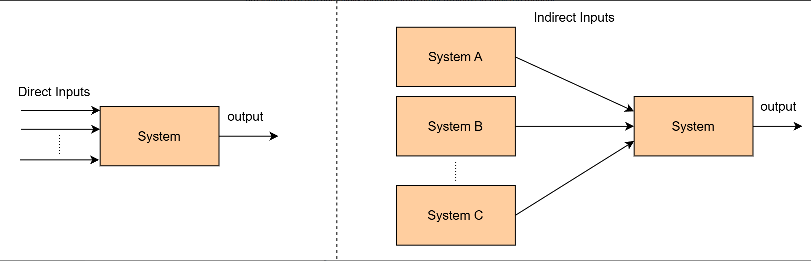
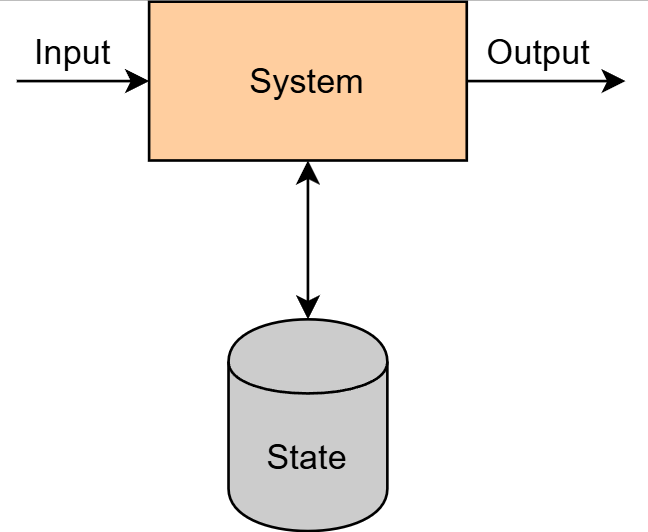

# Бесстатусные и статусные системы

Рассмотрим разницу между бесстатусными и статусными системами.

Мы можем сказать, что система относится к одной из двух следующих категорий:

- Бесстатусные системы
- Статусные системы

## Бесстатусная система

Бесстатусная система не сохраняет состояние того, что происходило в прошлом, и выполняет свои функции исключительно на основе предоставленных ей входных данных.

### Примеры

Простая бесстатусная система получает на вход набор чисел, вычисляет их максимум и возвращает результат. Эти входные данные могут быть прямыми или косвенными. Прямые входные данные включаются в запрос, тогда как косвенные входные данные могут быть получены от других систем для выполнения запроса.

Представьте сервис, который вычисляет цену определённого продукта, получая его начальную цену и текущие скидки от других сервисов, а затем выполняя необходимые вычисления с этими данными. Этот сервис остаётся бесстатусным.

## Статусная система

Статусные системы отвечают за сохранение и изменение состояния. Их результаты зависят от этого состояния.

### Пример

Представьте систему, которая хранит возраст всех сотрудников компании, и мы можем запросить максимальный возраст. Эта система является статусной, поскольку результат зависит от зарегистрированных в ней сотрудников.

## Некоторые интересные наблюдения

Статусные системы полезны в реальной жизни, поскольку компьютеры значительно превосходят людей в хранении и обработке данных.

Сохранение состояния связано с дополнительной сложностью. Например, необходимо определить наиболее эффективный способ хранения и обработки данных, как выполнять резервное копирование и т.д.

В результате обычно разумно создавать архитектуру, в которой чётко разделены бесстатусные компоненты (выполняющие бизнес-функции) и статусные компоненты (управляющие данными).

## Преимущества бесстатусных систем над статусными

Бесстатусные распределённые системы значительно проще проектировать, создавать и масштабировать по сравнению со статусными.

Основная причина этого в том, что все узлы (например, серверы) бесстатусной системы считаются одинаковыми. Это значительно упрощает балансировку трафика между ними и масштабирование путём добавления или удаления серверов.

Однако статусные системы создают гораздо больше проблем. Поскольку разные узлы могут содержать разные данные, они требуют дополнительных усилий. Необходимо направлять трафик в нужное место и обеспечивать синхронизацию каждого экземпляра с другими.

В результате некоторые примеры в курсе включают бесстатусные системы. Однако наиболее сложные проблемы, которые мы рассматриваем в этом курсе, в основном касаются статусных систем.