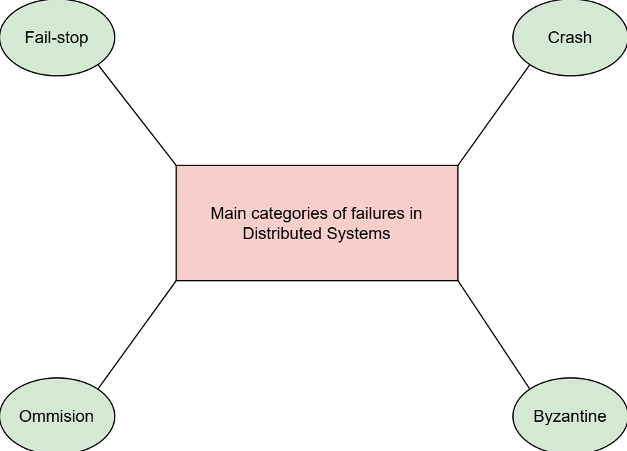

# Типы сбоев

Рассмотрим четыре основных типа сбоев.

Существует несколько различных типов сбоев. На следующей иллюстрации показаны наиболее основные категории.

## Четыре наиболее распространённых типа сбоев в распределённых системах

Рассмотрим эти сбои по порядку.

### Остановка (Fail-stop)

Узел останавливается и остаётся остановленным навсегда. Другие узлы могут обнаружить, что узел вышел из строя (например, путём общения с ним).

### Сбой (Crash)

Узел останавливается, но делает это незаметно. Таким образом, другие узлы могут не обнаружить это состояние. Они могут только предполагать сбой, когда не удаётся установить связь с узлом.

### Пропуск (Omission)

Узел не отвечает на входящие запросы.

### Византийский сбой (Byzantine)

Узел демонстрирует произвольное поведение: он может отправлять произвольные сообщения в произвольное время, выполнять некорректные шаги или останавливаться.

Византийские сбои происходят, когда узел не следует заданному протоколу или алгоритму. Обычно это случается, когда узел скомпрометирован злоумышленником или из-за программной ошибки.

Для борьбы с такими сбоями требуются сложные решения. Однако большинство компаний развертывают распределённые системы в средах, которые они считают частными и безопасными.

Сбои типа "остановка" являются самыми простыми и удобными с точки зрения разработчиков распределённых систем. Однако они не очень реалистичны. Это связано с тем, что в реальных системах часто сложно определить, произошёл ли сбой другого узла или нет.

Большинство алгоритмов, которые мы анализируем в этом курсе, работают с предположением о сбоях типа "сбой".