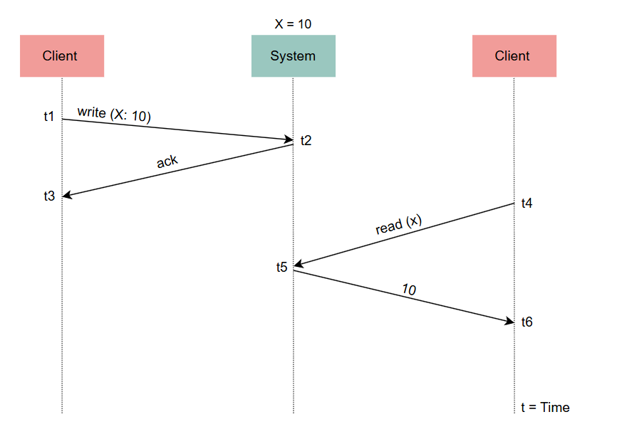
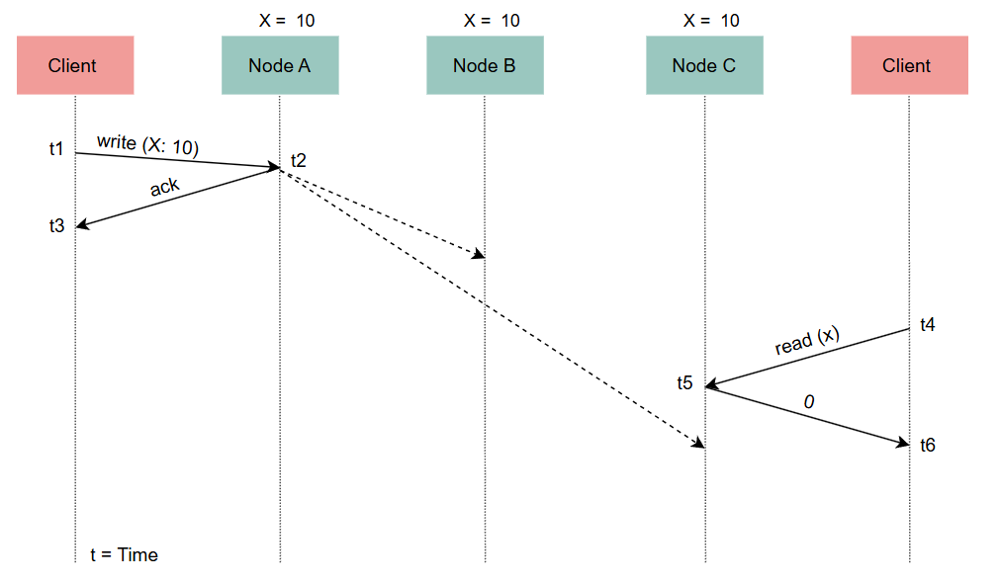
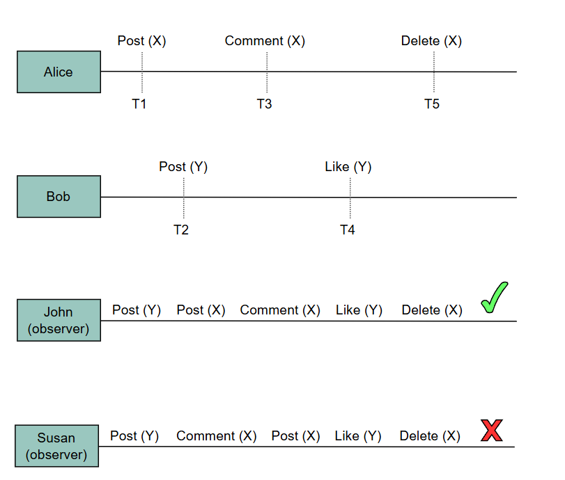
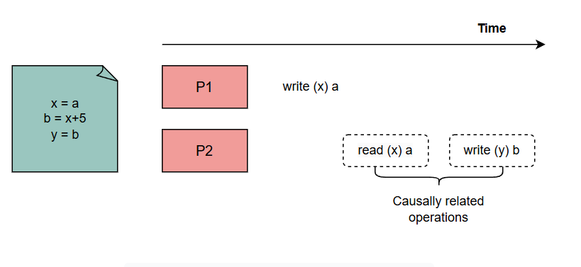
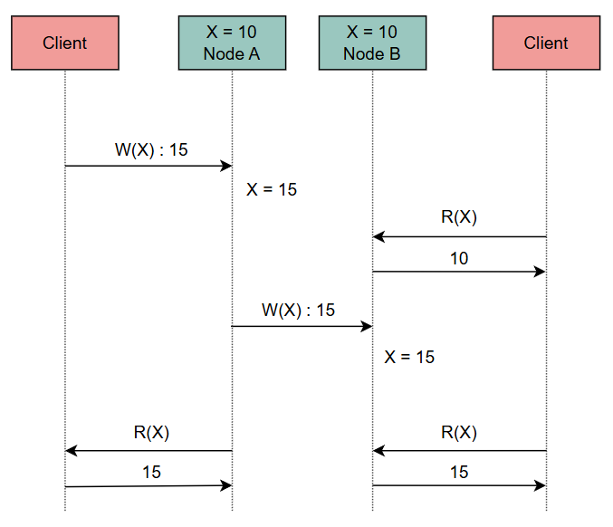

# Модели согласованности
На этом уроке мы изучим различные формы последовательности.

Согласно теореме CAP , согласованность означает, что каждый успешный запрос на чтение вернет результат последней записи. На самом деле, это упрощение, поскольку существует много различных форм согласованности.

В этом уроке мы познакомимся с формами последовательности, которые наиболее актуальны для нас.

Чтобы действительно точно определить все эти формы, нам нужно построить формальную модель. Обычно это модель согласованности .

# Модель согласованности
Модель согласованности определяет набор историй выполнения , которые действительны в системе.

Проще говоря, модель формально определяет возможные варианты поведения в распределенной системе.

Модели согласованности чрезвычайно полезны по многим причинам:

1) Они помогают нам формализовать поведение систем. Затем системы могут предоставить гарантии относительно своего поведения.
2) Инженеры-программисты могут уверенно использовать распределенную систему (например, распределенную базу данных) таким образом, чтобы не нарушать никаких важных для них свойств безопасности.
По сути, инженеры-программисты могут рассматривать распределенную систему как непрозрачный ящик, который предоставляет набор свойств. Более того, они могут делать это, не зная всей сложности, которую система внутренне предполагает для предоставления этих свойств.

# Модель сильной согласованности
Мы считаем модель согласованности A более сильной, чем модель B, когда первая допускает меньше историй. В качестве альтернативы мы говорим, что модель A делает больше предположений или накладывает больше ограничений на возможное поведение системы.

Обычно, чем сильнее модель согласованности, которой удовлетворяет система, тем проще построить приложение поверх нее. Это связано с тем, что разработчик может рассчитывать на более строгие гарантии.

# Список моделей согласованности
Существует множество различных моделей согласованности, используемых в современной области проектирования систем. Мы сосредоточимся на самых фундаментальных из них. Это следующие:

1) Линеаризуемость 
2) Последовательная последовательность 
3) Причинно-следственная последовательность 
4) Окончательная согласованность

# Линеаризуемость
Система, которая поддерживает модель согласованности линеаризуемости, — это система, в которой операции кажутся мгновенно выполняемыми внешнему клиенту. Это означает, что они происходят в определенной точке — от точки, в которой клиент вызывает операцию, до точки, в которой клиент получает подтверждение от системы о том, что операция завершена.

Более того, как только операция завершена и подтверждение доставлено клиенту, она видна всем остальным клиентам. Это подразумевает, что если клиент C2 вызывает операцию чтения после того, как клиент C1 получает завершение своей операции записи, C2 должен увидеть результат этой (или последующей) операции записи. Для некоторых может быть очевидно, что операции происходят мгновенно и видны после их завершения.

В централизованной системе линеаризуемость очевидна. Следующая иллюстрация это показывает.

Однако в распределенной системе мгновенности не существует.

На следующем рисунке показано, почему линеаризуемость не очевидна в распределенной системе.

Когда мы думаем о распределенной системе как об одном узле, кажется очевидным, что каждая операция происходит в определенный момент времени и немедленно видна всем. Однако, когда мы думаем о распределенной системе как о наборе взаимодействующих узлов, мы понимаем, что не следует принимать это как должное.

Например, система на иллюстрации выше не линеаризуема, так как T4 > T3. Однако второй клиент все равно не увидит чтение, поскольку оно еще не распространилось на узел, который обрабатывает операцию чтения. Нелинеаризуемость возникает из-за использования асинхронной репликации .

Когда мы используем технику синхронной репликации , мы делаем систему линеаризуемой. Однако это означает, что первая операция записи занимает больше времени, пока новое значение не распространится на остальные узлы. Помните о компромиссе между задержкой и согласованностью из теоремы PACELC.

## Преимущества
В результате вышеизложенного обсуждения мы понимаем, что линеаризуемость — очень мощная модель согласованности. Она помогает нам рассматривать сложные распределенные системы как гораздо более простые хранилища данных с одним узлом и рассуждать о наших приложениях более эффективно. Более того, используя атомарные инструкции, предоставляемые оборудованием (например, операции CAS ), мы можем строить более сложную логику поверх распределенных систем, например, мьютексы, семафоры, счетчики и т. д. Это невозможно в более слабых моделях согласованности.

# Последовательная последовательность
Последовательная согласованность — это более слабая модель согласованности, в которой операции могут вступать в силу до их вызова или после их завершения.

В результате он не дает никаких гарантий в реальном времени. Однако операции от разных клиентов должны быть видны в том же порядке всеми другими клиентами, и операции каждого отдельного клиента сохраняют порядок, указанный его программой (в этом глобальном порядке). Это допускает гораздо больше историй, чем линеаризуемость, но все еще накладывает некоторые ограничения, которые могут помочь в реальных приложениях.

## Пример
Например, в приложении социальной сети нам обычно все равно, в каком порядке размещаются посты у некоторых наших друзей. Однако мы все равно ожидаем, что посты от одного друга будут отображаться в правильном порядке (т. е. в том, в котором они их опубликовали). Следуя той же логике, мы обычно ожидаем, что комментарии наших друзей в посте будут отображаться в том порядке, в котором они их отправили. Все эти свойства фиксирует модель последовательной согласованности.

# Причинно-следственная связь
В некоторых случаях нам не нужно сохранять порядок, указанный программой каждого клиента, — пока причинно-связанные операции отображаются в правильном порядке. Это модель причинно-следственной согласованности , которая требует, чтобы только причинно-связанные операции отображались в том же порядке всеми узлами.

## Пример
Рассмотрим тот же сценарий, что и в нашем предыдущем примере с комментариями. Мы можем захотеть отображать комментарии не в хронологическом порядке, если это означает, что каждый комментарий отображается после комментария, на который он отвечает. Это ожидаемо, поскольку существует причинно-следственная связь между комментарием и комментариями, которые представляют собой ответы на него.

Таким образом, в отличие от последовательной согласованности, операции, которые не связаны причинно, могут быть видны в разных порядках в разных клиентах системы без необходимости поддерживать порядок программы каждого клиента. Конечно, чтобы достичь этого, каждая операция должна содержать некоторую информацию, которая сигнализирует, зависит ли она от других операций или нет. Это не обязательно должно быть связано со временем и может быть свойством, специфичным для приложения.

> Причинно-следственная последовательность — это более слабая модель последовательности, которая предотвращает распространенный класс неинтуитивного поведения.

# Окончательная согласованность
Существуют еще более простые приложения, которые не имеют понятия причины и следствия и требуют еще более простой модели согласованности. Модель согласованности в конечном счете здесь полезна.

## Пример
Например, мы могли бы принять, что порядок операций может быть разным между несколькими клиентами системы, и чтения не должны возвращать последнюю запись, пока система в конечном итоге не придет в стабильное состояние. В этом состоянии, если больше не выполняется операций записи, операции чтения вернут тот же результат. Это модель окончательной согласованности.

> Это одна из самых слабых форм согласованности, поскольку она не дает никаких гарантий относительно предполагаемого порядка операций или конечного состояния, к которому стремится система.

Она по-прежнему может быть полезной моделью для некоторых приложений, которые не требуют более строгих предположений или могут обнаруживать и устранять несоответствия на уровне приложения.

> Обратите внимание, что существует множество других моделей согласованности, помимо тех, которые мы здесь описали.