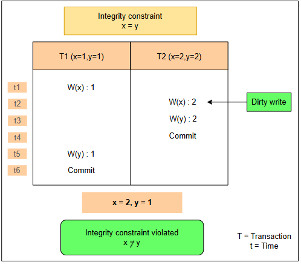
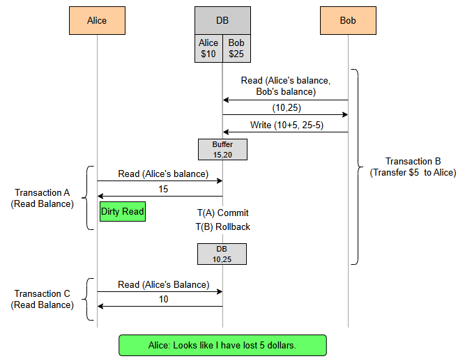
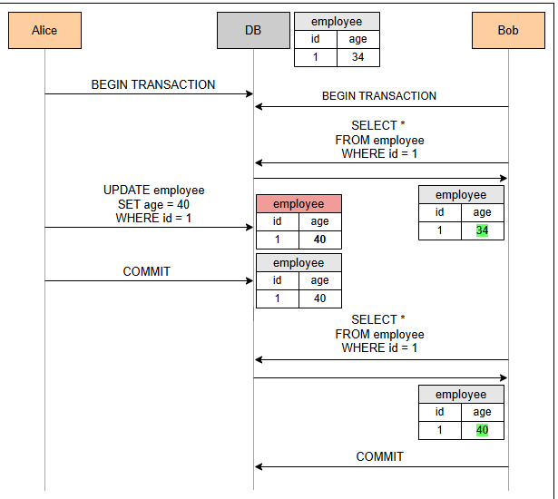
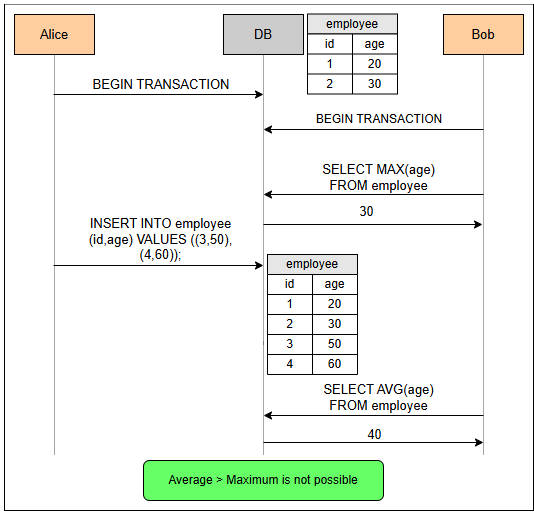
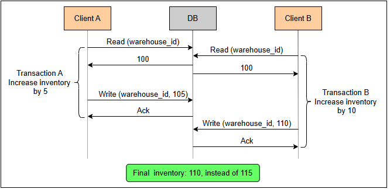
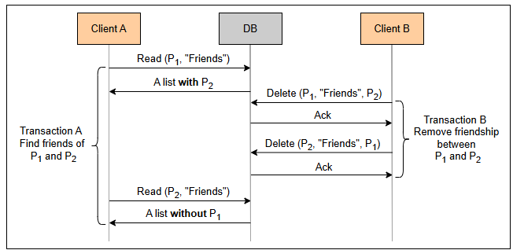
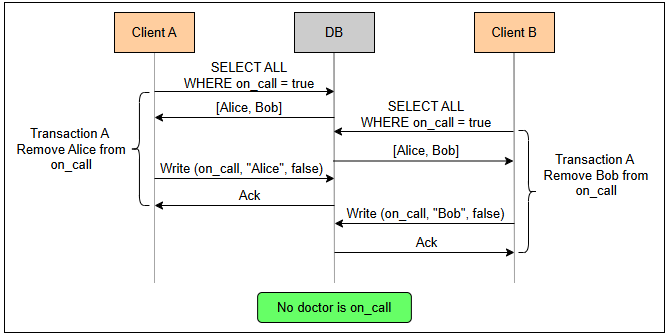

# Уровни изоляции и аномалии
Давайте рассмотрим список уровней изоляции и подробное объяснение аномалий, которые могут возникнуть в распределенных системах из-за присущего им параллелизма.

Врожденная параллелизм в распределенных системах создает потенциал для аномалий и неожиданного поведения. В частности, транзакции, которые включают в себя несколько операций и выполняются одновременно, могут приводить к разным результатам в зависимости от того, как чередуются их операции.

В результате все еще существует потребность в некоторых формальных моделях, которые определяют, что возможно, а что нет в поведении системы. Они называются уровнями изоляции .

Здесь мы рассмотрим наиболее распространённые из них, а именно:

1) Сериализуемость: по сути, это означает, что две транзакции, выполняемые одновременно, должны давать тот же результат, как если бы они выполнялись последовательно.

2) Повторяемое чтение: гарантирует, что данные, однажды считанные транзакцией, не изменятся на протяжении всего ее хода.

3) Изоляция моментального снимка: гарантирует, что все чтения, выполненные в транзакции, будут видеть согласованный моментальный снимок базы данных с момента ее начала, и транзакция будет успешно зафиксирована, если никакая другая транзакция не обновила те же данные с момента этого моментального снимка.

4) Чтение зафиксировано: транзакциям не разрешено считывать данные, которые еще не были зафиксированы другой транзакцией.

5) Чтение незафиксированных данных: это самый низкий уровень изоляции, который позволяет транзакции считывать незафиксированные данные другими транзакциями.

В отличие от моделей согласованности, представленных в уроке «Модели согласованности» , некоторые из этих уровней изоляции не определяют, что возможно, через некоторую формальную спецификацию. Вместо этого они определяют, что невозможно, т. е. какие аномалии из уже известных предотвращаются.

Конечно, более сильные уровни изоляции предотвращают больше аномалий за счет производительности. Давайте сначала рассмотрим возможные аномалии, прежде чем изучать различные уровни.

Источником уровней изоляции выше и связанных с ними аномалий по сути был стандарт ANSI SQL-92 . Однако определения в этом стандарте были неоднозначными и упускали некоторые возможные аномалии.

> Последующие исследования подробно изучают больше аномалий и пытаются дать более строгое определение этим уровням. Основные части будут рассмотрены в этом уроке, но, пожалуйста, обратитесь к этой статье для более глубокого анализа.

# Аномалии
Здесь рассматриваются следующие аномалии:

1) Грязные записи
2) Грязные чтения
3) (Нечеткие) неповторяющиеся чтения
4) Фантомные чтения
5) Потерянные обновления 
6) Read skew 
7) Write skew

# Грязная запись
«Грязная» запись происходит , когда транзакция перезаписывает значение, ранее записанное другой транзакцией, которая все еще выполняется и еще не зафиксирована.

Одна из причин, по которой грязные записи являются проблематичными, заключается в том, что они могут нарушать ограничения целостности . Например, есть две транзакции A и B, где транзакция A запускает операции [x=1, y=1], а транзакция B запускает операции [x=2, y=2]. Тогда последовательное выполнение их всегда приведет к ситуации, когда x и y будут иметь одинаковое значение. Однако это не обязательно верно в параллельном выполнении, где возможны грязные записи.

## Пример

Примером может служить следующее выполнение [x=1, x=2, y=2, коммит B, y=1, коммит A], результатом которого будут x=2 и y=1.

Другая проблема с грязными записями заключается в том, что они делают невозможным автоматический откат системы к предыдущему образу базы данных. В результате это аномалия, которую нам нужно предотвратить в большинстве случаев.

# Грязное чтение
«Грязное» чтение происходит , когда транзакция считывает значение, записанное другой транзакцией, которая еще не была зафиксирована.

Это проблематично, поскольку система может принимать решения в зависимости от этих значений, даже если связанные транзакции могут быть впоследствии откатены. Однако даже в случае, когда эти транзакции в конечном итоге фиксируются, это все еще может быть проблемой.

## Пример

Примером может служить классический сценарий банковского перевода, где общая сумма денег должна быть одинаковой в любое время. Например, представьте, что транзакция A может считать баланс двух счетов, участвующих в переводе, во время другой транзакции (B), которая выполняет перевод со счета 1 на счет 2. Во время перевода это будет выглядеть так, как будто часть денег была потеряна со счета 1.

Однако есть несколько случаев, когда разрешение грязных чтений может быть полезным, если делать это осторожно. Одним из таких случаев является создание большого совокупного отчета по полной таблице, когда мы можем допустить некоторые неточности в числах отчета.

Это также может быть полезно, когда мы устраняем неполадку и хотим проверить состояние базы данных в ходе текущей транзакции.

# Нечеткое или неповторяющееся считывание
Нечеткое или неповторяющееся чтение происходит, когда значение извлекается дважды во время транзакции (без его обновления в той же транзакции), и значение отличается.

Это может привести к проблемным ситуациям, аналогичным приведенному выше примеру с грязными чтениями.

Другие случаи, когда это может привести к проблемам, — когда первое чтение значения используется для некоторой условной логики, а второе — для обновления данных. В этом случае транзакция может действовать на устаревших данных.

# Фантомное чтение
Фантомное чтение происходит, когда транзакция выполняет чтение на основе предиката, а другая транзакция записывает или удаляет элемент данных, соответствующий этому предикату, пока первая транзакция все еще находится в процессе выполнения. Если это происходит, то первая транзакция может снова действовать на устаревших данных или несогласованных данных.

## Пример

Например, транзакция A запускает 2 запроса для вычисления максимального и среднего возраста определенного набора сотрудников. Однако между двумя запросами транзакция B чередуется и вставляет в этот набор много старых сотрудников, таким образом заставляя транзакцию A возвращать среднее значение, которое больше максимального.

Разрешение фантомных чтений может быть безопасным для приложения, которое не использует чтения на основе предикатов, т. е. выполняет только те чтения, которые выбирают записи с использованием первичного ключа.

# Потерянное обновление
Потерянное обновление происходит, когда две транзакции считывают одно и то же значение, а затем пытаются обновить его до двух разных значений. Конечный результат заключается в том, что одно из двух обновлений выживает, но процесс, выполняющий другое обновление, не информируется о том, что его обновление не вступило в силу. Поэтому это называется потерянным обновлением.

## Пример

Представьте себе склад с различными контроллерами, которые обновляют базу данных при поступлении новых товаров. Транзакции довольно просты. Они включают в себя считывание количества товаров, находящихся на складе в данный момент, добавление количества новых товаров к этому числу и последующее сохранение результата обратно в базе данных.

Эта аномалия может привести к следующей проблеме:

Транзакции A и B одновременно считывают текущий размер инвентаря (скажем, 100 позиций), добавляют к нему количество новых позиций (скажем, 5 и 10 соответственно), а затем сохраняют это обратно в базу данных. Предположим, что транзакция B была последней, кто делал запись. Это означает, что окончательный инвентарь составляет 110 вместо 115. Таким образом, пять новых позиций не регистрируются!
Для наглядности этого примера см. следующую иллюстрацию.

В зависимости от приложения, в некоторых случаях может быть безопасно разрешить потерянные обновления. Например, рассмотрим приложение, которое позволяет нескольким администраторам обновлять определенные части внутреннего веб-сайта, используемого сотрудниками компании.

# Читать перекос
Перекос чтения возникает, когда между двумя элементами данных существуют ограничения целостности, которые кажутся нарушенными, поскольку транзакция может видеть только частичные результаты другой транзакции.

## Пример

Давайте представим себе приложение, содержащее таблицу лиц, где каждая запись представляет человека и содержит список всех друзей этого человека. Основное ограничение целостности заключается в том, что дружеские отношения являются взаимными; если человек B включен в список друзей человека A, то A также должен быть включен в список B. Каждый раз, когда кто-то (например, P1) хочет удалить друга (например, P2), выполняется транзакция, которая удаляет P2 из списка P1, а также удаляет P1 из списка P2 за один раз.

Теперь давайте также предположим, что некоторая другая часть приложения позволяет людям просматривать друзей нескольких людей одновременно. Это делается транзакцией, которая считывает список друзей этих людей. Если вторая транзакция считывает список друзей P1 до начала первой транзакции, но считывает список друзей P2 после того, как первая транзакция была зафиксирована, она заметит нарушение целостности. P2 будет в списке друзей P1, но P1 не будет в списке друзей P2.

> Обратите внимание, что этот случай не является «грязным» чтением, поскольку все значения, записанные первой транзакцией, доступны только для чтения после ее фиксации.

Строгое требование предотвращения перекоса чтения встречается довольно редко, как мы уже могли догадаться. Например, распространенное приложение такого типа может позволить пользователю просматривать профиль только одного человека за раз вместе с его друзьями, таким образом не требуя ограничения целостности, описанного выше.

# Написать косой
Перекос записи возникает, когда две транзакции считывают одни и те же данные, но затем изменяют непересекающиеся наборы данных.

## Пример

Представьте себе приложение, которое поддерживает ротацию дежурных врачей в больнице. Таблица содержит одну запись для каждого врача с полем, указывающим, дежурят ли они. Приложение позволяет врачу удалить себя из дежурной ротации, если зарегистрирован другой врач. Это делается с помощью транзакции, которая считывает количество дежурных врачей из этой таблицы. Если число больше одного, оно обновляет запись, соответствующую этому врачу, чтобы он не был дежурным.

Теперь давайте рассмотрим проблемы, которые могут возникнуть из-за явления перекоса записи. Допустим, два врача, Алиса и Боб, в настоящее время находятся на дежурстве, и они оба решают попробовать удалить себя. Две транзакции, запущенные одновременно, могут прочитать состояние базы данных, увидеть, что есть два врача, и удалить соответствующего врача из дежурства. В конце концов, система останется без дежурных врачей!

Для наглядности этого примера смотрите следующую иллюстрацию.

> Теперь очевидно, что существует множество различных аномалий, которые нам следует учитывать. Кроме того, различные приложения манипулируют данными по-разному. Поэтому нам приходится анализировать каждый случай отдельно, чтобы увидеть, какие аномалии могут создавать проблемы.