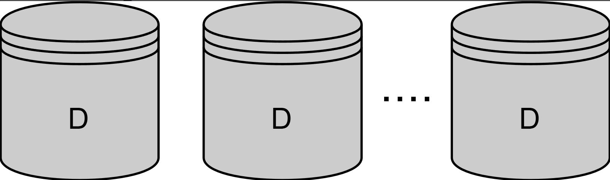

# Репликация

Узнайте, что такое репликация и почему она используется в распределённых системах.

Разделение данных может улучшить масштабируемость и производительность системы за счёт распределения данных и нагрузки от запросов между несколькими узлами.

Ещё одно преимущество использования распределённой системы связано с доступностью.

## Доступность

Доступность означает способность системы оставаться функциональной несмотря на сбои в её отдельных частях.

## Механизм достижения доступности

Техника, используемая для достижения доступности, — это репликация.

## Репликация

Репликация — это основная техника, используемая в распределённых системах для повышения доступности. Она заключается в хранении одной и той же части данных на нескольких узлах (называемых репликами), чтобы в случае сбоя одного из них данные не были потеряны, а запросы могли обслуживаться другими узлами в это время.

Однако повышение доступности за счёт репликации влечёт за собой ряд новых сложностей.

Репликация означает, что система теперь содержит несколько копий каждой части данных. Эти копии должны поддерживаться и синхронизироваться друг с другом при каждом обновлении.

В идеале репликация должна быть прозрачной для конечного пользователя или инженера. Это создаёт иллюзию, что существует только одна копия каждой части данных. Благодаря этому распределённая система выглядит как простая централизованная система с одним узлом, о которой гораздо легче рассуждать и разрабатывать программное обеспечение.

Конечно, это не всегда возможно. Для достижения такого идеала могут потребоваться значительные аппаратные ресурсы или отказ от других желаемых свойств. Например, инженеры иногда сознательно выбирают систему, которая обеспечивает гораздо более высокую производительность, но иногда предоставляет несогласованное представление данных. Это делается только при определённых условиях и определённым образом, которые они могут учесть при проектировании приложения.

Поэтому существуют две основные стратегии репликации:

- Пессимистичная репликация
- Оптимистичная репликация

### Пессимистичная репликация

Пессимистичная репликация старается с самого начала гарантировать, что все реплики идентичны друг другу — как будто изначально существует только одна копия данных.

### Оптимистичная репликация

Оптимистичная репликация, или ленивая репликация, допускает расхождение между различными репликами. Это гарантирует, что они снова сойдутся, если система не получает обновлений или переходит в состояние покоя на определённый период времени.

Репликация — это очень активная область исследований, поэтому для неё существует множество различных алгоритмов.