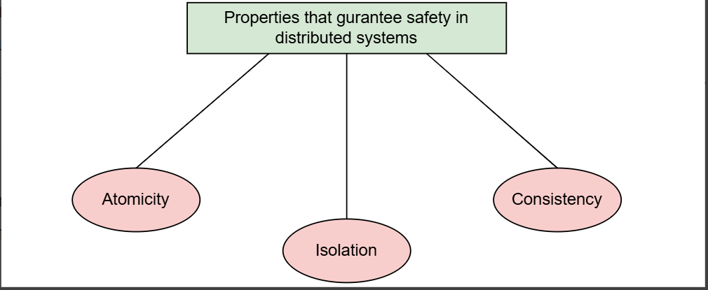
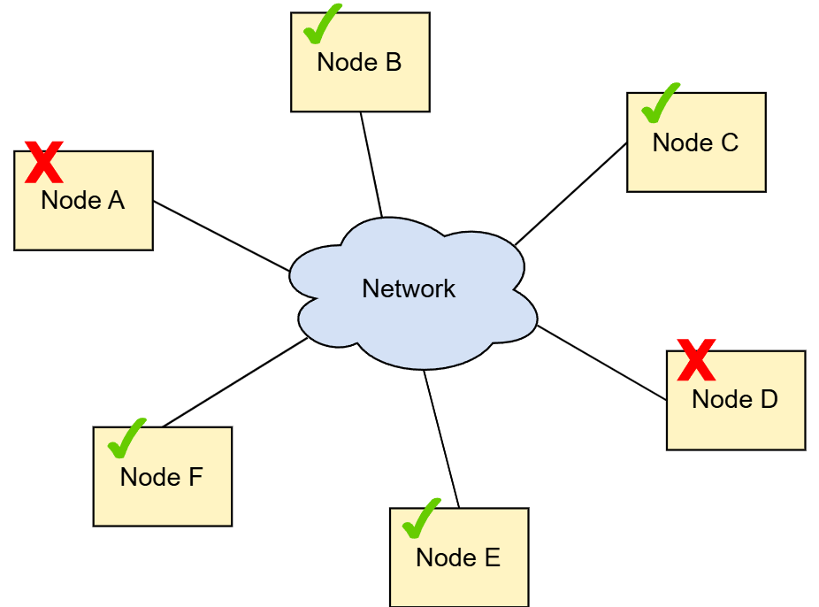
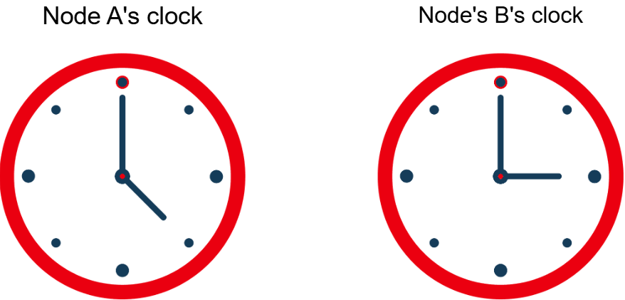

# Гарантии безопасности в распределенных системах
На этом уроке мы рассмотрим свойства, гарантирующие безопасность распределенных систем, и их связь с трудностями проектирования распределенных систем.

Поскольку распределенные системы предполагают большую сложность, некоторые гарантии безопасности гарантируют, что система будет вести себя определенным, предсказуемым образом. Это облегчает людям суждение о системе и любых потенциальных аномалиях, которые могут возникнуть. Это позволит им создать надлежащие меры безопасности для предотвращения возникновения этих аномалий.

# Гаранты безопасности
Основные гарантии безопасности, которые обеспечивают системы, связаны с тремя свойствами, показанными на иллюстрации.

Три свойства, гарантирующие безопасность в распределенной системе
Концепции атомарности и изоляции берут начало в исследовании баз данных и транзакциях ACID. Когда мы упоминаем согласованность в этом курсе, мы в основном будем ссылаться на понятие согласованности, ставшее популярным благодаря теореме CAP.

Прежде чем двигаться дальше, полезно рассмотреть эти темы. Мы подробно изучим эти две темы в следующих двух уроках.

Интересно отметить, что каждая из этих гарантий безопасности тесно связана с вышеупомянутыми причинами , которые затрудняют проектирование распределенных систем.

# Достижение атомарности
Достичь атомарности в распределенной системе сложно из-за возможности частичных сбоев .

Частичный отказ происходит, когда некоторые компоненты в системе выходят из строя. На следующем рисунке это показано.

# Достижение последовательности
Достичь согласованности сложно из-за асинхронности сети .

Асинхронность сети возникает, когда разные узлы в сети имеют разные значения для текущего времени. Это показано на следующем рисунке.

# Достижение изоляции
Достичь изоляции сложно из-за присущей распределенным системам параллельности.

Параллелизм возникает, когда несколько вещей происходят одновременно. Следующая иллюстрация показывает это.

На приведенной выше иллюстрации две ручки одновременно пытаются писать на одном ресурсе.