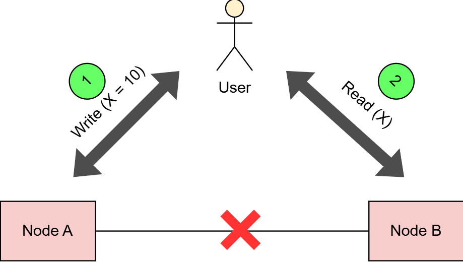
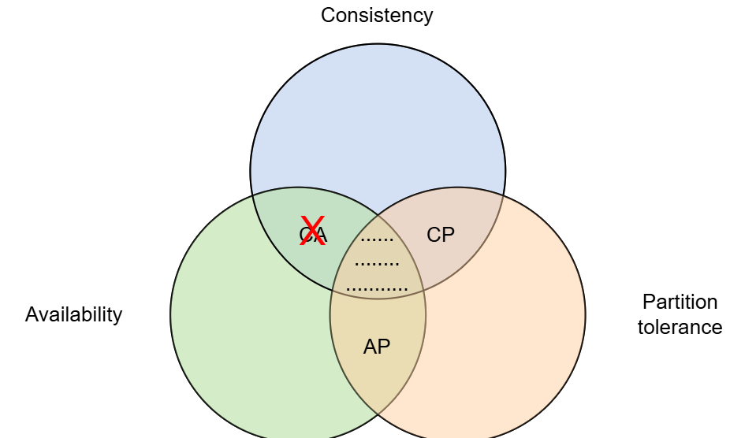

# Теорема CAP
На этом уроке мы объясним теорему CAP с ее доказательством и ее расширенную теорему PACELC.

Теорема CAP — одна из самых фундаментальных теорем в области распределенных систем. Она описывает неотъемлемый компромисс при проектировании распределенных систем.

# Первоначальное утверждение теоремы CAP
Согласно первоначальному утверждению теоремы CAP, распределенное хранилище данных не может одновременно обеспечивать более двух из следующих свойств: согласованность , доступность и устойчивость к разделению .

## Последовательность
Согласованность означает, что каждый успешный запрос на чтение получает результат самого последнего запроса на запись.

> Концепция согласованности в теореме CAP полностью отличается от концепции согласованности в транзакциях ACID. Понятие согласованности, представленное в теореме CAP, более важно для распределенных систем.

## Доступность
Доступность означает, что на каждый запрос возвращается ответ без ошибок, без каких-либо гарантий того, отражает ли он самый последний запрос на запись.

# Допустимое отклонение раздела
Устойчивость к разделению означает, что система может продолжать работать, несмотря на произвольное количество сообщений, отбрасываемых сетью между узлами из-за разделения сети .

> Очень важно понимать, что устойчивость к разделению — это не то свойство, от которого можно отказаться.

В распределенной системе всегда существует риск разделения сети. Если это происходит, система должна решить, продолжать ли работу и скомпрометировать согласованность данных , или прекратить работу и скомпрометировать доступность .

Однако не существует такого понятия, как компромисс между толерантностью к разделению и сохранением как согласованности , так и доступности . В результате, эта теорема на самом деле утверждает следующее.

# Окончательное утверждение теоремы CAP
Согласно заключительному утверждению теоремы CAP, распределенная система может быть либо согласованной , либо доступной при наличии сетевого разделения.

# Доказательство
Попробуем доказать эту теорему упрощенно и схематично. Представим себе распределенную систему, состоящую из двух узлов, как показано на рисунке.

Эта распределенная система может действовать как простой регистр со значением переменной X.

Теперь предположим, что произошел сетевой сбой, который в какой-то момент привел к разделению сети между двумя узлами системы. Пользователь системы выполняет запись, а затем чтение — даже два разных пользователя могут выполнять эти операции.

Мы рассмотрим случай, когда каждую операцию обрабатывает другой узел системы. В этом случае у системы есть два варианта:

1) Это может привести к сбою одной из операций и нарушению свойства доступности .
2) Он может обрабатывать обе операции, которые вернут устаревшее значение из чтения и нарушат свойство согласованности .
Он не может успешно обработать обе операции, одновременно гарантируя, что чтение вернет последнее значение, записанное операцией записи. Это происходит потому, что результаты операции записи не могут быть распространены от узла A к узлу B из-за разделения сети.

# Важность теоремы CAP
Теорема CAP действительно важна, поскольку она помогла установить основные ограничения всех распределенных систем.

Теорема CAP заставляет проектировщиков распределенных систем делать явные компромиссы между доступностью и согласованностью . Как только инженеры узнают об этих свойствах, они выбирают подходящую систему.

# Категоризация распределенных систем на основе теоремы CAP
Когда мы читаем литературу и документацию по распределенным системам, мы замечаем, что системы обычно классифицируются на две основные категории: CP и AP . Эта классификация зависит от того, какое свойство система нарушает во время разделения сети.

> Следует отметить еще один важный момент относительно теоремы CAP: выбор между согласованностью и доступностью необходимо делать только во время разделения сети.

Свойства согласованности и доступности могут быть удовлетворены при отсутствии сетевого разделения.

# Компромисс между задержкой и согласованностью
Если при нормальной работе сеть не разделена, существует другой компромисс между задержкой и согласованностью .

Чтобы гарантировать согласованность данных , системе придется откладывать операции записи до тех пор, пока данные не будут успешно распространены по всей системе, что приведет к задержке .

Примером такого компромисса является схема репликации «первичный-резервный». В этой настройке подход синхронной репликации будет способствовать согласованности , а не задержке . В то же время асинхронная репликация уменьшит задержку за счет согласованности .

# Теорема PACELC
Теорема PACELC является расширением теоремы CAP, которая изложена в отдельной статье . Она утверждает следующее:

> «В случае разделения сети (P) система должна выбирать между доступностью (A) и согласованностью (C), но в противном случае (E), когда система работает нормально при отсутствии сетевых разделов, система должна выбирать между задержкой (L) и согласованностью (C)».

# Категоризация распределенных систем на основе теоремы PACELC
Каждая ветвь теоремы PACELC создает две подкатегории систем.

Первая часть теоремы определяет две категории, которые мы уже рассмотрели: CP и AP.

Во второй части определяются две новые категории: EL и EC .

Эти подкатегории объединены в следующие четыре категории:

АП/ЭЛ
КП/ЭЛ
АП/ЕС
КП/ЕС
Система из категории AP/EL отдает приоритет доступности во время разделения сети и задержке во время нормальной работы.

В большинстве случаев системы разрабатываются с учетом всеобъемлющего принципа: обычно либо производительность и доступность, либо согласованность данных. В результате большинство систем попадают в категории AP/EL или CP/EC.

> Все еще существуют системы, которые мы не можем строго классифицировать по этим категориям. Это потому, что у них есть различные рычаги, которые могут настраивать систему по-разному, когда это необходимо. Тем не менее, эта теорема служит хорошим индикатором различных сил, действующих в распределенной системе.

Таблицу с категоризацией нескольких распределенных систем по этим измерениям можно найти на соответствующей странице Википедии, посвященной теореме PACELC .
