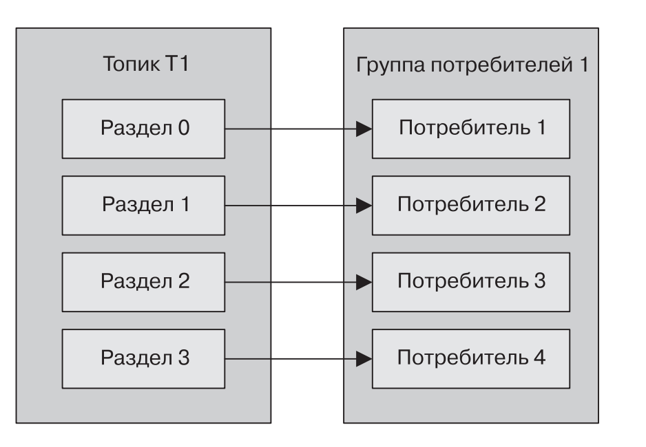

Что такое брокер сообщений

Главная задача брокера — обеспечение связи и обмена информацией между приложениями или отдельными модулями в режиме реального времени.
Брокер — система, преобразующая сообщение от источника данных (продюсера) в сообщение принимающей стороны (консьюмера). Брокер выступает проводником и состоит из серверов, объединенных в кластеры.

--------------------------------------------------------------------------------------------------------------------
Что такое Система обмена сообщениями и зачем она нужна?

Чтобы два приложения могли общаться друг с другом, они должны сначала определить интерфейс. Определение этого интерфейса включает выбор транспорта или протокола, такого как HTTP, MQTT или SMTP и согласование форматов сообщений, которыми будут обмениваться системы. Это может быть строгий процесс, такой как определение схемы XML с требованиями к затратам на полезную нагрузку (payload) сообщения, или это может быть гораздо менее формально, например, соглашение между двумя разработчиками о том, что некоторая часть HTTP-запроса будет содержать идентификатор клиента.
Пока формат сообщений и порядок их отправки между системами согласованы, они смогут взаимодействовать друг с другом, не заботясь о реализации другой системы. Внутренности этих систем, такие как язык программирования или использованный фреймфорк, могут со временем меняться. До тех пор, пока поддерживается сам контракт, взаимодействие может продолжаться без изменений с другой стороны. Эти две системы эффективно расцеплены (разделены) этим интерфейсом.
Системы обмена сообщениями, как правило, предусматривают участие посредника между двумя системами, которые взаимодействуют для дальнейшего расцепления (разделения) отправителя от получателя или получателей. При этом система обмена сообщениями позволяет отправителю отправить сообщение, не зная, где находится получатель, активен ли он или сколько их экземпляров.

--------------------------------------------------------------------------------------------------------------------
Что такое Kafka AdminClient?

AdminClient - это Api, нужное, чтобы предоставить программный API для административных функций, которые ранее выполнялись в командной строке: составления списков, создания и удаления топиков, описания кластера, управления списками контроля доступа (ACL) и изменения конфигурации

Основыне параметры:

client.dns.lookup:
использование псевдонимов DNS, особенно в конфигурации начальной загрузки, и использование одного DNS, который сопоставляется с несколькими IP-адресами.

request.timeout.ms:
Этот параметр ограничивает время, которое ваше приложение может потратить на ожидание ответа AdminClient

--------------------------------------------------------------------------------------------------------------------
Что такое контроллер Kafka?

Контроллер – это брокер, который отвечает за выбор ведущих реплик для разделов. Контроллером становится брокер, который был запущен раньше остальных. Он создает в службе ZooKeeper временный узел с названием /controller

--------------------------------------------------------------------------------------------------------------------
Что такое номер эпохи?

Номер эпохи - это представление количества умерших контроллеров, для поддержания получения информации только из одного.
Контроллер имеющий номер эпохи меньше, чем нынешний является зомби

--------------------------------------------------------------------------------------------------------------------
Что такое ведомый реплика?

ведомые – реплики, которые копируют сообщения из ведущей реплики, тем самым поддерживая актуальное состояние по сравнению с ней.

--------------------------------------------------------------------------------------------------------------------
Что такое KRaft?

KRaft - это кворум контроллеров на базе Raft. Замена ZooKeeper.

--------------------------------------------------------------------------------------------------------------------
Расскажите про Point-to-Point общение систем

Александра идет на почту, чтобы отправить Адаму посылку. Она подходит к окошку и вручает сотруднику посылку. Сотрудник забирает посылку и выдает Александре квитанцию. Адаму не нужно быть дома в момент отправки посылки. Александра уверена, что посылка будет доставлена Адаму в какой-то момент в будущем и может продолжать заниматься своими делами. Позже в какой-то момент Адам получает посылку.
Это пример модели обмена сообщениями точка-точка. Почтовое отделение здесь действует как механизм распределения посылок, гарантируя, что каждая посылка будет доставлена один раз. Использование почтового отделения отделяет акт отправки посылки от доставки посылки.В классических системах обмена сообщениями модель «точка-точка» реализуется через очереди. Очередь действует, как буфер FIFO (первый вошел, первый вышел), на который может подписаться один или несколько потребителей. Каждое сообщение доставляется только одному из подписанных потребителей. Очереди обычно пытаются справедливо распределять сообщения между потребителями. Только один потребитель получит данное сообщение.

К очередям применяется термин «надежные» («durable»). Надежность — это свойство сервиса, которое гарантирует, что система обмена сообщениями будет сохранять сообщения при отсутствии активных подписчиков до тех пор, пока потребитель не подпишется на очередь для доставки сообщений.

Надежность часто путают с персистентностью и, хотя эти два термина взаимозаменяемы, они выполняют разные функции. Персистентность определяет, записывает ли сообщение система обмена сообщениями в какого-либо рода хранилище между получением и отправкой его потребителю. Сообщения, отправляемые в очередь, могут быть или не быть персистентными.Обмен сообщениями типа «Точка-точка» используется, когда вариант использования требует однократного действия с сообщением. В качестве примера можно привести внесение средств на счет или выполнение заказа на доставку. Мы обсудим позже, почему система обмена сообщениями сама по себе неспособна обеспечить однократную доставку и почему очереди могут в лучшем случае обеспечить гарантию доставки хотя бы один раз.

--------------------------------------------------------------------------------------------------------------------
Расскажите про Издатель-Подписчик общение систем

Габриэлла набирает номер конференции. Пока она подключена к конференции, она слышит все, что говорит спикер, вместе с остальными участниками вызова. Когда она отключается, она пропускает то, что сказано. При повторном подключении она продолжает слышать, что говорят.

Это пример модели обмена сообщениями публикация-подписка. Конференц-связь выступает, как широковещательный механизм. Говорящий человек не заботится о том, сколько людей в настоящее время присоединились к звонку — система гарантирует, что любой подключившийся в настоящий момент услышит, что говорится.В классических системах обмена сообщениями модель обмена сообщениями «публикация-подписка» реализуется через топики. Топик предоставляет такой же способ широковещания, как и механизм конференц-связи. Когда сообщение отправляется в топик, оно распределяется по всем подписанным пользователям.
Топики обычно ненадежные (nondurable). Как и слушатель, который не слышит, что говорится на конференц-звонке, когда слушатель отключается, подписчики топика пропускают любые сообщения, которые отправляются в тот момент, когда они находятся в автономном режиме. По этой причине можно сказать, что топики предоставляют гарантию доставкине более одного разадля каждого потребителя.
Обмен сообщениями типа «публикация-подписка» обычно используется, когда сообщения носят информационный характер, и потеря одного сообщения — не особо значима. Например, топик может передавать показания температуры от группы датчиков один раз в секунду. Система, которая интересуется текущей температурой и которая подписывается на топик, не будет переживать, если она пропустит сообщение — другое поступит в ближайшее время.

--------------------------------------------------------------------------------------------------------------------
Расскажите про Гибридные модели общение систем

Веб-сайт магазина помещает сообщения о заказах в «очередь сообщений». Основным потребителем этих сообщений является исполнительная система. Кроме того, система аудита должна иметь копии этих сообщений о заказах для последующего отслеживания. Обе системы не могут пропускать сообщения, даже если сами системы в течение некоторого времени недоступны. Веб-сайт не должен знать о других системах.

Сценарии использования часто требуют совмещения моделей обмена сообщениями «публикация-подписка» и «точка-точка», например, когда нескольким системам требуется копия сообщения, и для предотвращения потери сообщения требуется как надежность, так и персистентность.

В этих случаях требуется адресат (destination) (общий термин для очередей и топиков), который распределяет сообщения в основном как топик, так, что каждое сообщение отправляется в отдельную систему, заинтересованную в этих сообщениях, но и также в которой каждая система может определить несколько потребителей, которые получают входящие сообщения, что больше похоже на очередь. Тип чтения в этом случае —один раз для каждой заинтересованной стороны. Эти гибридные адресаты часто требуют надежности (durability), так что, если потребитель отключается, сообщения, которые отправляются в это время, принимаются после повторного подключения потребителя.

Гибридные модели не новы и могут применяться в большинстве систем обмена сообщениями, включая как ActiveMQ (через виртуальные или составные адресаты, которые объединяют топики и очереди), так и Kafka (неявно, как фундаментальное свойство дизайна её адресата).

Теперь, когда у нас есть некоторая базовая терминология и понимание того, для чего нам могла бы пригодиться система обмена сообщениями, давайте перейдем к деталям.

--------------------------------------------------------------------------------------------------------------------
Что такое Apache Kafka

Apache Kafka — распределённый программный брокер сообщений,

По сути - это распределенный лаг, с возможностью публикации подписки. Основная задача - это доставка сообщений от продюсеров, которые пишут кластер, до подписчиков.

--------------------------------------------------------------------------------------------------------------------
Какую модель общение систем использует Kafka?

Kafka объединила обмен сообщениями типа «публикация-подписка» и «точка-точка» в рамках одного вида адресата — топика. Это сбивает с толку людей, работавших с системами обмена сообщениями, где слово «топик» относится к широковещательному механизму, из которого (из топика) чтение не является надежным (is nondurable). Топики Kafka следует рассматривать как гибридный тип адресата

--------------------------------------------------------------------------------------------------------------------
Что такое Broker Kafka?

За хранение ваших данных отвечает брокер (broker). Все данные хранятся в бинарном виде, и брокер мало знает про то, что они из себя представляют, и какова их структура.
Каждый логический тип событий обычно находится в своем отдельном топике (topic). Например, событие создания объявления может попадать в топик item.created, а событие его изменения — в item.changed. Топики можно рассматривать как классификаторы событий. На уровне топика можно задать такие конфигурационные параметры, как:

объем хранимых данных и/или их возраст (retention.bytes, retention.ms);

фактор избыточности данных (replication factor);
максимальный размер одного сообщения (max.message.bytes);

минимальное число согласованных реплик, при котором в топик можно будет записать данные (min.insync.replicas);

возможность провести failover на не синхронную отстающую реплику с потенциальной потерей данных (unclean.leader.election.enable);

В свою очередь, каждый топик разбивается на одну и более партицию (partition). Именно в партиции в итоге попадают события. Если в кластере более одного брокера, то партиции будут распределены по всем брокерам равномерно (насколько это возможно), что позволит масштабировать нагрузку на запись и чтение в один топик сразу на несколько брокеров.
На диске данные для каждой партиции хранятся в виде файлов сегментов, по умолчанию равных одному гигабайту (контролируется через log.segment.bytes). Важная особенность — удаление данных из партиций (при срабатывании retention) происходит как раз сегментами (нельзя удалить одно событие из партиции, можно удалить только целый сегмент, причем только неактивный).

--------------------------------------------------------------------------------------------------------------------
Что из себя представляют сообщения в Kafka

Каждое сообщение (event или message) в Kafka состоит из ключа, значения, таймстампа и опционального набора метаданных (так называемых хедеров).

Key — опциональный ключ, нужен для распределения сообщений по кластеру.
Value — массив байт, бизнес-данные.
Timestamp — текущее системное время, устанавливается отправителем или кластером во время обработки.
Headers — пользовательские атрибуты key-value, которые прикрепляют к сообщению.

--------------------------------------------------------------------------------------------------------------------
Для чего нужны Headers в сообщениях?

Заголовки записей позволяют добавлять метаданные о записи Kafka, но при этом не указывать дополнительную информацию в парах ключ-значение самой записи. Допустим, мы хотим добавить в сообщение идентификатор системы, из которой поступили данные. Это может понадобиться для отслеживания происхождения, аудита или упрощения маршрутизации данных.

--------------------------------------------------------------------------------------------------------------------
Какую роль выполняет Zookeeper в kafka?

Zookeeper выполняет роль хранилища метаданных и координатора. Именно он способен сказать, живы ли брокеры (посмотреть на это глазами zookeeper можно через zookeeper-shell командой ls /brokers/ids), какой из брокеров является контроллером (get /controller), находятся ли партиции в синхронном состоянии со своими репликами (get /brokers/topics/topic_name/partitions/partition_number/state).
Также именно к zookeeper сперва пойдут producer и consumer, чтобы узнать, на каком брокере какие топики и партиции хранятся. В случаях, когда для топика задан replication factor больше 1, zookeeper укажет, какие партиции являются лидерами (в них будет производиться запись и из них же будет идти чтение). В случае падения брокера именно в zookeeper будет записана информация о новых лидер-партициях (с версии 1.1.0 асинхронно, и это важно).
В более старых версиях Kafka zookeeper отвечал и за хранение оффсетов, но сейчас они хранятся в специальном топике __consumer_offsets на брокере (хотя вы можете по-прежнему использовать zookeeper для этих целей).
Самым простым способом превратить ваши данные в тыкву является как раз потеря информации с zookeeper. В таком сценарии понять, что и откуда нужно читать, будет очень сложно.

--------------------------------------------------------------------------------------------------------------------
Что такое Producer в kafka?

Producer — это чаще всего сервис, осуществляющий непосредственную запись данных в Apache Kafka. Producer выбирает topic, в котором будут храниться его тематические сообщения, и начинает записывать в него информацию. Например, producer'ом может быть сервис объявлений. В таком случае он будет отправлять в тематические топики такие события, как «объявление создано», «объявление обновлено», «объявление удалено» и т.д. Каждое событие при этом представляет собой пару ключ-значение.
По умолчанию все события распределяются по партициям топика round-robin`ом, если ключ не задан (теряя упорядоченность), и через MurmurHash (ключ), если ключ присутствует (упорядоченность в рамках одной партиции).
Здесь сразу стоит отметить, что Kafka гарантирует порядок событий только в рамках одной партиции. Но на самом деле часто это не является проблемой. Например, можно гарантированно добавлять все изменения одного и того же объявления в одну партицию (тем самым сохраняя порядок этих изменений в рамках объявления). Также можно передавать порядковый номер в одном из полей события.

--------------------------------------------------------------------------------------------------------------------
Основные параметры Producer

bootstrap.servers:
Cписок пар host:port брокеров, используемых производителем для первоначального соединения с кластером Kafka.

client.id:
Является логическим идентификатором клиента и приложения, в котором он используется.

key.serializer:
Имя класса, применяемого для сериализации ключей записей, генерируемых для отправки в Kafka.

value.serializer:
имя класса, используемого для сериализации значений записей, генерируемых для отправки в Kafka.

Batch.size:
Размер пакета сообщений, который отправляется от производителя к брокеру. Производители умеют собирать эти "паки", чтобы не отправлять сообщения по одному, т.к. они могут быть достаточно маленькими. В общем случае, чем больше этот параметр, тем:(Плюс) Больше степень сжатия, а значит выше пропускная способность.(Минус) Больше задержка в общем случае.

Linger.ms:
По умолчанию равно 0. Обычно продюсер начинает собирать следующий пакет сообщений сразу после того, как отправляет предыдущий. Параметр linger.ms говорит продюсеру, сколько нужно подождать времени, начиная с предыдущей отправки пакета и до следующего момента комплектации нового пакета (batch) сообщений.

max.block.ms:
Этот параметр контролирует, как долго производитель может блокировать при вызове функции send()

delivery.timeout.ms:
Эта конфигурация ограничивает время, которое проходит с момента, когда запись готова к отправке, до момента, пока брокер не ответит или клиент не откажется, включая время, затраченное на повторные попытки.

request.timeout.ms:
Этот параметр определяет, как долго производитель будет ждать ответа от сервера при отправке данных.

retry.backoff.ms:
Устанавливает сколько времени будет ждать производитель между повторными попытками

Compression.type:
Алгоритм для сжатия сообщений (lzip, gzip, и т.д). Этот параметр сильно влияет на задержку.

buffer.memory:
Этот параметр задает объем памяти, используемой производителем для буферизации сообщений, ожидающих отправки брокерам

max.request.size:
Этот параметр задает максимальный размер отправляемого производителем запроса

receive.buffer.bytes и send.buffer.bytes:
Это размеры TCP-буферов отправки и получения, используемых сокетами при записи и чтении данных

enable.idempotence:
Для поддержки семантики «ровно один раз»

Max.in.flight.requests.per.connection
Если этот параметр больше 1, то мы находимся в так называемом режиме "трубы" ("pipeline"). Вот к чему это ведет в общем случае(
Плюс) Более хорошую пропускную способность.(Минус) Возможность нарушения порядка сообщений в случае отказа.

Acks
Влияет на "живучесть" сообщений в случае отказа чего-либо. Может принимать четыре параметра: -1, 0, 1, all (то же самое, что -1).

1) acks=0. Производитель не будет ждать ответа от брокера
2) acks=1. Производитель получает от брокера ответ об успешном получении сразу же, как только ведущая реплика получит сообщение.
3) acks=all. Ответ от брокера об успешном получении сообщения приходит производителю после того, как оно дойдет до всех синхронизируемых реплик.

--------------------------------------------------------------------------------------------------------------------
Что делает параметр acks в kafka?

0, когда producer вообще не ждет никакого подтверждения, а сообщение считается в любом случае отправленным. При этом невозможно гарантировать, что сервер получил запись, а в случае сбоя повторная отправка не выполняется. Смещение, возвращаемое для каждой записи, всегда будет установлено равным -1.

1, когда отправленное сообщение записывается в локальный журнал одного брокера в кластере Кафка (лидер, leader), не ожидая полного подтверждения от всех остальных серверов (подписчиков, followers). При этом сообщение может быть потеряно в случае сбоя лидера до репликации записи по всему кластеру.

-1 или all, когда producer ждет полной репликации сообщения по всем серверам кластера, что обеспечивает надежную защиту от потери данных, но увеличивает задержку (latency) и снижает пропускную способность.

--------------------------------------------------------------------------------------------------------------------
Как выжать максимум из Producer

Итак, вы хотите подкрутить параметры производителя и тем самым ускорить систему. Под ускорением понимается увеличение пропускной способности и уменьшение задержки. При этом должна сохраниться "живучесть" и порядок сообщений в случае отказа.Возьмем за данность то, что у вас уже определен тип сообщений, которые вы отправляете от производителя к потребителю. А значит, примерно известен его размер. Мы в качестве примера возьмем сообщения размером в 100 байт.Понять в чем "затык" можно с помощью файла bin\windows\kafka-producer-perf-test.bat. Это достаточно гибкий инструмент для профилирования Apache Kafka, и для построения графиков я использовал именно его. А если его пропатчить (git pull github.com/becketqin/kafka KAFKA-3554), в нем можно выставлять два дополнительных параметра: --num-threads (кол-во потоков производителей) и --value-bound (диапазон случайных чисел для нагрузки компрессора).

Есть два варианта того, что можно изменить в производителях, чтобы все ускорить:

Найти оптимальный размер пакета (batch.size).

Увеличить кол-во производителей и кол-во разделов в топике (partitions).

--------------------------------------------------------------------------------------------------------------------
Что такое топик и как он устроен?

Топик — это способ группировки потоков сообщений по категориям. Производители публикуют сообщения определенной категории в топик, а потребители подписываются на этот топик и читают из него сообщения.

Внутреннее устройство топика с несколькими разделами:

--------------------------------------------------------------------------------------------------------------------
Что такое Consumer в kafka?

Consumer отвечает за получение данных из Apache Kafka. Если вернуться к примеру выше, consumer'ом может быть сервис модерации. Этот сервис будет подписан на топик сервиса объявлений, и при появлении нового объявления будет получать его и анализировать на соответствие некоторым заданным политикам.
Apache Kafka запоминает, какие последние события получил consumer (для этого используется служебный топик __consumer__offsets), тем самым гарантируя, что при успешном чтении consumer не получит одно и то же сообщение дважды. Тем не менее, если использовать опцию enable.auto.commit = true и полностью отдать работу по отслеживанию положения consumer'а в топике на откуп Кафке, можно потерять данные. В продакшен коде чаще всего положение консьюмера контролируется вручную (разработчик управляет моментом, когда обязательно должен произойти commit прочитанного события).
В тех случаях, когда одного consumer недостаточно (например, поток новых событий очень большой), можно добавить еще несколько consumer, связав их вместе в consumer group. Consumer group логически представляет из себя точно такой же consumer, но с распределением данных между участниками группы. Это позволяет каждому из участников взять свою долю сообщений, тем самым масштабируя скорость чтения.

Основные параметры настройки:

group.instance.id:
уникальный идентификатор в группе

bootstrap.servers:
Свойство представляет собой строку подключения к кластеру Kafka

key.deserializer и value.deserializer:
Схожи с сериализаторами для производителей

group.id:
задает группу потребителей, к которой относится экземпляр

fetch.min.bytes:
позволяет потребителю задавать минимальный объем данных

fetch.max.wait.ms:
Время через которое потребитель начнёт обработку не дожидаясь заполнения минимального объема данных

fetch.max.bytes:
позволяет указать максимальное количество байтов

max.poll.records:
Это свойство определяет максимальное количество записей, которые возвращает один вызов функции poll()

max.partition.fetch.bytes:
Это свойство определяет максимальное число байтов, возвращаемых сервером из расчета на один раздел

session.timeout.ms:
Задаёт время отправки запросов, чтобы потребитель не считался "мёртвым"

heartbeat.interval.ms:
задает частоту отправки потребителем Kafka контрольных сигналов координатору группы

max.poll.interval.ms:
Это свойство позволяет вам установить продолжительность времени, в течение которого потребитель может обходиться без опроса, прежде чем будет признан мертвым.

default.api.timeout.ms:
то тайм-аут, который будет применяться почти ко всем вызовам API, выполняемым потребителем, если вы не указали явный тайм-аут при вызове API.

request.timeout.ms:
Это максимальное количество времени, в течение которого потребитель будет ожидать ответа от брокера.

auto.offset.reset:
Этот параметр управляет поведением потребителя при начале чтения раздела, latest - с конца, earliest - с начала

enable.auto.commit:
Данный параметр определяет, будет ли потребитель фиксировать смещения автоматически, и по умолчанию равен true

partition.assignment.strategy:
Диапазонная (Range). Каждому потребителю присваиваются последовательные подмножества разделов из топиков, на которые он подписан
Циклическая (RoundRobin). Все разделы от всех подписанных топиков распределяются по потребителям последовательно, один за другим.

client.id:
Значение этого параметра может быть любой строкой. В дальнейшем его будут использовать брокеры для идентификации отправленных клиентом запросов, таких как запросы на получение.

--------------------------------------------------------------------------------------------------------------------
Что такое группы Consumer в kafka?

Это группа Consumer, если несколько потребителей подписаны на один топик и относятся к этой группе, все они будут получать сообщения из различных подмножеств разделов группы. Так же группа имеет одни и те же смещения, то есть если один Consumer умер, то его место переопределится другому. Нужны для того, чтобы читать большие колличества данных и не отставать от производителей.

--------------------------------------------------------------------------------------------------------------------
Какие бывают типы перебалансировки группы Consumer?

Безотлагательная перебалансировка. В этом случае все потребители прекращают потребление, отказываются от своих прав владения всеми разделами, снова присоединяются к группе потребителей и получают совершенно новое назначение разделов.

Совместная перебалансировка. Эта перебалансировка, называемая также инкрементной перебалансировкой, обычно включает в себя переназначение лишь небольшого подмножества разделов от одного потребителя к другому и позволяет потребителям продолжать обработку записей из всех разделов, которые не были переназначены.

--------------------------------------------------------------------------------------------------------------------

Какие бывают модели запросов?

pull-модель — консьюмеры сами отправляют запрос раз в n секунд на сервер для получения новой порции сообщений. При таком подходе клиенты могут эффективно контролировать собственную нагрузку. Кроме того, pull-модель позволяет группировать сообщения в батчи, таким образом достигая лучшей пропускной способности. К минусам модели можно отнести потенциальную разбалансированность нагрузки между разными консьюмерами, а также более высокую задержку обработки данных.

push-модель — сервер делает запрос к клиенту, посылая ему новую порцию данных. По такой модели, например, работает RabbitMQ. Она снижает задержку обработки сообщений и позволяет эффективно балансировать распределение сообщений по консьюмерам. Но для предотвращения перегрузки консьюмеров в случае с RabbitMQ клиентам приходится использовать функционал QS, выставляя лимиты.

--------------------------------------------------------------------------------------------------------------------
Что такое гарантия доставки сообщений?

хотя бы 1 раз (at least once), когда отправитель сообщения получает подтверждение от брокера Kafka при значении параметра acks=all, что гарантирует однократную запись сообщения в топик Kafka. Но если отправитель не получил подтверждения по истечении определенного времени или получил ошибку, он может повторить отправку. При этом сообщение может быть дублировано, если брокер дал сбой непосредственно перед отправкой подтверждения, но после успешной записи сообщения в топик Kafka.

не более 1-го раза (at most once), когда отправитель не повторяет отправку сообщения при отсутствии подтверждения или в случае ошибки. При этом возможна ситуация, что сообщение не записано в топик Кафка и не получено потребителем. На практике в большинстве случаев сообщения будут доставляться, но иногда возможна потеря данных.

строго однократно (exactly once), когда даже при повторной попытке отправителя отправить сообщение, оно доставляется строго один раз. В случае ошибки, заставляющей отправителя повторить попытку, сообщение будет однократно записано в логе брокера Kafka. Это избавляет от дублирования или потери данных из-за ошибок на стороне producer'a или брокера Кафка. Чтобы включить эту функцию для каждого раздела следует задать свойство идемпотентности в настройках отправителя idempotence=true. Напомним, идемпотентной считается операций, которая при многократном выполнении даёт тот же результат, что и при однократном.

--------------------------------------------------------------------------------------------------------------------
Что такое идемпотентная операция, как она включается, и как реализована?

Идемпотентная операция – это операция, которая при многократном выполнении даёт тот же результат, что и при однократном. Операция отправки продюсером теперь является идемпотентной.

Для включения этой функции и получения семантики exactly-once для каждого раздела (то есть никакого дублирования, никакой потери данных и сохранение порядка доставки) просто укажите в настройках продюсера enable.idempotence=true.

«Под капотом» она работает аналогично ТСР: каждый пакет сообщений, отправленный в Kafka, будет содержать порядковый номер, при помощи которого брокер сможет устранить дублирование данных. Но в отличие от ТСР, который гарантированно выполняет дедупликацию только в условиях временного соединения в памяти, порядковый номер сохраняется в реплицированный лог. Поэтому даже в случае сбоя главной реплики любой брокер, берущий на себя эту роль, также распознаёт, являются ли дублем заново отправленные данные.

Из-за идемпотентной операции возможна гарантия доставки строго один раз.

--------------------------------------------------------------------------------------------------------------------
Что такое транзакция, как транзакции гарантируют «точно один раз», как она работает, как её включить?

Транзакция в Kafka - это механизм, который позваляет атомарно записывать в несколько потоков и не читать, не закомиченные сообщения.

Обработка «точно один раз» означает, что потребление, обработка и выдача данных выполняются атомарно. Либо смещение исходного сообщения зафиксировано и результат успешно получен, либо не происходит ни того ни другого

Транзакции Kafka используют сообщения с маркерами для указания фиксации или отмены транзакций в нескольких разделах — когда производитель решает зафиксировать транзакцию, он отправляет сообщение «зафиксировать» координатору транзакций, который
затем записывает маркеры фиксации во все разделы, участвующие в транзакции.

API функции initTransaction() регистрирует новый идентификатор транзакции с координатором или увеличивает эпоху существующего идентификатора транзакции, чтобы отсечь предыдущих производителей, которые могли стать зомби. Когда эпоха увеличивается, ожидающие транзакции будут прерваны.
Следующим шагом для производителя будет вызов функции beginTransaction(). Этот вызов API не является частью протокола — он просто сообщает производителю, что теперь транзакция находится в процессе выполнения. Координатор транзакций на стороне брокера все еще не знает, что транзакция началась.
Однако, как только производитель начинает отправлять записи, каждый раз, когда производитель обнаруживает, что он отправляет записи в новый раздел, он также отправляет брокеру запрос Add PartitionsToTxnRequest, информируя
его о том, что для этого производителя выполняется транзакция и что дополнительные разделы являются ее частью. Эта информация будет записана в журнал транзакций.

Для включения транзакций нужно у производителя вызвать метод initTransactions(), после beginTransaction() и при завершении транзакции commitTransaction().

--------------------------------------------------------------------------------------------------------------------
Что такое транзакционный производитель?

Чтобы использовать транзакции и выполнять атомарную многораздельную запись, мы применяем транзакционный производитель. Это просто производитель Kafka, который был настроен с помощью параметра transactional.id и инициализирован с помощью функции initTransactions(). 
В отличие от параметра producer.id, который генерируется автоматически брокерами Kafka, параметр transactional.id является частью конфигурации производителя и, как ожидается, будет сохраняться между перезапусками.

--------------------------------------------------------------------------------------------------------------------
Как потребитель может читать транзакционные сообщения?

Поэтому с точки зрения потребителя есть два способа чтения транзакционных сообщений, выраженных через isolation level — настройку потребителя:

1) read_committed: вдобавок к чтению сообщений, не являющихся частью транзакции, есть возможность считывать и те, что являются частью транзакции, после коммита транзакции.

2) read_uncommitted: считываются все сообщения в порядке смещения без ожидания коммита транзакции; эта опция аналогична существующей семантике Kafka-потребителя.

--------------------------------------------------------------------------------------------------------------------
Что такое Kafka Streams

Kafka это последовательность событий, которые получают из темы, над которой можно выполнять определенные операции, трансформации и затем результат отдать далее, например, в другую тему или сохранить в БД, в общем куда угодно. Операции могут быть как например фильтрации (filter), преобразования (map), так и агрегации (count, sum, avg). Для этого есть соответствующие классы KStream, KTable, где KTable можно представить как таблицу с текущими агрегированными значениями которые постоянно обновляются по мере поступления новых сообщений в тему

--------------------------------------------------------------------------------------------------------------------
Приведите пример работы с Kafka Streams

издатель пишет в тему события (сообщения), Kafka все сообщения сохраняет в журнале сообщений, который имеет политику хранения (Retention Policy), например 7 дней. Например события изменения котировки это поток, далее хотим узнать среднее значение, тогда создадим Stream который возьмет историю из журнала и посчитает среднее, где ключом будет акция, а значением - среднее (это уже таблица с состоянием). Тут есть особенность - операции агрегирования в отличии от операций, например, фильтрации, сохраняют состояние. Поэтому вновь поступающие сообщения (события) в тему, будут подвержены вычислению, а результат будет сохраняться (state store), далее вновь поступающие будут писаться в журнал, Stream их будет обрабатывать, добавлять изменения к уже сохраненному состоянию. Операции фильтрации не требуют сохранения состояния. И тут тоже stream будет делать это не зависимо от издателя. Например, издатель пишет сообщения, а программа — stream в это время не работает, ничего не пропадет, все сообщения будут сохранены в журнале и как только программа-stream станет активной, она сделает вычисления, сохранит состояние, выполнит смещение для прочитанных сообщений (пометит что они прочитаны) и в дальнейшем она уже к ним не вернется, более того эти сообщения уйдут из журнала (kafka-logs). Тут видимо главное, чтобы журнал (kafka-logs) и его политика хранения позволило это. По умолчанию состояние Kafka Stream хранит в RocksDB. Журнал сообщений и все с ним связанное (темы, смещения, потоки, клиенты и др.) располагается по пути указанном в параметре «log.dirs=kafka-logs» файла конфигурации «config\server.properties», там же указывается политика хранения журнала «log.retention.hours=48»

--------------------------------------------------------------------------------------------------------------------
Напишите основные параметры конфигурации брокера Kafka.

broker.id - целочисленный идентификатор брокера

listener.security.protocol.map - конфигурация слушателя определяется как <протокол>://<имя_хоста>:<порт>

zookeeper.connect - путь к ZooKeeper, формат - hostname:port/path

log.dirs - настройка каталогов для хранения сообщений в виде сегментов на жёстком диске

num.recovery.threads.per.data.dir - настройка количества потоков для обработки сегментов журнала

auto.create.topics.enable - настройка для автоматического создания брокером топика

auto.leader.rebalance.enable - настройка дял автоматического распределения ведущих реплик

leader.imbalance.check.interval.seconds - промежуток времени через который будет проверка ведущих реплик

leader.imbalance.per.broker.percentage - если дисбаланс превышает данный параметр, то запускается перебалансировка

delete.topic.enable - автоматическое удаление топиков

--------------------------------------------------------------------------------------------------------------------
Напишите основные параметры конфигурации топиков Kafka.

num.partitions - определяет, с каким количеством разделов создается новый топик

default.replication.factor - если включено автоматическое создание топика, эта конфигурация задает коэффициент репликации для новых топиков.

min.insync.replicas - эта конфигурация указывает минимальное количество реплик, которые должны подтвердить запись, чтобы запись считалась успешной.

log.retention.ms - продолжительность хранения сообщений в Kafka в миллисекундах

log.retention.hours - продолжительность хранения сообщений в Kafka в часах

log.retention.minutes - продолжительность хранения сообщений в Kafka в минутах

log.retention.bytes - максимальная длинна сообщения в байтах на один раздел в топике

log.segment.bytes - максимальная длинна сегмента журнала

log.roll.ms - задаёт отрезок времени, по истечении которого сегмент журнала закрывается

message.max.bytes - устанавливает максимальный размер сообщения в байтах

--------------------------------------------------------------------------------------------------------------------
Что такое Kafka Connect?

Kafka Connect — это средство для масштабируемой и надежной потоковой передачи данных между Apache Kafka и другими системами.

--------------------------------------------------------------------------------------------------------------------
Вкратце опишите понятия Kafka Connect

worker — инстанс/сервер Kafka Connect;
connector — Java class + пользовательские настройки;
task — один процесс connector'a.

--------------------------------------------------------------------------------------------------------------------