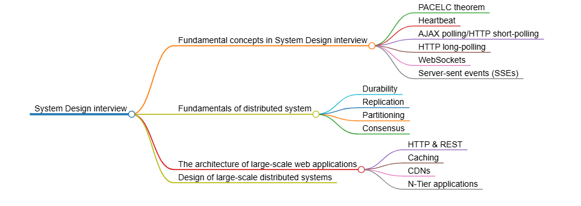
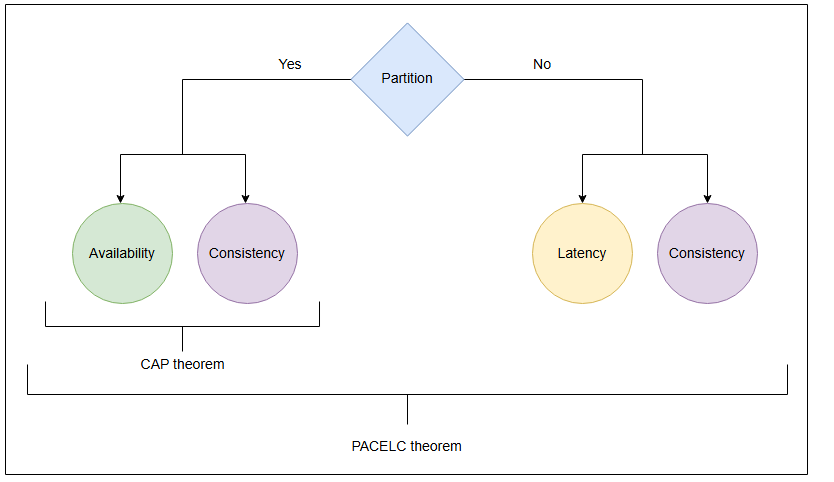
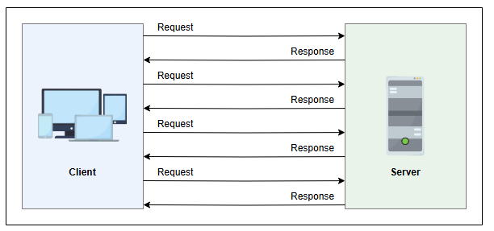
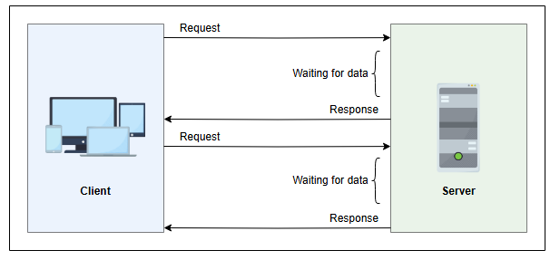
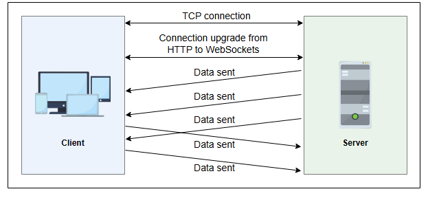
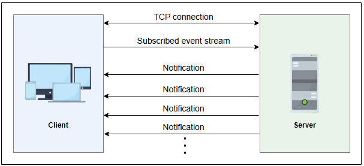
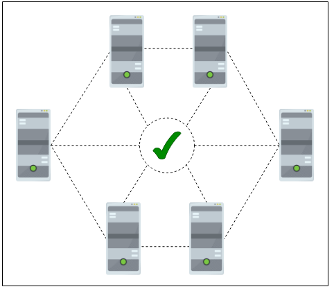

# Ключевые концепции для подготовки к собеседованию по проектированию систем

Изучите фундаментальные концепции распределённых систем, чтобы преуспеть на собеседовании по проектированию систем.

На **System Design Interview** интервьюеры просят кандидата спроектировать **web-scale application (приложение веб-масштаба)**. Например,
они могут попросить спроектировать **backend** таких платформ, как Instagram, YouTube или Uber.

В отличие от вопросов на **coding interview**, System Design Interviews — это дискуссии в свободной форме, где нет правильного или
неправильного ответа. Вместо этого интервьюер пытается оценить способность кандидата обсуждать различные аспекты системы и анализировать
решение на основе требований, которые могут меняться в ходе разговора.

Лучший способ представить себе этот разговор — вообразить, что нас с коллегами попросили спроектировать крупномасштабную систему. Мы
проработали детали на **whiteboard (маркерной доске)**, поняли требования, рамки и ограничения, прежде чем предлагать решение.

Итак, как же спроектировать систему на собеседовании, если мы никогда не создавали её в реальной жизни? Чтобы успешно пройти System Design
Interview, нам нужно подготовиться в четырёх областях:

* Фундаментальные концепции для System Design Interview
* Основы распределённых систем
* Архитектура крупномасштабных веб-приложений
* Проектирование крупномасштабных распределённых систем

Каждая из этих областей плавно перетекает в следующую.

### Почему важна стратегическая подготовка?

Как мы готовимся к собеседованию в Amazon, вероятно, будет отличаться от того, как мы готовились бы к собеседованию в Slack. Хотя общий
процесс собеседования имеет сходства в разных компаниях, существуют и явные различия, к которым мы должны быть готовы. Это одна из причин,
почему так важна стратегическая подготовка. В долгосрочной перспективе мы будем чувствовать себя увереннее, если будем целенаправленно и
тщательно подходить к созданию плана подготовки к собеседованию.

Если мы не знаем основ, мы не будем готовы спроектировать сервис; если мы не знаем, как соединять эти системы, мы не сможем спроектировать
конкретное решение; как только мы спроектируем крупномасштабные системы, мы сможем применить извлечённые уроки для расширения нашей базы
знаний.

Давайте рассмотрим каждую из этих областей.

### Фундаментальные концепции для System Design Interview

В этом уроке мы рассмотрим некоторые концепции, важные для System Design Interview.

#### PACELC theorem

**CAP theorem (теорема CAP)** не отвечает на вопрос: «Какие варианты есть у распределённой системы, когда нет **network partitions (сетевых
разделений)**?». На этот вопрос отвечает PACELC theorem.

PACELC theorem утверждает следующее о системе, которая выполняет **replication (репликацию)** данных:

* **if (если):** **Distributed system (распределённая система)** может пойти на компромисс между **availability (доступностью)** и *
  *consistency (согласованностью)**, если есть разделение сети.
* **else (иначе):** Когда система работает в обычном режиме без разделений, она может пойти на компромисс между **latency (задержкой)** и
  consistency.

Первые три буквы теоремы, PAC, совпадают с CAP theorem. ELC — это расширение. Теорема предполагает, что мы поддерживаем высокую availability
через replication. При сбое преобладает CAP theorem. Если сбоя нет, нам всё равно приходится учитывать компромисс между consistency и
latency в реплицированной системе.

Примерами систем PC/EC являются BigTable и HBase. Они всегда выбирают consistency, жертвуя availability и более низкой latency. Примерами
систем PA/EL являются Dynamo и Cassandra. Они выбирают availability вместо consistency при возникновении разделения. В остальных случаях они
выбирают более низкую latency. Примером системы PA/EC является MongoDB. В случае разделения она выбирает availability, но в остальное время
гарантирует consistency.

#### Heartbeat

Сообщение Heartbeat — это механизм, который помогает нам обнаруживать сбои в distributed system. Если есть центральный сервер, все остальные
серверы периодически отправляют ему сообщение Heartbeat, чтобы показать, что они всё ещё активны и функционируют. Если центрального сервера
нет, все серверы случайным образом выбирают набор других серверов и каждые несколько секунд отправляют им сообщение Heartbeat. Таким
образом, если сообщения Heartbeat не поступают в течение некоторого времени, система может заподозрить сбой или аварию.

#### AJAX polling

**AJAX polling / HTTP short-polling (AJAX-опросы / короткие опросы HTTP)** — это стандартная техника, используемая большинством
AJAX-приложений. Идея заключается в том, что клиент многократно опрашивает сервер на предмет наличия данных. Клиент отправляет запрос и
ждёт, пока сервер ответит данными. Если данных нет, сервер возвращает пустой ответ.

#### HTTP long-polling

При использовании HTTP long-polling, клиент запрашивает информацию у сервера, но сервер может не ответить немедленно. Эту технику иногда
называют **hanging GET (зависший GET-запрос)**. Если у сервера нет доступных данных для клиента, он удерживает запрос и ждёт, пока данные
появятся, вместо того чтобы отправлять пустой ответ. Как только данные становятся доступны, клиенту отправляется полный ответ. Клиент
немедленно отправляет повторный запрос, чтобы у сервера почти всегда был ожидающий запрос, который он может использовать для доставки данных
в ответ на событие.

#### WebSockets

WebSockets предоставляют **full-duplex communication (полнодуплексные каналы связи)** через одно **TCP connection (TCP-соединение)**. Это
обеспечивает постоянное соединение между клиентом и сервером. Обе стороны могут использовать это соединение для отправки данных в любое
время. Клиент устанавливает соединение через **WebSocket handshake (рукопожатие WebSocket)**. Если процесс успешен, сервер и клиент могут
начать обмен данными в обоих направлениях в любое время.

#### Server-sent events (SSEs)

Клиент может установить долговременное соединение с сервером с помощью Server-sent events (SSEs). Сервер использует это соединение для
отправки данных клиенту. Если клиенту нужно отправить данные на сервер, потребуется использовать другую технологию или протокол.

### Основы распределённых систем

Как и во всём остальном, важно начинать с основ. Основы distributed systems могут дать нам понимание того, что возможно, а что нет в данной
системе.

Мы можем понять ограничения конкретных архитектур и компромиссы, необходимые для достижения определённых целей (например, consistency против
пропускной способности записи). На самом базовом уровне мы должны начать с сильных и слабых сторон и целей distributed systems. Нам нужно
уметь обсуждать такие темы, как:

* Data durability and consistency (Долговечность и согласованность данных)
  Мы должны понимать различия и последствия сбоев и повреждений в хранилищах данных в процессах чтения-записи.
* Replication
  Replication — это ключ к обеспечению data durability и consistency. Это касается не только резервного копирования данных, а также повторяющимися процессами в масштабе.
* Partitioning
  Также называется **sharding (шардированием)**; partitioning разделяет данные по разным **nodes (узлам)** в нашей системе. В то время как
  replication распределяет данные по nodes, partitioning распределяет процессы по nodes, снижая зависимость от чистого replication.
* Consensus
  Один из наших nodes находится в Сиэтле, другой — в Пекине, а третий — в Лондоне. В 7:05 утра по тихоокеанскому времени поступает системный
  запрос. Учитывая время передачи пакетов данных, может ли этот запрос быть записан и правильно синхронизирован на удалённых nodes, и может
  ли быть достигнуто согласие? Это простая проблема consensus — все nodes должны прийти к согласию, что предотвратит выполнение ошибочных
  процессов и обеспечит consistency и replication данных и процессов по всей системе.

* **Distributed transactions (Распределённые транзакции)**
  Как только мы достигли consensus, транзакции от приложений должны быть зафиксированы во всех базах данных, при этом каждый участвующий
  ресурс выполняет проверку на сбои. Двух- и трёхсторонняя коммуникация для чтения, записи и фиксации разделяется между участвующими nodes.

### Архитектура крупномасштабных веб-приложений

Мы уже знаем, что большинство крупномасштабных приложений являются веб-приложениями. Даже если это не так, крупные потребительские
платформы, такие как Netflix, Twitter и Amazon, а также предприятия уходят от **on-premises systems (локальных систем)**, таких как
Exchange, к **cloud solutions (облачным решениям)** от Microsoft, Google и AWS. Вот почему полезно понимать архитектуру таких систем.

Нам нужно изучить такие темы, как:

* N-tier applications
  В distributed system обработка происходит на разных уровнях. Некоторые процессы выполняются на клиенте, некоторые — на сервере, а другие —
  на другом сервере, и всё это в рамках одного приложения. Эти уровни обработки называются **tiers (уровнями)**, и понимание того, как эти
  tiers взаимодействуют друг с другом и за какие конкретные процессы они отвечают, является частью System Design для веба.
* **HTTP (протокол передачи гипертекста)** и **REST (архитектурный стиль передачи состояния)**
  HTTP — это фундаментальный протокол, на котором работает весь интернет. Это система, через которую мы отправляем каждое электронное
  письмо, смотрим каждый фильм на Netflix и просматриваем каждый товар на Amazon. REST — это набор принципов проектирования для прямого
  взаимодействия с **API (интерфейсом прикладного программирования)**, которым является HTTP, что позволяет создавать эффективные,
  масштабируемые системы с компонентами, изолированными от предположений друг друга. Использование этих принципов и открытых API облегчает
  другим разработчикам создание продуктов на основе нашей работы или расширение наших возможностей с помощью дополнений к их собственным
  приложениям и сервисам.
* **DNS (система доменных имён)** и **load balancing (балансировка нагрузки)**
  Если у нас 99 одновременных пользователей, load balancing через DNS-маршрутизацию может обеспечить, чтобы серверы A, B и C обрабатывали по
  33 клиента каждый, вместо того чтобы сервер A был перегружен 99 клиентами, а серверы B и C простаивали. Маршрутизация клиентских запросов
  на правильный сервер, на правильный tier, где происходит обработка, помогает обеспечить стабильность системы. Нам нужно знать, как это
  делать.
* Caching
  **Cache (кеш)** делает наши наиболее часто запрашиваемые данные и приложения доступными для большинства пользователей на высокой скорости.
  Вопросы для нашего веб-приложения: что нужно хранить в cache, как мы направляем трафик в cache, и что происходит, когда в cache нет того,
  что нам нужно.
* **Stream processing (Потоковая обработка)**
  Stream processing применяет единообразные процессы к **data stream (потоку данных)**. Если через приложение проходит непрерывный,
  постоянный поток данных, то stream processing позволяет эффективно использовать локальные ресурсы внутри приложения.

### Проектирование крупномасштабных распределённых систем

Это может показаться большим объёмом, но, честно говоря, на подготовку уходит всего несколько недель — меньше, если у нас есть прочный
фундамент.

Как только мы освоим основы distributed systems и веб-архитектуры, настанет время применить эти знания и проектировать реальные системы.
Поиск и оптимизация потенциальных решений этих проблем даст нам инструменты для уверенного прохождения System Design Interview.

Когда мы будем готовы практиковать свои навыки, мы можем взяться за примеры задач с реальных собеседований, а также за советы и подходы к
созданию десяти различных веб-сервисов.