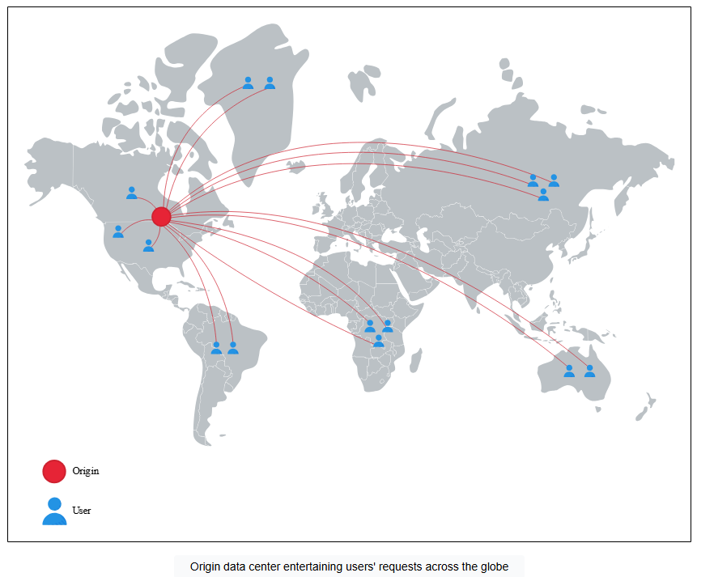
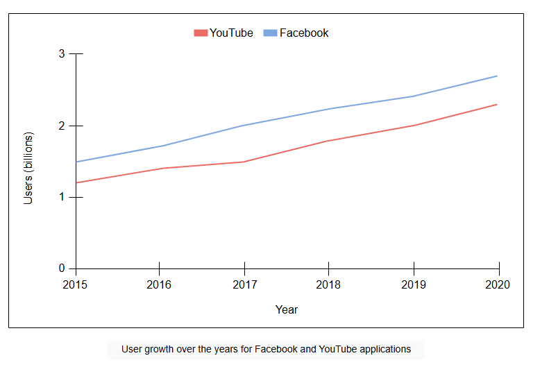

# Проектирование систем: Сеть доставки контента (CDN)

Узнайте, какие проблемы решает CDN.

## Постановка задачи

Давайте начнем с вопроса: если миллионы пользователей по всему миру используют наши приложения с большим объемом данных, а наш сервис развернут в одном центре обработки данных для обслуживания запросов пользователей, какие возможные проблемы могут возникнуть?

Могут возникнуть следующие проблемы:

*   **Высокая задержка**: Задержка, воспринимаемая пользователем, будет высокой из-за физического расстояния до обслуживающего центра обработки данных. Воспринимаемая пользователем задержка состоит из множества компонентов, таких как задержки передачи (зависят от доступной пропускной способности), задержки распространения (зависят от расстояния), задержки в очередях (зависят от загруженности сети) и задержки обработки в узлах. Поэтому передача данных на большие расстояния приводит к более высокой задержке. Приложениям реального времени, как правило, требуется задержка ниже 200 миллисекунд (мс). Для передачи голоса по интернет-протоколу (VoIP) задержка не должна превышать 150 мс, тогда как приложения для потокового видео не могут выдерживать задержку более нескольких секунд.

> **Примечание:** Согласно одному из измерений, проведенных 21 декабря 2021 года, средняя задержка от восточного побережья США (Северная Вирджиния) до западного побережья США (Северная Калифорния) составляла 62,9 мс. Между континентами — например, от восточного побережья США (Северная Вирджиния) до Африки (Кейптаун) — она составляла 225,63 мс. Это двусторонняя задержка, известная как задержка приема-передачи (round-trip latency).

*   **Приложения с большим объемом данных**: Приложения с большим объемом данных требуют передачи большого трафика. На больших расстояниях это может стать проблемой, так как сетевой путь проходит через различных интернет-провайдеров. Из-за некоторых каналов с меньшим размером MTU (Path message transmission unit), пропускная способность приложений в сети может снижаться. Аналогично, различные участки сетевого пути могут иметь разные характеристики перегрузки. Проблема усугубляется по мере роста числа пользователей, поскольку исходным серверам придется предоставлять данные каждому пользователю индивидуально. То есть, основному центру обработки данных придется отправлять много избыточных данных, когда их запрашивают несколько клиентов. Однако приложения, использующие потоковые сервисы, являются одновременно и ресурсоемкими по данным, и динамичными по своей природе.

> **Примечание:** Согласно опросу, 78% потребителей в США используют потоковые сервисы, что на 25% больше, чем за пять лет.

*   **Нехватка ресурсов центра обработки данных**: Важные ресурсы центра обработки данных, такие как вычислительная мощность и пропускная способность, становятся ограничением при значительном увеличении числа пользователей сервиса. Сервисы, которыми одновременно пользуются миллионы пользователей, требуют масштабирования. Даже если масштабирование достигнуто в одном центре обработки данных, он все равно может стать единой точкой отказа, если центр обработки данных выйдет из строя из-за стихийного бедствия или проблем с подключением к Интернету.

> **Примечание:** Согласно одному исследованию, в 2020 году на YouTube, Netflix и Amazon Prime в совокупности приходилось 80% интернет-трафика. Примерно в 2016 году CDN-провайдер Akamai обслуживал от 15% до 30% веб-трафика (около 30 терабит в секунду). Для 90% интернет-пользователей Akamai находился всего в одном шаге. Поэтому у нас есть веские причины для оптимизации доставки и потребления этих данных, чтобы не превращать ядро Интернета в узкое место.

## Как мы будем проектировать CDN?

Мы разделили проектирование CDN на шесть уроков:

1.  Введение в CDN : Мы предоставим подробное введение в CDN и определим функциональные и нефункциональные требования.
2.  Проектирование CDN: Мы объясним, как проектировать CDN. Мы также кратко опишем проектирование API.
3.  Углубленное исследование CDN: Часть 1: В этом уроке объясняются стратегии кэширования и архитектура CDN. Также мы обсудим различные подходы к поиску ближайшего прокси-сервера.
4.  Углубленное исследование CDN: Часть 2: Мы обсудим, как обеспечить согласованность контента в CDN и развертывание прокси-серверов. Мы также подробно рассмотрим кастомные и специализированные CDN.
5.  Оценка проектирования CDN: В этом уроке будет дана оценка предложенного нами проекта.
6.  Тест по проектированию систем CDN: Мы закрепим основные концепции проектирования CDN с помощью теста.

Давайте подумаем о решении обсуждаемых проблем в следующем уроке.