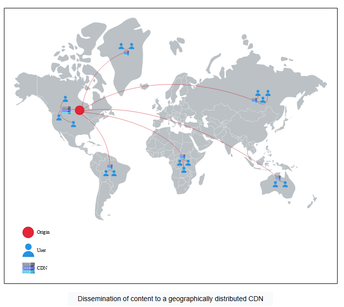
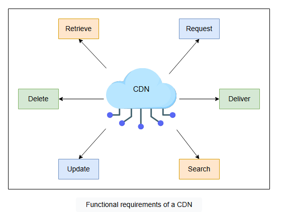
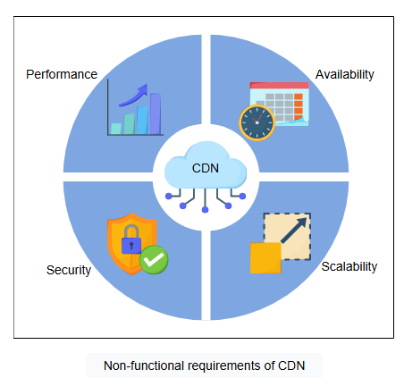
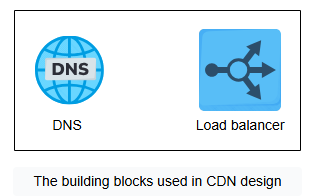

# Введение в CDN

Узнайте о CDN и сформулируйте требования к проектированию CDN.

## Предлагаемое решение

Решением всех проблем, обсуждавшихся в предыдущем уроке, является **сеть доставки контента (CDN)**. CDN — это группа географически
распределенных прокси-серверов. **Прокси-сервер** — это промежуточный сервер между клиентом и исходным сервером. Прокси-серверы размещаются
на границе сети (Граница сети - это зона, где устройство или локальная сеть взаимодействуют с Интернетом). Поскольку граница сети находится
близко к конечным пользователям,
размещение прокси-серверов помогает быстро доставлять контент конечным пользователям, сокращая задержки и экономя пропускную способность.
CDN обладает дополнительным интеллектом по сравнению с простым прокси-сервером.

Мы можем приблизить данные к пользователю, разместив рядом с ним небольшой центр обработки данных и храня там копии данных. CDN в основном
хранит два типа данных: статические (Этот тип данных меняется нечасто и остается на серверах в течение длительного периода времени) и
динамические (Этот тип данных меняется чаще всего — например, новостные рассылки, реклама, видео в реальном времени и так далее). CDN в
первую очередь нацелена на уменьшение задержки
распространения, приближая данные к пользователям. Провайдеры CDN прилагают дополнительные усилия для обеспечения достаточной пропускной
способности по всему пути и приближения данных к пользователям (возможно, в пределах их ISP). Они также стараются сократить задержки
передачи и очередей, поскольку предполагается, что у ISP имеется больше доступной пропускной способности в пределах автономной системы.

Давайте рассмотрим различные способы, которыми CDN решает обсуждаемые проблемы:

* **Высокая задержка**: CDN приближает контент к конечным пользователям. Таким образом, это уменьшает физическое расстояние и задержку.
* **Приложения с большим объемом данных**: Поскольку путь к данным включает только ISP и ближайшие компоненты CDN, нет проблем в
  обслуживании большого количества пользователей через несколько компонентов CDN в определенной области. Как показано ниже, исходному центру
  обработки данных потребуется предоставить данные локальным компонентам CDN только один раз, в то время как локальные компоненты CDN могут
  предоставлять данные разным пользователям индивидуально. Ни одному пользователю не придется загружать собственную копию данных с исходных
  серверов.

> **Примечание**: Провайдеры CDN используют различные протоколы потоковой передачи для доставки динамического контента. Например, CDNsun
> использует протокол обмена сообщениями в реальном времени (RTMP), HTTP Live Streaming (HLS), протокол потоковой передачи в реальном
> времени (RTSP) и многие другие для доставки динамического контента.

* **Нехватка ресурсов центра обработки данных**: CDN используется для обслуживания популярного контента. По этой причине большая часть
  трафика обрабатывается на CDN, а не на исходных серверах. Таким образом, различные локальные или распределенные компоненты CDN разделяют
  нагрузку на исходные серверы.

> **Примечание:** Некоторые из известных провайдеров CDN — это Akamai, StackPath, Cloudflare, Rackspace, Amazon CloudFront и Google Cloud
> CDN.

> ### Вопрос на размышление
> 1. Кэширует ли CDN весь контент с исходного сервера?
>
> 

>   
<b>Показать ответ</b>

> Маловероятно. CDN кэширует значительную часть содержимого в зависимости от своих возможностей, и в основном это статическое содержимое.
>
> Это также зависит от размера содержимого. Например, Netflix может хранить более 90% своих фильмов в сети CDN, в то время как для такого
> сервиса, как YouTube, это может оказаться невозможным из-за огромного объема контента.
>  

## Требования

Давайте рассмотрим функциональные и нефункциональные требования, которые мы ожидаем от CDN.

### Функциональные требования

Следующие функциональные требования будут частью нашего дизайна:

* **Извлечение**: В зависимости от типа моделей CDN (push или pull), CDN должна иметь возможность извлекать контент
  с исходных серверов. Мы рассмотрим модели CDN в следующем уроке.
* **Запрос**: Доставка контента с прокси-сервера осуществляется по запросу пользователя. Прокси-серверы CDN должны уметь отвечать на каждый
  запрос пользователя в этом отношении.
* **Доставка**: В случае push-модели исходные серверы должны иметь возможность отправлять контент на прокси-серверы CDN.
* **Поиск**: CDN должна иметь возможность выполнять поиск по запросу пользователя кэшированного или иным образом сохраненного контента в
  инфраструктуре CDN.
* **Обновление**: В большинстве случаев контент поступает с исходного сервера, но если мы
  запускаем скрипт (Этот код отвечает за последовательную репликацию любых изменений в данных CDN на все другие реплики на одноранговых прокси-серверах CDN) в CDN, CDN должна иметь возможность обновлять контент на
  одноранговых прокси-серверах CDN в PoP (точке присутствия)(Точка присутствия (PoP) - это физическое место, которое позволяет двум или более сетям или устройствам взаимодействовать друг с другом. Как правило, каждая точка доступа CDN PoP имеет большое количество кэш-серверов).
* **Удаление**: В зависимости от типа контента (статического или динамического), должна быть возможность удалять кэшированные записи с
  серверов CDN по истечении определенного периода.

### Нефункциональные требования

* **Производительность (Performance)**: Минимизация задержки — одна из основных задач CDN. Предлагаемый дизайн должен иметь минимально возможную задержку.
* **Доступность (Availability)**: Ожидается, что CDN будут доступны постоянно из-за их эффективности. Доступность включает защиту от атак, таких
  как DDoS (При DDoS-атаках злоумышленники перегружают исходный сервер или сервер приложений, отправляя огромное количество запросов).
* **Масштабируемость (Scalability)**: Растущее число пользователей будет запрашивать контент у CDN. Наш предлагаемый дизайн CDN должен иметь возможность
  горизонтального масштабирования по мере роста требований.
* **Надежность и безопасность (Reliability and security)**: Наш дизайн CDN должен исключать единую точку отказа. Помимо сбоев, спроектированная CDN должна надежно
  справляться с огромными нагрузками трафика. Кроме того, CDN должны обеспечивать защиту размещенного контента от различных атак.

## Компоненты, которые мы будем использовать

При проектировании CDN используются следующие компоненты:

* **DNS** — это служба,
  которая преобразует удобные для человека доменные имена CDN в машиночитаемые IP-адреса. Этот IP-адрес направит пользователей на указанный
  прокси-сервер.
* **Балансировщики нагрузки**
  распределяют миллионы запросов между работающими прокси-серверами.

В следующем уроке мы обсудим проектирование CDN.