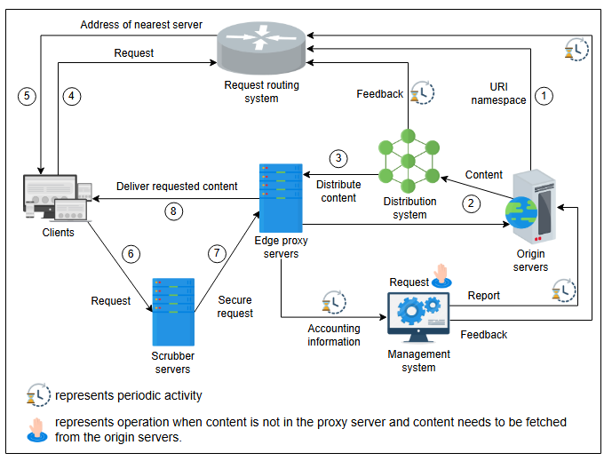

# Проектирование CDN

Давайте разберемся в базовом проектировании системы CDN.

## Проектирование CDN

Мы объясним проектирование нашей CDN в два этапа. На первом этапе мы рассмотрим компоненты, из которых состоит CDN. К концу этого этапа мы
поймем, зачем нам нужен каждый конкретный компонент. На втором этапе мы изучим рабочий процесс, объяснив, как каждый компонент
взаимодействует с другими для создания полнофункциональной CDN. Давайте начнем.

### Компоненты CDN

CDN состоит из следующих компонентов:

* **Клиенты**: Конечные пользователи используют различные клиенты, такие как браузеры, смартфоны и другие устройства, для запроса контента
  из CDN.
* **Система маршрутизации**: Система маршрутизации направляет клиентов в ближайший узел CDN. Для этого компонент получает данные из
  различных систем, чтобы понять, где размещен контент, сколько запросов делается на определенный контент, какую нагрузку несет определенный
  набор серверов и пространство имен URI (Uniform Resource Identifier) различного контента. В следующем уроке мы обсудим различные механизмы
  маршрутизации для направления пользователей в ближайший узел CDN.
* **Серверы очистки (Scrubber servers)**: Серверы очистки используются для отделения легитимного трафика от вредоносного и защиты от
  известных атак, таких как DDoS. Серверы очистки обычно используются только при обнаружении атаки. В этом случае трафик "очищается", а
  затем направляется к целевому месту назначения.
* **Прокси-серверы**: Прокси-серверы или пограничные прокси-серверы обслуживают пользователей, предоставляя им контент из оперативной
  памяти (RAM). Прокси-серверы хранят "горячие" данные в RAM, хотя они также могут хранить "холодные" данные на SSD или жестких дисках. Эти
  серверы также предоставляют информацию для учета и получают контент от системы распространения.
* **Система распространения**: Система распространения отвечает за доставку контента на все пограничные прокси-серверы в различных узлах
  CDN. Эта система использует Интернет и интеллектуальные подходы, подобные широковещательной рассылке, для распространения контента по
  активным пограничным прокси-серверам.
* **Исходные серверы (Origin servers)**: Инфраструктура CDN предоставляет пользователям данные, полученные от исходных серверов. Исходные
  серверы предоставляют клиентам любые данные, недоступные в CDN. Исходные серверы будут использовать соответствующие хранилища для контента
  и других метаданных для сопоставления. Однако мы не будем здесь обсуждать внутреннюю архитектуру исходной инфраструктуры.
* **Система управления**: Системы управления важны в CDN с точки зрения бизнеса и управления, где постоянно отслеживается использование
  ресурсов и статистика. Этот компонент измеряет важные метрики, такие как задержка, время простоя, потеря пакетов, нагрузка на сервер и так
  далее. Для сторонних CDN информация для учета также может использоваться для выставления счетов.


_Компоненты CDN_

### Рабочий процесс

Рабочий процесс для абстрактного дизайна описан ниже:

1. Исходные серверы предоставляют системе маршрутизации запросов делегирование пространства имен URI (Делегирование пространства имен URI -
   это процесс передачи управления различными частями пространства имен URI (такими как доменное имя) конкретной организации) для всех
   объектов, кэшированных в CDN.
2. Исходный сервер публикует контент в системе распространения, которая отвечает за распределение данных по активным пограничным
   прокси-серверам.
3. Система распространения распределяет контент между прокси-серверами и предоставляет обратную связь системе маршрутизации запросов. Эта
   обратная связь помогает оптимизировать выбор ближайшего прокси-сервера для запрашивающего клиента. Эта обратная связь содержит информацию
   о том, какой контент кэширован на каком прокси-сервере, для маршрутизации трафика на соответствующие прокси-серверы.
4. Клиент запрашивает у системы маршрутизации подходящий прокси-сервер.
5. Система маршрутизации запросов возвращает IP-адрес подходящего прокси-сервера.
6. Запрос клиента проходит через серверы очистки в целях безопасности.
7. Сервер очистки перенаправляет легитимный трафик на пограничный прокси-сервер.
8. Пограничный прокси-сервер обслуживает запрос клиента и периодически отправляет информацию для учета в систему управления. Система
   управления обновляет исходные серверы и отправляет обратную связь в систему маршрутизации о статистике и деталях контента. Однако, если
   контент недоступен на прокси-серверах, запрос направляется на исходные серверы. Также возможно наличие иерархии прокси-серверов, если
   контент не найден на пограничных прокси-серверах. В таких случаях запрос перенаправляется на родительские прокси-серверы.

## Проектирование API

В этом разделе мы обсудим проектирование API для функциональности, предлагаемой CDN. Это поможет нам понять, как CDN будет получать запросы
от клиентов, получать контент от исходных серверов и взаимодействовать с другими компонентами в сети. Давайте разработаем API для каждой из
следующих функций:

* Извлечение контента
* Доставка контента
* Запрос контента
* Поиск контента
* Обновление контента
* Удаление контента

Контентом может быть что угодно: файл, видео, аудио или другой веб-объект. Здесь мы будем использовать слово "контент" для обозначения всего
вышеперечисленного. Для ясности мы не будем обсуждать в следующих API параметры, связанные с конфиденциальностью, — например, является ли
контент публичным или частным, кто должен иметь к нему доступ, должен ли он быть зашифрован и так далее.

### Извлечение (от прокси-сервера к исходному серверу)

Если прокси-серверы запрашивают контент, метод `GET` извлекает контент через API `/retrieveContent` ниже:

```
retrieveContent(proxyserver_id, content_type, content_version, description)
```

Давайте рассмотрим детали параметров:

| Параметр          | Описание                                                                                                                                                                                                                                        |
|:------------------|:------------------------------------------------------------------------------------------------------------------------------------------------------------------------------------------------------------------------------------------------|
| `proxyserver_id`  | Это уникальный идентификатор запрашивающего прокси-сервера.                                                                                                                                                                                     |
| `content_type`    | Эта структура данных будет содержать информацию о запрашиваемом контенте. В частности, она будет содержать категорию (аудио, видео, документ, скрипт и т.д.), тип клиентов, для которых он запрашивается, и запрашиваемое качество (если есть). |
| `content_version` | Это номер версии контента. Для API `/retrieveContent` `content_version` будет содержать текущую версию контента, находящуюся на прокси-сервере. `content_version` будет `NULL`, если на прокси-сервере нет предыдущей версии.                   |
| `description`     | Здесь указываются детали контента — например, расширение видео, детали разрешения и так далее, если `content_type` — видео.                                                                                                                     |

Вышеуказанный API возвращает ответ в файле JSON, который содержит текст, типы контента, ссылки на изображения или видео в контенте и так
далее.

### Доставка (от исходного сервера к прокси-серверам)

Исходные серверы используют этот API для доставки указанного контента, его обновленной версии, на прокси-серверы через систему
распространения. Мы называем это API `/deliverContent`:

```
deliverContent(origin_id, server_list, content_type, content_version, description)
```

| Параметр          | Описание                                                                                                                     |
|:------------------|:-----------------------------------------------------------------------------------------------------------------------------|
| `origin_id`       | Однозначно идентифицирует каждый исходный сервер.                                                                            |
| `server_list`     | Указывает список серверов, на которые будет отправлен контент системой распространения.                                      |
| `content_version` | Представляет обновленную версию контента на исходном сервере. Прокси-сервер, получающий контент, отбросит предыдущую версию. |

Остальные параметры уже были объяснены выше.

### Запрос (от клиентов к прокси-серверам)

Пользователи используют этот API для запроса контента с прокси-серверов. Мы называем это API `/requestContent`:

```
requestContent(user_id, content_type, description)
```

| Параметр  | Описание                                                             |
|:----------|:---------------------------------------------------------------------|
| `user_id` | Это уникальный идентификатор пользователя, который запросил контент. |

Указанный прокси-сервер возвращает определенный контент запросившим пользователям в ответ на вышеуказанный API.

### Поиск (от прокси-сервера к одноранговым прокси-серверам)

Хотя контент сначала ищется локально на прокси-сервере, прокси-серверы также могут проверять наличие запрашиваемого контента на одноранговых
прокси-серверах в том
же PoP через API `/searchContent`.
> _В контексте сетей доставки контента (CDN) точка присутствия (POP) - это стратегически расположенный центр обработки данных или точка доступа к сети, которая служит ключевым узлом для распространения и доставки контента. PoPs являются неотъемлемой частью инфраструктуры CDN и играют решающую роль в оптимизации доставки веб-контента, включая веб-страницы, изображения, видео и другие цифровые активы, конечным пользователям_

Это может привести к "затоплению" запросами всех прокси-серверов в PoP. В качестве альтернативы мы можем
использовать хранилище данных в PoP для запроса контента, хотя прокси-серверам потребуется поддерживать информацию о том, какой контент
доступен на каком прокси-сервере.

API `/searchContent` показан ниже:

```
searchContent(proxyserver_id, content_type, description)
```

### Обновление (от прокси-сервера к одноранговым прокси-серверам)

Прокси-серверы используют API `/updateContent` для обновления указанного контента на одноранговых прокси-серверах в PoP. Это происходит,
когда на CDN выполняются указанные изолированные скрипты для предоставления услуг по изменению размера изображений, конвертации разрешения
видео, обеспечению безопасности и многих других. Этот тип скриптинга известен как бессерверный скриптинг.

API `/updateContent` показан ниже:

```
updateContent(proxyserver_id, content_type, description)
```

| Параметр         | Описание                                                               |
|:-----------------|:-----------------------------------------------------------------------|
| `proxyserver_id` | Однозначно идентифицирует прокси-сервер в PoP для обновления контента. |

Остальные параметры уже были объяснены выше.

> **Примечание**: API удаления здесь не обсуждается. В нашей главе о кэшировании мы подробно обсуждали различные механизмы вытеснения. Эти
> механизмы также применимы для вытеснения контента в CDN. Тем не менее, могут возникнуть ситуации, когда потребуются API удаления. Мы обсудим
> несколько механизмов согласованности контента, например, как долго контент остается в кэше, в следующем уроке.

В следующих уроках мы углубимся в характеристики CDN.