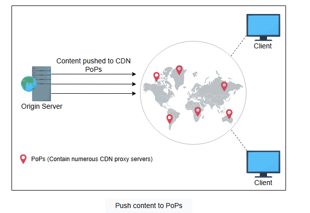
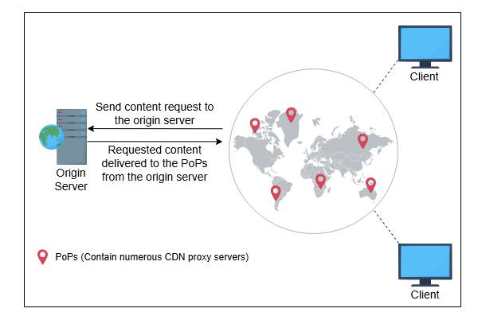
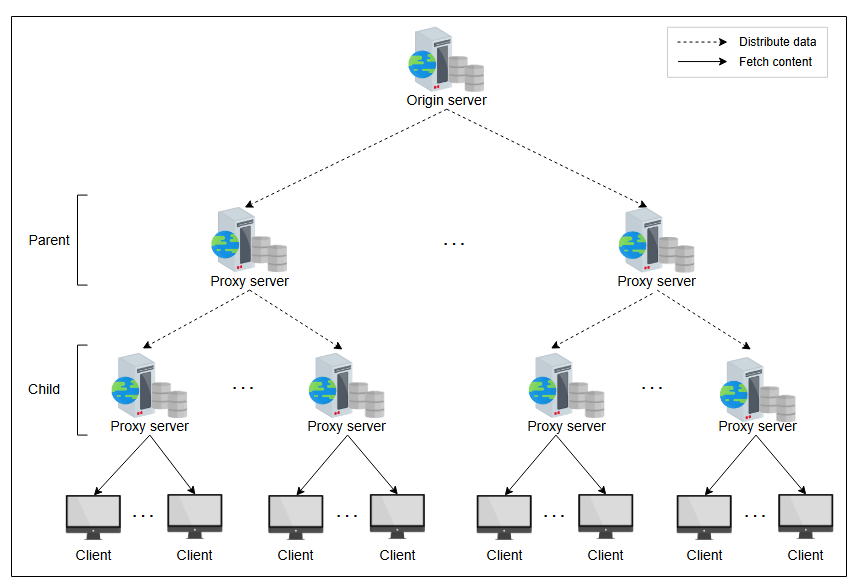
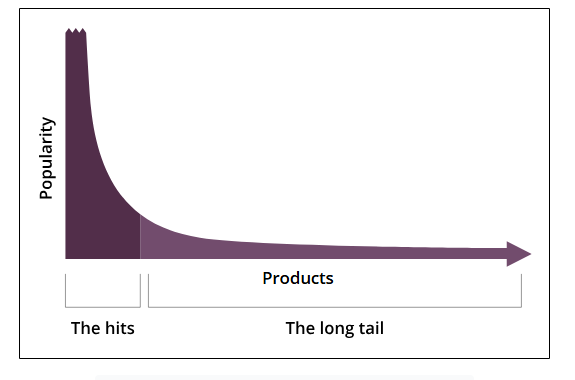

# Углубленное исследование CDN: Часть 1

Изучите модели push и pull и оптимизацию кэширования динамического контента в CDN.


В этом уроке мы углубимся в детали некоторых концепций, таких как модели CDN и многоуровневая/слоистая архитектура CDN, которые мы упоминали в предыдущих уроках. Мы также представим некоторые новые концепции, включая оптимизацию кэширования динамического контента и различные методы для обнаружения ближайших прокси-серверов в CDN.

## Стратегии кэширования контента в CDN

Определение контента для кэширования важно для доставки актуального и популярного веб-контента. Чтобы обеспечить своевременные обновления, используются две классификации CDN для получения контента с исходных серверов.

### Push CDN

В модели push CDN контент автоматически отправляется на прокси-серверы CDN с исходного сервера. Ответственность за доставку контента на прокси-серверы CDN лежит на поставщике контента. Push CDN подходит для доставки статического контента, где исходный сервер решает, какой контент доставлять пользователям через CDN. Контент передается (push) на прокси-серверы в различных местах в зависимости от его популярности. Если контент быстро меняется, push-модель может с трудом справляться с обновлениями и будет выполнять избыточные передачи контента.


_Передача контента в PoP_

### Pull CDN

CDN "вытягивает" (pulls) недоступные данные с исходных серверов по запросу пользователя. Прокси-серверы хранят файлы в течение определенного времени, а затем удаляют их из кэша, если они больше не запрашиваются, чтобы сбалансировать емкость и затраты.

Когда пользователи запрашивают веб-контент в модели pull CDN, сама CDN несет ответственность за извлечение запрошенного контента с исходного сервера и его предоставление пользователям. Поэтому этот тип CDN больше подходит для обслуживания динамического контента.


_Извлечение контента с исходного сервера в PoP CDN_

Как уже говорилось, push CDN в основном используется для обслуживания статического контента. Поскольку статический контент предоставляется широкому кругу пользователей дольше, чем динамический, схема push CDN поддерживает больше реплик, чем pull CDN, тем самым повышая доступность. С другой стороны, pull CDN предпочтительнее для часто меняющегося контента и высокой нагрузки трафика. Низкое потребление хранилища — одно из основных преимуществ pull CDN.

> #### Практическое задание: Выбор между типами CDN
>
> Предположим, вы управляете веб-сайтом с двумя различными типами контента:
>
> *   **Лента новостей:** Часто обновляемые статьи и посты в блоге с разной популярностью.
> *   **Статические ресурсы:** Редко обновляемые элементы, включая логотип компании, элементы дизайна веб-сайта и изображения продуктов.
>
> Выберите между push CDN и pull CDN для каждого типа контента. Обоснуйте свой выбор.
>
> 
> <details>
>  <summary><b>Показать ответ</b></summary>
>
>    **Лента новостей (Pull CDN):** Новости и посты в блоге часто меняются, и предсказать, какой контент станет популярным, сложно. Pull CDN здесь подходит лучше, так как он будет кэшировать контент только тогда, когда его запрашивают пользователи. Это экономит место для хранения и предотвращает передачу непопулярного контента.
> 
>    **Статические ресурсы (Push CDN):** Логотипы, элементы дизайна и изображения продуктов меняются редко и запрашиваются всеми пользователями. Push CDN является идеальным решением, поскольку вы можете заранее передать эти ресурсы на все пограничные серверы CDN, обеспечивая их постоянную доступность с минимальной задержкой для всех пользователей.
> </details>

> **Примечание:** Большинство поставщиков контента используют оба подхода к кэшированию (push и pull), чтобы получить преимущества обоих.

## Оптимизация кэширования динамического контента

Поскольку динамический контент часто меняется, его следует кэшировать оптимально. Этот раздел посвящен оптимизации часто изменяющегося контента.

Создание определенного динамического контента требует выполнения скриптов, которые могут быть запущены на прокси-серверах вместо исходного сервера. Динамические данные могут генерироваться с использованием различных параметров, что может быть выгодно, если это делать на прокси-серверах. Например, мы можем генерировать динамический контент на основе местоположения пользователя, времени суток в определенном месте, сторонних API, специфичных для местоположения (например, API погоды) и так далее. Таким образом, оптимальнее запускать скрипты на прокси-серверах, а не на исходных.

Для уменьшения обмена данными между исходным и прокси-серверами, а также требований к хранилищу на прокси-серверах, полезно применять методы сжатия. Например, Cloudflare использует Railgun для сжатия динамического контента.

Другой популярный подход к сжатию динамических данных — это язык разметки **Edge Side Includes (ESI)**. Обычно за определенное время меняется лишь небольшая часть веб-страницы. Это означает, что загрузка полной веб-страницы при каждом небольшом изменении содержит много избыточных данных. Чтобы устранить это снижение производительности, ESI указывает, где изменился контент, чтобы остальная часть веб-страницы могла быть кэширована. Он собирает динамический контент на пограничном сервере CDN или в браузере клиента. ESI еще не стандартизирован Консорциумом Всемирной паутины (W3C), но многие провайдеры CDN его используют.

> **Примечание**: **Dynamic Adaptive Streaming over HTTP (DASH)** использует файл-манифест с URI видео с разным разрешением, чтобы клиент мог выбрать подходящее в зависимости от текущих условий сети и конечного узла. Netflix использует собственную версию DASH с указанием диапазона байт (Byte-range) в URL для дальнейшей оптимизации запросов и доставки контента.

## Многоуровневая архитектура CDN

Поставщик контента отправляет контент большому количеству клиентов через CDN. Задача одновременного распределения данных на все прокси-серверы CDN является сложной и значительно нагружает исходный сервер. CDN используют древовидную структуру, чтобы облегчить процесс распределения данных для исходного сервера. У пограничных прокси-серверов есть несколько одноранговых серверов, принадлежащих к той же иерархии. Этот набор серверов получает данные от родительских узлов в дереве, которые, в свою очередь, получают данные от исходных серверов. Данные копируются с исходного сервера на прокси-серверы, следуя по разным путям в дереве.

Древовидная структура для распределения данных позволяет нам масштабировать нашу систему для растущего числа пользователей, добавляя больше серверных узлов в дерево. Это также снижает нагрузку на исходный сервер при распределении данных. CDN обычно имеет один или два уровня прокси-серверов (кэшей). На следующей иллюстрации показаны два уровня прокси-серверов:


_Распределение данных между прокси-серверами CDN_

Каждый раз, когда новый прокси-сервер входит в дерево CDN, он запрашивает у **управляющего ядра (control core)**, которое хранит информацию обо всех прокси-серверах в CDN, начальный контент с конфигурационными данными.

Исследования показывают, что многие виды контента имеют распределение с "длинным хвостом" (long-tail distribution). Это означает, что в определенный момент времени лишь небольшое количество контента очень популярно, а затем следует длинный хвост менее популярного контента. Здесь может использоваться **многоуровневый кэш** для обработки контента из "длинного хвоста".



_Многие виды данных демонстрируют феномен "длинного хвоста"_

> #### Вопрос на размышление
>
> Что произойдет, если дочерний или родительский прокси-сервер выйдет из строя или если выйдет из строя исходный сервер?
>
> <details>
>  <summary><b>Показать ответ</b></summary>
> Каждый PoP содержит набор прокси-серверов CDN. Когда какой-либо дочерний прокси-сервер перестает работать из-за каких-либо сбоев, DNS может перенаправлять клиентов на другой дочерний прокси-сервер. Каждый дочерний прокси-сервер знает множество родительских серверов верхнего уровня, и в случае сбоя на одном из них он может перейти на другой. Исходный сервер - это набор серверов с резервными копиями, содержимое которых хранится в реплицированном хранилище. Если какой-либо из исходных серверов выходит из строя, нагрузку берут на себя другие серверы.
> </details>

Теперь, когда мы рассмотрели способ распределения контента от исходного сервера ко всем прокси-серверам CDN, мы должны также узнать, как пользователи могут использовать эти прокси-серверы для более эффективного получения данных. Мы обсудим, как выбирается ближайший прокси-сервер, когда клиенты делают запросы, и как CDN размещается, в следующих разделах этого урока.

## Поиск ближайшего прокси-сервера для получения данных

Для пользователя жизненно важно получать данные с ближайшего прокси-сервера, поскольку CDN стремится уменьшить воспринимаемую пользователем задержку, приближая данные к нему. Однако остается вопрос, как пользователи по всему миру запрашивают данные с ближайшего прокси-сервера. Цель этого раздела — ответить на этот вопрос.

### Важные факторы, влияющие на близость прокси-сервера

Есть два важных фактора, которые имеют значение при поиске ближайшего к пользователю прокси-сервера:

*   **Сетевое расстояние** между пользователем и прокси-сервером. Это функция следующих двух вещей:
    *   Длина сетевого пути.
    *   Ограничения пропускной способности (bandwidth) вдоль сетевого пути.

Кратчайший сетевой путь с наибольшей пропускной способностью ведет к ближайшему для данного пользователя прокси-серверу. Этот путь помогает пользователю быстрее загружать контент.

*   **Нагрузка на запросы** относится к нагрузке, которую прокси-сервер обрабатывает в любой момент времени. Если набор прокси-серверов перегружен, система маршрутизации запросов должна перенаправить запрос в место с меньшей нагрузкой. Это действие уравновешивает нагрузку на прокси-серверы и, следовательно, снижает задержку ответа.

Давайте рассмотрим методы, которые можно использовать для маршрутизации пользователей на ближайший прокси-сервер.

### DNS-перенаправление

При типичном *разрешении DNS* мы используем систему DNS для получения IP-адреса по удобочитаемому имени. Однако DNS также может вернуть клиенту другой URI (вместо IP). Такой механизм называется **DNS-перенаправлением (DNS redirect)**.

Поставщики контента могут использовать DNS-перенаправление, чтобы направить клиента на определенный CDN. Например, если клиент пытается разрешить имя, содержащее слово "video", авторитетный DNS-сервер предоставляет другой URL (например, `cdn.xyz.com`). Клиент выполняет еще одно разрешение DNS, и авторитетный DNS-сервер CDN предоставляет IP-адрес подходящего прокси-сервера CDN для получения необходимого контента.

В зависимости от местоположения пользователя ответ DNS может быть разным. Этот процесс эффективно направляет пользователя на географически или сетевым образом близкий к нему сервер, учитывая при этом текущую нагрузку на серверы.

1) Сервер происхождения распределяет контент на прокси-серверы 

2) Клиент запрашивает прокси-сервер, который находится ближе всего к локальному DNS 

3) DNS предоставляет URL авторитетного DNS-сервера CDN запрошенным клиентам 

4) Клиент запрашивает прокси-сервер, который находится ближе всего к авторитетному DNS CDN 

5) Авторитетный DNS CDN предоставляет IP-адрес ближайшего прокси-сервера запрошенным клиентам 

6) Клиент запрашивает определенное видео 

7) Прокси-сервер доставляет запрошенное видео 


> **Примечание**: Ближайший прокси-сервер не обязательно означает географически самый близкий. Это может быть так, но важна не только география. Также имеют значение и другие факторы, такие как сетевое расстояние, пропускная способность и нагрузка трафика на этом маршруте.

Для перемещения клиента с одной машины в кластере на другую, ответы DNS на втором шаге даются с коротким TTL (Time-To-Live), чтобы клиент повторял разрешение через короткое время. DNS продолжает доставлять контент, маршрутизируя запросы на другие активные серверы в случае сбоев оборудования и перегрузки сети. Это достигается за счет балансировки нагрузки трафика, использования интеллектуального переключения при сбоях и поддержания серверов во многих центрах обработки данных, что обеспечивает хорошую надежность и производительность.

Многие провайдеры CDN, такие как Akamai, используют DNS-перенаправление в своей системе маршрутизации.

### Anycast

**Anycast** — это методология маршрутизации, при которой все пограничные серверы, расположенные в разных местах, используют один и тот же IP-адрес. Он использует **Протокол граничного шлюза (BGP)** для маршрутизации клиентов на основе естественного потока сети Интернет. Провайдер CDN может использовать механизм anycast, чтобы клиенты направлялись на ближайшие прокси-серверы за контентом.

> BGP - это протокол сетевого уровня, используемый пограничными маршрутизаторами Интернета для обмена информацией о маршрутизации и доступности, так что каждый узел сети, даже если он независим, осведомлен о состоянии своих ближайших соседей по сети.

### Мультиплексирование клиентов

**Мультиплексирование клиентов** предполагает отправку клиенту списка серверов-кандидатов. Затем клиент выбирает один сервер из списка для отправки запроса. Этот подход неэффективен, поскольку у клиента нет полной информации для выбора наиболее подходящего сервера для своего запроса. Это может привести к отправке запросов на уже загруженный сервер и увеличению задержки доступа.

### HTTP-перенаправление

**HTTP-перенаправление** — самый простой из всех подходов. При этой схеме клиент запрашивает контент у исходного сервера. Исходный сервер отвечает по протоколу HTTP, перенаправляя пользователя по URL-адресу контента.

Ниже приведен пример фрагмента HTML от Facebook. Как выделено в строке 8, пользователь перенаправляется в CDN для загрузки логотипа Facebook:

```html
<!--  Этот код взят с Facebook. -->
<div class="fb_content clearfix " id="content" role="main">
 <div>
  <div class="_8esj _95k9 _8esf _8opv _8f3m _8ilg _8icx _8op_ _95ka">
   <div class="_8esk">
    <div class="_8esl">
     <div class="_8ice">
      
     </div>
     <h2 class="_8eso">Facebook помогает вам общаться и делиться с людьми в вашей жизни.</h2>
    </div>
   </div>
  </div>
 </div>
</div>
```
_Пример HTML, содержащего URL-адрес для перенаправления_

В следующем уроке мы обсудим различные детали согласованности контента и развертывания прокси-серверов в CDN.