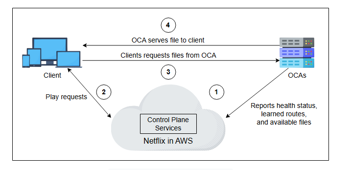

# Углубленное исследование CDN: Часть 2

Узнайте о механизмах согласованности контента и развертывании прокси-сервера в CDN.

***

В этом уроке мы узнаем, как можно достичь согласованности контента с помощью различных механизмов согласованности. Мы также узнаем, где следует развертывать прокси-серверы и в чем разница между CDN как услугой и специализированной CDN.

## Согласованность контента в CDN

Данные на прокси-серверах должны быть согласованы с данными на исходных серверах. Всегда существует риск того, что пользователи получат доступ к устаревшим данным, если прокси-серверы не будут поддерживать согласованность с исходными серверами. Для обеспечения согласованности данных можно использовать различные механизмы, в зависимости от push- или pull-модели.

### Периодический опрос

Используя pull-модель, прокси-серверы периодически запрашивают у исходного сервера обновленные данные и соответствующим образом изменяют контент в кэше. Когда контент меняется нечасто, метод опроса потребляет излишнюю пропускную способность. Периодический опрос использует **время до обновления (time-to-refresh, TTR)** для настройки периода времени для запроса обновленных данных с исходных серверов.

### Время жизни (TTL)

Из-за TTR прокси-серверы могут бесполезно запрашивать у исходных серверов обновленные данные. Лучшим подходом, который можно использовать для снижения частоты сообщений об обновлении, является подход **времени жизни (time-to-live, TTL)**. В этом подходе каждому объекту исходный сервер присваивает атрибут TTL. TTL определяет время истечения срока действия контента. Прокси-серверы обслуживают одну и ту же версию данных для пользователей до истечения срока действия этого контента. По истечении срока действия прокси-сервер проверяет наличие обновления на исходном сервере. Если данные изменились, он получает обновленные данные с исходного сервера, а затем отвечает на запросы пользователей обновленными данными. В противном случае он сохраняет те же данные с обновленным временем истечения срока действия от исходных серверов.

### Аренды (Leases)

Исходный сервер предоставляет аренду (lease) на данные, отправленные на прокси-сервер, с помощью этого метода. **Аренда** обозначает временной интервал, в течение которого исходный сервер обязуется уведомить прокси-сервер о любых изменениях в данных. Прокси-сервер должен отправить сообщение с запросом на продление аренды по истечении ее срока. Метод аренды помогает сократить количество сообщений, которыми обмениваются прокси- и исходный сервер. Кроме того, продолжительность аренды можно динамически оптимизировать в соответствии с наблюдаемой нагрузкой на прокси-серверы. Этот метод называется **адаптивной арендой (adaptive lease)**.

В следующем разделе мы обсудим, где размещать прокси-серверы CDN для эффективной передачи данных.

## Развертывание

Прежде чем устанавливать объекты CDN, мы должны четко ответить на следующие вопросы:

*   Каковы наилучшие места для установки прокси-серверов, чтобы максимально использовать технологию CDN?
*   Сколько прокси-серверов CDN нам следует установить?

### Размещение прокси-серверов CDN

Прокси-серверы CDN должны размещаться в сетевых узлах с хорошей связностью. Рассмотрим следующие варианты:

*   **On-premises** (на своей площадке) представляет собой небольшой центр обработки данных, который может быть размещен рядом с крупными точками обмена интернет-трафиком (IXP).
*   **Off-premises** (на чужой площадке) представляет собой размещение прокси-серверов CDN в сетях интернет-провайдеров (ISP).

Сегодня может быть целесообразно хранить большую часть данных фильма в инфраструктуре CDN, размещенной внутри сети интернет-провайдера. Тем не менее, для таких сервисов, как YouTube, объем данных настолько велик и постоянно растет, что сложно решить, что следует размещать рядом с пользователем. Google использует split TCP для уменьшения воспринимаемых пользователем задержек, поддерживая постоянные соединения с огромными окнами TCP от инфраструктуры на уровне IXP до своих основных центров обработки данных. TCP-запросы клиента завершаются на инфраструктуре уровня IXP, а затем перенаправляются по уже установленным соединениям с низкой задержкой.

Это существенно снижает воспринимаемую клиентом задержку, что связано с избежанием начального трехстороннего рукопожатия TCP-соединения и этапов медленного старта до удаленного хоста (если бы клиент обращался напрямую к основным ЦОД Google). Задержка приема-передачи до IXP часто очень мала. Поэтому трехсторонние рукопожатия и медленные старты на этом уровне незначительны. **Предиктивная отправка (Predictive push)** — это значимая область исследований для решения вопроса о том, что следует отправлять ближе к клиентам.

Мы можем использовать измерения для облегчения принятия решения о размещении прокси-серверов. Одним из таких инструментов является **ProxyTeller**, который помогает решить, где размещать прокси-сервер и сколько прокси-серверов требуется для достижения высокой производительности. ProxyTeller использует коэффициент попадания (hit ratio), пропускную способность сети и время отклика клиента (задержку) в качестве параметров производительности для принятия решения о размещении прокси-серверов. Для размещения прокси-серверов также используются другие жадные, случайные и основанные на "горячих точках" (hotspot) алгоритмы.

> **Примечание**: Akamai и Netflix популяризировали идею размещения своих прокси-серверов CDN внутри сетей интернет-провайдеров клиентов. Для многих клиентов Akamai контент находится всего в одном сетевом прыжке. С другой стороны, Google также имеет свою частную инфраструктуру CDN, но больше полагается на свои серверы рядом с IXP. Одной из причин этого может быть огромный объем данных и характер их изменения.

> #### Вопрос на размышление
>
> Какие преимущества может получить интернет-провайдер, размещая прокси-серверы CDN в своей сети?
>
> 

>   
<b>Показать ответ</b>

>       Интернет-провайдер может сократить свои операционные расходы, поскольку значительный объем трафика не будет покидать его сеть. Это может снизить стоимость пиринга с другими интернет-провайдерами. Также провайдер может улучшить пользовательский опыт своих клиентов, обслуживая данные из ближайшего местоположения. Это приводит к большей удовлетворенности клиентов.
> 

## CDN как услуга

Большинство компаний не создают свои собственные CDN. Вместо этого они используют услуги провайдеров CDN, таких как Akamai, Cloudflare, Fastly и так далее, для доставки своего контента. Аналогично, такие игроки, как AWS, дают возможность любому использовать глобальную инфраструктуру CDN.

Компании подписывают контракт с поставщиком услуг CDN и доставляют свой контент в CDN, тем самым позволяя CDN распространять контент конечным пользователям. Публичный CDN вызывает следующие опасения у поставщиков контента:

*   Поставщик контента ничего не может сделать, если публичный CDN не работает.
*   Если у публичного CDN нет прокси-серверов в регионе или стране, откуда идет часть трафика веб-сайта, то этим конкретным клиентам не повезло. В таких случаях поставщикам контента приходится покупать услуги CDN у других провайдеров или развертывать и использовать свой собственный частный CDN.
*   Возможно, что некоторые домены или IP-адреса провайдеров CDN заблокированы или ограничены в некоторых странах, поскольку они могут доставлять контент, запрещенный в этих странах.

> **Примечание**: Некоторые компании создают свои собственные CDN вместо использования услуг провайдеров. Например, у Netflix есть своя специально созданная CDN под названием **Open Connect**.

## Специализированная CDN

Мы обсуждали, что многие компании используют CDN как услугу, но бывают случаи, когда компании создают свои собственные CDN. На это решение влияет ряд причин. Одна из них — стоимость коммерческих услуг CDN. Специализированная CDN состоит из точек присутствия **(PoP)**, которые обслуживают контент только для своей компании. Эти PoP могут быть кэширующими серверами, обратными прокси или контроллерами доставки приложений. Хотя у специализированной CDN высокие затраты на первоначальную настройку, со временем затраты в конечном итоге снижаются. По сути, это решение "купить или создать".

PoP специализированной CDN состоят из множества прокси-серверов для обслуживания петабайтов контента. Частный CDN может использоваться совместно с публичным. В случае, если мощности частного CDN недостаточно или происходит сбой, приводящий к снижению мощности, публичный CDN используется в качестве резервного. **Open Connect Appliance (OCA)** от Netflix — это пример CDN, специализированной на доставке видео.

Серверы OCA от Netflix не хранят пользовательские данные. Вместо этого они выполняют следующие задачи:

*   Они сообщают о своем статусе — работоспособности, изученных маршрутах и деталях кэшированного контента — в плоскость управления Open Connect, которая находится в AWS (Amazon Web Services).
*   Они обслуживают кэшированный контент, запрашиваемый пользователем.

_Устройства Open Connect от Netflix_

Все развернутые OCA, расположенные в IXP или встроенные в сеть ISP, контролируются операционной командой Open Connect.

### Почему Netflix создал свой CDN

По мере роста популярности Netflix решил создать и управлять своей собственной CDN по следующим причинам:

*   Провайдеры услуг CDN с трудом справлялись с расширением своей инфраструктуры из-за быстрого роста спроса клиентов на потоковое видео на Netflix.
*   С увеличением объема потокового видео возросли расходы на использование услуг CDN.
*   Потоковое видео — это основной бизнес и главный источник дохода для Netflix. Поэтому защита данных всех видео на платформе критически важна. OCA от Netflix лучше управляет потенциальными рисками утечки данных.
*   Чтобы обеспечить оптимальную доставку потокового мультимедиа клиентам, Netflix необходимо было максимизировать контроль над видеоплеером пользователя, сетью между пользователем и серверами Netflix.
*   OCA от Netflix может использовать пользовательские модули HTTP и алгоритмы TCP-соединений для быстрого обнаружения проблем в сети и устранения любых неполадок в своей сети CDN.
*   Netflix хотел долго хранить популярный контент. Это было не совсем возможно при работе с публичным CDN из-за высоких затрат на его хранение и обслуживание.

> **Примечание**: С помощью OCA Netflix достигает коэффициента попадания в кэш близкого к 95%.

В следующем уроке мы оценим предложенный нами проект.