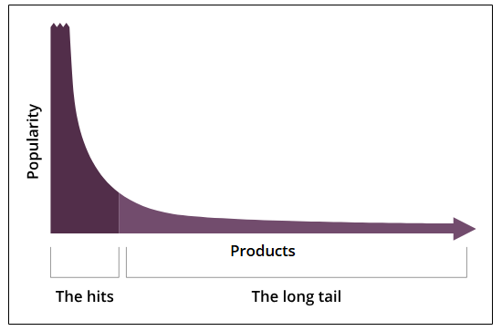

# Оценка проекта CDN

Давайте оценим предложенный нами проект CDN.

## Оценка

Здесь мы рассмотрим, как наш проект выполняет требования, которые мы обсуждали в предыдущих уроках. Наши основные требования — это высокая производительность, доступность, масштабируемость, надежность и безопасность. Давайте обсудим их по порядку.

### Производительность

CDN достигает высокой производительности за счет минимизации задержек. Некоторые из ключевых проектных решений, которые минимизируют задержки, следующие:

*   Прокси-серверы обычно обслуживают контент из оперативной памяти (RAM).
*   Прокси-серверы CDN размещаются рядом с пользователями для обеспечения более быстрого доступа к контенту.
*   CDN также может предоставлять прокси-серверы, расположенные в сетях интернет-провайдеров (ISP) или **точках обмена интернет-трафиком (IXP)** для обработки высокого трафика.
*   Система маршрутизации запросов гарантирует, что пользователи направляются к ближайшим прокси-серверам, как обсуждалось ранее.
*   Прокси-серверы хранят контент с длинным хвостом в энергонезависимых системах хранения, таких как SSD или HDD. Обслуживание с этих ресурсов приводит к более незначительной задержке, чем при обслуживании контента с исходных серверов.

> **Примечание**: Если мы проследим за частотой доступа к нашему контенту в течение некоторого времени, то увидим тенденцию, когда некоторый контент читают многие клиенты (например, 20% контента запрашивают 80% клиентов), а затем появляется длинный список контента, который запрашивают очень немногие клиенты. Такое распределение доступа называется распределением с длинным хвостом.
> 

_Многие виды данных демонстрируют феномен "длинного хвоста"_

*   Как обсуждалось ранее, прокси-серверы могут быть реализованы в виде уровней, где, если на одном уровне нет контента, запрос может быть обработан следующим уровнем прокси-серверов. Например, пограничные прокси-серверы могут запрашивать родительские прокси-серверы. Размещение прокси-серверов у определенных интернет-провайдеров может быть лучшим вариантом, когда большая часть трафика поступает из регионов этих провайдеров.

#### Доступность

CDN может справляться с огромным трафиком благодаря своей распределенной природе. CDN обеспечивает доступность за счет своего кэшированного контента, который служит резервной копией в случае сбоя исходных серверов. Более того, если один или несколько прокси-серверов в CDN перестают работать, другие работающие прокси-серверы берут на себя их функции и продолжают обслуживать веб-трафик. Кроме того, доступность пограничных прокси-серверов можно обеспечить за счет избыточности, реплицируя данные на необходимое количество прокси-серверов, чтобы избежать единой точки отказа и справиться с нагрузкой запросов. Наконец, мы можем использовать балансировщик нагрузки для распределения запросов пользователей по ближайшим активным прокси-серверам.

#### Масштабируемость

Проект CDN способствует масштабируемости следующими способами:

*   Он приближает контент к пользователю и устраняет требование высокой пропускной способности, тем самым обеспечивая масштабируемость.
*   Горизонтальная масштабируемость возможна путем добавления количества реплик для чтения в виде пограничных прокси-серверов.
*   Ограничения горизонтальной масштабируемости и емкости хранения отдельного прокси-сервера можно преодолеть с помощью многоуровневой архитектуры прокси-серверов, которую мы описали выше.

#### Надежность и безопасность

CDN обеспечивает отсутствие единой точки отказа за счет тщательной реализации циклов обслуживания и интеграции дополнительного оборудования и программного обеспечения по мере необходимости. Помимо сбоев, CDN справляется с огромными нагрузками трафика, равномерно распределяя нагрузку на пограничные прокси-серверы. Мы можем использовать серверы очистки (scrubber servers) для предотвращения DDoS-атак и безопасного хостинга контента. Более того, мы можем использовать **протокол heartbeat** для мониторинга состояния серверов и исключения неисправных. Приложения реального времени также создают свои собственные специализированные CDN для предотвращения проблем с утечкой контента и безопасного обслуживания контента для своих конечных пользователей.

### Заключение

С момента своего появления в 1990-х годах CDN играет жизненно важную роль в обеспечении высокой доступности и доставки контента с низкой задержкой. В настоящее время CDN считаются ключевым игроком в улучшении общей производительности гигантских сервисов.