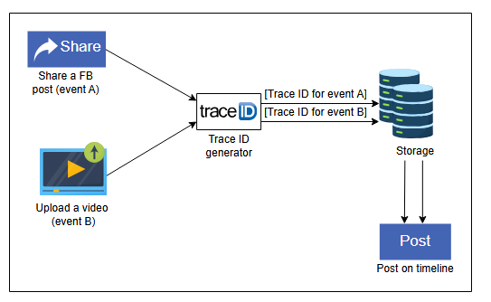

# **Проектирование систем: Секвенсор**

Изучите основы проектирования sequencer.

---

## **Мотивация**

В большой распределенной системе могут происходить миллионы событий в секунду. Комментарий к посту на Facebook, ретвит в Twitter или публикация фотографии в Instagram — это лишь несколько примеров таких событий. Нам нужен механизм, чтобы различать эти события. Один из таких механизмов — присвоение глобально уникальных идентификаторов (ID) каждому из этих событий.

Присвоение первичного ключа записи в базе данных — еще один случай использования уникального ID. Обычно эту задачу решает функция автоинкремента в базах данных. Однако эта функция не будет работать для распределенной базы данных, где разные узлы генерируют идентификаторы независимо друг от друга. В этом случае нам нужен генератор уникальных ID, который будет выступать в качестве первичного ключа в распределенной среде, например, для горизонтально шардированной таблицы.

Уникальный ID помогает нам отслеживать поток событий в логах и полезен для отладки. Реальным примером использования уникальных ID является система сквозного отслеживания и анализа производительности Facebook — **Canopy**. Canopy использует **TraceID** для однозначной идентификации события на всем пути его выполнения, который может затрагивать сотни микросервисов для обработки одного пользовательского запроса.
> Canopy - Комплексная система отслеживания и анализа производительности

*Присвоение уникального TraceID каждому событию*

> Объясните, почему нам нужно спроектировать генератор уникальных ID, сортируемых по времени. Почему мы предпочитаем time-sortable UIDs?
>
> 

>  
<b>Показать ответ</b>

>
>   Генератор идентификаторов с возможностью сортировки по времени имеет решающее значение, поскольку он гарантирует, что идентификаторы, присвоенные событиям или объектам, отражают порядок, в котором они происходили. Такой хронологический порядок жизненно важен для анализа последовательности событий, отладки и выполнения эффективных запросов к базе данных, поскольку обеспечивает быстрый доступ к самым свежим или релевантным данным.
> 

---

## **Как спроектировать sequencer?**

Мы разделили комплексное проектирование секвенсора на следующие два урока:

1.  **Проектирование генератора уникальных ID:** Перечислив требования к проектированию, мы обсуждаем три способа генерации уникальных ID: с помощью UUID, с помощью базы данных и с помощью обработчика диапазонов (range handler).
2.  **Уникальные ID с учетом причинности:** В этом уроке мы включаем дополнительный фактор времени в генерацию ID и объясняем процесс, принимая во внимание причинно-следственные связи.

**Уникальные ID** важны для идентификации событий и объектов в распределенной системе. Однако проектирование генератора уникальных ID в распределенной системе — сложная задача. В следующем уроке мы рассмотрим требования к распределенной системе генерации уникальных ID.
