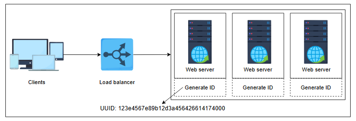
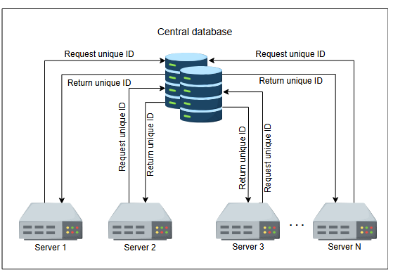
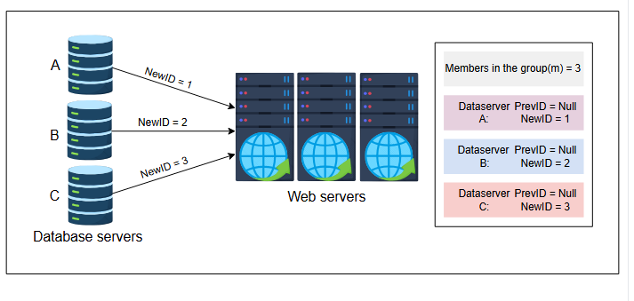
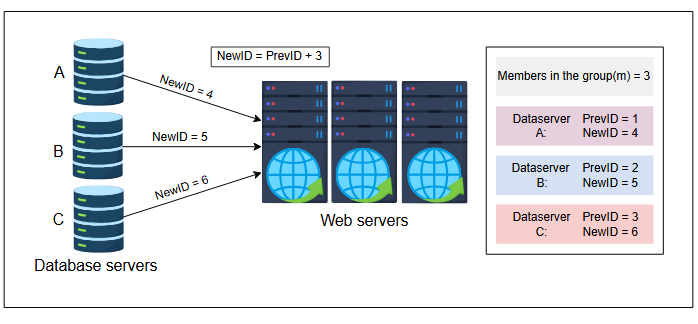
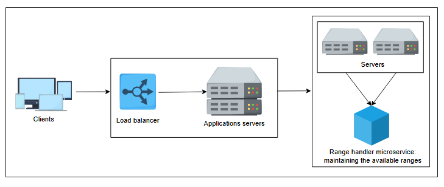

# **Проектирование генератора уникальных ID**

Узнайте, как спроектировать систему, которая генерирует уникальные ID.

В предыдущем уроке мы увидели, что нам нужны уникальные идентификаторы для многих сценариев, таких как идентификация объектов (например, твитов, загруженных видео и т.д.) и отслеживание потока выполнения в сложной сети сервисов. Теперь мы сформулируем требования к уникальному идентификатору и обсудим три постепенно улучшающихся варианта проектирования для их выполнения.

## **Требования к уникальным идентификаторам**

Требования к нашей системе следующие:

*   **Уникальность**: Нам нужно присваивать уникальные идентификаторы различным событиям для их идентификации.
*   **Масштабируемость**: Система генерации ID должна генерировать как минимум один миллиард уникальных ID в день.
*   **Доступность**: Поскольку множество событий происходит даже на уровне наносекунд, наша система должна генерировать ID для всех происходящих событий.
*   **64-битный числовой ID**: Мы ограничиваем длину 64 битами, так как этого размера достаточно на много лет вперед. Давайте рассчитаем количество лет, через которое наш диапазон ID зациклится.
    *   Общее количество доступных чисел = `2^64` = 1.8446744 x `10^19`
    *   Примерное количество событий в день = 1 миллиард = `10^9`
    *   Количество событий в год = 365 миллиардов = `365 × 10^9`
    *   Количество лет до исчерпания диапазона идентификаторов = `2^64 / (365 × 10^9)` = 50 539 024.8595 лет
    *   Учитывая эти расчеты, 64 бит должно быть достаточно для длины уникального ID.

Давайте рассмотрим возможные решения вышеупомянутой проблемы.

---

## **Первое решение: UUID**

Пробное решение для нашего проекта использует **UUID (универсально уникальные идентификаторы)**. Это 128-битное число, которое в шестнадцатеричном виде выглядит как `123e4567-e89b-12d3-a456-426614174000`. Оно дает нам около `10^38` чисел. У UUID есть разные версии. Мы выбираем версию 4, которая генерирует псевдослучайное число.

Каждый сервер может генерировать свой собственный ID и присваивать его соответствующему событию. Для UUID не требуется координация, так как он не зависит от сервера. С UUID легко масштабироваться, и эта система также высокодоступна. Кроме того, у нее низкая вероятность коллизий. Проект этого подхода приведен ниже:

*Генерация уникального ID с использованием подхода UUID*

> **На заметку**
>
> **1. Каковы преимущества использования подхода с UUID?**
>
> *   [ ] A. Он не требует синхронизации между серверами.
> *   [ ] B. Он масштабируем.
> *   [ ] C. Он доступен.
> *   [ ] D. Все вышеперечисленное.

### **Недостатки использования подхода с UUID**

Использование 128-битных чисел в качестве первичных ключей замедляет индексацию по первичному ключу, что приводит к медленным вставкам. Обходным путем может быть интерпретация ID как шестнадцатеричной строки, а не числа. Однако нечисловые идентификаторы могут не подходить для многих сценариев. ID не имеет размер 64 бита. Более того, существует **вероятность дублирования**. Хотя эта вероятность минимальна, мы не можем утверждать, что UUID детерминированно уникален. Кроме того, UUID, выдаваемые клиентам со временем, могут быть не монотонно возрастающими. В следующей таблице кратко изложены требования, которые мы выполнили с помощью UUID:

**Требования, выполненные с помощью UUID**

| | **Уникальность** | **Масштабируемость** | **Доступность** | **64-битный числовой ID** |
| :--- | :---: | :---: | :---: | :---: |
| **Использование UUID** | ✖️ | ✔️ | ✔️ | ✖️ |

---

## **Второе решение: использование базы данных**

Давайте попробуем имитировать функцию автоинкремента базы данных. Представим себе центральную базу данных, которая предоставляет текущий ID, а затем увеличивает значение на единицу. Мы можем использовать текущий ID как уникальный идентификатор для наших событий.

*Использование центральной базы данных для генерации уникальных ID*

> **На заметку**
>
> **1. Какая может быть потенциальная проблема при использовании центральной базы данных?**
>
> 

>  
<b>Показать ответ</b>

>
>   Такая схема имеет существенную проблему: наличие единой точки отказа. Зависимость от одной базы данных может серьезно повлиять на работу системы. Вся система перестанет работать, если центральная база данных выйдет из строя.
> 

Чтобы решить проблему единой точки отказа (single point of failure), мы изменяем обычную функцию автоинкремента, которая увеличивает значение на единицу. Вместо инкремента на единицу, давайте будем опираться на значение `m`, где `m` равно количеству имеющихся у нас серверов баз данных. Каждый сервер генерирует ID, и следующий ID добавляет `m` к предыдущему значению. Этот метод масштабируем и предотвращает дублирование ID. Следующее изображение демонстрирует, как генерируется уникальный ID с использованием базы данных:

*Генерация ID с использованием значения m*

### **Преимущества использования базы данных**
Этот подход масштабируем. Мы можем добавлять больше серверов, и значение `m` будет обновляться соответствующим образом.

### **Недостатки использования базы данных**
Хотя этот метод отчасти масштабируем, его трудно масштабировать на несколько дата-центров. Задача добавления и удаления сервера может привести к дублированию ID. Например, предположим, `m=3`, и сервер A генерирует уникальные ID 1, 4 и 7. Сервер B генерирует ID 2, 5 и 8, а сервер C — ID 3, 6 и 9. Сервер B выходит из строя. Теперь значение `m` обновляется до 2. Сервер A генерирует 9 в качестве своего следующего уникального ID, но этот ID уже был сгенерирован сервером C. Следовательно, ID больше не уникальны.

В таблице ниже показаны ограничения нашего решения. Система генерации уникальных ID не должна быть **единой точкой отказа (SPOF)**. Она должна быть масштабируемой и доступной.

**Сравнение выполнения требований: UUID vs. База данных**

| | **Уникальность** | **Масштабируемость** | **Доступность** | **64-битный числовой ID** |
| :--- | :---: | :---: | :---: | :---: |
| **Использование UUID** | ✖️ | ✔️ | ✔️ | ✖️ |
| **Использование серверов БД** | ✖️ | ✔️ | ✔️ | ✔️ |

---

## **Третье решение: использование обработчика диапазонов**

Давайте попробуем преодолеть проблемы, выявленные в предыдущих методах. Мы можем использовать диапазоны на центральном сервере. Предположим, у нас есть несколько диапазонов от одного до двух миллиардов, например, от 1 до 1 000 000; от 1 000 001 до 2 000 000; и так далее. В таком случае центральный микросервис может предоставлять диапазон серверу по запросу.

Любой сервер может запросить диапазон, когда он ему понадобится впервые или если у него закончился предыдущий. Предположим, сервер получил диапазон и теперь хранит начало диапазона в локальной переменной. Всякий раз, когда поступает запрос на ID, он предоставляет значение локальной переменной запрашивающему и увеличивает это значение на единицу.

Допустим, сервер 1 запрашивает диапазон чисел от 300 001 до 400 000. После этого запроса ID пользователя 300 001 присваивается первому запросу. Затем сервер возвращает 300 002 следующему пользователю, увеличивая свою текущую позицию в диапазоне. Это продолжается до тех пор, пока сервер не выдаст ID 400 000. Затем сервер приложений запрашивает у центрального сервера следующий доступный диапазон и повторяет этот процесс.

Это решает проблему дублирования ID. Каждый сервер приложений может отвечать на запросы одновременно. Мы можем добавить балансировщик нагрузки над группой серверов для распределения нагрузки запросов.

Мы используем микросервис под названием **обработчик диапазонов**, который ведет учет всех занятых и доступных диапазонов. Статус каждого диапазона может определять, доступен ли он. Состояние — то есть, какому серверу какой диапазон назначен — может быть сохранено в реплицируемом хранилище.

Этот микросервис может стать единой точкой отказа, но в этом случае спасает **резервный сервер (failover server)**. Резервный сервер выдает диапазоны, когда основной сервер недоступен. Мы можем восстановить состояние доступных и недоступных диапазонов из последней контрольной точки реплицируемого хранилища.

*Проектирование микросервиса-обработчика диапазонов*

> **[i]** Представьте ситуацию, когда вы планируете запустить новый дата-центр для обработки растущего числа пользовательских запросов. Как бы вы изменили свою стратегию распределения диапазонов, чтобы учесть это изменение?
>
> 

>  
<b>Показать ответ</b>

>   Для размещения нового центра обработки данных обычно требуется обновить стратегию распределения диапазонов, распределив диапазоны данных более равномерно по всем центрам обработки данных. Одним из эффективных методов является использование согласованного хэширования, которое помогает минимизировать перемещение данных при добавлении или удалении центров обработки данных. Вы также можете рассмотреть возможность географического сегментирования, распределяя данные в зависимости от местоположения пользователя, чтобы уменьшить задержку. При подключении нового центра обработки данных к сети вы можете разделить существующие диапазоны или перенести некоторые диапазоны в новое местоположение, обеспечивая сбалансированную нагрузку. Кроме того, реализация балансировки нагрузки обеспечивает эффективное распределение пользовательских запросов по всей инфраструктуре.
> 

### **Преимущества использования обработчика диапазонов**
Эта система масштабируема, доступна и выдает ID пользователей без дубликатов. Более того, мы можем поддерживать этот диапазон в 64 битах, что является числовым значением.

### **Недостатки использования обработчика диапазонов**
Мы теряем значительный диапазон, когда сервер выходит из строя, и можем предоставить новый диапазон только после того, как он снова заработает. Мы можем преодолеть этот недостаток, выделяя серверам более короткие диапазоны, хотя диапазоны должны быть достаточно большими, чтобы служить для выдачи идентификаторов в течение некоторого времени.

В следующей таблице подведены итоги того, что этот подход для нас выполняет:

**Сводная таблица выполнения требований**

| | **Уникальность** | **Масштабируемость** | **Доступность** | **64-битный числовой ID** |
| :--- | :---: | :---: | :---: | :---: |
| **Использование UUID** | ✖️ | ✔️ | ✔️ | ✖️ |
| **Использование серверов БД** | ✖️ | ✔️ | ✔️ | ✔️ |
| **Использование обработчика диапазонов** | ✔️ | ✔️ | ✔️ | ✔️ |

---

Мы разработали решение, которое предоставляет нам уникальный ID, который мы можем присваивать различным событиям и даже использовать в качестве первичного ключа. Но что, если мы добавим требование, чтобы ID был также сортируемым по времени?
