# **Уникальные ID с учетом причинности**

---

## **Причинность**

В предыдущем уроке мы генерировали уникальные ID для различения событий. Помимо уникальных идентификаторов для событий, нас также интересует
последовательность этих событий. Рассмотрим пример, где Петр и Иван — два пользователя Twitter. Иван публикует комментарий (событие А), а
Петр отвечает на комментарий Ивана (событие Б). Событие Б зависит от события А и не может произойти раньше него. В данном случае события не
являются параллельными.

У нас также могут быть параллельные события, то есть два события, которые происходят независимо друг от друга. Например, если Петр и Иван
комментируют два разных твита, между ними нет отношения «произошло до» или причинно-следственной связи. Важно определять зависимость одного
события от другого, но не в случае параллельных событий.

> **Примечание:** Описанный выше сценарий также можно реализовать, присваивая уникальный ID и кодируя зависимость событий с помощью
> социального графа. Мы также могли бы использовать отдельную структуру данных для времени и простой уникальный ID. Однако мы хотим, чтобы
> уникальный ID выполнял двойную функцию — обеспечивал уникальную идентификацию и помогал с определением причинности событий.

Следующие слайды демонстрируют параллельные и непоследовательные события.

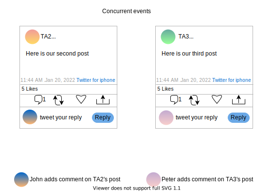

Некоторым приложениям требуется, чтобы идентификаторы событий были уникальными и несли релевантную информацию о причинности. Примером этого
является присвоение идентификатора параллельным записям ключа в хранилище «ключ-значение» для реализации стратегии «побеждает последняя
запись» (last-write-wins).

Мы можем использовать либо логические, либо физические часы для вывода причинности. Некоторые системы имеют дополнительные требования, где
мы хотим, чтобы причинность идентификаторов событий соответствовала реальному времени (wall-clock time). Примером этого является финансовое
приложение, соответствующее европейским регуляциям MiFID. MiFID требует, чтобы часы имели расхождение не более 100 микросекунд с UTC для
обнаружения аномалий во время высокочастотных/высокоскоростных рыночных торгов.

> **Примечание:** Существует много тонкостей, связанных с логическими или физическими часами. Вы можете обратиться к тексту ниже под
> названием «Время в распределенной системе», чтобы освежить свои знания о времени.

Мы используем время для определения последовательности событий в нашей жизни. Например, если Сэм принял ванну в 6 утра, а позавтракал в 7
утра, мы можем определить, что Сэм принял ванну до завтрака по временным меткам каждого события. Таким образом, временные метки можно
использовать для поддержания причинности.

 

  
<b>💡 Необязательное повторение: Время в распределенной системе</b>

### Физические часы

В компьютере обычно доступны два типа физических часов: часы реального времени и монотонные счетчики.

**Часы реального времени**

* Обычно они имеют более низкое разрешение по сравнению с монотонными счетчиками.
* Протокол сетевого времени (NTP) может переводить часы вперед или назад, поэтому они не всегда монотонны.
* Они могут как учитывать, так и не учитывать високосные секунды (секунды координации).

**Монотонные счетчики**

* Монотонные счетчики обычно имеют более высокое разрешение, чем часы реального времени.
* Монотонные счетчики следует использовать для измерения длительности между двумя событиями, а не для определения абсолютного времени.
* Их значения не имеют смысла при сравнении между разными узлами. Например, даже на одном сервере с несколькими процессорами может
  существовать отдельный счетчик для каждого процессора. Приложение должно проявлять осторожность при использовании счетчиков с разных
  процессоров.
* NTP может корректировать их, не нарушая монотонность.
* NTP может только ускорять или замедлять скорость изменения счетчика, но не более чем на 0,05%.

**Причины расхождения (дрейфа) часов**
Физические часы со временем расходятся по многим причинам:

* Разница температур
* Возраст оборудования
* Производственные дефекты
* Виртуализированные часы

Например, дрейф часов в 200 частей на миллион (ppm) означает расхождение в шесть миллисекунд при синхронизации каждые 30 секунд или
расхождение в 17 секунд при повторной синхронизации каждые 24 часа.

Исследование показало, что в публичном интернете NTP не может обеспечить точность часов лучше 35 мс, а при перегрузке сети расхождение может
подскакивать до одной секунды. В остальных случаях NTP использует несколько серверов времени и отбрасывает аномальные значения (выбросы).

**Компромисс: сложность и стоимость в обмен на точность часов**
Возможно поддерживать стабильно низкий дрейф часов, используя GPS и атомные часы, а также благодаря тщательному развертыванию и мониторингу.
Однако такая система требует дополнительных финансовых затрат и сопряжена с повышенной сложностью.

### Логические часы

* **Часы Лэмпорта** предоставляют нам отношения «произошло до» (happened-before). Если событие A произошло до события B, то значение часов
  для A будет меньше, чем значение часов для B. Однако есть тонкий момент: имея два значения часов для двух событий с любых двух серверов,
  мы не можем просто сравнить их, чтобы определить отношение «произошло до», поскольку эти два события могут быть параллельными (то есть не
  связанными причинно-следственной связью).
* Мы можем использовать **векторные часы**, чтобы выводить отношения «произошло до» на основе значений часов. Для этого нам понадобится
  счетчик для каждой участвующей сущности в векторе.
* Следует отметить, что отношение «произошло до» не всегда означает, что два события причинно связаны. Может быть и так, что одно событие
  просто произошло раньше другого. Обычно для установления истинной причинности поверх механизма «произошло до» требуется контекст на уровне
  приложения.

---

## **Использование временных меток UNIX**

Временные метки UNIX имеют точность до миллисекунды и могут использоваться для различения событий. У нас есть **сервер генерации ID**,
который может сгенерировать один ID за одну миллисекунду. Любой запрос на генерацию уникального ID направляется на этот сервер, который
возвращает временную метку как уникальный ID. Возможность генерировать ID за миллисекунды позволяет нам получать тысячу идентификаторов в
секунду. Это означает, что мы можем получить `24 (часов) * 60 (мин/час) * 60 (сек/мин) * 1000 (ID/сек) = 86 400 000 ID` в день. Это меньше,
чем миллиард в день.

> **Примечание:** Подключитесь к следующему терминалу, чтобы просмотреть временную метку UNIX в миллисекундах.

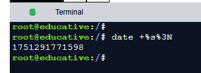

Наша система хорошо справляется с генерацией ID, но создает серьезную проблему. Сервер генерации ID является единой точкой отказа (SPOF), и
нам нужно это решить. Чтобы справиться с SPOF, мы можем добавить больше серверов. Каждый сервер генерирует уникальный ID для каждой
миллисекунды. Чтобы сделать общий идентификатор уникальным в рамках всей системы, мы прикрепляем ID сервера к временной метке UNIX. Затем мы
добавляем балансировщик нагрузки для более эффективного распределения трафика. Схема генератора уникальных ID с использованием временных
меток UNIX приведена ниже:

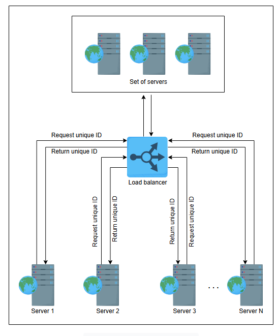

*Использование временной метки в качестве ID*

### **Преимущества**

Этот подход прост, масштабируем и легок в реализации. Он также позволяет нескольким серверам обрабатывать параллельные запросы.

### **Недостатки**

Для двух параллельных событий возвращается одна и та же временная метка, и им может быть присвоен один и тот же ID. Таким образом, ID
перестают быть уникальными.

**Сводная таблица выполнения требований**

| Подход                                   | Уникальный | Масштабируемый | Доступный | 64-битный числовой ID | Поддержка причинности |
|:-----------------------------------------|:----------:|:--------------:|:---------:|:---------------------:|:---------------------:|
| **Использование UUID**                   |     ✖️     |       ✔️       |    ✔️     |          ✖️           |          ✖️           |
| **Использование БД**                     |     ✖️     |       ✖️       |    ✔️     |          ✔️           |          ✖️           |
| **Использование обработчика диапазонов** |     ✔️     |       ✔️       |    ✔️     |          ✔️           |          ✖️           |
| **Использование временных меток UNIX**   |     ✖️     |   **слабо**    |    ✔️     |          ✔️           |       **слабо**       |

---

## **Twitter Snowflake**

Давайте попробуем использовать время эффективно. Мы можем использовать часть из наших целевых 64 бит для хранения времени, а оставшиеся —
для другой информации. Обзор разделения представлен ниже:

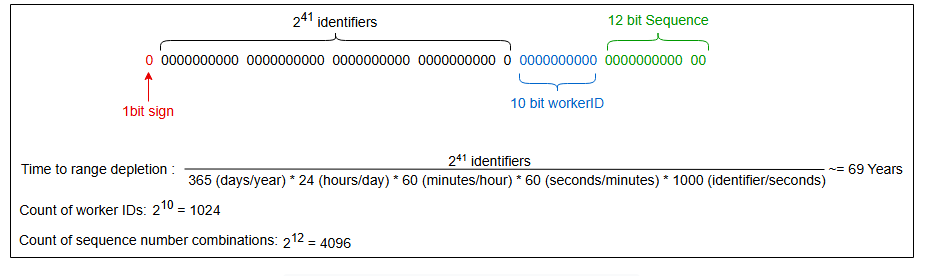

*Обзор разделения битов в Twitter Snowflake*

Объяснение разделения битов следующее:

* **Знаковый бит**: Один бит выделен как знаковый, и его значение всегда будет ноль. Это делает общее число положительным. Это помогает
  гарантировать, что любая среда программирования, использующая эти идентификаторы, будет интерпретировать их как положительные целые числа.
* **Временная метка**: 41 бит выделен для миллисекунд. Будет использоваться эпоха по умолчанию Twitter Snowflake. Ее
  значение — `1288834974657`, что эквивалентно 4 ноября 2010 г., 01:42:54 UTC. Мы можем установить собственную эпоху при развертывании нашей
  системы, например, 1 января 2022 года, 12 часов ночи, может стать началом нашей эпохи с нуля. Максимальное время до исчерпания этого
  диапазона показано ниже:
    * `Время до исчерпания = 2^41 / (365*24*60*60*1000) ≈ 69 лет`
    * Приведенные выше расчеты дают нам 69 лет, прежде чем нам понадобится новый алгоритм для генерации ID. Как мы видели ранее, если мы
      можем генерировать 1000 идентификаторов в секунду, мы не достигаем нашей цели в миллиард идентификаторов в день. Однако теперь, в
      предложении Snowflake, у нас есть достаточно идентификаторов, когда мы используем ID рабочего узла и локальные порядковые номера
      машины.
* **Номер рабочего узла**: 10 бит. Это дает нам `2^10` = 1024 ID рабочих узлов. Сервер, создающий уникальный ID для своих событий, будет
  прикреплять свой ID.
* **Порядковый номер**: 12 бит. Для каждого ID, сгенерированного на сервере, порядковый номер увеличивается на единицу. Это дает
  нам `2^12` = 4096 уникальных порядковых номеров. Мы сбросим его до нуля, когда он достигнет 4096. Этот номер добавляет слой для избежания
  дублирования.

> **[i]** Как мы можем обеспечить уникальность при генерации ID, когда на машину поступает более 4096 запросов в одну и ту же миллисекунду,
> учитывая, что порядковый номер в структуре ID обеспечивает уникальность в пределах одной миллисекунды?
>
> 

>  
<b>Показать ответ</b>

>   Когда на компьютер поступает более 4096 запросов в течение одной миллисекунды, обычно система ожидает следующую миллисекунду, прежде чем генерировать новые идентификаторы. Таким образом, порядковый номер сбрасывается, гарантируя, что каждый идентификатор останется уникальным. Это ожидание приводит к небольшой задержке, но в целом приемлемо, поскольку в большинстве систем такая высокая частота запросов встречается редко.
> 

*(Слайд-шоу, показывающее преобразование временной метки в UTC)*

1) Обзор разделения битов  
   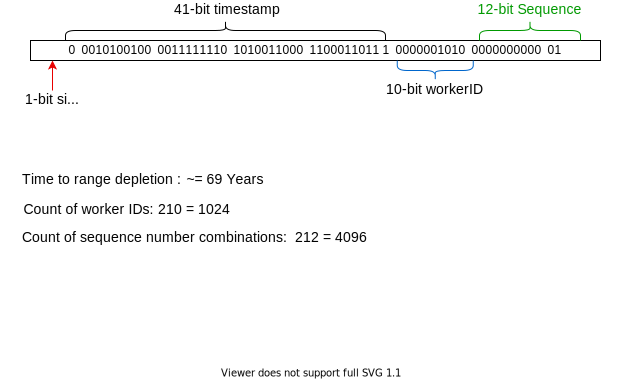

2) Преобразовать время в UTC  
   

3) Преобразовать биты в десятичное число  
   

4) Преобразовать десятичное число в эпоху  
   

5) Преобразовать миллисекунды в UTC  
   

### **Преимущества**

Twitter Snowflake использует временную метку в качестве первого компонента. Поэтому они сортируемы по времени. Генератор ID также является
высокодоступным.

### **Недостатки**

ID, сгенерированные в **«мертвый период»**, являются проблемой. Мертвый период — это когда на сервер не поступает запросов на генерацию ID.
Эти ID будут потрачены впустую, так как они занимают пространство идентификаторов. Возможный уникальный диапазон исчерпается раньше, чем
ожидалось, и создаст пробелы в нашем глобальном наборе ID.

> **На заметку**
>
> **1. Можете ли вы найти еще один недостаток в показанной выше схеме?**
>
> 

>  
<b>Показать ответ</b>

> Физические часы ненадежны. Для таких часов погрешность может составлять 17 секунд в сутки. Если мы измеряем время с их помощью на сервере, время уходит в сторону.
>
> Учитывая наличие одного сервера, мы не будем подвержены влиянию времени, поскольку все транзакции поступают на один сервер. Но в
> распределенной среде часы не будут синхронизированы.
>
> Из-за ненадежности точного измерения времени, независимо от того, как часто мы синхронизируем эти часы друг с другом или с другими часами,
> использующими точные методы измерения, всегда будет наблюдаться перекос между различными часами, задействованными в распределенной
> системе.
> 

Еще одним слабым местом этой системы является ее зависимость от времени. NTP может повлиять на работу этой системы. Если часы на одном из
серверов «убегут» на две секунды вперед, другие серверы будут отставать на две секунды. Часы NTP распознают это и перекалибруют свои часы.
Теперь все серверы будут синхронизированы. Однако в процессе этого сдвига могли быть сгенерированы ID для времени, которое еще не наступило,
и теперь у нас будет пара возможных непараллельных событий с одинаковой временной меткой. Наконец, причинность наших событий не будет
сохранена.

> **Примечание:** Network Time Protocol (NTP) — это сетевой протокол для синхронизации часов между компьютерными системами по сетям с
> коммутацией пакетов и переменной задержкой. NTP предназначен для синхронизации всех участвующих компьютеров с точностью до нескольких
> миллисекунд от Всемирного координированного времени (UTC). Он смягчает эффекты переменной сетевой задержки.

Точное время по-прежнему остается проблемой. Мы можем считывать время с часов машины с точностью до микросекунд или даже наносекунд. Даже
при таком точном измерении **риски NTP** остаются. Поскольку мы не можем полагаться на физические часы, давайте воспользуемся логическими
часами.

**Сводная таблица выполнения требований**

| Подход                                   | Уникальный | Масштабируемый | Доступный | 64-битный числовой ID | Поддержка причинности |
|:-----------------------------------------|:----------:|:--------------:|:---------:|:---------------------:|:---------------------:|
| **Использование UUID**                   |     ✖️     |       ✔️       |    ✔️     |          ✖️           |          ✖️           |
| **Использование БД**                     |     ✖️     |       ✖️       |    ✔️     |          ✔️           |          ✖️           |
| **Использование обработчика диапазонов** |     ✔️     |       ✔️       |    ✔️     |          ✔️           |          ✖️           |
| **Использование временных меток UNIX**   |     ✖️     |   **слабо**    |    ✔️     |          ✔️           |       **слабо**       |
| **Twitter Snowflake**                    |     ✔️     |       ✔️       |    ✔️     |          ✔️           |       **слабо**       |

---

## **Использование логических часов**

Мы можем использовать логические часы (часы Лэмпорта и векторные часы), которым требуются монотонно возрастающие идентификаторы для событий.

### **Часы Лэмпорта**

В **часах Лэмпорта** каждый узел имеет свой собственный счетчик. Все узлы системы оснащены числовым счетчиком, который начинается с нуля при
первой активации. Перед выполнением события числовой счетчик увеличивается на единицу. Сообщение, отправленное от этого события на другой
узел, содержит значение счетчика. Когда другой узел получает сообщение, он сначала обновляет свои логические часы, беря максимум из значения
своих часов и значения, отправленного в сообщении, а затем выполняет сообщение.

Часы Лэмпорта обеспечивают уникальный частичный порядок событий, используя отношение «произошло до». Мы также можем получить полный порядок
событий, добавляя уникальные идентификаторы узлов/процессов, хотя такой порядок не является уникальным и будет меняться при другом
назначении идентификаторов узлов. Однако следует отметить, что часы Лэмпорта не позволяют нам выводить причинность на глобальном уровне. Это
означает, что мы не можем просто сравнить два значения часов на любом сервере, чтобы вывести отношение «произошло до». Векторные часы
преодолевают этот недостаток.

### **Векторные часы**

Векторные часы сохраняют причинную историю, то есть всю информацию об отношениях «произошло до» между событиями. Поэтому мы должны выбрать
эффективную структуру данных для захвата причинной истории каждого события.

Рассмотрим приведенную ниже схему. Мы будем генерировать наш ID, объединяя соответствующую информацию, как в Twitter Snowflake, со следующим
разделением:

* **Знаковый бит**: Один бит, всегда ноль.
* **Векторные часы**: 53 бита для счетчиков каждого узла.
* **Номер рабочего узла**: 10 бит. Это дает `2^10` = 1024 ID рабочих узлов.

Следующие слайды объясняют генерацию уникального ID с помощью векторных часов, где узлы A, B и C находятся в одном дата-центре.

> **Примечание:** На следующих слайдах мы не преобразовывали данные в биты для простоты понимания. Шаблон, который мы будем использовать для
> уникального ID, следующий:
>
> `[vector-clock][worker-id]`

Конечно, вот перевод объяснения работы векторных часов.

***

💡 **Объяснение работы векторных часов**

Приведенные выше слайды объясняют поведение векторных часов. Система состоит из трех узлов: A, B и C, и часы отслеживают события, происходящие на каждом узле с течением времени. Рассмотрим шаги подробно:

1.  **Формат векторных часов:**
    Каждый узел поддерживает векторные часы `[A, B, C]`, где:
    *   A — это локальный счетчик событий на узле A,
    *   B — для узла B, и
    *   C — для узла C.
    
        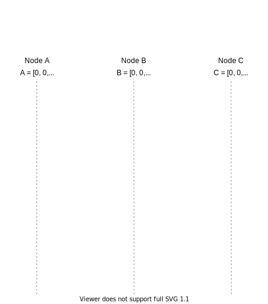

2.  **Событие A₁ на Узле A:**
    *   Часы: `[1, 0, 0]`
    *   Первое событие на узле A увеличивает его счетчик (первое число в векторе).
    *   Узел отправляет сообщение узлу B, передавая эти часы.

        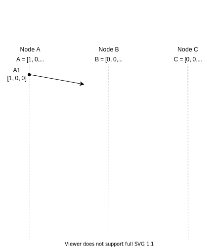

3.  **Событие C₁ на Узле C:**
    *   На узле C происходит локальное событие, которое увеличивает его счетчик до C₁: `[0, 0, 1]`.

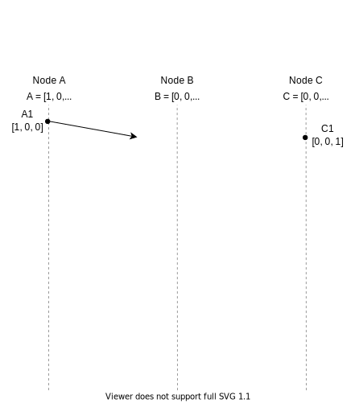

4.  **Событие B₁ на Узле B:**
    *   Узел B получает сообщение, сгенерированное узлом A, с часами A₁: `[1, 0, 0]`.
    *   Узел B сравнивает полученные часы со своими собственными `[0, 0, 0]`, находит поэлементный максимум и увеличивает свой собственный счетчик (счетчик B).
    *   Максимум: `[1, 0, 0]`. Затем B увеличивает свой счетчик, в результате чего часы B₁ становятся: `[1, 1, 0]`.
    *   Узел B отправляет сообщение узлу C с векторными часами `[1, 1, 0]`.
    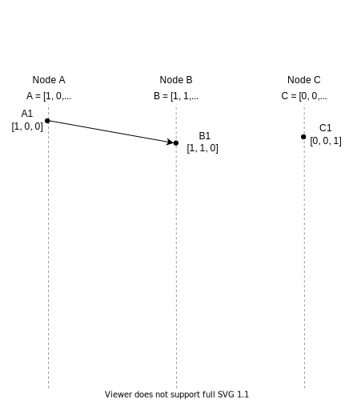
    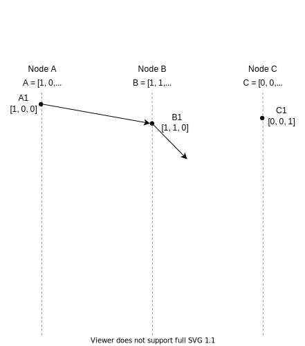

5.  **Событие C₂ на Узле C:**
    *   На узле C происходит локальное событие, увеличивая его вектор с `[0, 0, 1]` до C₂: `[0, 0, 2]`.
        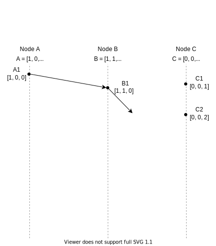

6.  **Событие B₂ на Узле B:**
    *   На узле B происходит локальное событие, увеличивая его часы с `[1, 1, 0]` до `[1, 2, 0]`.
        
    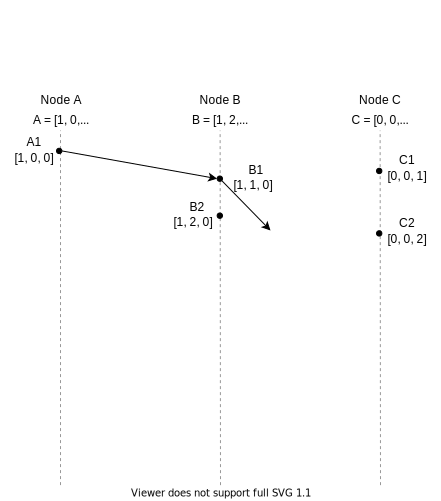
7.  **Событие A₂ на Узле A:**
    *   На узле A происходит локальное событие, увеличивая его часы до `[2, 0, 0]`.
       
    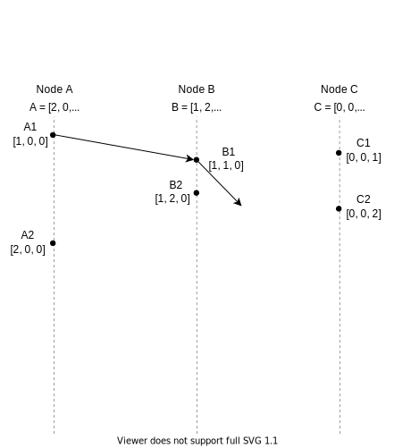
8.  **Событие C₃ на Узле C:**
    *   На узле C происходит локальное событие, увеличивая его счетчик с `[0, 0, 2]` до C₃: `[0, 0, 3]`.
        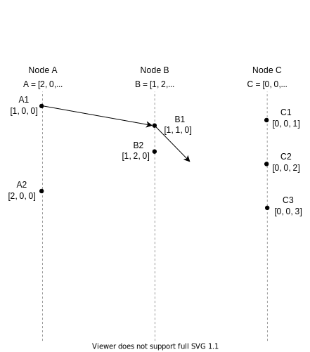
9.  **Событие C₄ на Узле C:**
    *   Узел C получает сообщение от узла B с векторными часами B₂: `[1, 1, 0]`.
    *   Текущие часы узла C: `[0, 0, 3]`.
    *   Узел C находит поэлементный максимум между `[0, 0, 3]` и `[1, 1, 0]`, что дает `[1, 1, 3]`. Затем узел C увеличивает свой счетчик; итоговые часы на узле C: `[1, 1, 4]`.

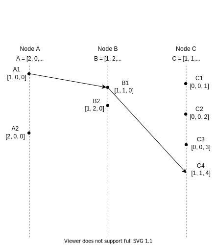
10. **Событие C₅ на Узле C:**
    *   На узле C происходит локальное событие, увеличивая счетчик C до `[1, 1, 5]`.
    *   Узел C отправляет сообщение узлу A с векторными часами `[1, 1, 5]`.

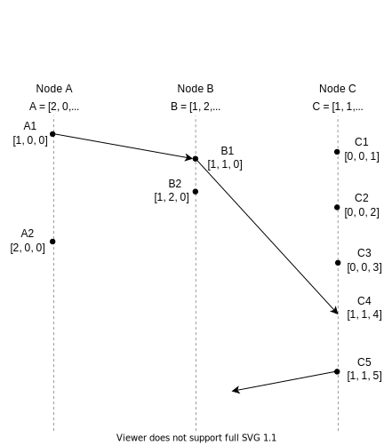

11. **Событие A₃ на Узле A:**
    *   Узел A получает сообщение от узла C с векторными часами `[1, 1, 5]`.
    *   Локальные часы узла A были `[2, 0, 0]`.
    *   Узел A находит поэлементный максимум между `[1, 1, 5]` и `[2, 0, 0]`, что дает `[2, 1, 5]`.
    *   Узел увеличивает свой счетчик, итоговые часы на узле A: `[3, 1, 5]`.
       
    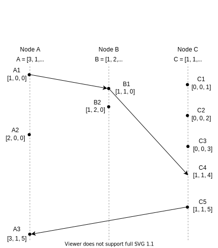
12. **Итоговые состояния векторных часов:**
    *   A = `[3, 1, 5]`
    *   B = `[1, 2, 0]`
    *   C = `[1, 1, 5]`
    
        
    
Наш подход с векторными часами работает. Однако, чтобы полностью захватить причинность, векторные часы должны иметь размер не менее `n` (
количество узлов). В результате, когда общее количество участвующих узлов огромно, векторные часы требуют значительного объема хранения.
Некоторые современные системы, такие как веб-приложения, рассматривают каждый браузер как клиента системы. Такая информация значительно
увеличивает длину ID, что затрудняет его обработку, хранение, использование и масштабирование.

**Сводная таблица выполнения требований**

| Подход             | Уникальный | Масштабируемый | Доступный | 64-битный числовой ID | Поддержка причинности |
|:-------------------|:----------:|:--------------:|:---------:|:---------------------:|:---------------------:|
| **Использование БД**                     |     ✖️     |       ✖️       |    ✔️     |          ✔️           |          ✖️           |
| **Использование обработчика диапазонов** |     ✔️     |       ✔️       |    ✔️     |          ✔️           |          ✖️           |
| **Использование временных меток UNIX**   |     ✖️     |   **слабо**    |    ✔️     |          ✔️           |       **слабо**       |
| **Twitter Snowflake**                    |     ✔️     |       ✔️       |    ✔️     |          ✔️           |       **слабо**       |
| **Векторные часы** |     ✔️     |   **слабо**    |    ✔️     |  **может превышать**  |          ✔️           |

> **На заметку**
>
> **1. Помогут ли глобальные часы решить нашу проблему?**
>
> 

>  
<b>Показать ответ</b>

>   Поскольку у нас нет глобальных часов, даже если каждый узел может назначить уникальные временные метки для происходящих событий, эти временные метки будут получены из часов, работающих с разной скоростью. Это усложнит их сравнение, и они не будут уникальными.
>
>   Однако, если у нас есть глобальные часы, которые показывают нам время по запросу и всегда точны, то мы можем поддерживать причинно-следственную связь событий, а также уникальный идентификатор. Такие часы были бы очень полезны, но в распределенных системах сложно управлять временем.
> 

---

## **TrueTime API**

**TrueTime API от Google** в Spanner — это интересный вариант. Вместо конкретной временной метки он возвращает интервал времени. При запросе
текущего времени мы получаем два значения: самое раннее и самое позднее. Это самое раннее возможное и самое позднее возможное время.

Основываясь на своих расчетах неопределенности, часы знают, что фактическое текущее время находится где-то в этом интервале. Ширина
интервала зависит, среди прочего, от того, сколько времени прошло с последней синхронизации локальных кварцевых часов с более точным
источником времени.

Google размещает GPS-приемник или атомные часы в каждом дата-центре, и часы синхронизируются с точностью около 7 мс. Это позволяет Spanner
свести неопределенность часов к минимуму. Неопределенность интервала представлена как эпсилон.

1) В каждом дата-центре есть обработчики времени. Главные серверы времени GPS оснащены приемниками GPS, и некоторые из них имеют атомные часы.  
   

2) Клиенту требуется TrueTime.  
   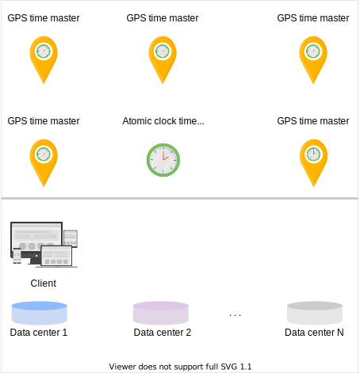

3) Клиент запускает демон. Демон в основном связывается с главными серверами времени GPS, а иногда обращается к серверам времени с атомными часами для получения избыточности различных источников времени.  
   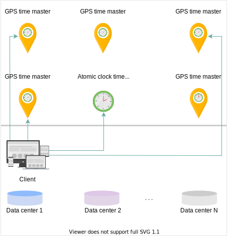

4) Мы используем алгоритм Марзулло, который пересекает временные интервалы для определения временной метки. API возвращает интервал от самого раннего до самого позднего времени.  
   

5) Временная метка будет выражена в виде заданного интервала плюс или минус эпсилон.  
   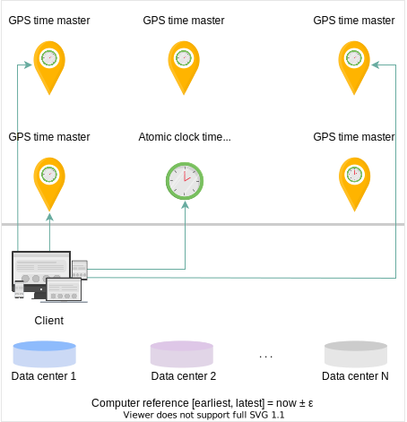

*(Слайд-шоу, объясняющее, как серверы времени TrueTime работают с GPS и атомными часами)*

1) Перед тем, как клиент запросит TrueTime  
   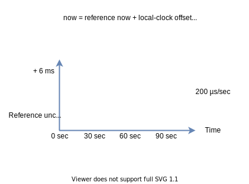

2) Вычислить эпсилон в нулевое время  
   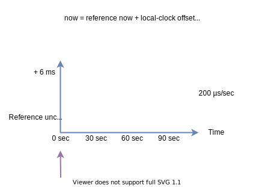

3) Предположим, что дрейф часов составляет не более 200 микросекунд в секунду. Это означает, что за 30 секунд к значению эпсилон прибавляется примерно 6 миллисекунд (мс).  
   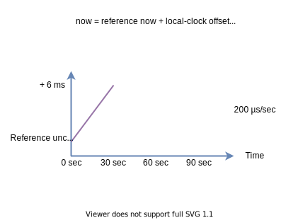

4) Вычислить эпсилон через 30 секунд  
   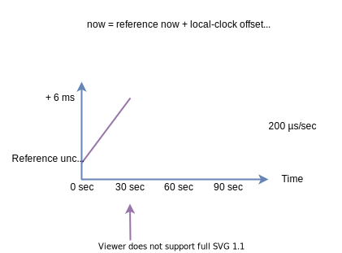

5) В следующие 30 секунд мы взаимодействуем с главным сервером времени, так как вычисляется неопределенность временной метки, которая увеличивается со скоростью 200 микросекунд в секунду.  
   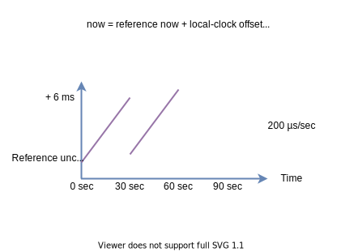

6) Вычислить эпсилон через 60 секунд  
   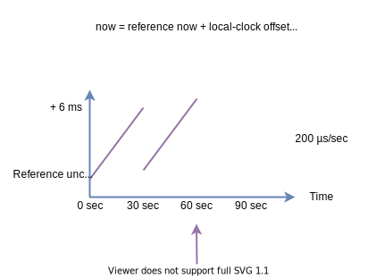

7) Снова, вычисленная неопределенность временной метки увеличивается со скоростью 200 микросекунд в секунду.  
   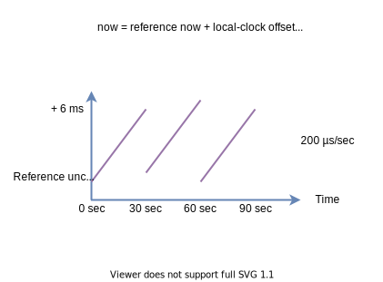

Spanner гарантирует, что два доверительных интервала не пересекаются (т.е. `A_earliest < A_latest < B_earliest < B_latest`), тогда событие B
определенно произошло после A.

Мы генерируем наш уникальный ID, используя интервалы TrueTime. Допустим, самый ранний интервал — `T_E`, самый поздний — `T_L`, а
неопределенность — `ε`. Мы используем `T_E` в миллисекундах как временную метку в нашем уникальном ID.

* **Временная метка**: 41 бит. Мы используем `T_E` как временную метку.
* **Неопределенность**: 4 бита. Поскольку максимальная неопределенность заявлена как 6-10 мс, мы используем 4 бита для ее хранения.
* **Номер рабочего узла**: 10 бит (1024 ID).
* **Порядковый номер**: 8 бит (`2^8` = 256 комбинаций).

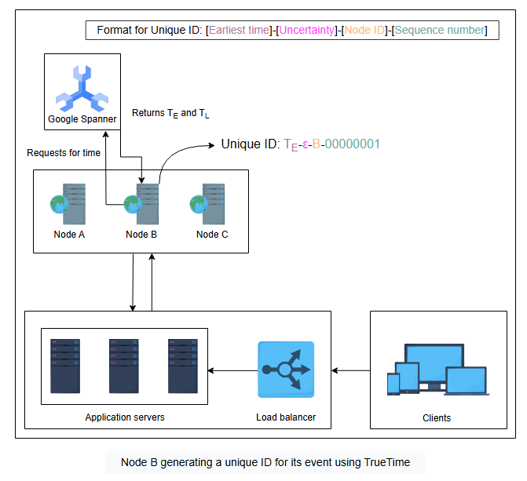

### **Преимущества**

TrueTime удовлетворяет всем требованиям. Мы можем генерировать глобально уникальный 64-битный идентификатор. Причинность событий
сохраняется. Подход масштабируем и высокодоступен.

### **Недостатки**

Если два интервала пересекаются, мы не уверены, в каком порядке произошли A и B. Возможно, это параллельные события, но 100% гарантии дать
нельзя. Кроме того, Spanner дорог, поскольку обеспечивает высокую согласованность базы данных. Стоимость системы типа Spanner также высока
из-за ее сложной инфраструктуры и необходимости мониторинга.

**Итоговая сводная таблица**

| Подход                                   | Уникальный | Масштабируемый | Доступный | 64-битный числовой ID | Поддержка причинности |
|:-----------------------------------------|:----------:|:--------------:|:---------:|:---------------------:|:---------------------:|
| **Использование UUID**                   |     ✖️     |       ✔️       |    ✔️     |          ✖️           |          ✖️           |
| **Использование БД**                     |     ✖️     |       ✖️       |    ✔️     |          ✔️           |          ✖️           |
| **Использование обработчика диапазонов** |     ✔️     |       ✔️       |    ✔️     |          ✔️           |          ✖️           |
| **Использование временных меток UNIX**   |     ✖️     |   **слабо**    |    ✔️     |          ✔️           |       **слабо**       |
| **Twitter Snowflake**                    |     ✔️     |       ✔️       |    ✔️     |          ✔️           |       **слабо**       |
| **Векторные часы**                       |     ✔️     |   **слабо**    |    ✔️     |  **может превышать**  |          ✔️           |
| **Использование TrueTime**               |     ✔️     |       ✔️       |    ✔️     |          ✔️           |          ✔️           |

---
> **[i]** **Рассмотрим сценарий:** В дата-центре на 30 минут отключается электричество. После восстановления часы на машинах
> рассинхронизированы на 5 минут. Какие проблемы это может вызвать, и как бы вы их решили?
>
> 

>  
<b>Показать ответ</b>

>   Когда часы не синхронизированы, возникают проблемы, связанные с коллизиями идентификаторов и несогласованными временными метками, что влияет на целостность данных. Для решения этой проблемы синхронизируйте часы с помощью протокола NTP, предотвратите генерацию идентификаторов на уязвимых компьютерах до тех пор, пока часы не будут выровнены, или используйте логические часы для упорядочивания, вместо того чтобы полагаться исключительно на системное время.
> 

---

## **Заключение**

* Мы хотим избежать дублирования идентификаторов. Подумайте, что произойдет, если будут сгенерированы дублирующиеся платежные или закупочные
  ордера.
* UUID предоставляют вероятностные гарантии отсутствия коллизий ключей. Детерминированное получение гарантий отсутствия коллизий может
  потребовать консенсуса между различными распределенными сущностями или хранилищами и чтения из реплицированного хранилища.
* Когда длина ключа становится большой, это часто приводит к замедлению обновлений кортежей в базе данных. Поэтому идентификаторы должны
  быть достаточно большими, но не слишком большими.
* Часто желательно, чтобы никто не мог угадать следующий ID. В противном случае могут произойти нежелательные утечки данных, и конкуренты
  организации могут узнать, сколько заказов было обработано за день, просто взглянув на ID заказов. Добавление нескольких случайных чисел в
  биты идентификатора затрудняет угадывание, хотя это и сказывается на производительности.
* Мы можем использовать простые счетчики для генерации уникальных ID, если не хотим связывать ID со временем. Получение временных меток
  медленнее, чем использование простых счетчиков.
* Получение временных меток медленнее, чем использование простых счетчиков, хотя это требует, чтобы мы постоянно хранили сгенерированные ID.
  Счетчик должен храниться в базе данных. Хранение сопряжено со своими проблемами. К ним относятся множество параллельных записей, которые
  могут стать непосильной нагрузкой для базы данных, и то, что база данных становится единой точкой отказа.
* Для некоторых распределенных баз данных, таких как Spanner, генерация монотонно возрастающих или убывающих ID может навредить. Google
  сообщает следующее: «Фактически, использование монотонно возрастающих (или убывающих) значений в качестве ключей строк не соответствует
  лучшим практикам в Spanner, поскольку это создает горячие точки (hotspots) в базе данных, что приводит к снижению производительности».

> **Примечание:** Глобальное упорядочивание событий — дорогостоящая процедура. Функция, которая была быстрой и простой в централизованной
> базе данных (ID на основе автоинкремента), становится медленной и сложной в ее распределенном аналоге из-за некоторых фундаментальных
> ограничений (таких как консенсус, который трудно достичь между удаленными сущностями).
>
> Например, Spanner, географически распределенная база данных, сообщает, что «если транзакция чтения-обновления одной ячейки (один столбец в
> одной строке) имеет задержку 10 миллисекунд (мс), то максимальная теоретическая частота выдачи последовательных значений составляет 100 в
> секунду. Этот максимум применяется ко всей базе данных, независимо от количества экземпляров клиентского приложения или количества узлов в
> базе данных. Это связано с тем, что одна строка всегда управляется одним узлом». Если бы мы могли пойти на компромисс в требованиях к
> глобальному упорядочиванию и отсутствию пробелов в идентификаторах, мы смогли бы получать гораздо больше идентификаторов за более короткое
> время, то есть с лучшей производительностью.
