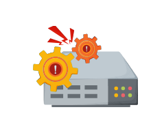

# **Проектирование систем: Распределенный мониторинг**

Узнайте о важности мониторинга в распределенной системе и изучите наш высокоуровневый план его проектирования.

---

## **Мониторинг**

Современная экономика зависит от непрерывной работы IT-инфраструктуры. Такая инфраструктура включает в себя оборудование, распределенные сервисы и сетевые ресурсы. Эти компоненты взаимосвязаны, что затрудняет поддержание бесперебойной работы и предотвращение простоев приложений.

Сложно понять, что происходит на аппаратном или прикладном уровне, когда наша инфраструктура распределена по нескольким локациям и включает множество серверов. Компоненты могут сталкиваться со сбоями, превышением времени отклика, перегрузкой или недоступностью оборудования, нехваткой ресурсов в контейнерах и многим другим. В такой инфраструктуре работает множество сервисов, и что угодно может пойти не так.

Когда один из сервисов выходит из строя, это может привести к сбою других сервисов, и в результате приложение становится недоступным для пользователей. Если мы не узнаем, что пошло не так, на ранней стадии, отладка системы вручную может занять много времени и усилий. Более того, для крупных сервисов нам необходимо убедиться, что они работают в рамках согласованных соглашений об уровне обслуживания (SLA). Нам нужно отслеживать важные тенденции и сигналы о надвигающихся сбоях в качестве ранних предупреждений, чтобы можно было своевременно устранить любые проблемы.

Мониторинг помогает анализировать такую сложную инфраструктуру, где постоянно что-то выходит из строя. Мониторинг распределенных систем включает в себя сбор, интерпретацию и отображение данных о взаимодействиях между одновременно работающими процессами. Он помогает в отладке, тестировании, оценке производительности и дает возможность получить «вид с высоты птичьего полета» на множество сервисов.

---

## **Как мы будем проектировать систему распределенного мониторинга?**

Мы разделили проектирование системы распределенного мониторинга на следующие главы и уроки:

1.  **Распределенный мониторинг**
    1.  **Введение в распределенный мониторинг**: Узнайте, почему мониторинг в распределенной системе имеет решающее значение, какова стоимость простоев и какие существуют типы мониторинга.
    2.  **Предварительные требования к системе мониторинга**: Изучите несколько основных понятий о метриках и оповещениях в системе мониторинга.
2.  **Мониторинг ошибок на стороне сервера**
    1.  **Проектирование системы мониторинга**: Определите требования и высокоуровневую архитектуру системы мониторинга.
    2.  **Детальное проектирование системы мониторинга**: Углубитесь в детали проектирования системы мониторинга и изучите задействованные компоненты.
    3.  **Визуализация данных в системе мониторинга**: Узнайте уникальный способ визуализации огромного количества данных мониторинга.
3.  **Мониторинг ошибок на стороне клиента**
    1.  **Фокус на ошибках на стороне клиента**: Познакомьтесь с ошибками на стороне клиента и узнайте, почему важно их отслеживать.
    2.  **Проектирование системы мониторинга на стороне клиента**: Научитесь проектировать систему, которая отслеживает ошибки на стороне клиента.

В следующем уроке мы на примере рассмотрим, почему мониторинг так важен в распределенной системе. Мы также рассмотрим стоимость простоев из-за сбоев и типы мониторинга.
