# **Введение в распределенный мониторинг**

Узнайте, почему мониторинг в распределенной системе имеет решающее значение.

---

## **Необходимость мониторинга**

Давайте рассмотрим, как сбой одного сервиса может повлиять на бесперебойную работу связанных систем. Чтобы избежать каскадных сбоев, мониторинг может сыграть жизненно важную роль, предоставляя ранние предупреждения или направляя нас к первопричине неисправностей.

Рассмотрим сценарий, в котором пользователь загружает видео `intro-to-system-design` на YouTube. Сервис `UI` на сервере `A` принимает информацию о видео и передает данные сервису 2 на сервере B. Сервис 2 делает запись в базе данных и сохраняет видео в блоб-хранилище. Другой сервис, 3 на сервере C, управляет репликацией и синхронизацией баз данных X и Y.

В этом сценарии сервис 3 выходит из строя из-за какой-то ошибки, а сервис 2 делает запись в базе данных X. База данных X падает, и запрос на получение видео направляется в базу данных Y. Пользователь хочет воспроизвести видео `intro-to-system-design`, но получит ошибку «Видео не найдено…».

1) Пользователь загружает видео на YouTube  
   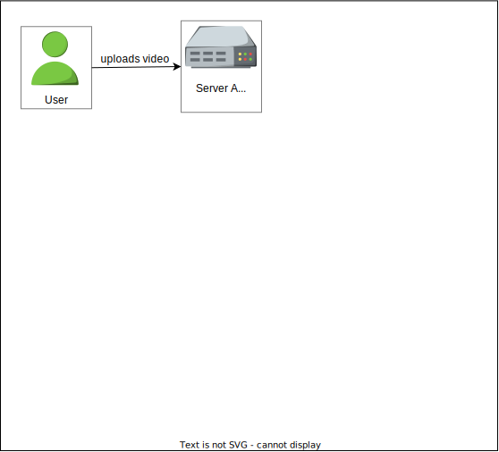

2) Служба пользовательского интерфейса на сервере A принимает информацию о видео и передает данные службе 2 на сервере B  
   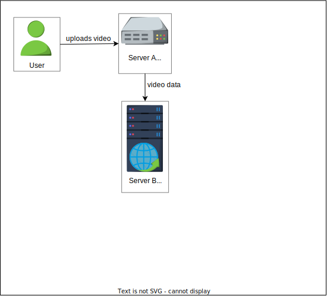

3) Служба 2 создает запись в базе данных и сохраняет видео в хранилище больших двоичных объектов (blob storage)  
   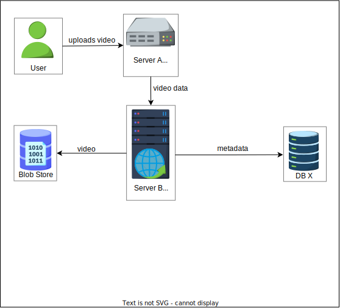

4) Служба 3 на сервере C управляет синхронизацией баз данных X и Y  
   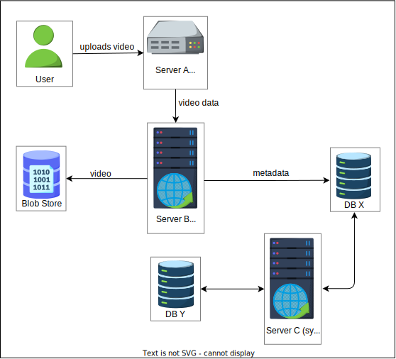

5) Служба 3 выходит из строя из-за ошибки, и служба 2 создает запись в базе данных X  
   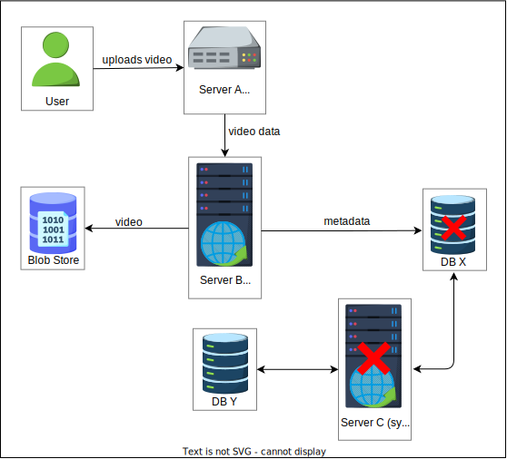

6) База данных X выходит из строя  
   

7) В базе данных Y отсутствует запись о видео "intro-to-system-design"  
   

8) Пользователь запрашивает получение видео  
   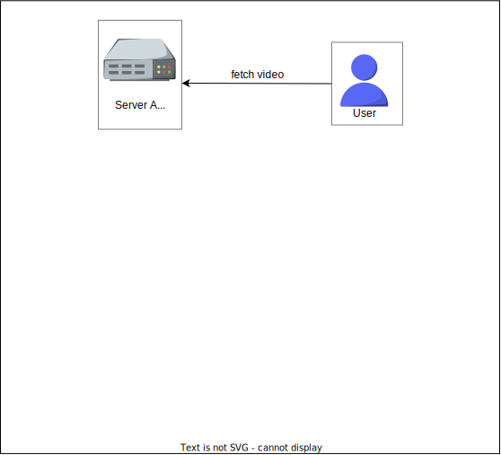

9) Служба пользовательского интерфейса на сервере A пересылает запрос на чтение серверу B  
   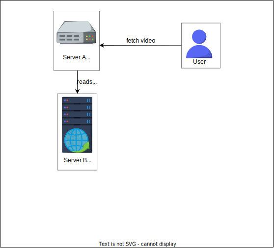

10) База данных X выходит из строя  
    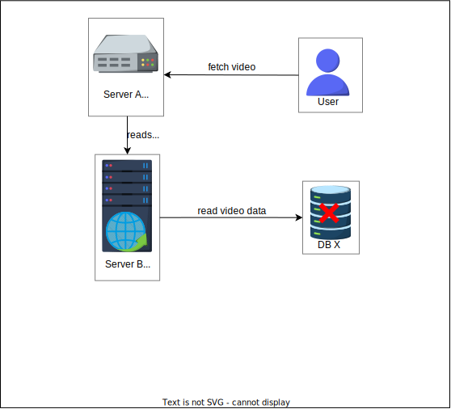

11) Видео не может быть получено, так как база данных не работает  
    

12) Запрос перенаправляется в базу данных Y  
    

13) В базе данных Y отсутствует запись об этом видео  
    

14) Ответ "Видео не найдено" возвращается на сервер пользовательского интерфейса  
    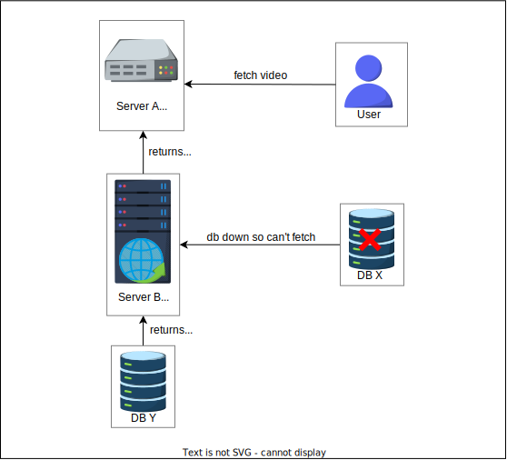

15) Ответ "Видео не найдено" возвращается пользователю  
    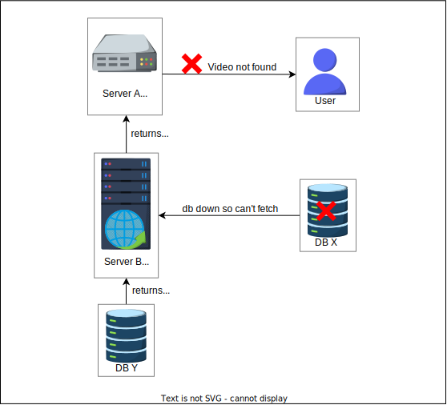

Приведенный выше пример относительно прост. В реальности возникают сложные проблемы, поскольку у нас много дата-центров по всему миру, и в каждом из них миллионы серверов. Из-за уменьшающегося соотношения числа администраторов к количеству серверов часто невозможно вручную найти проблемы. Наличие системы мониторинга снижает эксплуатационные расходы и способствует автоматизированному способу обнаружения сбоев.

---
### **Стоимость простоя**

Существуют отказоустойчивые системы, которые скрывают большинство сбоев от конечных пользователей, но крайне важно выявлять сбои до того, как они превратятся в большую проблему. Незапланированные простои в работе сервисов могут быть дорогостоящими. Например, в октябре 2021 года приложения Meta были недоступны почти девять часов, что привело к убыткам около 13 миллионов долларов в час. Такие потери подчеркивают потенциальное влияние сбоев.

IT-инфраструктура широко распространена по всему миру. Иллюстрация ниже дает представление о глобально распределенных дата-центрах основных облачных провайдеров, примерно в 2021 году. Дата-центры соединены через частные или публичные сети. Мониторинг серверов в географически разделенных дата-центрах имеет важное значение.

> *По данным Amazon, 7 декабря 2021 года: «В 7:30 по тихоокеанскому времени автоматизированное действие по масштабированию емкости одного из сервисов AWS, размещенных в основной сети AWS, вызвало неожиданное поведение большого числа клиентов внутри внутренней сети. Это привело к резкому увеличению активности подключений, что перегрузило сетевые устройства между внутренней сетью и основной сетью AWS, вызвав задержки в обмене данными между этими сетями. Эти задержки увеличили латентность и количество ошибок для сервисов, обменивающихся данными между этими сетями, что привело к еще большему количеству попыток подключения и повторов. Это привело к постоянной перегрузке и проблемам с производительностью на устройствах, соединяющих две сети». По одной из оценок, стоимость простоя для Amazon составила 66 240 долларов в минуту.*

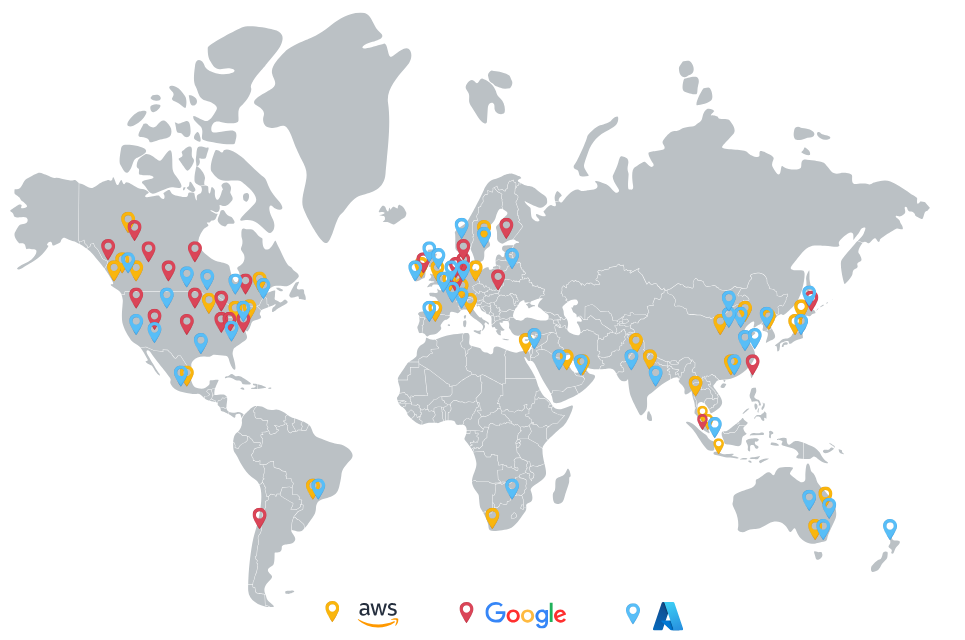
*Приблизительное расположение глобально распределенных дата-центров, управляемых AWS, Azure и Google*

---
### **Типы мониторинга**

Рассмотрим пример, чтобы понять типы ошибок, которые мы хотим отслеживать. В Educative, когда учащийся подключается к исполняемой среде, ему выделяется контейнер. Представим, что сервис 1 на сервере A отвечает за выделение контейнера при подключении учащегося. Другой сервис, 2 на сервере B, принимает эту информацию и сообщает сервису, отвечающему за UI. Сервис UI, работающий на сервере C, обновляет интерфейс для учащегося. Предположим, что сервис 2 выходит из строя из-за какой-то ошибки, и учащийся видит ошибку «Не удается подключиться…».

Как разработчики Educative узнают, что учащийся столкнулся с этой ошибкой?

1) Ученик инициирует запрос на подключение к Educative  
   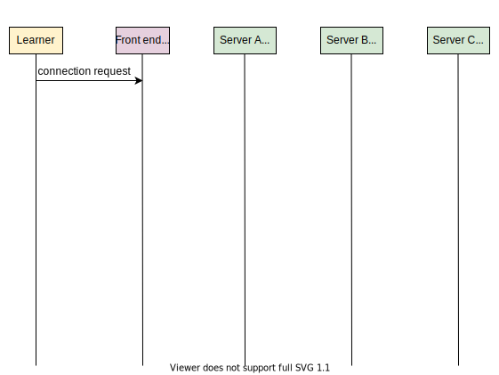

2) Фронтенд-сервер Educative инициирует запрос на выделение контейнера  
   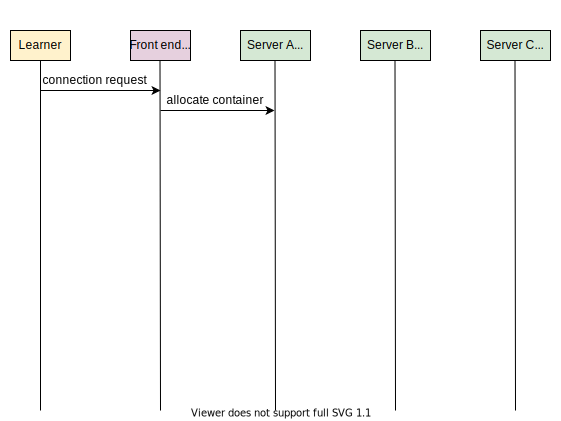

3) Служба 2 на сервере B выделяет контейнер и уведомляет службу 1 на сервере A  
   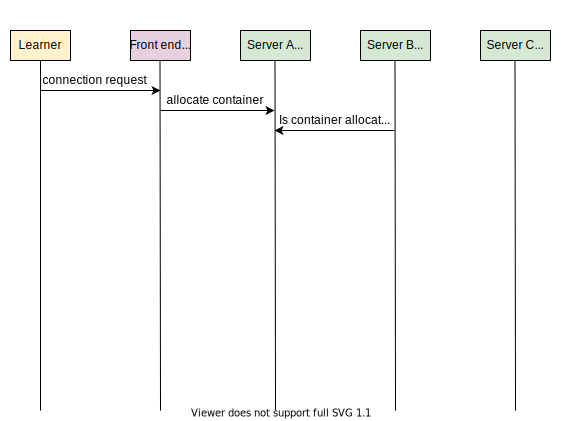

4) Служба 1 на сервере A подтверждает выделение  
   

5) Служба 3 на сервере C получает запрос на обновление пользовательского интерфейса для ученика  
   

6) Служба 3 на сервере C обновляет пользовательский интерфейс для ученика  
   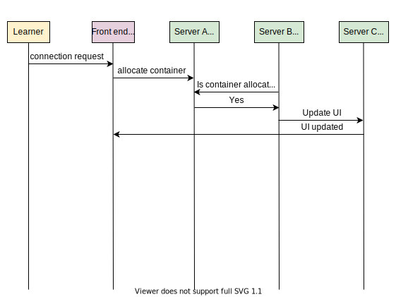

7) Подключение для ученика установлено  
   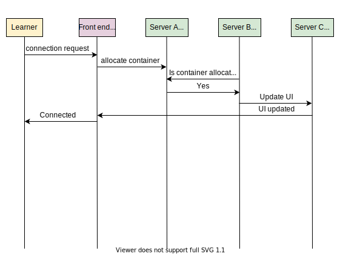

8) Ученик снова инициирует запрос на подключение к Educative  
   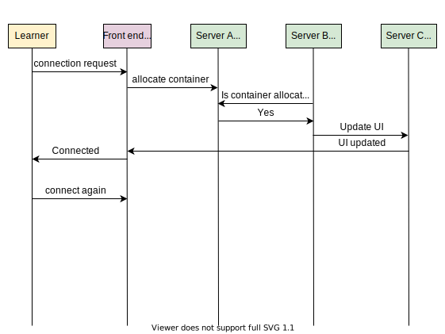

9) Фронтенд-сервер Educative инициирует запрос на выделение контейнера  
   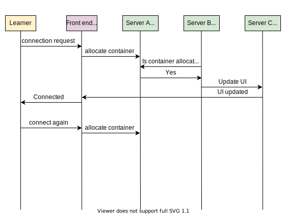

10) Сервер B выходит из строя по какой-то причине  
    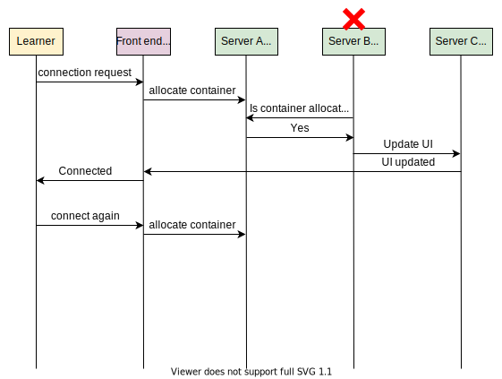

11) Фронтенд-сервер ожидает обновления пользовательского интерфейса для ученика  
    

12) Запрос истекает по времени  
    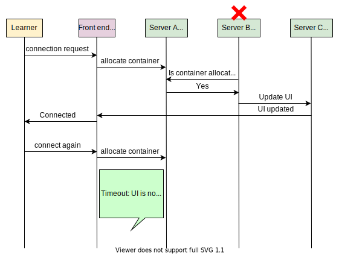

13) Подключение для ученика не удалось установить  
    

14) Как разработчики узнают об ошибке неудачного подключения?  
    

> *Учащийся пытается подключиться... Сервис выделения контейнеров падает... Запрос на обновление UI не доходит... Учащийся получает ошибку.*

А что, если запрос учащегося никогда не доходит до серверов Educative? Как Educative узнает, что у учащегося возникла проблема?

Исходя из приведенных выше примеров, мы можем разделить наш мониторинг на две большие категории ошибок:

*   **Ошибки на стороне сервера**: Это ошибки, которые обычно видны службам мониторинга, поскольку они происходят на серверах. Такие ошибки сообщаются в кодах ответа HTTP как ошибки 5xx.
*   **Ошибки на стороне клиента**: Это ошибки, первопричина которых находится на стороне клиента. Такие ошибки сообщаются в кодах ответа HTTP как ошибки 4xx. Некоторые ошибки на стороне клиента невидимы для сервиса, когда запросы клиента не могут до него дойти.

В следующих главах «Мониторинг ошибок на стороне сервера» и «Мониторинг ошибок на стороне клиента» мы рассмотрим, как спроектировать службу мониторинга для обработки обоих сценариев. Мы хотим, чтобы наши системы мониторинга анализировали наши глобально распределенные сервисы. Это позволяет лучше понимать компоненты системы и оперативно обнаруживать неисправности и реагировать на них.
