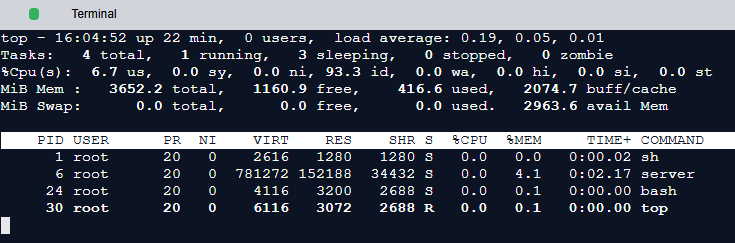
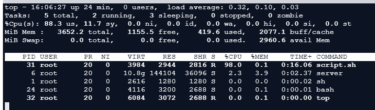

# **Предварительные требования к системе мониторинга**

Узнайте о метриках и оповещениях в системе мониторинга.

## **Мониторинг: метрики и оповещения**

Хорошая система мониторинга должна четко определять, что измерять и в каких единицах (метрики). Система мониторинга также должна определять
пороговые значения для всех метрик и иметь возможность информировать соответствующих заинтересованных лиц (оповещения) при выходе значений
за пределы допустимых диапазонов. Знание состояния нашей инфраструктуры и систем обеспечивает стабильность сервиса. Команда поддержки может
реагировать на проблемы быстрее и увереннее, если у нее есть доступ к информации о состоянии и производительности развернутых систем.
Системы мониторинга, которые собирают измерения, отображают данные и отправляют предупреждения, когда что-то кажется не так, очень полезны
для команды поддержки.

Чтобы глубже понять метрики, оповещения и их связь с мониторингом, мы рассмотрим их значимость, потенциальные преимущества и данные, которые
мы хотели бы отслеживать.

>
> **Каковы традиционные подходы к обработке сбоев в IT-инфраструктуре?**
>
> 

>  
<b>Показать ответ</b>

> Существует два традиционных подхода к устранению сбоев в ИТ-инфраструктуре - реактивный и проактивный.
>
> При реактивном подходе корректирующие действия принимаются после возникновения сбоя. При таком подходе, даже если DevOps быстро находит
> причину ошибки и оперативно устраняет сбои, это приводит к простоям. В результате при реактивном подходе произойдет простойсистемы, что, как
> правило, нежелательно для непрерывно работающих приложений.
>
> При проактивном подходе упреждающие действия предпринимаются до того, как произойдет сбой. Таким образом, предотвращаются простои и
> связанные с ними потери. Проактивный подход позволяет прогнозировать системные сбои для принятия корректирующих мер во избежание сбоя. Этот
> подход повышает надежность за счет предотвращения простоев.
>
> В современных сервисах невозможно полностью избежать проблем. В огромных центрах обработки данных и при развертывании сетей постоянно
> что-то выходит из строя. Цель состоит в том, чтобы выявить возможные проблемы на ранней стадии и спроектировать системы таким образом, чтобы
> сбои в обслуживании были незаметны конечным пользователям.
>
> 

---

## **Метрики**

**Метрики** объективно определяют, что мы должны измерять и какие единицы будут подходящими. Значения метрик дают представление о состоянии
системы в любой момент времени. Например, способность веб-сервера обрабатывать определенный объем трафика в секунду или его способность
присоединиться к пулу веб-серверов — это примеры высокоуровневых данных, связанных с конкретной целью или деятельностью компонента. Другой
пример — измерение производительности сети с точки зрения пропускной способности (мегабиты в секунду) и задержки (время приема-передачи).
Нам необходимо собирать значения метрик с минимальными потерями производительности. Для измерения этих потерь мы можем использовать
воспринимаемую пользователем задержку или объем используемых вычислительных ресурсов.

Значения, отслеживающие, сколько физических ресурсов использует наша операционная система, могут стать хорошей отправной точкой. Если у нас
есть система мониторинга, нам не придется прилагать много дополнительных усилий для получения данных о загрузке процессора, статистике ЦП,
такой как попадания и промахи в кэш, использовании ОЗУ операционной системой и процессами, сбоях страниц, дисковом пространстве, задержках
чтения и записи на диск, использовании пространства подкачки и так далее. Метрики, предоставляемые многими веб-серверами, серверами баз
данных и другим программным обеспечением, помогают нам определить, все ли работает гладко.

Мы используем команду `top` для просмотра процессов Linux. Запуск этой команды открывает интерактивное представление работающей системы,
содержащее сводку о системе и список процессов или потоков. В представлении по умолчанию есть следующее:

* Вверху мы видим, как долго машина включена, сколько пользователей вошло в систему и среднюю нагрузку на машину за последние несколько
  минут.
* В следующей строке мы видим состояние (`running`, `sleeping` или `stopped`) задач, выполняющихся на машине.
* Далее у нас есть значения потребления ЦП.
* Наконец, у нас есть обзор физической памяти: сколько из нее свободно, используется, буферизировано или доступно.

Теперь выполним следующие шаги, чтобы увидеть изменение в использовании ЦП:

1. Выйдите, введя `q` в терминале.
2. Запустите `nohup ./script.sh &>/dev/null &`. Этот скрипт содержит бесконечный цикл и его запуск выполнит скрипт в фоновом режиме.
3. Запустите команду `top`, чтобы наблюдать увеличение использования ЦП.

### **Сбор метрик**

Метрики должны быть логически централизованы для целей глобального мониторинга и оповещения. Получение метрик имеет решающее значение для
системы мониторинга. Метрики могут либо передаваться (push), либо запрашиваться (pull) системой мониторинга, в зависимости от предпочтений
пользователя.

Здесь мы сталкиваемся с фундаментальной дилеммой проектирования: использовать push или pull? Должен ли сервер проактивно отправлять значения
метрик или он должен только предоставлять конечную точку и реактивно ждать запроса?

При стратегии **pull** (запроса) каждый отслеживаемый сервер должен лишь хранить метрики в памяти и предоставлять их через открытую конечную
точку. Эта конечная точка позволяет приложению мониторинга самостоятельно запрашивать метрики. Серверы, отправляющие слишком много данных
или отправляющие данные слишком часто, не могут перегрузить систему мониторинга. Система мониторинга будет запрашивать данные по
собственному расписанию.

В других ситуациях, однако, может быть предпочтительнее **push** (передача), например, когда межсетевой экран не позволяет системе
мониторинга напрямую обращаться к серверу. Система мониторинга имеет возможность настраивать глобальную конфигурацию о собираемых данных и
интервале, с которым серверы и коммутаторы должны передавать данные.

Терминология push и pull может сбивать с толку. Всякий раз, когда мы обсуждаем стратегию push или pull, мы будем рассматривать ее с точки
зрения системы мониторинга. То есть, либо система будет запрашивать (pull) значения метрик из приложений, либо метрики будут передаваться (
push) в систему мониторинга. Чтобы избежать путаницы, мы будем придерживаться точки зрения системы мониторинга.

> **Примечание:** В модели **pull** система мониторинга запрашивает у распределенных сборщиков данных данные, которые они собрали локально.
> Это означает, что поток данных происходит только по запросу системы мониторинга. С другой стороны, в модели **push** распределенные сборщики
> периодически отправляют собранные данные в систему мониторинга.

> **На заметку**
>
> **1. Логирование — это ведение записей о событиях в программной системе. Как это помогает в мониторинге?**
>
> 

>  
<b>Показать ответ</b>

>  При ведении логов серверы приложений заносят информацию в файл. Эта информация может включать использование процессора, информацию, связанную с приложением, и другие важные свойства, которые мы считаем необходимыми для отслеживания или отладки файла при возникновении проблемы. Мы можем заполнить наши показатели на основе значений, занесенных в логи.
>
>  И логи, и показатели помогают в мониторинге сервиса. Но это не всегда так, поскольку обработка информации логов требует времени. В
> режиме реального времени нам необходимо действовать быстро для раннего обнаружения проблем. Таким образом, ведение логов также является
> одним из входных данных для показателей. Ведение логов - это всего лишь механизм сбора информации, и система мониторинга может
> использовать его для сбора необходимой информации.
>
>  Ведение логов также может помочь временно сохранить данные на сервере, чтобы сгладить любые кратковременные всплески данных или
> разделить системы генерации данных и мониторинга.
> 

> **Примечание:** Иногда мы используем слово «метрики», когда следовало бы говорить «значения метрик». Однако из контекста можно понять, о
> чем идет речь.

### **Хранение данных**

Важно определить, как хранить метрики с отслеживаемых серверов. Централизованного репозитория метрик в памяти может быть достаточно. Однако
для большого дата-центра с миллионами объектов для мониторинга потребуется хранить огромный объем данных, и в этом может помочь база данных
временных рядов.

**Базы данных временных рядов** помогают обеспечить долговечность хранения, что является важным фактором. Без исторического представления
событий система мониторинга не очень полезна. Выборки, имеющие временную метку, хранятся в хронологической последовательности. Таким
образом, вся временная шкала метрики может быть показана в виде временного ряда.

### **Метрики приложений**

Нам может потребоваться добавить код или API для получения метрик приложений, которые нас интересуют, для других компонентов, особенно для
наших собственных приложений. Мы встраиваем код для логирования или мониторинга в наши приложения, что называется **инструментированием кода
**, для сбора интересующей информации.

Анализ метрик в целом может пролить свет на то, как работают наши системы и насколько они здоровы. Системы мониторинга используют эти данные
для создания всеобъемлющего представления о нашей среде, автоматизации реакции на изменения, такие как запуск дополнительных инстансов EC2
при увеличении трафика приложений, и предупреждения людей при необходимости. Эти системные метрики — это измерения системы, которые
позволяют анализировать исторические тенденции, корреляции и изменения в производительности, потреблении ресурсов или частоте ошибок.

---

## **Оповещения**

**Оповещение** — это часть системы мониторинга, которая реагирует на изменения значений метрик и предпринимает действия. Определение
оповещения состоит из двух компонентов: условия или порога на основе метрик и действия, которое необходимо предпринять, когда значения
выходят за пределы допустимого диапазона.

