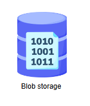
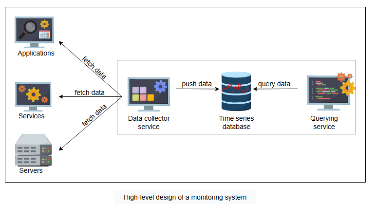

# **Проектирование системы мониторинга**

Узнайте о начальном проектировании универсальной системы мониторинга.

## **Требования**

Давайте подытожим, что мы хотим от нашей системы мониторинга:

*   Мониторинг критически важных локальных процессов на сервере на предмет сбоев.
*   Мониторинг любых аномалий в использовании процессора/памяти/диска/сетевой пропускной способности процессом на сервере.
*   Мониторинг общего состояния сервера, такого как ЦП, память, диск, пропускная способность сети, средняя нагрузка и т. д.
*   Мониторинг сбоев аппаратных компонентов на сервере, таких как сбои памяти, выходящие из строя или замедляющиеся диски и т. д.
*   Мониторинг способности сервера достигать критически важных сервисов за его пределами, таких как сетевые файловые системы и т.д.
*   Мониторинг всех сетевых коммутаторов, балансировщиков нагрузки и любого другого специализированного оборудования внутри дата-центра.
*   Мониторинг энергопотребления на уровне сервера, стойки и дата-центра.
*   Мониторинг любых событий, связанных с электропитанием на серверах, в стойках и в дата-центре.
*   Мониторинг информации о маршрутизации и DNS для внешних клиентов.
*   Мониторинг задержек на сетевых каналах и путях внутри и между дата-центрами.
*   Мониторинг состояния сети в точках пиринга.
*   Мониторинг общего состояния сервиса, который может охватывать несколько дата-центров, например, CDN и его производительность.

Мы хотим автоматизированный мониторинг, который выявляет аномалии в системе и информирует менеджера по оповещениям или показывает прогресс на панели мониторинга. Провайдеры облачных услуг предоставляют информацию о состоянии своих сервисов:

*   AWS: [https://health.aws.amazon.com/health/status](https://health.aws.amazon.com/health/status)
*   Azure: [https://status.azure.com/en-us/status](https://status.azure.com/en-us/status)
*   Google: [https://status.cloud.google.com/](https://status.cloud.google.com/)

> **[i]** В распределенной системе, почему необходимо специальное решение для мониторинга, а не простое использование логов отдельных серверов?
>
> 

>  
<b>Показать ответ</b>

>    В распределенной системе необходимо специальное решение для мониторинга, поскольку оно обеспечивает централизованную видимость всей системы, упрощая обнаружение проблем. Оно также помогает выявлять взаимосвязи и закономерности, которые могут быть пропущены в журналах отдельных серверов, и обеспечивает проактивные оповещения для более быстрого устранения неполадок. Эти преимущества гарантируют надежность и эффективность системы
>  

---

## **Строительные блоки, которые мы будем использовать**

Проектирование распределенного мониторинга будет состоять из следующего строительного блока:

*   **Блоб-хранилище (Blob storage)**: Мы будем использовать блоб-хранилище для хранения информации о наших метриках.

---

## **Высокоуровневая архитектура**

Высокоуровневые компоненты нашего сервиса мониторинга следующие:

*   **Хранилище**: База данных временных рядов хранит данные метрик, такие как текущее использование ЦП или количество исключений в приложении.
*   **Сервис сбора данных**: Он извлекает соответствующие данные из каждого сервиса и сохраняет их в хранилище.
*   **Сервис запросов**: Это API, который может выполнять запросы к базе данных временных рядов и возвращать соответствующую информацию.

*Высокоуровневая архитектура системы мониторинга*

Давайте углубимся в детали упомянутых выше компонентов в следующем уроке.
