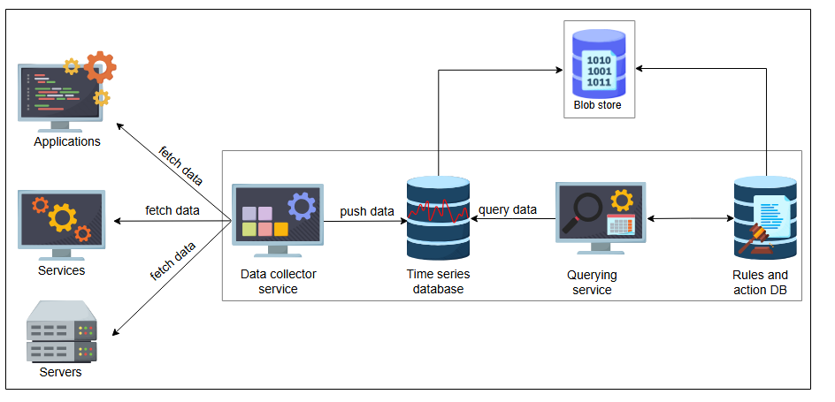
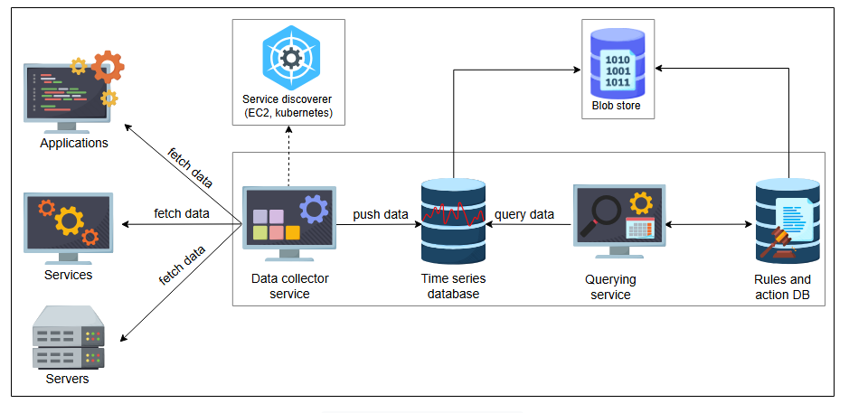
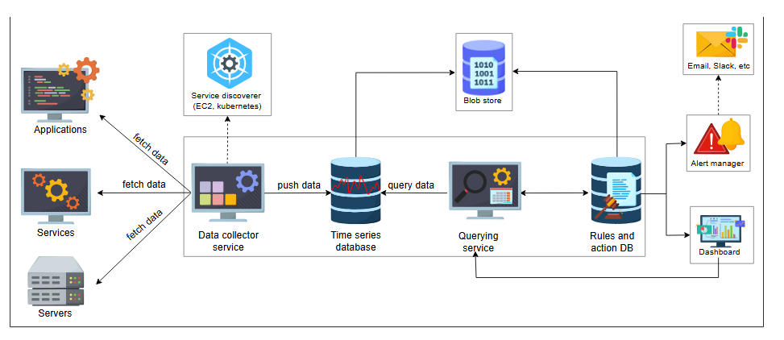
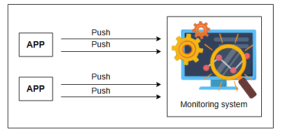
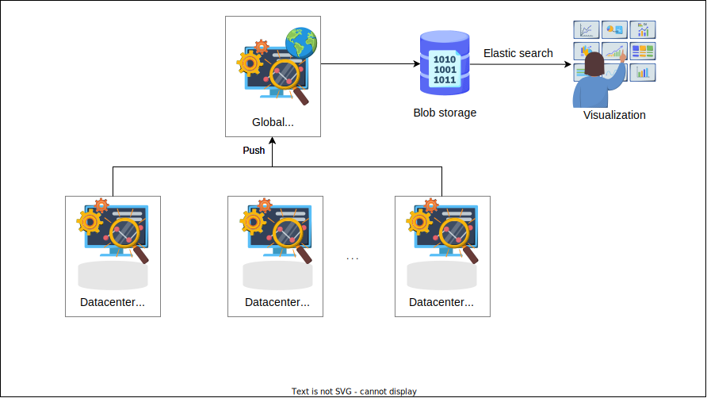
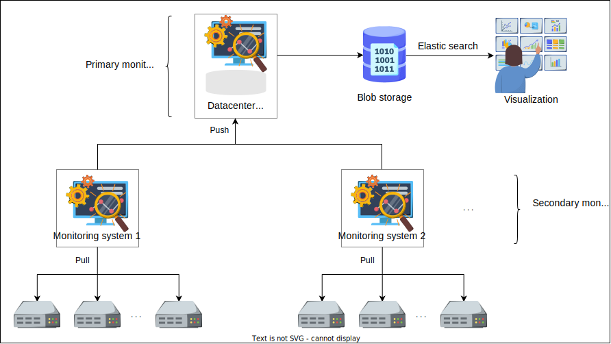

# **Детальное проектирование системы мониторинга**

Узнайте детали проектирования системы мониторинга и поймите ее преимущества и недостатки.

---

Мы обсудим основные компоненты нашей системы мониторинга, выявим недостатки нашего проекта и улучшим его, чтобы он соответствовал нашим требованиям.

## **Хранилище**

Мы будем использовать базы данных временных рядов для сохранения данных локально на сервере, где работает наш сервис мониторинга. Затем мы интегрируем его с отдельным узлом хранения. Мы будем использовать blob-хранилище для хранения наших метрик.

Нам нужно хранить метрики и знать, какие действия выполнять, если метрика достигла определенного значения. Например, если использование ЦП превышает 90%, мы генерируем оповещение конечному пользователю, чтобы получатель оповещения мог предпринять необходимые шаги, например, выделить больше ресурсов для масштабирования. Для этой цели нам нужно еще одно хранилище, которое будет содержать правила и действия. Назовем его **базой данных правил**. При любом нарушении правил мы можем предпринять соответствующие действия.

Здесь мы определили еще два компонента в нашем проекте — базу данных правил и действий и узел хранения (blob-хранилище).

*Добавление blob-хранилища и базы данных правил и действий*

## **Collector данных**

Нам нужна система мониторинга, чтобы получать обновления о наших нескольких дата-центрах. Мы можем оставаться в курсе, если информация о наших процессах доходит до нас, что возможно благодаря логированию. Мы выберем стратегию **pull** (запроса). Затем мы будем извлекать наши релевантные метрики из логов приложения. Как обсуждалось в нашем проекте логирования, мы использовали распределенную очередь сообщений. Сообщение в очереди содержит имя сервиса, ID и краткое описание лога. Это поможет нам идентифицировать метрику и ее информацию для конкретного сервиса. Предоставление релевантных метрик сборщику данных необходимо для мониторинга любого сервиса, чтобы наш сборщик данных мог получать метрики от сервиса и сохранять их в базе данных временных рядов.

Реальным примером системы мониторинга, основанной на подходе с запросами (pull-based), является DigitalOcean. Она отслеживает миллионы машин, разбросанных по всему миру.

> **На заметку**
>
> **1. Каковы некоторые недостатки использования подхода с передачей (push-based)?**
>
> 

>  
<b>Показать ответ</b>

>    Инструмент мониторинга на основе push собирает данные о показателях из приложений и серверов и отправляет их на центральную платформу сбора данных. Каждый микросервис отправляет свои показатели в систему мониторинга, что приводит к высокой нагрузке на инфраструктуру. Таким образом, мониторинг может стать узким местом для бизнес-операций. Мониторинг может осуществляться практически в режиме реального времени. Однако, если не принять надлежащих мер, это может привести к перегрузке инфраструктуры постоянными push-запросами от всех служб, что приведет к переполнению сети. Мы также должны установить демонов для каждой из этих целей, чтобы отправлять показатели на сервер мониторинга, что требует дополнительной работы.
> 

### **Обнаружитель сервисов**

Сборщик данных отвечает за получение метрик от сервисов, которые он отслеживает. Таким образом, системе мониторинга не нужно отслеживать сервисы. Вместо этого она может находить их с помощью службы обнаружения. Мы будем сохранять относительную информацию о сервисах, которые нам нужно отслеживать. Мы будем использовать решение для обнаружения сервисов и интегрироваться с несколькими платформами и инструментами, включая EC2, Kubernetes и Consul. Это позволит нам обнаруживать, какие сервисы мы должны отслеживать. Подобное динамическое обнаружение можно использовать и для нового вводимого в эксплуатацию оборудования.

Давайте добавим наш вновь определенный компонент в существующий проект.

*Добавление обнаружителя сервисов*

## **Сервис запросов**

Нам нужен сервис для доступа к базе данных и получения результатов соответствующих запросов. Это необходимо, потому что мы хотим просматривать ошибки, такие как значения использования памяти определенным узлом, или отправлять оповещение, если метрика превышает установленный лимит. Давайте добавим два компонента, которые нам нужны для выполнения запросов.

### **Менеджер оповещений**

Менеджер оповещений отвечает за отправку оповещений при нарушении установленных правил. Он может отправлять оповещения по электронной почте, в Slack и т.д.

### **Панель мониторинга (Dashboard)**

Мы можем настроить панели мониторинга, используя собранные метрики для отображения необходимой информации — например, количества запросов за текущую неделю.

Давайте добавим обсужденные выше компоненты, что завершит наш проект системы мониторинга.

*Детальное проектирование системы мониторинга*

Наша комплексная система мониторинга работает для активного отслеживания систем и сервисов. Она собирает и хранит данные, а также поддерживает поиск, графики и оповещения.

## **Преимущества**

*   Проект нашей системы мониторинга обеспечивает бесперебойную работу и отслеживает признаки надвигающихся проблем.
*   Наш проект позволяет избежать перегрузки сетевого трафика, самостоятельно запрашивая данные.
*   Сервис мониторинга обеспечивает более высокую доступность.

## **Недостатки**

*   Система кажется масштабируемой, но управление большим количеством серверов для мониторинга может стать проблемой. Например, у нас есть выделенный сервер, отвечающий за работу службы мониторинга. Он может стать единой точкой отказа (SPOF). Чтобы решить проблему SPOF, мы можем иметь резервный сервер для нашей системы мониторинга. Затем нам также нужно будет поддерживать согласованность между основным и резервным серверами. Однако такой проект также столкнется с пределом масштабируемости по мере дальнейшего увеличения количества серверов.
*   Мониторинг собирает огромное количество данных круглосуточно, и хранить их вечно может быть нецелесообразно. Нам нужна политика и механизмы для периодического удаления ненужных данных для эффективного использования ресурсов.

Давайте подумаем, как преодолеть проблемы с нашей службой мониторинга.

## **Улучшение нашего проекта**

Мы хотим улучшить наш проект, чтобы система лучше масштабировалась и решала, какие данные хранить, а какие удалять. Давайте посмотрим, как работает подход на основе **push** (передачи). В подходе на основе push приложение передает свои данные в систему мониторинга.

*Система мониторинга на основе push-подхода*

Мы использовали стратегию на основе **pull** (запроса), чтобы избежать перегрузки сети. Это также позволяет приложениям не беспокоиться о том, что им нужно отправлять соответствующие данные мониторинга в систему. Вместо этого система мониторинга сама запрашивает данные. Для удовлетворения потребностей в масштабировании нам также необходимо применить подход на основе push. Мы будем использовать гибридный подход, сочетая нашу pull-стратегию с push-стратегией.

Мы продолжим использовать pull-стратегию для нескольких серверов в пределах одного дата-центра. Мы также назначим несколько серверов мониторинга для сотен или тысяч серверов в дата-центре — скажем, один сервер мониторинга на 5000 серверов. Назовем их **вторичными серверами мониторинга**.

Теперь мы применим push-стратегию. Вторичные системы мониторинга будут передавать свои данные на сервер основного дата-центра. Сервер основного дата-центра будет передавать свои данные в глобальную службу мониторинга, отвечающую за проверку всех дата-центров, разбросанных по всему миру.

Мы будем использовать blob-хранилище для хранения избыточных данных, применять эластичный поиск и просматривать соответствующую статистику с помощью визуализатора. По мере увеличения количества наших серверов или дата-центров мы будем добавлять больше систем мониторинга. Проект этого приведен ниже.

> **Примечание**: Использование иерархии систем для масштабирования — это распространенный шаблон проектирования систем. Увеличивая количество узлов на уровне или вводя дополнительные уровни в иерархии, мы получаем возможность масштабироваться в соответствии с нашими текущими потребностями.

1) Системы мониторинга центров обработки данных передают данные в глобальную систему мониторинга
   

2) Системы мониторинга центров обработки данных передают данные в глобальную систему мониторинга
   

> **1. Что произойдет, если локальная или глобальная система мониторинга выйдет из строя?**
>
> 

>  
<b>Показать ответ</b>

> Мы можем хранить данные локально и ждать, пока система снова заработает. Но существует ограничение на локальное хранение данных. Поэтому мы либо удаляем предыдущие данные, либо не храним новые. Для принятия решения необходимо создать соответствующие политики.
> 

Людям необходимо обрабатывать огромные объемы данных, и даже после различных видов их обобщения данных может быть все еще очень много. Далее мы рассмотрим, как представлять огромные объемы данных администраторам-людям.

