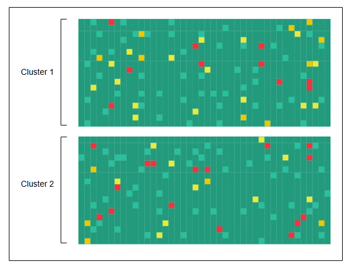

# Визуализация данных в системе мониторинга
Узнайте о новом способе визуализации огромного количества данных мониторинга.

---

В крупных центрах обработки данных миллионы серверов, и визуализировать данные о состоянии каждого из них — непростая задача. Важный аспект мониторинга парка серверов — знать, какие из них активны, а какие отключены. В современном дата-центре могут размещаться тысячи серверов в одном здании. Мы можем использовать тепловую карту, чтобы компактно отображать информацию о тысячах серверов в дата-центре.

**Тепловая карта** — это техника визуализации данных, которая с помощью цветов показывает интенсивность явления в двух измерениях.

## Использование тепловых карт для устранения неполадок
Мы будем определять, не работает ли сервер, с помощью тепловых карт. Каждая стойка серверов имеет своё имя и отсортирована по дата-центру, затем по кластеру и ряду, поэтому проблемы, общие для любого из этих уровней, сразу становятся очевидны.

Тепловая карта, отображающая рабочее состояние большого числа компонентов, является эффективным методом. Состояние каждого компонента обозначается цветом ячейки в большой матрице. Узлы с зелёными ячейками работают в допустимых пределах, в то время как узлы с красными ячейками не отвечают на многократные попытки связи.

Ниже представлена тепловая карта, отображающая состояние серверов.

*Просмотр серверов в дата-центре с помощью тепловых карт*

Мы можем использовать тепловые карты для глобально распределённых систем и постоянно обмениваться информацией о состоянии сервера. Можно использовать один бит (единица — работает, ноль — не работает). Для 1 000 000 серверов это составит 125 КБ данных. По красному цвету мы можем быстро определить, какой сервер вышел из строя, и сосредоточиться на проблемных участках.

Можно создавать аналогичные тепловые карты, чтобы получить общее представление о любом ресурсе, например, о файловых системах, сетевых коммутаторах, каналах связи и так далее.

## Итог
*   Системы мониторинга критически важны в распределённых системах, поскольку они помогают анализировать систему и оповещать заинтересованные стороны о возникновении проблем.
*   Мы можем сделать систему мониторинга масштабируемой, используя гибрид методов push и pull.
*   Тепловые карты — это мощный инструмент визуализации, который помогает нам компактно отображать информацию о состоянии тысяч серверов.