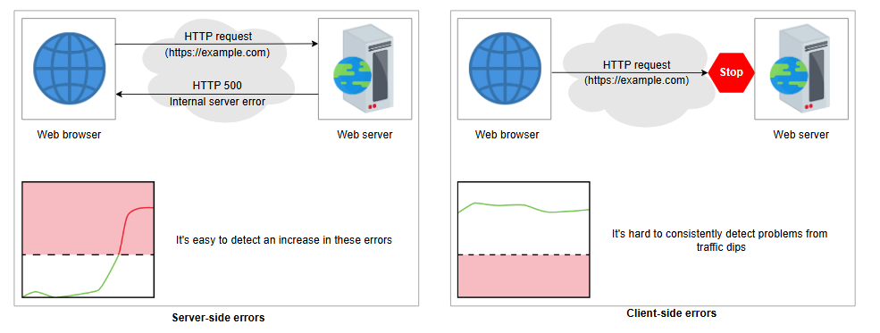
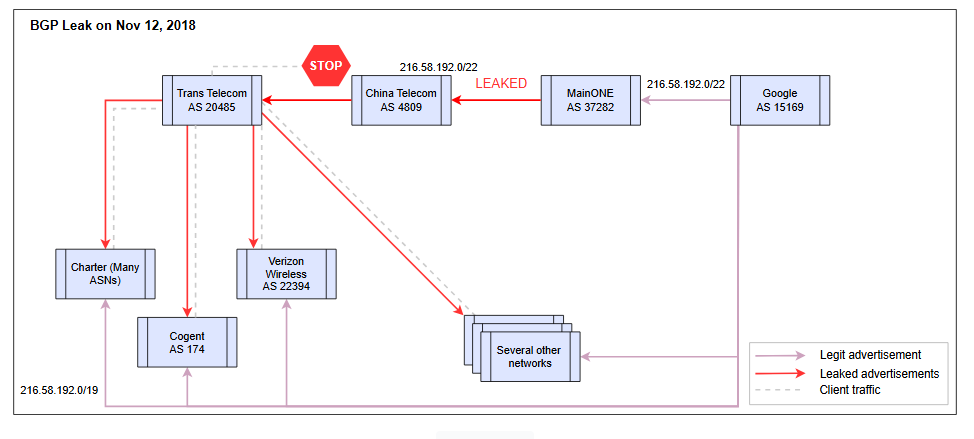

# Фокус на ошибках на стороне клиента в системе мониторинга
Узнайте, что такое ошибки на стороне клиента и как они влияют на сервис.

---

## Ошибки на стороне клиента
В распределенной системе клиенты часто обращаются к сервису через HTTP-запрос. Мы можем отслеживать логи наших веб- и прикладных серверов, если запрос не удается обработать. Если несколько запросов завершаются неудачей, мы можем наблюдать всплеск внутренних ошибок (ошибка 500).

На ошибки, первопричина которых находится на стороне клиента, трудно реагировать, поскольку сервис практически не имеет информации о системе клиента. Мы можем попытаться отследить падение нагрузки по сравнению со средними значениями, но такой график обычно сложно анализировать. Он может давать ложноположительные и ложноотрицательные результаты из-за таких факторов, как неожиданно переменная нагрузка или затронутость лишь небольшой части клиентской аудитории.

Существует множество факторов, которые могут вызывать сбои, в результате которых клиенты не могут связаться с сервером. К ним относятся:

*   Сбой в разрешении DNS-имен.
*   Любой сбой маршрутизации на пути от клиента к поставщику услуг.
*   Любые сбои в сторонней инфраструктуре, такой как промежуточные устройства (middleboxes) и сети доставки контента (CDN).

*Ошибки на стороне сервера в сравнении с ошибками на стороне клиента*

## Сбои из-за ошибки маршрутизации
Давайте рассмотрим реальный пример ошибки, которая затронула большое количество клиентов сервиса, но сервис не сразу узнал о ней.

Один из пиринговых интернет-провайдеров Google случайно анонсировал интернет-маршруты, которые он не должен был анонсировать. В результате трафик многих клиентов Google начал маршрутизироваться через непредназначенных провайдеров и не достигал Google из-за утечки BGP; один из примеров утечки BGP показан на иллюстрации ниже. Клиенты были разочарованы, потому что не могли связаться с Google, в то время как Google мог не знать о таких проблемах сразу, поскольку эти проблемы возникли не на его инфраструктуре.

> Подробнее об этом событии можно узнать по интерактивной ссылке в оригинальном материале.
> 

>  
<b>Показать</b>

> Протокол пограничного шлюза (BGP) - это протокол маршрутизации, который соединяет весь Интернет. Маршрутизация в локальной сети проста, поскольку все устройства подключены к одной компьютерной сети. Однако это усложняется по мере роста сети, а Интернет состоит из миллионов сетей по всему миру. Крупные организации и интернет-провайдеры сами управляют подключением к Интернету для множества сетевых узлов и местоположений. Это называется автономной системой (AS).
>
> AS обрабатывает сетевой трафик внутри себя, а маршрутизатор BGP управляет входящим и исходящим трафиком. Каждый маршрутизатор BGP содержит таблицы маршрутизации. Это позволяет BGP находить наилучший путь через Интернет для отправки пакета по назначению. Но может произойти утечка маршрута. Утечка маршрута происходит, когда автономная система распространяет некоторые сообщения о маршрутизации за пределы их предполагаемого объема.
>
> 12 ноября 2018 года произошла утечка BGP, которая повлияла на клиентов по всему миру, включая Google, Meta и Amazon. Служба объявила маршрут 216.58.192.0/19 для некоторых автономных систем и более конкретный маршрут (216.58.192.0/22) для одной автономной системы, которая не должна была объявлять его в дальнейшем. При переадресации IP-адреса в качестве совпадающего выбирается самый длинный префикс. В примере префикс /22 будет длиннее, чем префикс /19. Из-за ошибок конфигурации более конкретный маршрут просочился в Интернет, а также из-за того, что он настолько специфичен, весь трафик проходил через неправильную автономную систему, что привело к потере трафика.
> 

*Утечка BGP*

Вышеописанная утечка не уникальна. Подобные проблемы продолжают возникать. Еще одна такая утечка произошла 16 апреля 2021 года, когда одна из автономных систем (AS) по ошибке анонсировала более 30 000 префиксов BGP. Это привело к 13-кратному всплеску входящего трафика в их сеть. Однако увеличение притока было замечено, и проблема была решена.

Системы мониторинга затронутых сервисов могут не сразу обнаружить вышеупомянутые события. Мониторинг таких ситуаций имеет решающее значение для того, чтобы приложение оставалось доступным для всех своих клиентов. Поэтому в следующих уроках мы рассмотрим методы, которые помогут нам отслеживать подобные ситуации.