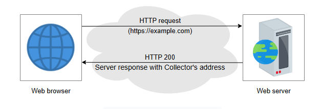

D# Проектирование системы мониторинга на стороне клиента
Узнайте, как спроектировать систему для мониторинга ошибок, которые не доходят до нашего сервиса.

---
Сервис не имеет представления об ошибках, которые происходят не в его инфраструктуре. Тем не менее, такие сбои не менее неприятны для
клиентов, и им приходится спрашивать у друзей: "У вас тоже сервис X не работает?" или заходить на сайты вроде Downdetector, чтобы проверить,
сообщают ли другие о тех же проблемах. Они могут сообщить о проблеме через Твиттер или другой канал связи. Однако во всех этих случаях
обратная связь медленная. Как поставщик услуг, мы хотим обнаруживать такие проблемы как можно быстрее, чтобы принять меры по их устранению.
Давайте спроектируем такую систему.

## Первоначальный дизайн

Чтобы убедиться, что запросы клиента доходят до сервера, мы будем действовать как клиенты и выполнять проверки доступности и
работоспособности. Нам понадобятся различные точки наблюдения по всему миру. Мы можем запустить сервис, назовем его **зонд (prober)**,
который периодически отправляет запросы к нашему основному сервису для проверки доступности. Таким образом, мы сможем отслеживать
доступность нашего сервиса из множества разных мест.

*Зонд (prober) проверяет доступность веб-сайта*

### Проблемы с зондами

С использованием зондов могут возникнуть следующие проблемы:

* **Неполное покрытие**: У нас может не быть достаточного покрытия по всем автономным системам. По состоянию на март 2021 года в интернете
  насчитывается 100 000 уникальных автономных систем. Размещение такого количества зондов по всему миру нерентабельно и даже невозможно.
  Дополнительными препятствиями являются специфические для стран или интернет-провайдеров нормативные требования и необходимость
  периодического обслуживания.
* **Отсутствие имитации пользователя**: Такие зонды могут не отражать типичное поведение пользователя и не объяснять, как обычный
  пользователь будет использовать сервис.

> **Примечание:** Первоначальный дизайн основан на активном зондировании.

## Улучшение дизайна

Вместо использования зондов в точках наблюдения мы можем встроить их непосредственно в клиентское приложение. У нас будут два следующих
компонента:

* **Агент**: Это зонд, встроенный в клиентское приложение, который отправляет соответствующие отчеты о сбоях.
* **Сборщик (Collector)**: Это сборщик отчетов, независимый от основного сервиса. Он сделан независимым, чтобы избежать ситуаций, когда
  клиентские агенты пытаются сообщить об ошибке неработающему сервису. Мы обобщаем отчеты об ошибках от сборщиков и ищем всплески на графике
  ошибок, чтобы выявить проблемы на стороне клиента.

Следующая иллюстрация показывает, как агент связывается с независимым сборщиком, когда основной сервис недоступен:

*Анализ отчета агента для выявления всплеска ошибок*

Эти сборщики представляют собой иерархию систем обработки больших данных. Мы можем разместить их рядом с клиентской сетью и со временем
накапливать эту статистику со всех таких локализованных сайтов. Мы будем использовать системы потоковой обработки данных в реальном времени,
чтобы сделать такую систему близкой к реальному времени. Если мы в основном ищем сводную статистику, наша система может допустить потерю
некоторых отчетов об ошибках. Некоторые отчеты будут относительными к общей численности пользователей. Например, мы можем сказать, что 1%
пользователей сервиса испытывают проблемы. Если мы не хотим терять отчеты, нам нужно будет спроектировать систему более тщательно, что будет
дороже.

Теперь решим следующие вопросы:

* Может ли пользователь активировать и деактивировать отчеты на стороне клиента?
* Как агенты на стороне клиента достигают сборщиков в условиях сбоя?
* Как мы будем защищать конфиденциальность пользователя?

## Активация и деактивация отчетов

Мы будем использовать специальный HTTP-заголовок для отправки соответствующей информации сборщикам. Хотя клиент получает доступ к сервису
через браузер, конкретный браузер должен знать об этой функции, чтобы соответствующим образом заполнять информацию в заголовках
HTTP-запросов. Для организаций, которые создают браузеры и предоставляют услуги (например, браузеры на базе Chromium), такие функции могут
быть встроены и стандартизированы со временем.

Другим решением может быть использование клиентского приложения, которое контролируется сервисом, и тогда мы можем легко включать такие
заголовки по HTTP.

Клиент может заполнить заголовок запроса, если он уже дал на это согласие. Затем сервис может ответить соответствующими значениями для
политики и конечных точек сбора.

*Активация и деактивация отчетов*

## Доступ к сборщикам в условиях сбоя

Сборщики должны находиться в другой домене отказа (failure domain) от конечной точки веб-сервиса, которую мы пытаемся отслеживать.
Клиентская сторона может пробовать обращаться к разным сборщикам в разных доменах отказа, пока один из них не сработает. Мы можем видеть
похожий шаблон в следующих примерах. Иногда мы называем такое явление нахождением вне "радиуса поражения" (blast radius) сбоя.

Если мы хотим проверить доступность IP-адреса, мы размещаем сервис на другом IP. Если мы отслеживаем доступность домена, мы размещаем
сборщик на другом домене. И если мы хотим обнаружить, что маршрут автономной системы (AS) не перехвачен, мы размещаем сервис в другой
автономной системе. Однако в случае ошибок на "последней миле" мы, как поставщик услуг, мало что можем сделать. Мы можем накапливать такие
события на стороне клиента и сообщать о них при следующем подключении. Сервис может влиять на остальные сбои компонентов.

### Доступ к сборщикам в условиях сбоя

| Условие сбоя                       | Резервное решение для сборщика  |
|:-----------------------------------|:--------------------------------|
| IP 1.2.3.4 недоступен              | Другой IP-адрес сервера         |
| Не удается разрешить `example.com` | Другой домен                    |
| AS 1234 перехвачена                | Другая ASN (автономная система) |
| CDN недоступна                     | Другая CDN или ее отсутствие    |
| Проблемы «последней мили»          | Нет готового резервного решения |

## Защита конфиденциальности пользователя

Пользователь, использующий клиентское программное обеспечение, должен иметь полный контроль и точно знать, какие данные собираются и
отправляются с каждым запросом. Пользователь также должен иметь возможность в любой момент отключить эту функцию. Если мы используем наше
собственное клиентское приложение (а не браузер), у нас есть большая гибкость в том, какая диагностика может быть включена в отчет. Для
клиента на базе браузера мы можем избегать следующей информации:

* Мы можем не включать данные traceroute, чтобы отслеживать путь от клиента к сервису. Пользователи могут быть чувствительны к своему
  географическому положению. Это может быть сродни сбору информации о местоположении.
* Мы можем не включать информацию о том, какой DNS-резолвер используется. Опять же, детали DNS могут раскрыть некоторую информацию о
  местоположении.
* Мы можем не включать информацию о времени кругового пути (round-trip-time RTT) и потере пакетов.

> **Примечание:** В качестве руководящего принципа мы должны стараться собирать как можно меньше информации, и она должна использоваться
> только для той конкретной цели, на которую пользователь дал согласие.

В идеале, для веб-клиента мы должны собирать только ту информацию, которая регистрируется в веб-логе при успешном выполнении любого запроса.

Мы не должны использовать активное зондирование, кроме как для проверки стандартной функциональности сервиса и сообщения результатов таких
зондирований. Таким образом, информация о traceroute, RTT и потере пакетов исключается.

Любой посредник (например, интернет-провайдеры или промежуточные устройства) не может изменять, добавлять или удалять механизм отчетности об
ошибках благодаря шифрованию. Аналогично, назначенные сборщики являются единственным местом, куда могут отправляться такие данные.

## Заключение

* В распределенной системе сложно обнаруживать и реагировать на ошибки на стороне клиента. Поэтому необходимо отслеживать такие события,
  чтобы обеспечить хороший пользовательский опыт.
* Мы можем обрабатывать ошибки с помощью независимого агента, который отправляет отчеты о сбоях сервиса сборщику. Такие сборщики должны быть
  независимы от основного сервиса с точки зрения инфраструктуры и развертывания.