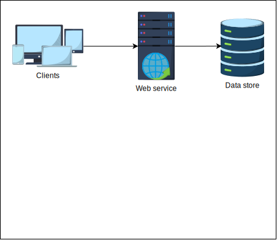
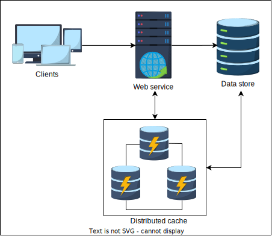
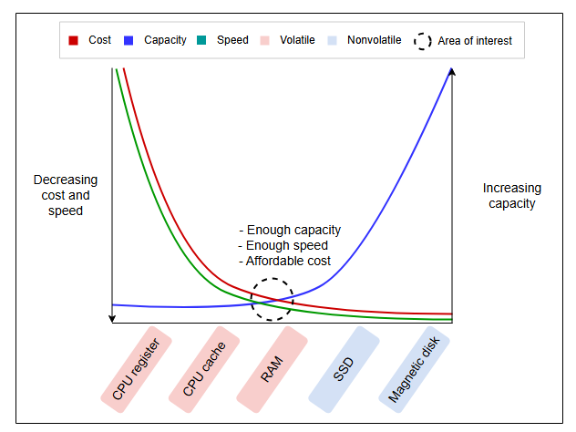

# Проектирование систем: Распределенный кэш

Изучите основы распределенного кэша.

## Постановка задачи

Типичная система состоит из следующих компонентов:

*   Клиент, который запрашивает услугу.
*   Один или несколько хостов сервиса, которые обрабатывают запросы клиентов.
*   База данных, используемая сервисом для хранения данных.

В обычных условиях эта абстракция работает хорошо. Однако по мере увеличения числа пользователей растет и количество запросов к базе данных. В результате поставщики услуг перегружаются, что приводит к снижению производительности.

В таких случаях в систему добавляется **кэш** для борьбы с ухудшением производительности. Кэш — это временное хранилище данных, которое может обслуживать данные быстрее, храня записи в памяти. Кэши хранят только наиболее часто запрашиваемые данные. Когда запрос поступает на обслуживающий хост, он извлекает данные из кэша (**попадание в кэш**) и обслуживает пользователя. Однако, если данные в кэше недоступны (**промах кэша**), данные будут запрошены из базы данных. Кроме того, кэш пополняется новым значением, чтобы избежать промахов в следующий раз.

1) Сервис перед использованием кэширования
   

2) Сервис, использующий кэширование для повышения производительности.
   

Кэш — это энергозависимая область хранения, используемая для хранения многократно читаемых и записываемых данных, что обеспечивает конечному пользователю меньшую задержку. Поэтому кэш должен обслуживать данные из компонента хранения, который является быстрым, имеет достаточный объем и доступен по цене по мере масштабирования сервиса кэширования. Следующая иллюстрация подчеркивает пригодность оперативной памяти (RAM) в качестве основного строительного блока для кэширования:

*Приближенное изображение, показывающее, что RAM является оптимальным выбором для обслуживания кэшированных данных*

Мы понимаем необходимость в кэше и подходящем оборудовании для хранения, но что такое распределенный кэш? Давайте обсудим это далее.

## Что такое распределенный кэш?

**Распределенный кэш** — это система кэширования, в которой несколько серверов кэша координируются для хранения часто запрашиваемых данных. Распределенные кэши необходимы в средах, где одного сервера кэша недостаточно для хранения всех данных. В то же время он является масштабируемым и гарантирует более высокую степень доступности.

Кэши, как правило, представляют собой небольшие, часто используемые, краткосрочные хранилища с быстрым временем чтения. Кэши используют принцип **локальности ссылок**.

> Локальность ссылок - это понятие, согласно которому программа будет получать доступ к определенному набору данных в течение короткого периода времени. Локальность может быть пространственной или временной.

Как правило, распределенные кэши полезны в следующих отношениях:

*   Они минимизируют воспринимаемую пользователем задержку за счет предварительного вычисления результатов и хранения часто запрашиваемых данных.
*   Они предварительно генерируют дорогостоящие запросы из базы данных.
*   Они временно хранят данные сессий пользователей.
*   Они обслуживают данные из временного хранилища, даже если хранилище данных временно недоступно.
*   Наконец, они снижают сетевые затраты за счет обслуживания данных из локальных ресурсов.

## Зачем нужен распределенный кэш?

Когда размер данных, требуемых в кэше, увеличивается, хранение всех данных в одной системе становится непрактичным. Это связано со следующими тремя причинами:

*   Это может быть потенциальной единой точкой отказа (SPOF).
*   Система проектируется слоями, и каждый слой должен иметь свой механизм кэширования для обеспечения разделения конфиденциальных данных разных слоев.
*   Кэширование в разных местах помогает уменьшить задержку обслуживания на этом уровне.

В таблице ниже мы описываем, как кэширование на разных уровнях выполняется с использованием различных технологий. Важно отметить, что компоненты хранилища «ключ-значение» используются на разных уровнях.

### Кэширование на разных уровнях системы

| Системный уровень | Используемая технология | Применение |
|---|---|---|
| Веб | HTTP-заголовки кэша, веб-ускорители, хранилища «ключ-значение», CDN и т.д. | Ускорение извлечения статического веб-контента и управление сессиями |
| Приложение | Локальный кэш и хранилище данных «ключ-значение» | Ускорение вычислений на уровне приложения и извлечения данных |
| База данных | Кэш базы данных, буферы и хранилище данных «ключ-значение» | Снижение задержки при извлечении данных и нагрузки на ввод-вывод из базы данных |

> Помимо трех вышеуказанных системных уровней, кэширование также выполняется на уровне DNS и в клиентских технологиях, таких как браузеры или конечные устройства.

## Как мы будем проектировать распределенный кэш?

Мы разделим задачу проектирования и закрепления знаний об основных концепциях распределенного кэша на пять уроков:

1.  **Основы распределенного кэша**: Крайне важно создать базовые знания, необходимые для принятия критических решений при проектировании распределенных кэшей. В этом уроке мы вернемся к некоторым основным, но важным концепциям.
2.  **Высокоуровневое проектирование распределенного кэша**: В этом уроке мы создадим высокоуровневый проект распределенного кэша.
3.  **Детальное проектирование распределенного кэша**: Мы выявим некоторые ограничения нашего высокоуровневого проекта и будем работать над масштабируемым, доступным и производительным решением.
4.  **Оценка проекта распределенного кэша**: В этом уроке мы оценим наш проект по различным нефункциональным требованиям, таким как масштабируемость, согласованность, доступность и так далее.
5.  **Memcached против Redis**: Мы обсудим известные промышленные решения, а именно Memcached и Redis. Мы также рассмотрим их детали и сравним их функции, чтобы понять их потенциальные варианты использования и то, как они соотносятся с нашим проектом.

Давайте начнем с изучения основ распределенного кэша в следующем уроке.