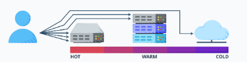
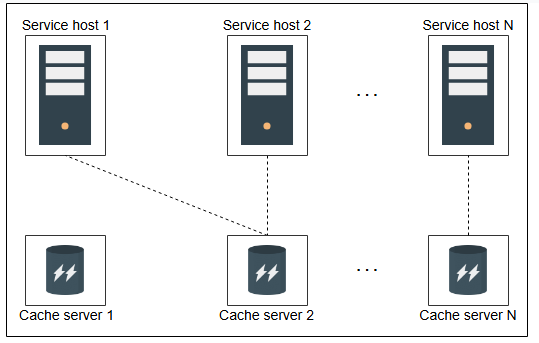
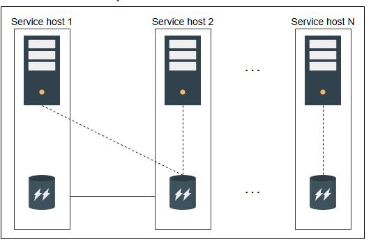

# Основы распределенного кэша

Изучите основы проектирования распределенного кэша.

Основная цель этой главы — спроектировать распределенный кэш. Для достижения этой цели у нас должны быть основательные базовые знания, в основном о различных техниках чтения и записи. Этот урок поможет нам сформировать эти базовые знания. Давайте посмотрим на структуру этого урока в таблице ниже.

| Раздел | Мотивация |
| :--- | :--- |
| Политики записи | Данные записываются в кэш и базы данных. Порядок, в котором происходит запись данных, влияет на производительность. Мы обсудим различные политики записи, чтобы помочь решить, какая из них подойдет для распределенного кэша, который мы хотим спроектировать. |
| Политики вытеснения | Поскольку кэш строится на ограниченном хранилище (RAM), мы в идеале хотим хранить в нем наиболее часто запрашиваемые данные. Поэтому мы обсудим различные политики вытеснения для замены менее часто используемых данных на наиболее часто используемые. |
| Инвалидация кэша | Некоторые кэшированные данные могут устареть. В этом разделе мы обсудим различные методы инвалидации для удаления устаревших или неактуальных записей из кэша. |
| Механизм хранения | Распределенное хранилище имеет множество серверов. Мы обсудим важные вопросы проектирования, такие как, какая запись кэша должна храниться на каком сервере и какую структуру данных использовать для хранения. |
| Клиент кэша | Сервер кэша хранит записи кэша, а клиент кэша обращается к серверу кэша для запроса данных. В этом разделе мы обсудим детали библиотеки клиента кэша. |

## Политики записи

Часто кэш хранит копию (или часть) данных, которые постоянно хранятся в хранилище данных. Когда мы сохраняем данные в хранилище, возникают некоторые важные вопросы:

> *   Куда мы сохраняем данные в первую очередь? В базу данных или в кэш?
> *   Каковы будут последствия каждой стратегии для моделей согласованности?

Краткий ответ: это зависит от требований приложения. Давайте рассмотрим детали различных политик записи, чтобы лучше понять концепцию:

*   **Сквозной кэш (Write-through cache)**: Механизм сквозной записи записывает данные как в кэш, так и в базу данных. Запись в оба хранилища может происходить одновременно или последовательно. Это увеличивает задержку записи, но обеспечивает строгую согласованность между базой данных и кэшем.
*   **Кэш с отложенной записью (Write-back cache)**: В механизме кэша с отложенной записью данные сначала записываются в кэш, а затем асинхронно записываются в базу данных. Хотя в кэше есть обновленные данные, несогласованность неизбежна в сценариях, когда клиент читает устаревшие данные из базы данных. Однако системы, использующие эту стратегию, будут иметь небольшую задержку записи.
*   **Кэш с записью в обход (Write-around cache)**: Эта стратегия предполагает запись данных только в базу данных. Позже, когда инициируется чтение данных, они записываются в кэш после промаха кэша. В базе данных будут обновленные данные, но такая стратегия неблагоприятна для чтения недавно обновленных данных.

> **Тест**
>
> **1.** Система хочет записывать данные и сразу же их считывать. В то же время нам нужна согласованность между кэшем и базой данных. Какая политика записи является оптимальным выбором?
>
> *   A. Сквозной кэш
> *   B. Кэш с записью в обход
> *   C. Кэш с отложенной записью
> 

>  
<b>Показать</b>

>   A: Чтение будет быстрым, и данные в базе данных также будут согласованы.
 > 

>
> **2.** Что касается производительности, то чего следует избегать системе с большим объемом записи?
>
> *   A. Сквозной кэш
> *   B. Кэш с записью в обход
> *   C. Кэш с отложенной записью
> 

>  
<b>Показать</b>

>   A: Кэш с сквозной записью имеет высокую задержку записи, поскольку он выполняет запись не только в кэш, но и в базу данных.
 > 

>
> **3.** Устаревший ввод данных является типичной проблемой, при которой политика написания?
>
> *   A. Сквозной кэш
> *   B. Кэш с записью в обход
> *   C. Кэш с отложенной записью
> 

>  
<b>Показать</b>

> B: Потому что данные записываются в базу данных асинхронно.
>
>C: Поскольку это позволяет обходить кэш для операций записи, что приводит к возможности быстрого удаления данных из кэша до того, как они будут прочитаны снова.
 > 

## Политики вытеснения

Одна из основных причин, по которой кэши работают быстро, заключается в их небольшом размере. Маленькие кэши означают ограниченную емкость хранилища. Поэтому нам нужен механизм вытеснения для удаления менее часто используемых данных из кэша.

Существует несколько известных стратегий для вытеснения данных из кэша. Наиболее известные стратегии включают следующие:

*   Наименее давно использовавшийся (Least recently used, LRU)
*   Наиболее давно использовавшийся (Most recently used, MRU)
*   Наименее часто используемый (Least frequently used, LFU)
*   Наиболее часто используемый (Most frequently used, MFU)

Также существуют и другие стратегии, такие как "первым пришел, первым ушел" (FIFO). Выбор каждого из этих алгоритмов зависит от системы, для которой разрабатывается кэш.

## Инвалидация кэша

Помимо вытеснения менее часто используемых данных, некоторые данные, находящиеся в кэше, могут со временем устареть. Такие записи кэша являются недействительными и должны быть помечены для удаления.

Ситуация требует ответа на вопрос: Как мы определяем устаревшие записи?

Решение проблемы требует хранения метаданных, соответствующих каждой записи кэша. В частности, поддержание значения **времени жизни (time-to-live, TTL)** для работы с устаревшими элементами кэша.

Мы можем использовать два разных подхода для работы с устаревшими элементами с помощью TTL:

*   **Активное истечение срока действия**: Этот метод активно проверяет TTL записей кэша с помощью фонового процесса или потока.
*   **Пассивное истечение срока действия**: Этот метод проверяет TTL записи кэша во время доступа к ней.

Каждый элемент с истекшим сроком действия удаляется из кэша при обнаружении.

## Механизм хранения

Хранение данных в кэше не так тривиально, как кажется, потому что распределенный кэш имеет несколько серверов кэша. Когда мы используем несколько серверов кэша, необходимо ответить на следующие вопросы проектирования:

*   Какие данные мы должны хранить на каких серверах кэша?
*   Какую структуру данных мы должны использовать для хранения данных?

Вышеуказанные два вопроса являются важными проблемами проектирования, поскольку они будут определять производительность нашего распределенного кэша, что является нашим самым важным требованием. Мы будем использовать следующие методы для ответа на эти вопросы.

### Хеш-функция

Возможно использование хеширования в двух разных сценариях:

*   Идентификация сервера кэша в распределенном кэше для хранения и извлечения данных.
*   Определение местоположения записей кэша внутри каждого сервера кэша.

Для первого сценария мы можем использовать различные алгоритмы хеширования. Однако consistent hashing или его разновидности обычно хорошо работают в распределенных системах, потому что простое хеширование не будет идеальным в случае сбоев или масштабирования.

Во втором сценарии мы можем использовать типичные хеш-функции для определения местоположения записи кэша для чтения или записи внутри сервера кэша. Однако хеш-функция сама по себе может только определить местоположение записи кэша. Она ничего не говорит об управлении данными внутри сервера кэша. То есть, она ничего не говорит о том, как реализовать стратегию вытеснения менее часто используемых данных из сервера кэша. Она также ничего не говорит о том, какие структуры данных используются для хранения данных внутри серверов кэша. Это и есть второй вопрос проектирования механизма хранения. Давайте рассмотрим структуру данных далее.

> Почему мы предпочитаем consistent hashing?
> 

>  
<b>Показать</b>

> Consistent hashing считается предпочтительным выбором по сравнению с простым хэшированием в системах распределенного кэширования, поскольку оно значительно сокращает объем данных, которые необходимо перемещать при добавлении или удалении узлов. Это сводит к минимуму усилия по перебалансировке и улучшает масштабируемость. Кроме того, это повышает отказоустойчивость, поскольку при сбое узла затрагивается лишь небольшая часть данных, что делает систему более устойчивой.
> 

### Связный список

Мы будем использовать двусвязный список. Основная причина — его широкое использование и простота. Кроме того, добавление и удаление данных из двусвязного списка в нашем случае будет операцией с постоянным временем выполнения. Это потому, что мы либо вытесняем определенную запись из хвоста связного списка, либо перемещаем запись в начало двусвязного списка. Следовательно, итерации не требуются.

> **Примечание:** Фильтры Блума — интересный выбор для быстрого определения, не существует ли запись кэша на серверах кэша. Мы можем использовать фильтры Блума, чтобы определить, что запись кэша определенно отсутствует на сервере кэша, но вероятность ее присутствия вероятностна. Фильтры Блума довольно полезны в больших системах кэширования или базах данных.

## Шардирование в кластерах кэша

Чтобы избежать единой точки отказа (SPOF) и высокой нагрузки на один экземпляр кэша, мы вводим шардирование. Шардирование включает разделение данных кэша между несколькими серверами кэша. Это можно выполнить двумя способами.

### Выделенные серверы кэша

В методе **выделенных серверов кэша** мы отделяем серверы приложений и веб-серверы от серверов кэша.

Преимущества использования выделенных серверов кэша следующие:

*   Гибкость в выборе оборудования для каждой функциональности.
*   Возможность раздельного масштабирования веб/приложений и серверов кэша.

Помимо вышеуказанных преимуществ, работа в качестве автономного сервиса кэширования позволяет другим микросервисам извлекать из них выгоду — например, Кэш как Сервис. В этом случае система кэширования должна будет знать о различных приложениях, чтобы их данные не конфликтовали.

> 

>  
<b>Температура данных</b>

> Данные можно разделить на три температурные области в зависимости от частоты доступа:
>
>Горячие: это данные с высокой степенью доступности.
>
>Теплые: к этим данным обращаются реже.
>
>Холодные: к этим данным обращаются редко.
>
>Холодные данные часто удаляются из кэша и заменяются горячими или разогретыми данными. На следующем рисунке показан спектр значений температуры:

> 

*Изображение, показывающее, как хосты сервиса координируются с выделенными серверами кэша*

### Совмещенный кэш

**Совмещенный кэш** встраивает функциональность кэша и сервиса в один и тот же хост.

Основным преимуществом этой стратегии является снижение капитальных (CAPEX) и операционных (OPEX) затрат на дополнительное оборудование. Кроме того, при масштабировании одного сервиса достигается автоматическое масштабирование другого. Однако сбой одной машины приведет к одновременной потере обоих сервисов.

> Капитальные затраты - это крупные инвестиции в активы, которые удерживаются в течение длительного времени.
> Операционные расходы - это повседневные расходы, которые поддерживают работу компании.

*Размещение кэша и логики приложения на одной машине*

## Клиент кэша

Мы обсуждали, что для выбора серверов кэша следует использовать хеш-функции. Но какая сущность выполняет эти хеш-вычисления?

**Клиент кэша** — это фрагмент кода, находящийся на хост-серверах, который выполняет (хеш) вычисления для хранения и извлечения данных на серверах кэша. Также клиенты кэша могут координироваться с другими компонентами системы, такими как сервисы мониторинга и конфигурации. Все клиенты кэша запрограммированы одинаково, так что одни и те же операции `PUT` и `GET` от разных клиентов возвращают одинаковые результаты. Некоторые из характеристик клиентов кэша следующие:

*   Каждый клиент кэша будет знать обо всех серверах кэша.
*   Все клиенты могут использовать известные транспортные протоколы, такие как TCP или UDP, для связи с серверами кэша.

> **На заметку**
>
> 1.  Как поведут себя клиенты кэша при запросе на доступ, если один из серверов кэша вышел из строя?
>
> 

>  
<b>Показать</b>

> Поскольку данные на серверах кэширования больше не будут доступны, клиенты кэширования отметят этот запрос на доступ как пропущенный.
> 

## Заключение

В этом уроке мы узнали, что такое распределенные кэши, и подчеркнули их значение в распределенных системах. Мы также обсудили различные механизмы хранения и вытеснения для кэшей. Кэши жизненно важны для любой распределенной системы и располагаются в разных точках внутри ее проекта. Важно понимать, как распределенные кэши могут быть спроектированы как часть большой системы.