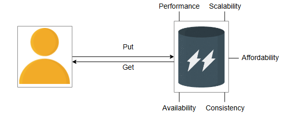
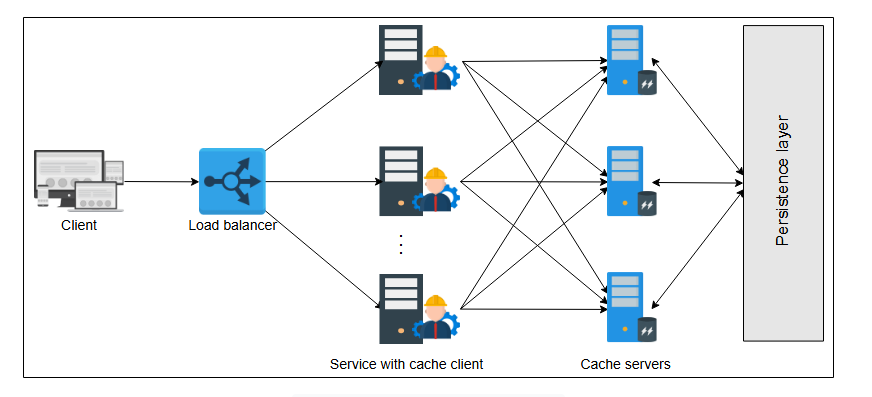

# Высокоуровневое проектирование распределенного кэша

Узнайте, как мы можем разработать высокоуровневый проект распределенного кэша.

В этом уроке мы научимся проектировать распределенный кэш. Мы также обсудим компромиссы и проектные решения, которые могут возникнуть в
процессе разработки нашего решения.

## Требования

Начнем с понимания требований к нашему решению.

### Функциональные

Ниже приведены функциональные требования:

* **Вставка данных:** Пользователь системы распределенного кэша должен иметь возможность вставлять запись в кэш.
* **Извлечение данных:** Пользователь должен иметь возможность извлекать данные по определенному ключу.



*Функциональные и нефункциональные требования к распределенному кэшу*

### Нефункциональные требования

Мы будем учитывать следующие нефункциональные требования:

* **Высокая производительность:** Основная причина использования кэша — обеспечение быстрого извлечения данных. Поэтому операции `insert`
  и `retrieve` должны быть быстрыми.
* **Масштабируемость:** Система кэша должна масштабироваться горизонтально без узких мест при увеличении количества запросов.
* **Высокая доступность:** Недоступность кэша создаст дополнительную нагрузку на серверы баз данных, которые также могут выйти из строя в
  периоды пиковой нагрузки. Мы также требуем, чтобы наша система выдерживала случайные сбои компонентов и сети, а также перебои в
  электроснабжении.
* **Согласованность:** Данные, хранящиеся на серверах кэша, должны быть согласованы. Например, данные, извлекаемые разными клиентами кэша с
  разных серверов (основных или вторичных) по одному и тому же ключу, должны быть актуальными.
* **Доступность (по стоимости):** В идеале система кэширования должна быть спроектирована на основе стандартного оборудования, а не дорогих
  вспомогательных компонентов в рамках проекта системы.

## Проектирование API

Проектирование API для этой задачи достаточно простое, поскольку существует всего две основные операции.

### Вставка

Вызов API для выполнения вставки должен выглядеть следующим образом:

```
insert(key, value)
```

| **Параметр** | **Описание**                                 |
|:-------------|:---------------------------------------------|
| `key`        | Это уникальный идентификатор.                |
| `value`      | Это данные, хранящиеся по уникальному `key`. |

Эта функция возвращает подтверждение или ошибку, описывающую проблему на стороне сервера.

### Извлечение

Вызов API для извлечения данных из кэша должен выглядеть следующим образом:

```
retrieve(key)
```

| **Параметр** | **Описание**                                                   |
|:-------------|:---------------------------------------------------------------|
| `key`        | Этот параметр указывает ключ, по которому возвращаются данные. |

Этот вызов возвращает объект вызывающей стороне.

> **На заметку**
>
> 1. Проектирование API распределенного кэша очень похоже на API хранилища "ключ-значение". Каковы возможные различия между хранилищем "
     ключ-значение" и распределенным кэшем?
>
> <details>
>  <summary><b>Показать</b></summary>
> Некоторые из ключевых отличий заключаются в следующем:
>
> Хранилища ключей и значений должны обеспечивать долговременное хранение данных (постоянство). Для повышения производительности чтения в
> дополнение к постоянному хранилищу используется кэш.
>
> Кэш обрабатывает данные из оперативной памяти. Хранилище ключей и значений записывает данные в энергонезависимое хранилище.
>
> Хранилища ключей и значений надежны и должны выдерживать сбои. Однако кэши могут аварийно завершать работу и после восстановления
> заполняться заново.
> </details>

## Вопросы проектирования

Прежде чем проектировать систему распределенного кэша, важно рассмотреть некоторые проектные решения. Каждый из этих выборов будет
основываться исключительно на требованиях нашего приложения. Однако мы можем выделить некоторые ключевые различия здесь:

### Аппаратное обеспечение для хранения

Если у нас большой объем данных, нам может потребоваться шардирование, и, следовательно, мы будем использовать серверы шардов для разделов
кэша. Должны ли эти серверы быть специализированным или стандартным оборудованием? Специализированное оборудование будет иметь хорошую
производительность и емкость хранения, но будет стоить дороже. Мы можем **создать большой кэш из стандартных серверов**. В целом, количество
серверов шардов будет зависеть от размера кэша и частоты доступа.

Кроме того, мы можем рассмотреть возможность хранения наших данных на вторичном хранилище этих серверов для обеспечения постоянства, в то
время как мы по-прежнему обслуживаем данные из RAM. Вторичное хранилище может использоваться в случаях перезагрузки, когда восстановление
кэша занимает много времени. Однако постоянство может не быть требованием в системе кэша, если есть выделенный уровень постоянства, такой
как база данных.

### Структуры данных

Важнейшей частью проекта должна быть скорость доступа к данным. Хеш-таблицы — это структуры данных, которые в среднем занимают постоянное
время для хранения и извлечения данных. Кроме того, нам нужна другая структура данных для реализации алгоритма вытеснения для кэшированных
данных. В частности, связные списки являются хорошим вариантом (как обсуждалось в предыдущем уроке).

Также нам нужно понимать, какие типы структур данных может хранить кэш. Несмотря на то, что в разделе проектирования API мы обсуждали
использование строк для простоты, в кэше можно хранить различные структуры данных или форматы, такие как хеш-карты, массивы, множества и так
далее. В следующем уроке мы увидим практический пример такого кэша.

### Клиент кэша

Это клиентский процесс или библиотека, которая выполняет вызовы `insert` и `retrieve`. Расположение клиентского процесса — это вопрос
проектирования. Например, можно разместить клиентский процесс внутри обслуживающего хоста, если кэш предназначен только для внутреннего
использования. В противном случае, если система кэширования предоставляется как сервис для внешнего использования, выделенный клиент кэша
может отправлять запросы пользователей на серверы кэша.

### Политика записи

Стратегия записи в кэш и базу данных имеет последствия для согласованности. В целом, оптимального выбора нет, но в зависимости от нашего
приложения, предпочтение политики записи имеет большое значение.

### Политика вытеснения

По своей природе кэш обеспечивает чтение и запись с низкой задержкой. Для этого данные часто обслуживаются из оперативной памяти (RAM).
Обычно мы не можем поместить все данные в кэш из-за его ограниченного размера по сравнению с полным набором данных. Поэтому нам нужно
тщательно решать, что остается в кэше и как освободить место для новых записей.

С добавлением новых данных некоторые из существующих данных, возможно, придется вытеснить из кэша. Однако выбор "жертвы" зависит от политики
вытеснения. Существует множество политик вытеснения, но выбор снова зависит от использующего его приложения. Например, "наименее давно
использовавшийся" (LRU) может быть хорошим выбором для социальных сетей, где недавно загруженный контент, скорее всего, получит больше всего
просмотров.

Помимо деталей, описанных в разделах выше, оптимизация значения времени жизни (TTL) может играть важную роль в сокращении количества
промахов кэша.

> ℹ️ Как шардирование помогает смягчить единые точки отказа (SPOF) в системе распределенного кэша?
>
> <details>
>  <summary><b>Показать</b></summary>
> Sharding предполагает разделение данных кэша на более мелкие, управляемые блоки (сегменты) и их распределение по нескольким серверам кэширования. Этот подход позволяет снизить вероятность возникновения отдельных точек сбоя (SPOF), гарантируя, что каждый сегмент хранится на отдельном сервере. При сбое одного сервера теряются только данные на затронутом сегменте, в то время как остальная часть системы остается неповрежденной.
> </details>

## Высокоуровневое проектирование

Следующий рисунок изображает наш высокоуровневый проект:


*Высокоуровневое проектирование распределенного кэша*

Основные компоненты в этом высокоуровневом проекте следующие:

* **Клиент кэша:** Эта библиотека находится на серверах приложений сервиса. Она содержит всю информацию о серверах кэша. Клиент кэша будет
  выбирать один из серверов кэша, используя хеш и алгоритм поиска для каждого входящего запроса `insert` и `retrieve`. Все клиенты кэша
  должны иметь согласованное представление обо всех серверах кэша. Также техника разрешения для перемещения данных на серверы кэша и с них
  должна быть одинаковой. В противном случае разные клиенты будут запрашивать разные серверы для одних и тех же данных.
* **Серверы кэша:** Эти серверы поддерживают кэш данных. Каждый сервер кэша доступен для всех клиентов кэша. Каждый сервер подключен к базе
  данных для хранения или извлечения данных. Клиенты кэша используют протоколы TCP или UDP для передачи данных на серверы кэша или с них.
  Однако, если какой-либо сервер кэша не работает, запросы к этим серверам рассматриваются клиентами кэша как промах кэша.