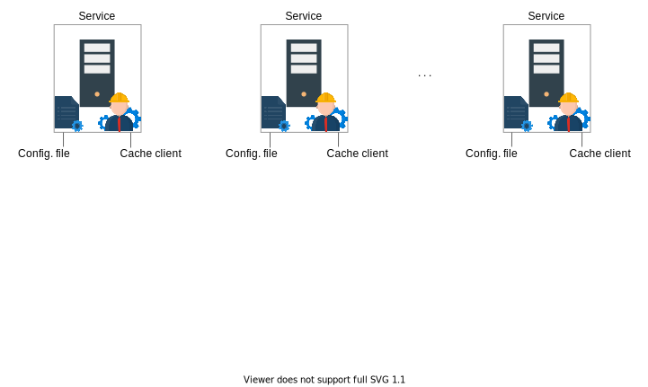
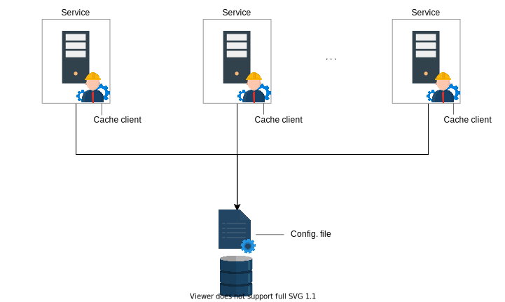
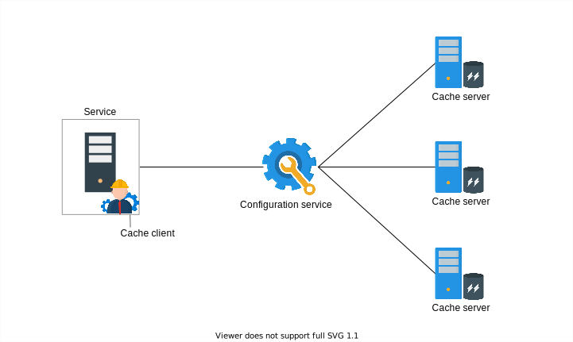
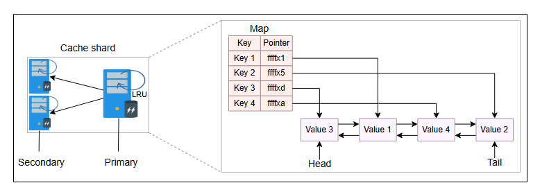
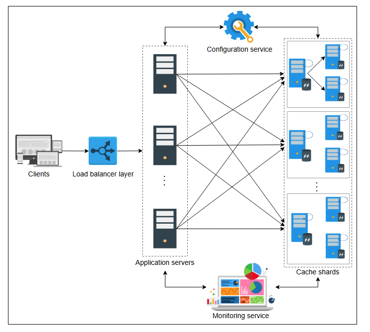

# Детальный дизайн распределенного кэша

Давайте разберемся в детальном дизайне распределенного кэша.

Этот урок выявит некоторые недостатки высокоуровневого дизайна распределенного кэша и улучшит его, чтобы устранить пробелы. Давайте начнем.

## Найти и устранить ограничения

Прежде чем перейти к детальному дизайну, нам нужно понять и преодолеть некоторые проблемы:

* У клиента кэша нет способа узнать о добавлении или сбое кэш-сервера.
* Решение будет страдать от проблемы единой точки отказа (SPOF), поскольку у нас есть один кэш-сервер для каждого набора кэшированных
  данных. Кроме того, если некоторые данные на любом из кэш-серверов часто запрашиваются (что обычно называется проблемой "горячего ключа"),
  наша производительность также будет низкой.
* Наше решение также не раскрывало внутреннее устройство кэш-серверов. То есть, какие структуры данных он будет использовать для хранения и
  какую политику вытеснения он будет применять?

### Поддержка списка кэш-серверов

Начнем с решения первой проблемы. Мы будем двигаться к наилучшему возможному решению поэтапно. Давайте рассмотрим следующие слайды, чтобы
получить представление о каждом из описанных ниже решений:

*
[Решение 1] Поддержка конфигурационного файла на каждом сервере, который может использовать клиент кэша
*

*
[Решение 2] Поддержка конфигурационного файла в централизованном месте
*

*
[Решение 3] Использование сервиса конфигурации для мониторинга кэш-серверов и обновления клиентов кэша
*

* **Решение 1**: Можно иметь конфигурационный файл на каждом хосте сервиса, где находятся клиенты кэша. Конфигурационный файл будет
  содержать обновленную информацию о состоянии и метаданные, необходимые клиентам кэша для эффективного использования кэш-серверов. Каждая
  копия конфигурационного файла может обновляться через push-сервис с помощью любого инструмента DevOps. Основная проблема этой стратегии
  заключается в том, что конфигурационный файл придется обновлять и развертывать вручную с помощью инструментов DevOps.
* **Решение 2**: Мы можем хранить конфигурационный файл в централизованном месте, которое клиенты кэша могут использовать для получения
  обновленной информации о кэш-серверах. Это решает проблему развертывания, но нам все еще нужно вручную обновлять конфигурационный файл и
  отслеживать состояние каждого сервера.
* **Решение 3**: Автоматический способ решения этой проблемы — использовать сервис конфигурации, который постоянно отслеживает состояние
  кэш-серверов. Кроме того, клиенты кэша будут получать уведомления о добавлении нового кэш-сервера в кластер. При использовании этой
  стратегии не потребуется вмешательство человека или мониторинг в случае сбоев или добавления новых узлов. В конечном итоге, клиенты кэша
  получают список кэш-серверов от сервиса конфигурации.

> Сервис конфигурации имеет самые высокие операционные затраты. В то же время, это сложное решение. Однако оно является самым надежным из
> всех представленных нами решений.

### Повышение доступности

Вторая проблема связана с недоступностью кэша в случае сбоя кэш-серверов. Простое решение — добавление узлов-реплик. Мы можем начать с
добавления одного основного и двух резервных узлов в шард кэша. При использовании реплик всегда есть вероятность несогласованности. Если
наши реплики находятся в непосредственной близости, запись на реплики выполняется синхронно, чтобы избежать несоответствий между репликами
шарда. Крайне важно разделить данные кэша между шардами так, чтобы не возникала проблема недоступности и не тратилось впустую оборудование.

У этого решения есть два основных преимущества:

* Повышенная доступность в случае сбоев.
* "Горячие" шарды могут иметь несколько узлов (основной-вторичный) для чтения.

Такое решение не только повысит доступность, но и улучшит производительность.

### Внутреннее устройство кэш-сервера

Каждый клиент кэша должен использовать три механизма для хранения и вытеснения записей из кэш-серверов:

* **Хеш-таблица**: Кэш-сервер использует хеш-таблицу для хранения или поиска различных записей в оперативной памяти кэш-серверов.
  Иллюстрация ниже показывает, что таблица содержит указатели на каждое значение кэша.
* **Двусвязный список**: Если нам нужно вытеснить данные из кэша, нам потребуется связный список, чтобы мы могли упорядочить записи в
  соответствии с частотой их использования. Иллюстрация ниже показывает, как записи соединены с помощью двусвязного списка.
* **Политика вытеснения**: Политика вытеснения зависит от требований приложения. Здесь мы предполагаем использование политики наименее давно
  использовавшихся (LRU).

Ниже представлено изображение кластера с шардами, а также структура данных узла:

*
Основной узел шарда и реплика, каждый с одинаковыми внутренними механизмами
*

> Из вышеизложенного следует, что мы не предоставляем API `delete`. Это связано с тем, что вытеснение (через алгоритм вытеснения) и
> удаление (устаревших записей по TTL) происходит локально на кэш-серверах. Тем не менее, могут возникнуть ситуации, когда API `delete` может
> потребоваться. Например, когда мы удаляем недавно добавленную запись из базы данных, это должно приводить к удалению элементов из кэша для
> поддержания согласованности.

## Детальный дизайн

Теперь, после решения каждой из трех ранее выделенных проблем, мы готовы формализовать детальный дизайн. Посмотрите на детальный дизайн
ниже:

*
Детальный дизайн распределенной системы кэширования
*

Давайте обобщим предложенный детальный дизайн в нескольких пунктах:

* Запросы клиента достигают хостов сервиса через балансировщики нагрузки, где находятся клиенты кэша.
* Каждый клиент кэша использует согласованное хеширование для определения кэш-сервера. Затем клиент кэша перенаправляет запрос на
  кэш-сервер, обслуживающий определенный шард.
* У каждого кэш-сервера есть основной и реплицированные серверы. Внутренне каждый сервер использует одинаковые механизмы для хранения и
  вытеснения записей кэша.
* Сервис конфигурации обеспечивает, чтобы все клиенты видели обновленное и согласованное представление кэш-серверов.
* Сервисы мониторинга могут дополнительно использоваться для логирования и составления отчетов по различным метрикам сервиса кэширования.

> **Примечание:** Важным аспектом дизайна является то, что записи кэша хранятся и извлекаются из оперативной памяти (RAM). Мы обсуждали
> целесообразность использования RAM для проектирования системы кэширования в предыдущем уроке.

> **На подумать**
>
> 1. Хотя согласованное хеширование является хорошим выбором, оно может привести к неравномерному распределению данных, и некоторые серверы
     могут быть перегружены. Как мы можем решить эту проблему?
>  

>  
<b>Показать</b>

> Со временем было предложено несколько вариантов алгоритмов последовательного хэширования. Мы можем использовать один из таких вариантов, который равномерно распределяет нагрузку и даже создает несколько копий одних и тех же данных на разных серверах кэширования. Внутри каждого кэш-сервера могут находиться виртуальные серверы, и количество виртуальных серверов в компьютере зависит от его возможностей. Это позволяет лучше контролировать нагрузку на кэш-сервер. В то же время это повышает доступность.
> 
