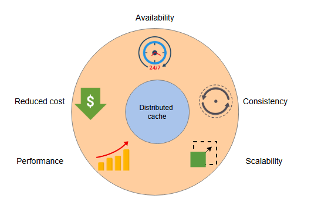

# Оценка дизайна распределенного кэша

Давайте оценим наш дизайн в контексте наших требований.

Давайте оценим предложенный нами дизайн в соответствии с требованиями к проектированию.

## Высокая производительность

Вот некоторые проектные решения, которые мы приняли, способствующие общей высокой производительности:

* Мы использовали согласованное хеширование. Поиск ключа с помощью этого алгоритма имеет временную сложность O(log(N)), где N — количество
  шардов кэша.
* Внутри кэш-сервера ключи находятся с помощью хеш-таблиц, что в среднем требует постоянного времени.
* Подход вытеснения LRU использует постоянное время для доступа и обновления записей кэша в двусвязном списке.
* Связь между клиентами кэша и серверами осуществляется по протоколам TCP и UDP, что также очень быстро.
* Поскольку мы добавили больше реплик, они могут снизить потери производительности, с которыми мы сталкиваемся при высокой нагрузке на одну
  машину.
* Важной особенностью дизайна является добавление, извлечение и предоставление данных из оперативной памяти (RAM). Поэтому задержка
  выполнения этих операций довольно низкая.

> **Примечание:** Критически важным параметром для высокой производительности является выбор алгоритма вытеснения, поскольку от него зависит
> количество попаданий и промахов в кэше. Чем выше процент попаданий в кэш, тем выше производительность.

Чтобы понять, насколько важен алгоритм вытеснения, предположим следующее:

* Время обслуживания при попадании в кэш (99.9-й перцентиль): 5 мс
* Время обслуживания при промахе в кэше (99.9-й перцентиль): 30 мс (включая время на получение данных из базы данных и установку кэша)

Предположим, у нас 10% промахов в кэше при использовании алгоритма наиболее часто используемых (MFU), тогда как при использовании алгоритма
наименее давно использовавшихся (LRU) у нас 5% промахов. Тогда мы используем следующую формулу:

`EAT = Доля_попаданий x Время_попадания + Доля_промахов x Время_промаха`

Здесь это означает следующее:

* **EAT**: Эффективное время доступа (Effective access time).
* **Доля_попаданий**: Процент случаев, когда происходит попадание в кэш.
* **Доля_промахов**: Процент случаев, когда происходит промах в кэше.
* **Время_попадания**: Время, необходимое для обслуживания попадания в кэш.
* **Время_промаха**: Время, необходимое для обслуживания промаха в кэше.

Для MFU мы видим следующее:

```
EAT = 0.90 x 5 мс + 0.10 x 30 мс = 4.5 мс + 3.0 мс = 7.5 мс
```

Для LRU мы видим следующее:

```
EAT = 0.95 x 5 мс + 0.05 x 30 мс = 4.75 мс + 1.5 мс = 6.25 мс
```

Приведенные выше цифры подчеркивают важность алгоритма вытеснения для увеличения процента попаданий в кэш. Каждое приложение должно провести
эмпирическое исследование, чтобы определить алгоритм вытеснения, который дает лучшие результаты для конкретной рабочей нагрузки.

## Масштабируемость

Мы можем создавать шарды в зависимости от требований и изменяющейся нагрузки на серверы. При добавлении новых кэш-серверов в кластер нам
также приходится выполнять ограниченное количество пересчетов хешей благодаря согласованному хешированию.

Добавление реплик снижает нагрузку на "горячие" шарды. Еще один способ справиться с проблемой "горячих ключей" — это дальнейшее шардирование
в диапазоне этих ключей. Хотя сценарий, когда один ключ становится "горячим", редок, клиент кэша может разработать решения, чтобы избежать
проблемы узкого места из-за одного "горячего ключа". Например, клиенты кэша могут интеллектуально избегать ситуации, когда один ключ
становится узким местом, или мы можем использовать динамическую репликацию для конкретных ключей и так далее. Тем не менее, эти решения
сложны и выходят за рамки данного урока.



*<p align="center">Гарантии, предоставляемые распределенным кэшем</p>*

## Высокая доступность

Мы улучшили доступность за счет резервных кэш-серверов. Резервирование добавляет уровень надежности и отказоустойчивости в наш дизайн. Мы
также использовали
алгоритм лидер-последователь (leader-follower)
для удобного управления шардом кластера. Однако мы не достигли высокой доступности, потому что у нас есть две реплики шарда, и на данный
момент мы предполагаем, что реплики находятся в одном дата-центре.

Можно достичь более высокой доступности, разделив лидерские и ведомые серверы между разными дата-центрами. Но такая высокая доступность
достигается ценой согласованности. Мы предполагали синхронные записи в пределах одного дата-центра. Но синхронная запись для строгой
согласованности в разных дата-центрах имеет серьезные последствия для производительности, что нежелательно в системах кэширования. Обычно мы
используем асинхронную репликацию между дата-центрами.

Для репликации в пределах дата-центра мы можем получить строгую согласованность с хорошей производительностью. Мы можем пожертвовать строгой
согласованностью при репликации между дата-центрами для достижения лучшей доступности (см. теоремы CAP и PACELC).

## Согласованность

Возможно записывать данные на кэш-серверы в синхронном или асинхронном режиме. В случае кэширования для улучшения производительности
предпочтителен асинхронный режим. Следовательно, наша система кэширования страдает от несогласованности. Альтернативно, строгая
согласованность достигается за счет синхронной записи, но это увеличивает общую задержку, и производительность страдает.

Несогласованность также может возникать из-за неисправных конфигурационных файлов и сервисов. Представьте себе сценарий, когда кэш-сервер
выходит из строя во время операции записи, и операция чтения выполняется на нем сразу после его восстановления. Мы можем избежать таких
сценариев для любого подключающегося или повторно подключающегося сервера, не позволяя ему обслуживать запросы до тех пор, пока не будет
разумной уверенности, что он обновлен.

## Доступность (стоимость)

Предложенный нами дизайн имеет низкую стоимость, поскольку создать такую систему с использованием стандартного (commodity) оборудования
вполне реально и практично.

> **На подумать**
>
> 1. Что произойдет, если узел-лидер выйдет из строя в протоколе лидер-последователь?
> <details>
>  <summary><b>Показать</b></summary>
>В этом случае могут быть использованы два возможных решения:
>
>Используйте алгоритм выбора лидера, чтобы выбрать нового лидера из числа доступных подписчиков.
>
>Используйте отдельную службу управления распределенной конфигурацией для мониторинга и выбора лидеров.
> </details>
>
> 2. Стоит ли внедрять синхронную репликацию на серверы кэширования?
> <details>
>  <summary><b>Показать</b></summary>
> Синхронная репликация в кластерах кэша приведет к снижению производительности, поскольку для репликации одних и тех же данных на все серверы кэша требуется время. Таким образом, существует компромисс между производительностью и согласованностью при использовании асинхронной и синхронной репликации соответственно.
>
> Ответ зависит от варианта использования. В случае кэш-серверов синхронная репликация является хорошим выбором, если реплицируемые серверы находятся в непосредственной близости от основного сервера.
>
> </details>
>
> 3. Предположим, что большое количество одновременных запросов перенаправляется на один сегментный сервер. Если сервер использует алгоритм LRU, некоторые запросы приведут к сбою в работе кэша и записи новой записи в кэш, в то время как некоторые приведут к сбою в работе кэша и в конечном итоге будут считаны с сервера. Эти параллельные запросы могут конкурировать друг с другом. Поэтому могут потребоваться некоторые механизмы блокировки. Однако блокировка всей структуры данных для всех операций чтения и записи значительно снизит производительность. Как, по-вашему, будет решаться такая проблема?
> <details>
>  <summary><b>Показать</b></summary>
> Как правило, для одновременного доступа к общим данным хорошим выбором являются некоторые механизмы блокировки, такие как семафор, мониторы, блокировки мьютексов и другие. Но по мере роста числа пользователей (читателей в случае попадания в кэш или авторов в случае пропуска в кэш) блокировка всей структуры данных не является подходящим решением. В этом случае мы можем рассмотреть следующие варианты:
>
> Ограниченная блокировка: В соответствии с этой стратегией будут заблокированы только определенные разделы всей структуры данных. Хотя некоторые потоки или процессы могут выполнять чтение из структуры данных одновременно, некоторые потоки могут временно блокировать доступ к определенным разделам структуры данных.
>
> Удаление в автономном режиме: Удаление в автономном режиме может быть возможным, когда вместо внесения фактических изменений в структуру данных будут записываться только необходимые изменения при выполнении различных операций до тех пор, пока не возникнет необходимость в фиксации изменений. Это решение является желательным и простым, если частота попадания в кэш высока, поскольку в случае сбоя в работе кэша, скорее всего, потребуется внести изменения в структуру данных.
>
> Реализация Lock-free: Было предложено несколько решений, которые предполагают, что одновременное чтение и запись по двусвязному списку возможно для поддержки большого количества одновременных операций чтения и записи.
> </details>

## Итоги

Мы изучили основы кэша и спроектировали распределенный кэш, который имеет хороший уровень доступности, высокую производительность, высокую
масштабируемость и низкую стоимость. Наш механизм поддерживает высокую доступность с помощью реплик, хотя если все реплики находятся в одном
дата-центре, такая схема не справится с полным отказом дата-центра. Теперь, когда мы узнали об основах проектирования, давайте изучим
популярные опенсорсные фреймворки, такие как Memcached и Redis.