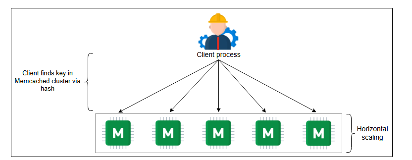

# Memcached против Redis

Давайте сравним Memcached и Redis.

## Введение

В этом уроке мы обсудим некоторые из широко распространенных реальных реализаций распределенного кэша. Наше внимание будет сосредоточено на двух известных опенсорсных фреймворках: Memcached и Redis. Это высокомасштабируемые, высокопроизводительные и надежные инструменты кэширования. Оба этих метода следуют модели клиент-сервер и достигают задержки менее миллисекунды. Давайте обсудим каждый из них, а затем сравним их полезность.

## Memcached

**Memcached** был представлен в 2003 году. Это распределенный кэш типа "ключ-значение", предназначенный для очень быстрого хранения объектов. Memcached хранит данные в виде пар ключ-значение. И ключ, и значение являются строками. Это означает, что любые сохраненные данные должны быть сериализованы. Таким образом, Memcached не поддерживает и не может манипулировать различными структурами данных.

Memcached имеет клиентский и серверный компоненты, каждый из которых необходим для работы системы. Система спроектирована таким образом, что половина логики заключена в сервере, а другая половина — в клиенте. Однако каждый сервер следует **архитектуре без общих ресурсов (shared-nothing architecture)**. В этой архитектуре серверы не знают друг о друге, и между ними нет синхронизации, обмена данными и коммуникации.

Благодаря такой несвязанной конструкции, Memcached способен достигать почти детерминированной скорости запросов (O(1)), обслуживая миллионы ключей в секунду на высокопроизводительной системе. Таким образом, Memcached предлагает высокую пропускную способность и низкую задержку.


*<p align="center">Дизайн типичного кластера Memcached</p>*

Как видно из дизайна типичного кластера Memcached, он хорошо масштабируется горизонтально. Клиентский процесс обычно находится на хосте сервиса, который также взаимодействует с авторитетным хранилищем (базой данных на бэкенде).

### Facebook и Memcached

Шаблон доступа к данным в Facebook требует частых чтений и обновлений, поскольку представления показываются пользователям "на лету", а не генерируются заранее. Поскольку Memcached прост, он стал легким выбором для решения, так как Memcached начал разрабатываться в 2003 году, а Facebook был разработан в 2004 году. Фактически, в некоторых случаях команды Facebook и Memcached работали вместе для поиска решений.

Некоторые из простых команд Memcached включают следующие:

```
get <key_1> <key_2> <key_3> ...
set <key> <value> ...
delete <key>[<time>] ...
```

В Facebook Memcached находится между базой данных MySQL и веб-уровнем, используя примерно 28 терабайт оперативной памяти, распределенных по более чем 800 серверам (по состоянию на 2013 год). Используя аппроксимацию политики вытеснения LRU (наименее давно использовавшихся), Facebook достигает коэффициента попадания в кэш 95%.

Следующая иллюстрация показывает высокоуровневый дизайн архитектуры кэширования в Facebook. Как мы видим, из 50 миллионов запросов, сделанных веб-уровнем, только 2,5 миллиона запросов достигают уровня персистентности.


*<p align="center">Facebook использует слой Memcached между уровнем персистентности и веб-уровнем</p>*

## Redis

**Redis** — это хранилище структур данных, которое можно использовать как кэш, базу данных и брокер сообщений. Он предлагает богатый функционал ценой дополнительной сложности. У него есть следующие особенности:

*   **Хранилище структур данных**: Redis понимает различные структуры данных, которые он хранит. Нам не нужно извлекать из него структуры данных, манипулировать ими, а затем сохранять обратно. Мы можем вносить изменения "на месте", что экономит время и усилия.
*   **База данных**: Он может сохранять все находящиеся в памяти объекты на вторичное хранилище.
*   **Брокер сообщений**: Асинхронная коммуникация является жизненно важным требованием в распределенных системах. Redis может передавать миллионы сообщений в секунду от одного компонента к другому в системе.

Redis предоставляет встроенный механизм репликации, автоматическое аварийное переключение и различные уровни персистентности. Кроме того, Redis понимает протоколы Memcached, и поэтому решения, использующие Memcached, могут быть перенесены на Redis. Особенно хорошим аспектом Redis является то, что он отделяет доступ к данным от управления кластером. Он отделяет плоскость управления (control plane) от плоскости данных (data plane). Это приводит к повышению надежности и производительности. Наконец, Redis не обеспечивает строгой согласованности из-за использования асинхронной репликации.


*<p align="center">Структура Redis, поддерживающая автоматическое аварийное переключение с помощью избыточных вторичных реплик</p>*

### Кластер Redis

Redis имеет встроенную поддержку кластеризации, которая обеспечивает высокую доступность. Это называется Redis Sentinel. Кластер имеет одну или несколько баз данных Redis, запросы к которым выполняются через многопоточные прокси. Кластеры Redis выполняют автоматическое шардирование, где каждый шард имеет основной и вторичные узлы. Однако количество шардов в базе данных или узле настраивается для удовлетворения ожиданий и требований приложения.

Каждый кластер Redis поддерживается менеджером кластера, чья задача — обнаруживать сбои и выполнять автоматическое аварийное переключение. Уровень управления состоит из компонентов мониторинга и конфигурации.


*<p align="center">Архитектура кластеров Redis</p>*

### Конвейеризация в Redis

Поскольку Redis использует модель клиент-сервер, каждый запрос блокирует клиента до тех пор, пока сервер не получит результат. Клиенту Redis, желающему отправить последующие запросы, придется ждать ответа сервера на первый запрос. Таким образом, общая задержка будет выше.

Redis использует **конвейеризацию (pipelining)** для ускорения процесса. **Конвейеризация** — это процесс объединения нескольких запросов со стороны клиента без ожидания ответа от сервера. В результате это уменьшает количество RTT (Round-Trip Time) для нескольких запросов.


*<p align="center">Взаимодействие клиент-сервер в Redis без конвейеризации и с конвейеризацией</p>*

Процесс конвейеризации уменьшает задержку за счет сокращения RTT и времени на ввод-вывод на уровне сокетов. Также переключение режимов через системные вызовы в операционной системе — это дорогостоящая операция, которая значительно сокращается благодаря конвейеризации. Конвейеризация команд со стороны клиента не влияет на то, как сервер обрабатывает эти запросы.

Например, два запроса, отправленные клиентом по конвейеру, достигают сервера, и сервер не может обработать второй. Сервер предоставляет результат для первого и возвращает ошибку для второго. Клиент самостоятельно группирует похожие команды для достижения максимальной пропускной способности.

> **Примечание:** Конвейеризация улучшает задержку как минимум в пять раз, если и клиент, и сервер находятся на одной машине. Запрос отправляется на адрес обратной петли (`127.0.0.1`). Истинная мощь конвейеризации проявляется в системах, где запросы отправляются на удаленные машины.

## Memcached против Redis

Хотя и Memcached, и Redis принадлежат к семейству NoSQL, есть тонкие аспекты, которые их отличают:

*   **Простота:** Memcached прост, но оставляет большую часть усилий по управлению кластерами на разработчиков кластера. Это, однако, означает более тонкий контроль при использовании Memcached. Redis, с другой стороны, автоматизирует большинство задач по масштабированию и разделению данных.
*   **Персистентность:** Redis обеспечивает персистентность с помощью таких свойств, как файл только для добавления (AOF) и снимок базы данных Redis (RDB). В Memcached нет поддержки персистентности. Но это ограничение можно обойти, используя сторонние инструменты.
*   **Типы данных:** Memcached хранит объекты в виде пар ключ-значение, где оба являются строками, тогда как Redis поддерживает строки, отсортированные наборы, хеш-таблицы, битовые карты и HyperLogLogs. Однако максимальный размер ключа или значения настраивается.
*   **Использование памяти:** Оба инструмента позволяют установить максимальный размер памяти для кэширования. Memcached использует метод slab-аллокации для уменьшения фрагментации. Однако при обновлении размера существующих записей или хранении множества мелких объектов может происходить потеря памяти. Тем не менее, существуют обходные пути в конфигурации для решения таких проблем.
*   **Многопоточность:** Redis работает как один процесс, используя одно ядро, тогда как Memcached может эффективно использовать многоядерные системы с технологией многопоточности. Можно утверждать, что Redis был спроектирован как однопоточный процесс, что снижает сложность многопоточных систем. Тем не менее, можно запустить несколько процессов Redis для параллелизма. В то же время, Redis с годами улучшал свою производительность. Поэтому Redis может эффективно хранить небольшие элементы данных. Memcached может быть правильным выбором для файлов размером более 100 КБ.
*   **Репликация:** Как уже говорилось, Redis автоматизирует процесс репликации с помощью нескольких команд, тогда как репликация в Memcached снова зависит от использования сторонних инструментов. Архитектурно Memcached может хорошо масштабироваться горизонтально благодаря своей простоте. Redis обеспечивает масштабируемость через кластеризацию, что значительно сложнее.

Таблица ниже суммирует некоторые основные различия и общие черты между Memcached и Redis:

### Возможности, предлагаемые Memcached и Redis

| **Характеристика** | **Memcached** | **Redis** |
| :--- | :---: | :---: |
| Низкая задержка | Да | Да |
| Персистентность | Возможно через сторонние инструменты | Несколько опций |
| Поддержка многих языков | Да | Да |
| Шардирование данных | Возможно через сторонние инструменты | Встроенное решение |
| Простота использования | Да | Да |
| Поддержка многопоточности | Да | Нет |
| Поддержка структур данных | Объекты | Несколько структур данных |
| Поддержка транзакций | Нет | Да |
| Политика вытеснения | LRU | Несколько алгоритмов |
| Поддержка скриптов Lua | Нет | Да |
| Геопространственная поддержка | Нет | Да |

В итоге, Memcached предпочтительнее для небольших, простых систем с высокой нагрузкой на чтение, тогда как Redis полезен для сложных систем с высокой нагрузкой как на чтение, так и на запись.

> **На подумать**
>
> 1. Исходя из деталей реализации, какой из двух фреймворков (Memcached или Redis) имеет поразительное сходство с распределенным кэшем, который мы спроектировали в предыдущем уроке?
> <details>
>  <summary><b>Показать</b></summary>
> Ответ - Memcached. Причины следующие:
>
> Клиентское программное обеспечение выбирает, какой сервер кэширования использовать с помощью алгоритма хэширования.
>
> Серверное программное обеспечение сохраняет значения для каждого ключа, используя внутреннюю хэш-таблицу.
>
> В качестве политики исключения используется параметр "Наименее недавно использованный" (LRU).
>
> Между разными серверами кэширования нет связи.
> </details>
## Заключение

Невозможно представить высокоскоростные крупномасштабные решения без использования системы кэширования. В этой главе мы рассмотрели необходимость в системе кэширования и ее фундаментальные детали, а также спроектировали базовую систему распределенного кэша. Мы также ознакомились с дизайном и особенностями двух самых известных фреймворков кэширования.