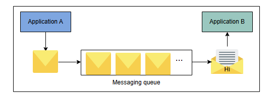

# Проектирование систем: Распределенная очередь сообщений

Узнайте об очереди сообщений, почему мы ее используем и о важных сценариях ее применения.

## Что такое очередь сообщений?

**Очередь сообщений** — это промежуточный компонент между взаимодействующими сущностями, известными как *производители* и *потребители*. **Производитель** создает сообщения и помещает их в очередь, в то время как **потребитель** извлекает сообщения из очереди и обрабатывает их. С очередью могут одновременно взаимодействовать несколько производителей и потребителей.

Ниже приведена иллюстрация взаимодействия двух приложений через одну очередь сообщений:

*
Пример взаимодействия двух приложений через одну очередь сообщений
*

## Мотивация

Очередь сообщений имеет несколько преимуществ и сценариев использования.

*   **Повышение производительности:** Очередь сообщений обеспечивает асинхронную связь между двумя взаимодействующими сущностями, производителями и потребителями, и устраняет разницу в их относительной скорости. Производитель помещает сообщения в очередь, не дожидаясь потребителей. Аналогично, потребитель обрабатывает сообщения, когда они становятся доступными. Более того, очереди часто используются для вынесения медленных операций за пределы критического пути и, таким образом, помогают снизить воспринимаемую клиентом задержку. Например, вместо того чтобы ждать завершения конкретной долгой задачи, процесс-производитель отправляет сообщение для требуемой задачи (которое помещается в очередь, если есть несколько запросов) и продолжает свои операции. Потребитель может уведомить нас о результате обработки, будь то успех или неудача, используя другую очередь.

*   **Повышение надежности:** Разделение взаимодействующих сущностей через очередь сообщений делает систему более отказоустойчивой. Например, производитель или потребитель могут выйти из строя независимо друг от друга, не затрагивая остальных, и перезапуститься позже. Кроме того, репликация очереди сообщений на нескольких серверах обеспечивает доступность системы в случае отказа одного или нескольких серверов.

*   **Гранулярная масштабируемость:** Асинхронная связь делает систему более масштабируемой. Например, множество процессов могут общаться через очередь сообщений. Кроме того, при увеличении количества запросов мы распределяем рабочую нагрузку между несколькими потребителями. Таким образом, приложение имеет полный контроль над изменением числа процессов-производителей или потребителей в соответствии с текущими потребностями.

*   **Простое разделение (декаплинг):** Очередь сообщений устраняет зависимости между различными сущностями в системе. Взаимодействующие сущности общаются через сообщения и не знают о внутренних механизмах работы друг друга.

*   **Ограничение скорости (Rate limiting):** Очереди сообщений также помогают справляться с пиковыми нагрузками и предотвращают перегрузку сервисов, действуя как элементарная форма ограничения скорости, когда необходимо избежать отбрасывания входящих запросов.

*   **Очередь с приоритетами:** Можно использовать несколько очередей для реализации различных приоритетов — например, по одной очереди на каждый приоритет — и уделять больше времени на обслуживание очереди с более высоким приоритетом.

### Сценарии использования очереди сообщений

Очередь сообщений имеет множество применений как в односерверных, так и в распределенных средах. Например, ее можно использовать для межпроцессного взаимодействия в одной операционной системе. Она также обеспечивает связь между процессами в распределенной среде. Ниже обсуждаются некоторые из сценариев использования очереди сообщений.

1.  **Отправка большого количества электронных писем:** Электронные письма используются для множества целей, таких как обмен информацией, проверка учетной записи, сброс паролей, маркетинговые кампании и многое другое. Все эти письма, написанные для разных целей, не требуют немедленной обработки и, следовательно, не нарушают основную функциональность системы. В таких случаях очередь сообщений может помочь координировать большое количество писем между различными отправителями и получателями.

2.  **Постобработка данных:** Многим мультимедийным приложениям необходимо обрабатывать контент для различных нужд зрителей, например, для просмотра на мобильном телефоне и смарт-телевизоре. Часто приложения загружают контент в хранилище и используют очередь сообщений для его постобработки в офлайн-режиме. Это существенно снижает воспринимаемую клиентом задержку и позволяет сервису планировать офлайн-работу на подходящее время — возможно, поздно ночью, когда вычислительные мощности менее загружены.

3.  **Рекомендательные системы:** Некоторые платформы используют рекомендательные системы для предоставления предпочтительного контента или информации пользователю. Рекомендательная система берет исторические данные пользователя, обрабатывает их и предсказывает релевантный контент или информацию. Поскольку это трудоемкая задача, между рекомендательной системой и запрашивающими процессами можно встроить очередь сообщений для повышения и ускорения производительности.

## Как спроектировать распределенную очередь сообщений?

Мы разделим проектирование распределенной очереди сообщений на следующие пять уроков:

1.  **Требования:** Здесь мы сосредоточимся на функциональных и нефункциональных требованиях к проектированию распределенной очереди сообщений. В этом уроке мы также обсудим односерверную очередь сообщений и ее недостатки.
2.  **Аспекты проектирования:** В этом уроке мы обсудим некоторые важные факторы, которые могут повлиять на дизайн распределенной очереди сообщений, например, порядок размещения сообщений в очереди, их извлечение, их видимость в очереди и параллелизм входящих сообщений.
3.  **Проектирование:** В этом уроке мы подробно обсудим дизайн распределенной очереди сообщений. Мы также опишем процесс репликации очередей и взаимодействие между различными строительными блоками, участвующими в дизайне.
4.  **Оценка:** В этом уроке мы оценим дизайн распределенной очереди сообщений на основе его функциональных и нефункциональных требований.
5.  **Тест:** В конце главы мы оценим понимание дизайна распределенной очереди сообщений с помощью теста.

Давайте начнем с понимания требований к проектированию распределенной очереди сообщений.