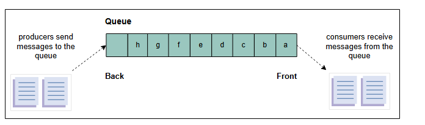

# Требования к дизайну распределенной очереди сообщений

Узнайте о требованиях к проектированию распределенной очереди сообщений на примере предварительного решения.

## Требования

В **распределенной очереди сообщений** данные находятся на нескольких машинах. Наша цель — спроектировать распределенную очередь сообщений, отвечающую следующим функциональным и нефункциональным требованиям.

### Функциональные требования

Ниже перечислены действия, которые клиент должен иметь возможность выполнять:

*   **Создание очереди:** Клиент должен иметь возможность создавать очередь и задавать некоторые параметры, например, имя очереди, **размер очереди** и **максимальный размер сообщения**.
*   **Отправка сообщения:** Сущности-производители должны иметь возможность отправлять сообщения в предназначенную для них очередь.
*   **Получение сообщения:** Сущности-потребители должны иметь возможность получать сообщения из своих соответствующих очередей.
*   **Удаление сообщения:** Процессы-потребители должны иметь возможность удалять сообщение из очереди после его успешной обработки.
*   **Удаление очереди:** Клиенты должны иметь возможность удалять определенную очередь.

### Нефункциональные требования

Наш дизайн распределенной очереди сообщений должен соответствовать следующим нефункциональным требованиям:

*   **Долговечность (Durability):** Данные, полученные системой, должны быть долговечными и не должны теряться. Производители и потребители могут выходить из строя независимо друг от друга, и очередь с долговечностью данных критически важна для работы всей системы, поскольку другие сущности полагаются на эту очередь.
*   **Масштабируемость (Scalability):** Система должна быть масштабируемой и способной справляться с возросшей нагрузкой, количеством очередей, производителей, потребителей и сообщений. Аналогично, при снижении нагрузки система должна уметь соответствующим образом сокращать ресурсы.
*   **Доступность (Availability):** Система должна быть высокодоступной для получения и отправки сообщений. Она должна продолжать работать без перебоев даже после сбоя одного или нескольких ее компонентов.
*   **Производительность (Performance):** Система должна обеспечивать высокую пропускную способность и низкую задержку.

## Односерверная очередь сообщений

Прежде чем мы приступим к проектированию распределенной очереди сообщений, стоит вспомнить, как очереди используются в рамках одного сервера, где процессы-производители и потребители также находятся на одном узле. Производитель или потребитель могут получить доступ к односерверной очереди, используя механизм блокировки во избежание несогласованности данных. Очередь считается критической секцией, где в один момент времени доступ к данным может иметь только одна сущность — либо производитель, либо потребитель.

Однако несколько аспектов мешают нам использовать односерверную очередь сообщений в современной парадигме распределенных систем. Например, она становится недоступной для взаимодействующих процессов (производителей и потребителей) в случае аппаратных или сетевых сбоев. Более того, производительность серьезно страдает по мере увеличения конкуренции за блокировку. Кроме того, она не является ни масштабируемой, ни долговечной.

*
Несколько производителей и потребителей взаимодействуют через одну очередь сообщений
*

> **На подумать**
>
> 1. Можем ли мы расширить дизайн односерверной очереди сообщений до распределенной?
> 

>  
<b>Показать</b>

> Очередь обмена сообщениями на одном сервере имеет следующие недостатки:
>
> Высокая задержка: как и в случае с очередью обмена сообщениями на одном сервере, производитель или потребитель блокирует доступ к очереди. Таким образом, этот механизм становится узким местом, когда многие процессы пытаются получить доступ к очереди. Это увеличивает задержку службы.
>
> Низкая доступность: из-за отсутствия репликации очереди обмена сообщениями процесс-производитель и процесс-потребитель могут не иметь доступа к очереди в случае сбоя. Это снижает доступность и надежность системы.
>
> Недостаток надежности: Из-за отсутствия репликации данные в очереди могут быть потеряны в случае сбоя системы.
>
> Масштабируемость: Очередь обмена сообщениями на одном сервере может обрабатывать ограниченное количество сообщений, отправителей и потребителей. Поэтому она не масштабируема.
>
> Чтобы расширить структуру очереди обмена сообщениями с одним сервером до распределенной очереди обмена сообщениями, нам необходимо приложить значительные усилия для устранения недостатков, описанных выше.
>  

## Строительные блоки, которые мы будем использовать

При проектировании распределенной очереди сообщений используются следующие строительные блоки:

*   **База(ы) данных** потребуется для хранения метаданных очередей и пользователей.
*   **Кэши** важны для хранения часто используемых данных, будь то данные, относящиеся к пользователям, или метаданные очередей.
*   **Балансировщики нагрузки** используются для направления входящих запросов на серверы, где хранятся метаданные.

В нашем обсуждении очередей сообщений мы сосредоточились на их функциональных и нефункциональных требованиях. Прежде чем перейти к процессу проектирования распределенной очереди сообщений, нам необходимо обсудить некоторые ключевые соображения и проблемы, которые могут повлиять на дизайн.