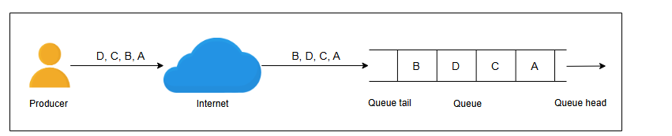
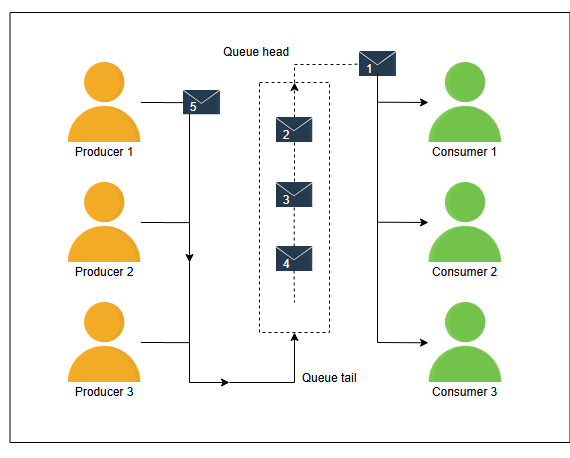

# Аспекты проектирования распределенной очереди сообщений

Узнайте о факторах, которые влияют на проектирование очереди сообщений.

Прежде чем мы приступим к проектированию распределенной очереди сообщений, давайте обсудим некоторые основные факторы, которые могут существенно повлиять на дизайн. К ним относятся порядок сообщений, влияние этого порядка на производительность и управление конкурентным доступом к очереди. Мы подробно обсудим каждый из этих факторов ниже.

## Порядок сообщений

Очередь сообщений используется для получения сообщений от производителей. Эти сообщения потребляются потребителями в их собственном темпе. Некоторые операции являются критически важными и требуют строгого порядка выполнения задач, определяемого сообщениями в очереди. Например, при общении в мессенджере с другом сообщения должны доставляться по порядку; в противном случае такое общение может быть, мягко говоря, запутанным. Аналогично, электронные письма, получаемые пользователем от разных людей, могут не требовать строгого порядка. Поэтому в некоторых случаях строгий порядок входящих сообщений в очереди важен, в то время как многие сценарии использования могут допускать некоторое переупорядочивание.

Давайте обсудим две следующие категории упорядочивания сообщений в очереди:

*   *Упорядочивание по мере поступления*
*   *Строгий порядок*

> 

>  
<b>Как порядок связан с сообщениями?</b>

> В очереди порядок следования сообщений неявно связан с поступающими сообщениями. Как только сообщения помещаются в очередь, при получении и обработке этих сообщений соблюдается тот же порядок.
>
> Для одновременных производителей, помещающих сообщения в одну и ту же очередь, порядок не определен до тех пор, пока производители не предоставят информацию о заказе, например, временные метки или порядковые номера. Без какой-либо информации о заказе очередь помещает сообщения в очередь в том порядке, в каком они поступают в службу.
>
> Для одновременных пользователей, получающих сообщения из одной и той же очереди, упорядочение может снова стать сложной проблемой. Хотя очередь может передавать сообщения одно за другим в том же порядке, в котором они были введены в очередь, двум пользователям, обрабатывающим два сообщения практически одновременно, может потребоваться механизм упорядочения, зависящий от конкретного приложения. Очередь может помочь, если при выдаче сообщения из очереди пометить информацию о заказе, порядковый номер или временную метку сообщения.
>  

### Упорядочивание по мере поступления

При подходе **упорядочивания по мере поступления** система помещает сообщения в указанную очередь в том же порядке, в котором они были получены.

Например, как показано на следующем рисунке, производитель отправляет четыре сообщения: A, B, C и D, в указанном порядке. Из-за перегрузки сети или какой-либо другой проблемы сообщение B получено после сообщения D. Следовательно, порядок сообщений на принимающей стороне: A, C, D и B. Таким образом, при этом подходе сообщения будут помещены в очередь в том же порядке, в котором они были получены, а не в том, в котором они были созданы на стороне клиента.

*
Упорядочивание по мере поступления: Сообщения помещаются в очередь в том порядке, в котором они получены, а не в том, в котором они были отправлены
*

### Строгий порядок

Техника строгого упорядочивания более строго сохраняет порядок сообщений. При этом подходе сообщения помещаются в очередь в том порядке, в котором они были созданы.

Прежде чем поместить сообщения в очередь в правильной последовательности, крайне важно иметь механизм для определения порядка, в котором сообщения были созданы на стороне клиента. Часто для маркировки сообщения при его создании используется уникальный идентификатор или временная метка.

> **На подумать**
>
> 1. Кто будет отвечать за предоставление порядковых номеров?
> 

>  
<b>Показать</b>

> Система предоставляет клиенту необходимые библиотеки или API-интерфейсы для присвоения порядковых номеров сообщениям, создаваемым на стороне клиента.
>  

Для упорядочивания входящих сообщений можно использовать один из следующих трех подходов:

1.  **Монотонно возрастающие номера:**
    Один из способов упорядочить входящие сообщения — присваивать им монотонно возрастающие номера на стороне сервера. Когда приходит первое сообщение, система присваивает ему номер, например, 1. Затем она присваивает номер 2 второму сообщению и так далее.
    Однако у этого подхода есть потенциальные недостатки. Во-первых, при получении большого количества запросов это становится узким местом, что влияет на производительность системы, поскольку система должна присваивать идентификатор сообщению в определенной последовательности, в то время как другие сообщения ждут своей очереди.
    Во-вторых, это все еще не решает проблему, возникающую, когда сообщение получено раньше того, которое было создано ранее на стороне клиента. Из-за этого не гарантируется, что будет сгенерирован правильный порядок для сообщений, созданных на стороне клиента.

2.  **Сортировка на основе причинности на стороне сервера:** Учитывая недостатки использования монотонно возрастающих номеров, другим подходом для проставления временных меток и упорядочивания входящих сообщений является сортировка на основе причинности. При этом подходе сообщения сортируются на основе временной метки, созданной на стороне клиента, и соответствующим образом помещаются в очередь. Основным недостатком этого подхода является то, что для нескольких клиентских сессий сервис не может определить порядок с точки зрения реального времени.

3.  **Использование временных меток на основе синхронизированных часов:** Чтобы решить потенциальные проблемы, возникающие с обоими описанными выше подходами, мы можем использовать другой подходящий метод для присвоения временных меток сообщениям, основанный на синхронизированных часах. При этом подходе временная метка (ID), присвоенная каждому сообщению через синхронизированные часы, является уникальной и соответствует правильной последовательности создания сообщений. Мы можем добавить к временной метке уникальный идентификатор процесса, чтобы сделать общий идентификатор сообщения уникальным и справиться с ситуацией, когда две параллельные сессии запрашивают временную метку в одно и то же время. Более того, при таком подходе сервер может легко идентифицировать задержанные сообщения на основе временной метки и ожидать их.
    Как мы обсуждали в разделе о строительном блоке секвенсор, мы можем получить порядковые номера, которые выполняют двойную функцию: как порядковые номера и как глобально синхронизированные временные метки реального времени. Используя этот подход, наш сервис может также глобально упорядочивать сообщения между клиентскими сессиями.

В заключение, наиболее подходящим механизмом для предоставления уникального ID или временной метки входящим сообщениям из трех описанных выше подходов является использование синхронизированных часов.

#### Сортировка

Как только сообщения получены на стороне сервера, нам нужно отсортировать их на основе их временных меток. Для этой цели мы используем подходящий алгоритм **онлайн-сортировки**.

> **На подумать**
>
> 1. Предположим, что сообщение, отправленное ранее, приходит с опозданием из-за задержки в сети. Каков будет правильный подход к обработке такой ситуации?
> 

>  
<b>Показать</b>

> Простым решением в таких случаях является изменение порядка в очереди. Из этого могут возникнуть два сценария. Во-первых, при изменении порядка сообщения размещаются в правильном порядке. Во-вторых, мы уже рассылали новые сообщения пользователям.
>
> Если старое сообщение приходит после того, как мы уже отправили новое сообщение, мы помещаем его в специальную очередь, и клиент обрабатывает эту ситуацию. Позже клиент может решить, использовать ли это сообщение, если оно не влияет на предполагаемую операцию, или отбросить его, если оно не требуется.
>  

## Влияние на производительность

В первую очередь, очередь предназначена для операций **«первым пришел — первым вышел» (FIFO)**. Операции FIFO предполагают, что первое сообщение, поступившее в очередь, всегда выдается первым. Однако в распределенных системах поддерживать этот строгий порядок непросто. Поскольку сообщение A было создано раньше сообщения B, все еще неясно, будет ли сообщение A потреблено раньше сообщения B. Использование монотонно возрастающих идентификаторов сообщений или идентификаторов, несущих причинно-следственную связь, обеспечивает высокую пропускную способность при помещении сообщений в очередь. Хотя необходимость в онлайн-сортировке для обеспечения строгого порядка требует некоторого времени, прежде чем сообщения будут готовы к извлечению. Чтобы минимизировать задержку, вызванную онлайн-сортировкой, мы используем подход **«временного окна»**.

Аналогично, для строгого порядка на принимающей стороне нам нужно сериализовать все запросы, чтобы выдавать сообщения одно за другим. Если это не требуется, мы получаем лучшую пропускную способность и меньшую задержку на принимающей стороне.

Из-за вышеупомянутых причин многие решения для распределенных очередей сообщений либо не гарантируют строгий порядок, либо имеют ограничения по пропускной способности. Как мы видели ранее, очереди должны выполнять множество дополнительных проверок и операций координации для поддержания порядка.

> Временное окно -  Мы должны отсортировать сообщения, полученные в течение определенного периода времени, а затем поместить их в соответствующую очередь (самые старые будут помещены в очередь первыми).

### Управление конкурентным доступом

Конкурентный доступ к очереди требует надлежащего управления. Конкуренция может возникать на следующих этапах:

*   Когда несколько сообщений приходят одновременно.
*   Когда несколько потребителей одновременно запрашивают сообщение.

Первое решение — использовать механизм блокировки. Когда процесс или поток запрашивает сообщение, он должен получить блокировку для размещения или потребления сообщений из очереди. Однако, как обсуждалось ранее, у этого подхода есть несколько недостатков. Он не является ни масштабируемым, ни производительным.

Другое решение — сериализовать запросы с помощью системного буфера на обоих концах очереди, чтобы входящие сообщения помещались в определенном порядке, а процессы-потребители также получали сообщения в порядке их поступления. Под сериализацией запросов мы подразумеваем, что запросы (на помещение или извлечение данных), поступающие на сервер, будут поставлены в очередь операционной системой, и один поток приложения будет помещать их в очередь (можно предположить, что оба типа запросов, на помещение и извлечение, приходят на один и тот же порт) без какой-либо блокировки. Это будет возможное решение без блокировок, обеспечивающее высокую пропускную способность. Это более жизнеспособное решение, поскольку оно может помочь нам избежать возникновения состояний гонки.

Приложения могут использовать несколько очередей с выделенными производителями и потребителями, чтобы контролировать затраты на упорядочивание для каждой очереди, хотя это достигается за счет более сложной логики приложения.

*
Избежание состояний гонки: Производители и потребители сериализуются на обоих концах очереди
*

В этом уроке мы обсудили некоторые ключевые соображения и проблемы в процессе проектирования очереди сообщений и ответили на следующие вопросы:

*   Почему важен порядок сообщений, и как мы его обеспечиваем?
*   Как упорядочивание влияет на производительность?
*   Как мы справляемся с конкурентным доступом к очереди?

Теперь мы готовы приступить к проектированию распределенной очереди сообщений.