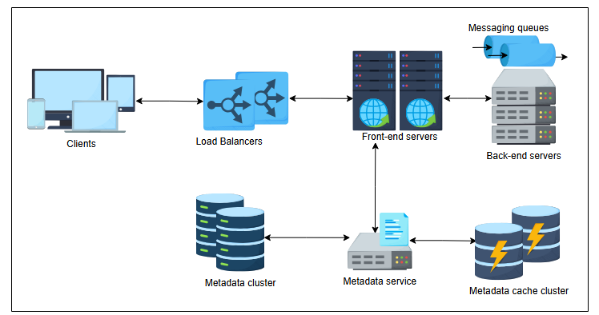
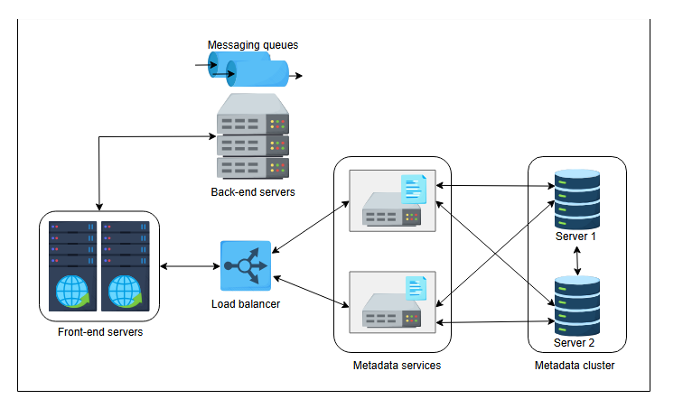
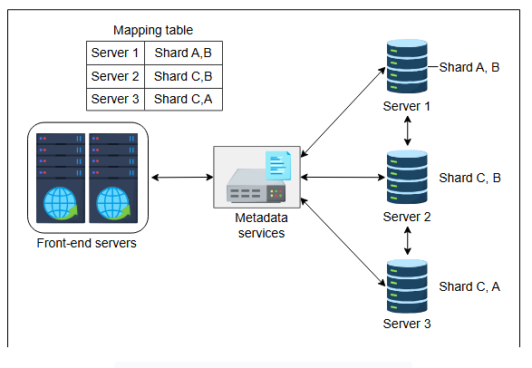
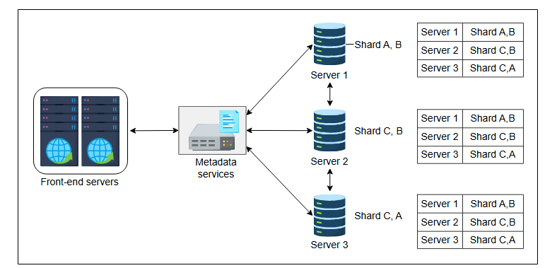

# Проектирование распределенной очереди сообщений: Часть 1

Узнайте о высокоуровневом проектировании очереди сообщений и о том, как масштабировать метаданные очередей.

До сих пор мы обсуждали требования и аспекты проектирования распределенной очереди сообщений. Теперь давайте начнем с изучения
высокоуровневого проектирования распределенной очереди сообщений.

## Распределенная очередь сообщений

В отличие от односерверной очереди сообщений, распределенная очередь сообщений размещается на нескольких серверах. У распределенной очереди
сообщений есть свои проблемы. Однако при правильном проектировании она устраняет недостатки односерверного решения.

Следующие разделы посвящены вопросам масштабируемости, доступности и долговечности при проектировании распределенной очереди сообщений,
знакомя нас с более отказоустойчивой архитектурой очереди сообщений.

### Высокоуровневое проектирование

Прежде чем углубляться в проектирование, давайте сделаем следующие допущения, чтобы сделать обсуждение проще и понятнее. В последующих
материалах мы обсудим, как эти допущения позволяют нам устранить проблемы односерверного решения для очереди сообщений.

1. Данные очереди реплицируются с использованием системы "ведущий-ведомый" (primary-secondary) или системы на основе кворума (подробнее см.
   в уроке Репликация данных). Наш сервис может использовать партиционирование данных, если очередь становится слишком длинной для одного
   сервера. Для этого мы можем использовать схему, подобную консистентному хешированию, или мы можем использовать хранилище "ключ-значение",
   где ключом могут быть порядковые номера сообщений. В этом случае каждый шард соответствующим образом реплицируется (подробнее об этом см.
   в уроке Партиционирование).

2. Мы также предполагаем, что наша система может автоматически расширять и сокращать ресурсы по мере необходимости для оптимального их
   использования.

На следующей схеме показано высокоуровневое проектирование распределенной очереди сообщений, состоящей из нескольких компонентов.

*Высокоуровневая архитектура распределенной очереди сообщений*

Основные компоненты нашего проекта подробно описаны ниже.

#### Балансировщик нагрузки

Уровень балансировщика нагрузки принимает запросы от производителей и потребителей, которые перенаправляются на один из front-end серверов.
Этот уровень состоит из множества балансировщиков нагрузки. Благодаря этому запросы принимаются с минимальной задержкой и обеспечивается
высокая доступность.

#### Front-end сервис

Front-end сервис состоит из stateless-машин (машин без состояния), распределенных по центрам обработки данных. Front-end предоставляет
следующие услуги:

* **Валидация запроса:** Обеспечивает корректность запроса и проверяет, содержит ли он всю необходимую информацию.
* **Аутентификация и авторизация:** Этот сервис проверяет, является ли запрашивающий действительным пользователем и авторизован ли он для
  использования этих сервисов.
* **Кэширование:** В кэше front-end хранится информация о метаданных часто используемых очередей. Наряду с этим здесь также кэшируются
  данные, связанные с пользователем, для сокращения времени ответа от сервисов аутентификации и авторизации.
* **Диспетчеризация запросов:** Front-end также отвечает за вызов двух других сервисов: back-end и хранилища метаданных. Различение вызовов
  к этим двум сервисам является одной из обязанностей front-end.
* **Дедупликация запросов:** Front-end также отслеживает информацию обо всех запросах, поэтому он предотвращает попадание **идентичных
  запросов** в очередь. Решение о том, что делать с дубликатами, может быть таким же простым, как поиск хеш-ключа в хранилище. Если что-то
  найдено в хранилище, это означает дубликат, и сообщение может быть отклонено.
* **Сбор данных об использовании:** Это относится к сбору данных в реальном времени, которые могут быть использованы для аудита.

> Метаданные очереди обмена сообщениями обычно включают важную информацию, такую как название очереди, атрибуты, параметры конфигурации, а также могут включать такие детали, как политики хранения сообщений, разрешения доступа и показатели, относящиеся к конкретной очереди. Он служит важным ориентиром для управления поведением и характеристиками очереди сообщений в распределенной системе.

#### Сервис метаданных

Этот компонент отвечает за хранение, извлечение и обновление метаданных очередей в хранилище (store) и кэше (cache) метаданных. Всякий раз,
когда очередь создается или удаляется, хранилище и кэш метаданных соответствующим образом обновляются. Сервис метаданных действует как
промежуточное ПО (middleware) между front-end серверами и уровнем данных. Поскольку метаданные очередей хранятся в кэше, front-end серверы
сначала проверяют кэш на наличие любой релевантной информации, связанной с полученным запросом. В случае промаха кэша (cache miss)
информация извлекается из хранилища метаданных, и кэш обновляется.

> Хранилище (store) - Кластер постоянного хранилища данных, отвечающий за хранение метаданных, относящихся ко всем очередям, доступным в системе.
> Кэш (cache) - Кластер метаданных, к которому часто обращаются всякий раз, когда поступают запросы клиентов.

Существует два разных подхода к организации кластеров кэша метаданных:

1. Если объем метаданных для хранения невелик и может поместиться на одной машине, то они реплицируются на каждом сервере кластера.
   Следовательно, запрос может быть обслужен с любого случайного сервера. В этом подходе между front-end серверами и сервисами метаданных
   также может быть введен балансировщик нагрузки.

   

*Между front-end серверами и сервисами метаданных добавлен балансировщик нагрузки*

2. Если объем метаданных для хранения слишком велик, можно использовать один из следующих подходов:
    * Первая стратегия — использовать подход с **шардингом** для разделения данных на разные шарды. Шардинг может выполняться на основе
      некоторого ключа партиционирования или техник хеширования, как обсуждалось в уроке
      о  партиционировании баз данных. Каждый шард
      хранится на отдельном хосте в кластере. Более того, каждый шард также реплицируется на разных хостах для повышения доступности. В этом
      подходе к организации кластера на front-end сервере есть таблица сопоставления (mapping table) между шардами и хостами. Таким образом,
      front-end сервер отвечает за перенаправление запросов на хост, где хранятся данные.

   

    *Таблица маршрутизации находится на front-end серверах*

    * Второй подход похож на первый. Однако в этом подходе таблица сопоставления хранится на каждом хосте, а не только на front-end
      серверах. Благодаря этому любой случайный хост может получить запрос и перенаправить его на хост, где находятся данные. Эта техника
      подходит для приложений с интенсивным чтением.

   

*Таблица маршрутизации находится на каждом сервере метаданных*

В нашем обсуждении распределенных очередей сообщений мы сосредоточились на высокоуровневом проектировании этого типа очередей. Кроме того,
мы рассмотрели каждый компонент высокоуровневого проекта, включая следующие:

* Front-end серверы и сервисы, необходимые для их бесперебойной работы.
* Балансировщики нагрузки.
* Сервисы метаданных.
* Кластеры метаданных и их организация.

Важной частью проекта является организация серверов на back-end для создания, удаления очередей и других подобных операций. Следующий урок
посвящен организации back-end серверов и управлению очередями, а также другим важным операциям, связанным с доставкой и извлечением
сообщений.