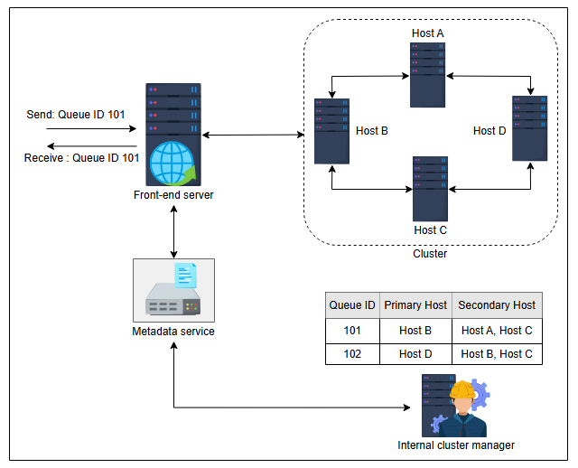
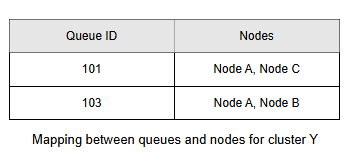
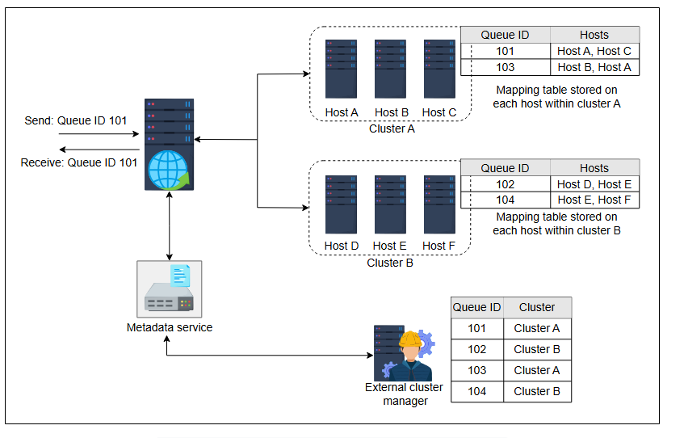

# Проектирование распределенной очереди сообщений: Часть 2
Узнайте о детальном проектировании очереди сообщений и управлении ею на back-end серверах.

В предыдущем уроке мы обсуждали обязанности front-end серверов и сервисов метаданных. В этом уроке мы сосредоточимся на основной части проекта, где хранятся очереди и сообщения: back-end сервисе.

## Back-end сервис
Это ядро архитектуры, где происходят основные действия. Когда front-end получает сообщение, он обращается к сервису метаданных, чтобы определить хост, на который необходимо отправить сообщение. Затем сообщение пересылается на этот хост и реплицируется на соответствующие хосты, чтобы предотвратить возможные проблемы с доступностью. Репликация сообщений в кластере на разных хостах может выполняться с использованием одной из двух следующих моделей:

1.  *Модель «ведущий-ведомый» (Primary-secondary)*
2.  *Кластер независимых хостов*

Прежде чем углубляться в детали этих моделей, давайте обсудим два типа менеджеров кластеров, отвечающих за управление очередями: *внутренний* и *внешний*. Различия между этими двумя менеджерами кластеров показаны в следующей таблице.

### Сравнение внутреннего и внешнего менеджеров кластеров

| **Внутренний менеджер кластера** | **Внешний менеджер кластера** |
| :--- | :--- |
| Управляет назначением очередей внутри кластера. | Управляет назначением очередей между кластерами. |
| Знает о каждом узле внутри кластера. | Знает о каждом кластере. Однако у него нет информации о каждом хосте, который находится внутри кластера. |
| Прослушивает сигналы "heartbeat" от каждого узла. | Отслеживает состояние каждого независимого кластера. |
| Управляет сбоями хостов, добавлением и удалением экземпляров из кластера. | Управляет и использует кластеры. |
| Разделяет очередь на несколько частей, и каждая часть получает ведущий сервер. | Может разделять очередь между несколькими кластерами, чтобы сообщения для одной и той же очереди были равномерно распределены между несколькими кластерами. |

### Модель «ведущий-ведомый» (Primary-secondary model)
В **модели «ведущий-ведомый»** каждый узел считается **ведущим хостом** для набора очередей. Обязанностью ведущего хоста является прием запросов для определенной очереди и полная ответственность за репликацию данных. Запрос принимается front-end'ом, который, в свою очередь, связывается с сервисом метаданных для определения ведущего хоста для этого запроса.

Например, предположим, у нас есть две очереди с идентификаторами 101 и 102, расположенные на четырех разных хостах A, B, C и D. В этом примере экземпляр B является ведущим хостом очереди 101, а ведомыми хостами, куда реплицируется очередь 101, являются A и C. Когда front-end получает запросы на сообщения, он определяет ведущий сервер через внутреннего менеджера кластера с помощью сервиса метаданных. Сообщение извлекается из ведущего экземпляра, который также отвечает за удаление исходного сообщения и всех его реплик после использования.

Как показано на следующей иллюстрации, внутренний менеджер кластера является компонентом, отвечающим за сопоставление ведущего хоста, ведомых хостов и очередей. Кроме того, он помогает в выборе ведущего хоста. Поэтому он должен быть надежным, масштабируемым и производительным.

*Модель «ведущий-ведомый» для распределенной очереди: получен запрос для очереди с ID 101, который обслуживается соответствующим образом*

### Кластер независимых хостов
В подходе с **кластером независимых хостов** у нас есть несколько кластеров из множества независимых хостов, распределенных по центрам обработки данных. Когда front-end получает сообщение, он определяет соответствующий кластер через сервис метаданных от внешнего менеджера кластера. Затем сообщение пересылается на случайный хост в кластере, который реплицирует сообщение на другие хосты, где хранится очередь.

> **Вопрос на размышление**
>
> 1.  Как случайный хост внутри кластера реплицирует данные, то есть сообщения, в очередях на других хостах в том же кластере?
> 

>  
<b>Показать</b>

> Каждый узел состоит из сопоставления между очередями и узлами внутри кластера, что упрощает репликацию.
>
> Предположим, что у нас есть кластер, скажем, Y, с узлами A, B и C. В этом кластере есть две очереди с идентификаторами 101 и 103, хранящимися на разных узлах, как показано в следующей таблице. Эта таблица хранится на каждом узле в кластере Y. Когда случайный узел получает сообщение, скажем, узел C, для очереди, имеющей идентификатор 103, узел C реплицирует это сообщение на других узлах, где хранится очередь 103, то есть на узлах A и B.
>
>  

Тот же процесс применяется для получения запросов на сообщения от потребителя. Аналогично первому подходу, случайно выбранный хост отвечает за доставку сообщения и его очистку после успешной обработки.

Кроме того, вводится еще один компонент, называемый **внешним менеджером кластера**, который отвечает за поддержание сопоставления между очередями и кластерами, как показано на следующем рисунке. Внешний менеджер кластера также отвечает за управление очередями и назначение кластера определенной очереди.

На следующем рисунке показан кластер независимых хостов. Есть два кластера, A и B, которые состоят из нескольких узлов. Внешний менеджер кластера имеет таблицу сопоставления между очередями и их соответствующими кластерами. Всякий раз, когда front-end получает запрос для очереди, он определяет соответствующий кластер для этой очереди и пересылает запрос в кластер, где находится очередь. Узлы внутри этого кластера отвечают за хранение и отправку сообщений соответствующим образом.

*Кластер независимых хостов, состоящий из распределенных очередей*

> **Вопрос на размышление**
>
> 1.  Какие аномалии могут возникнуть при репликации сообщений на другие хосты?
> 

>  
<b>Показать</b>

> Существует два способа репликации сообщений в очереди, размещенной на нескольких хостах.
>
>  1 Синхронная репликация
> 
>  2 Асинхронная репликация
> 
>  При синхронной репликации основной хост отвечает за репликацию сообщения во все соответствующие очереди на других хостах. После подтверждения от дополнительных хостов основной хост уведомляет клиента о получении сообщений. При таком подходе сообщения остаются согласованными во всех репликах очередей; однако это приводит к дополнительной задержке обмена данными и приводит к частичной или полной недоступности во время проведения выборов для продвижения вторичного сообщения в качестве основного.
>
> При асинхронной репликации, как только основной хост получает сообщения, он подтверждает связь с клиентом и на следующем шаге начинает реплицировать сообщение на других хостах. Этот подход сопряжен с другими проблемами, такими как задержка репликации и проблемы с согласованностью.
>
> Исходя из потребностей приложения, мы можем выбрать то или иное.
>  

Мы завершили проектирование распределенной очереди сообщений и обсудили две модели организации back-end сервера. Мы также описали процесс управления очередями и то, как сообщения обрабатываются на back-end. Кроме того, мы обсудили, как back-end серверы управляются с помощью различных менеджеров кластеров.

В следующем уроке мы обсудим, как наша система удовлетворяет функциональным и нефункциональным требованиям, которые были описаны ранее в этой главе.