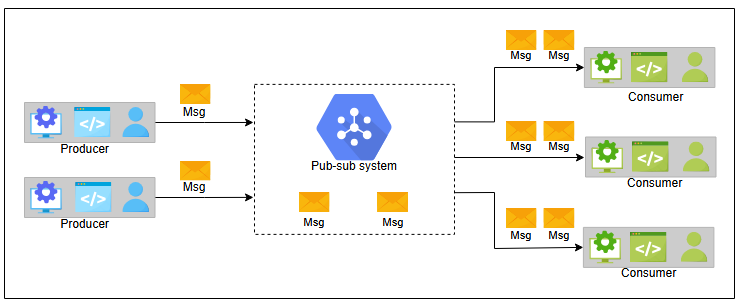

# Проектирование систем: Абстракция «Издатель-подписчик» (Pub-Sub)

Знакомство с основами проектирования системы «издатель-подписчик».

## Что такое система «издатель-подписчик»?
Обмен сообщениями по схеме **«издатель-подписчик»** (publish-subscribe), часто называемый **pub-sub**, — это асинхронный метод межсервисного взаимодействия, популярный в бессерверных (serverless) и микросервисных архитектурах.

С помощью системы pub-sub сообщения могут асинхронно отправляться различным подсистемам. Все сервисы, подписанные на модель pub-sub, получают сообщение, отправленное в систему.

Например, когда известный спортсмен публикует пост в Instagram или делится твитом, все его подписчики получают обновление. Здесь спортсмен — это издатель (publisher), его пост или твит — это сообщение, а все его подписчики — это подписчики (subscribers).

*Система «издатель-подписчик»*

## Мотивация
Аппаратная инфраструктура распределенных систем состоит из миллионов машин. Использование системы pub-sub для асинхронной связи повышает масштабируемость. Производители (producers) и потребители (consumers) разъединены и работают независимо, что позволяет нам масштабировать и разрабатывать их по отдельности. Такое разделение (decoupling) между компонентами — производителями и потребителями — обеспечивает большую масштабируемость, поскольку добавление или удаление любого компонента не влияет на другие компоненты.

## Как спроектировать систему «издатель-подписчик»?
Мы разделили проектирование системы pub-sub на следующие уроки:

1.  **Введение**: В этом уроке мы изучим сценарии использования системы pub-sub, определим ее требования и спроектируем для нее API.
2.  **Проектирование**: В этом уроке мы обсудим два варианта проектирования системы pub-sub: один с использованием очередей сообщений, а другой — с брокером.