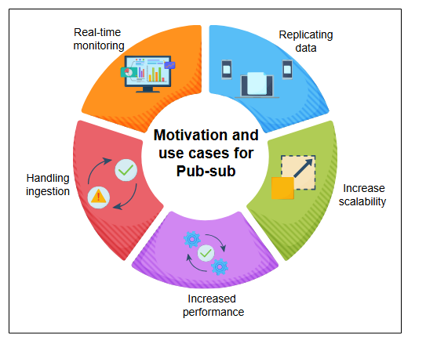
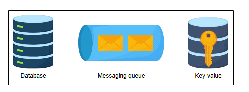

# Введение в Pub-sub

Узнайте о сценариях использования системы pub-sub, как определить ее требования и спроектировать для нее API.


Обмен сообщениями по схеме «издатель-подписчик» обеспечивает асинхронную связь. Давайте рассмотрим сценарии, в которых система pub-sub приносит пользу.

## Сценарии использования pub-sub
Ниже перечислены некоторые сценарии использования pub-sub:

*   **Повышение производительности**: Система pub-sub обеспечивает push-доставку, избавляя получателей сообщений от необходимости регулярно проверять наличие новой информации и изменений. Это способствует более быстрому времени отклика и снижает задержку доставки.
*   **Обработка приема данных (ingestion)**: Pub-sub помогает в обработке **сбора логов**. Данные о взаимодействии с пользователем могут помочь нам получить полезный анализ поведения пользователей. Мы можем передавать в систему pub-sub большие объемы данных, которые она, в свою очередь, может доставлять в любую аналитическую систему для понимания поведенческих моделей. Более того, мы также можем логировать детали событий, происходящих при выполнении запроса от пользователя. Крупные сервисы, такие как Meta, используют систему pub-sub под названием Scribe, чтобы точно знать, кому какие данные нужны, и удалять или архивировать обработанные или ненужные данные. Это необходимо для управления огромным количеством данных.
*   **Мониторинг в реальном времени**: Необработанные или обработанные сообщения приложения или системы могут предоставляться нескольким приложениям для мониторинга системы в реальном времени.
*   **Репликация данных**: Система pub-sub может использоваться для распространения изменений. Например, в протоколе «лидер-ведомый» (leader-follower) лидер отправляет изменения своим ведомым через систему pub-sub. Это позволяет ведомым асинхронно обновлять свои данные. Распределенные кэши также могут обновляться, получая изменения асинхронно. Аналогичным образом, приложения вроде WhatsApp, которые позволяют иметь несколько представлений одной и той же беседы — например, на мобильном телефоне и в браузере компьютера — могут элегантно работать с использованием pub-sub, где несколько представлений могут выступать как в роли издателя, так и в роли подписчика.



*Мотивация и сценарии использования системы pub-sub*

> ### Вопросы для размышления
> 1. Каковы сходства и различия между системой pub-sub и очередями?
>
> <details>
> <summary>Показать ответ</summary>
> Как системы pub-sub, так и очереди сообщений обеспечивают асинхронную связь. Основное различие заключается в том, как сообщения доставляются потребителям. В очередях сообщение обычно доставляется одному потребителю. В системе pub-sub сообщение доставляется всем подписчикам topic.
> </details>
>
> 2. Как producers и producers и consumers отделены друг от друга в системе pub-sub?
>
> <details>
> <summary>Показать ответ</summary>
> Producers не знают, кто в конечном итоге прочтет их информацию. Они просто отправляют ее в систему, и consumer считывает ее. Система действует как разделительный слой между producers и consumers. На производителей не влияют медлительность consumers, их количество или сбои в работе. Мы можем масштабировать их самостоятельно.
> </details>

## Требования
Мы стремимся спроектировать систему pub-sub, отвечающую следующим требованиям.

### Функциональные требования
Давайте определим функциональные требования к системе pub-sub:

*   **Создание topic**: producer должен иметь возможность создать topic.
*   **Запись сообщений**: producer должны иметь возможность записывать сообщения в topic.
*   **Подписка**: consumers должны иметь возможность подписываться на topic для получения сообщений.
*   **Чтение сообщений**: consumers должен иметь возможность читать сообщения из topic.
*   **Указание времени хранения**: consumers должны иметь возможность указывать время хранения, по истечении которого сообщение должно быть удалено из системы.
*   **Удаление сообщений**: Сообщение должно удаляться из topic или системы по истечении определенного периода хранения, заданного пользователем системы.

> ℹ️ **Упражнение**
>
> Вы проектируете приложение для чата в реальном времени, в котором есть каналы для разных обсуждений. Объясните, как бы вы использовали систему pub-sub для его компонента обмена сообщениями.
>
> Опишите, как компоненты чат-приложения соотносятся со следующими компонентами pub-sub:
> *   Topics
> *   Subscribers
> *   Как будет работать доставка сообщений
>
> <details>
> <summary>Показать ответ</summary>
> В системе pub-sub для приложения для чата в режиме реального времени:
>
> Topics: Это каналы, на которых происходят обсуждения.
>
> Subscribers: Это пользователи, которые являются частью канала и получают от него сообщения.
>
> Доставка сообщений: Когда пользователь отправляет сообщение, он публикует его в соответствующей теме. Затем посредник pub-sub рассылает это сообщение всем подписчикам этой темы.
> 
> </details>

### Нефункциональные требования
При проектировании системы pub-sub мы учитываем следующие нефункциональные требования:

*   **Масштабируемость (Scalable)**: Система должна масштабироваться при увеличении количества topic и нагрузки на запись (со стороны производителей) и чтение (со стороны потребителей).
*   **Высокая доступность (Available)**: Система должна быть высокодоступной, чтобы производители могли добавлять свои данные, а потребители — читать их в любое время.
*   **Надежность хранения (Durability)**: Система должна быть надежной. Сообщения, принятые от производителей, не должны теряться и должны доставляться предполагаемым подписчикам.
*   **Отказоустойчивость (Fault tolerance)**: Наша система должна быть способна работать в случае сбоев.
*   **Конкурентность (Concurrent)**: Система должна справляться с проблемами конкурентного доступа, когда чтение и запись выполняются одновременно.

## Проектирование API
Мы исключим некоторые параметры из приведенных ниже функций, такие как идентификатор производителя или потребителя. Будем считать, что эта информация доступна из контекста нижележащего соединения. Проектирование API для этой задачи выглядит следующим образом:

**Создание topic**
Вызов API для создания topic должен выглядеть так:
```
create(topic_ID, topic_name)
```
Эта функция возвращает подтверждение в случае успешного создания topic или ошибку, если создать topic не удалось.

| Параметр | Описание |
| :--- | :--- |
| `topic_ID` | Уникально идентифицирует topic. |
| `topic_name` | Содержит название topic. |

---

**Запись сообщения**
Вызов API для записи в систему pub-sub должен выглядеть так:
```
write(topic_ID, message)
```
Этот вызов API записывает `message` в topic с идентификатором `topic_ID`. Каждое сообщение может иметь максимальный размер 1 МБ. Эта функция вернет подтверждение, если успешно поместит данные в систему, или соответствующую ошибку в случае сбоя.

| Параметр | Описание |
| :--- | :--- |
| `message` | Сообщение для записи в систему. |

---

**Чтение сообщения**
Вызов API для чтения данных из системы должен выглядеть так:
```
read(topic_ID)
```
Тема находится по `topic_ID`, и вызов вернет вызывающей стороне объект, содержащий сообщение.

| Параметр | Описание |
| :--- | :--- |
| `topic_ID` | Идентификатор topic, из которой будет прочитано сообщение. |

---

**Подписка на topic**
Вызов API для подписки на topic в системе должен выглядеть так:
```
subscribe(topic_ID)
```
Функция добавляет потребителя в качестве подписчика к topic с `topic_ID`.

| Параметр | Описание |
| :--- | :--- |
| `topic_ID` | Идентификатор topic, на которую подписывается потребитель. |

---

**Отписка от topic**
Вызов API для отписки от topic в системе должен выглядеть так:
```
unsubscribe(topic_ID)
```
Функция удаляет потребителя из подписчиков topic с `topic_ID`.

| Параметр | Описание |
| :--- | :--- |
| `topic_ID` | Идентификатор topic, от которой отписывается потребитель. |

---

**Удаление topic**
Вызов API для удаления topic из системы должен выглядеть так:
```
delete_topic(topic_ID)
```
Функция удаляет topic на основе `topic_ID`.

| Параметр | Описание |
| :--- | :--- |
| `topic_ID` | Идентификатор удаляемой topic. |

## Компоненты, которые мы будем использовать
При проектировании pub-sub используются многие стандартные блоки, которые обсуждались в начальных главах. Мы будем рассматривать следующие уроки по стандартным блокам.



*Компоненты, которые мы будем использовать*

*   **База данных**: Мы будем использовать базы данных для хранения информации, такой как детали подписки.
*   **Распределенная очередь сообщений**: Мы будем использовать очередь сообщений для хранения сообщений, отправленных producer.
*   **Хранилище «ключ-значение»**: Мы будем использовать хранилище «ключ-значение» для хранения информации о consumers.

В следующем уроке мы сосредоточимся на проектировании системы pub-sub.