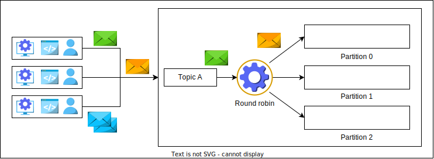

# Проектирование системы Pub-sub

Погрузимся в проектирование системы pub-sub и ее компонентов.

## Первый вариант проектирования

В предыдущем уроке мы обсуждали, что **producer** записывает в **topics**, а **consumers** подписываются на **topic**, чтобы читать из нее
сообщения. Поскольку новые сообщения добавляются в конец очереди, мы можем использовать распределенные очереди сообщений для **topics**.

Нам понадобятся следующие компоненты:

* **Очередь topic (Topic queue)**: Каждый **topic** будет представлять собой распределенную очередь сообщений, чтобы мы могли хранить
  сообщения, отправленные нам от **producer**. **Producer** будет записывать свои сообщения в эту очередь.
* **База данных**: Мы будем использовать реляционную базу данных, которая будет хранить детали подписки. Например, нам нужно хранить, какой
  **consumer** на какой **topic** подписан, чтобы мы могли предоставлять **consumers** желаемые сообщения. Мы будем использовать реляционную
  базу данных, так как данные о **consumers** структурированы, и мы хотим обеспечить целостность данных.
* **Диспетчер сообщений (Message director)**: Этот сервис будет читать сообщение из очереди **topic**, извлекать информацию о **consumers**
  из базы данных и отправлять сообщение в очередь **consumer**.
* **Очередь consumer (Consumer queue)**: Сообщение из очереди **topic** будет скопировано в очередь **consumer**, чтобы **consumer** мог его
  прочитать. Для каждого **consumer** мы определим отдельную распределенную очередь.
* **Сервис подписки (Subscriber)**: Когда **consumer** запрашивает подписку на **topic**, этот сервис добавит запись в базу данных.

**Consumer** подписывается на **topic**, и система добавляет данные о подписчике в базу данных. **Producer** записывает сообщения в **topics**, а диспетчер сообщений читает сообщение из очереди, извлекает информацию о том, кому его нужно доставить, и отправляет им. **Consumers**
получают сообщение из своей очереди.

> **Примечание**: Мы будем использовать сервисы резервирования (fail-over) для диспетчера сообщений и сервиса подписки для защиты от сбоев.

*Использование распределенной очереди сообщений*

Использование распределенных очередей сообщений делает наш проект простым. Однако огромное количество необходимых очередей является
серьезной проблемой. Если у нас миллионы подписчиков на тысячи **topics**, определение и поддержка миллионов очередей становятся
дорогостоящими. Более того, мы будем копировать одно и то же сообщение **topic** во все очереди подписчиков, что является ненужным
дублированием и занимает место.

> ### Вопросы для размышления
> 1. Есть ли способ избежать поддержки отдельной очереди для каждого читателя?
> 

> 
Показать ответ

> В очередях обмена сообщениями сообщение исчезает после того, как его получит читатель. Итак, что, если мы добавим счетчик для каждого сообщения? Значение счетчика уменьшается по мере того, как подписчик получает сообщение. Сообщение не удаляется, пока счетчик не станет равным нулю. Теперь нам не нужно создавать отдельную очередь для каждого читателя.
> 

## Второй вариант проектирования

Рассмотрим другой подход к проектированию системы pub-sub.

### Высокоуровневое проектирование

На высоком уровне система pub-sub будет иметь следующие компоненты:

* **Брокер (Broker)**: Этот сервер будет обрабатывать сообщения. Он будет хранить сообщения, отправленные **producer**, и позволять 
  **consumers** их читать.
* **Менеджер кластера (Cluster manager)**: У нас будет множество серверов-брокеров для удовлетворения потребностей в масштабируемости. Нам
  нужен менеджер кластера для контроля за состоянием брокеров. Он будет уведомлять нас о сбое брокера.
* **Хранилище (Storage)**: Мы будем использовать реляционную базу данных для хранения данных о **consumers**, таких как информация о
  подписке и периоде хранения.
* **Менеджер consumers (Consumer manager)**: Он отвечает за управление **consumers**. Например, он будет проверять, авторизован ли *
  *consumer** читать сообщение из определенного **topic**.

Помимо этих компонентов, у нас также есть следующие проектные соображения:

* **Подтверждение (Acknowledgment)**: Подтверждение используется для уведомления **producer** о том, что полученное сообщение было успешно
  сохранено. Система будет ожидать подтверждения от **consumer** об успешном потреблении сообщения.
* **Время хранения (Retention time)**: **Consumers** могут указывать период хранения своих сообщений. По умолчанию это семь дней, но
  значение можно настроить. Некоторые приложения, например, банковские, требуют хранения данных в течение нескольких недель в соответствии с
  бизнес-требованиями, в то время как аналитическому приложению данные могут не понадобиться после их потребления.

*Высокоуровневое проектирование системы pub-sub*

Давайте подробно разберем роль каждого компонента.

## Брокер

Сервер-брокер — это основной компонент нашей системы pub-sub. Он будет обрабатывать запросы на запись и чтение. У брокера будет несколько **topics**, каждый из которых может иметь несколько связанных с ним **partitions**. Мы используем partition для хранения сообщений в
локальном хранилище для обеспечения их сохранности. Это также повышает доступность.

Partition содержат сообщения, инкапсулированные в **сегменты (segments)**. Сегменты помогают идентифицировать начало и конец сообщения с
помощью адреса смещения (offset). Используя сегменты, **consumers** могут получать сообщения по своему выбору из partition, читая с
определенного адреса смещения.

*Изображение того, как сообщения хранятся в сегментах внутри partition*

Как мы знаем, **topic** — это постоянная последовательность сообщений, хранящаяся в локальном хранилище брокера. После добавления данных в *
*topic**, их нельзя изменить. Чтение и запись сообщения из **topic** или в него — это задача ввода-вывода для компьютеров, и масштабирование
таких задач является сложной задачей. По этой причине мы partition **topics** на несколько partition. Данные, принадлежащие одному **topic**,
могут находиться в нескольких partition. Например, предположим, у нас есть Topic А, и мы выделяем для него три partition. **Producers** будут
отправлять свои сообщения в соответствующий **topic**. Полученные сообщения будут распределяться по различным partition на основе **алгоритма
Round-Robin**. Мы будем использовать его вариацию: **взвешенный Round-Robin (weighted round-robin)**.

1) Сообщения добавляются в соответствующие partition.
   

2) Циклический алгоритм определяет partition, в котором нам нужно сохранить сообщение.
   

3) Циклический алгоритм отправляет сообщение в partition 0 и определяет partition для входящего сообщения.
   

4) Циклический алгоритм отправляет сообщение в partition 1 и определяет partition для входящего сообщения.
   

5) Циклический алгоритм отправляет сообщение в partition 1 и определяет partition для входящего сообщения.
   

6) Циклический алгоритм отправляет сообщение в partition 2 и определяет partition для входящего сообщения.
   

7) Циклический алгоритм отправляет сообщение в partition 0 и определяет partition для входящего сообщения.
   

8) Циклический алгоритм отправляет сообщение в partition 2 и определяет partition для входящего сообщения.
   

9) Сообщения будут добавлены в соответствующие partition.
   

> ### Вопросы для размышления
> 1. Строгий порядок гарантирует, что сообщения хранятся в том порядке, в котором они были созданы. Как мы можем обеспечить строгий порядок
     для наших сообщений?
> 

> 
Показать ответ

> Мы присвоим каждому partition уникальный идентификатор partition_ID. Пользователь может указать partition_ID при входе в систему. Таким образом, сообщения будут отправляться в указанный раздел, и порядок будет строгим. Наш вызов API для записи в систему pub-sub выглядит следующим образом:
>
> write(topic_ID, partition_ID, message)
> Если пользователь не укажет partition_ID, мы будем использовать взвешенный циклический алгоритм, чтобы решить, какое сообщение должно быть отправлено в какой раздел.
>
> Может показаться странным предоставлять возможность выбора раздела клиенту pub-sub. Однако такая возможность может быть основой, с помощью которой клиенты могут получать данные за определенный период времени — например, получать данные за вчерашний день. Для простоты мы не будем включать в наш дизайн чтение, основанное на времени.
> 

Мы будем распределять partition по различным брокерам в системе. Это означает, что разные partition одного и того же **topic** будут находиться
на разных брокерах. Мы будем придерживаться строгого порядка в partition, добавляя новый контент в конец существующих сообщений.

1) Брокер содержит несколько разделов.
   

2) Физический просмотр: Раздел разделен на множество разделов, которые хранятся у других брокеров.
   

3) Логический вид: мы можем представить разделы другим способом. Здесь тема B разделена на несколько разделов.
   

Мы обсуждали, что сообщение будет храниться в сегменте. Мы будем идентифицировать каждый сегмент с помощью смещения (offset). Поскольку это
неизменяемые записи, читатели независимы и могут читать сообщения из любой точки этого файла, используя необходимые функции API.

1) В конце файла будет добавлена новая запись.
   

2) Пользователи могут читать из файла в любом месте. Производители добавляют в конец файла.
   

Брокер решил проблемы, которые были в нашем первом варианте проектирования. Мы избежали большого количества очередей, partition **topic** на
partition. Мы ввели параллелизм с помощью partition, что позволило избежать узких мест при потреблении сообщений.

> 1. Строгий порядок гарантирует, что сообщения хранятся в том порядке, в котором они были созданы. Как мы можем обеспечить строгий порядок
     для наших сообщений?
> 

> 
Показать ответ

> Стратегия partition: Назначьте каждой topic отдельный partition, что гарантирует упорядоченную доставку сообщений в каждом partition.
>
> Упорядочение на основе временных меток: Включайте временные метки в каждое сообщение и обрабатывайте сообщения на основе этих временных меток, чтобы поддерживать согласованный глобальный порядок в partition и topic.
>
> Обработка нескольких topic: Поддерживайте отдельные очереди пользователей для каждого topic или объединяйте очереди, соблюдая временные метки, чтобы сохранить порядок в разных topic.
>
> Синхронизация между partition: Используйте систему координатора для отслеживания и синхронизации порядка сообщений в нескольких partition на основе временных меток, обеспечивая согласованность.
> 

## Менеджер кластера

В нашем кластере будет несколько брокеров. Менеджер кластера будет выполнять следующие задачи:

* **Реестр брокеров и topics**: Хранит список **topics** для каждого брокера.
* **Управление репликацией**: Менеджер кластера управляет репликацией, используя подход «лидер-ведомый» (leader-follower). Один из брокеров
  является лидером. Если он выходит из строя, менеджер решает, кто будет следующим лидером. В случае сбоя ведомого, он добавляет нового
  брокера и обеспечивает его обновление до актуального состояния. Он соответствующим образом обновляет метаданные. Мы будем хранить три
  реплики каждого partition на разных брокерах.
* **Авторизация**: Менеджер кластера обрабатывает авторизацию для доступа к брокерам и **topics**, а также контролирует репликацию сообщений
  между кластерами.

*Репликация на уровне partition*

## Менеджер consumers

Менеджер **consumers** будет управлять **consumers**. На него возложены следующие обязанности:

* **Проверка consumer**: Менеджер будет извлекать данные из базы данных и проверять, разрешено ли **consumer** читать определенное
  сообщение. Например, если **consumer** подписан на Topic А (но не на Topic B), ему не должно быть разрешено читать из Topic B. Менеджер *
  *consumers** проверяет запрос **consumer**.
* **Управление временем хранения**: Менеджер также будет проверять, разрешено ли **consumer** читать конкретное сообщение. Если, согласно
  его времени хранения, сообщение должно быть недоступно **consumer**, он не позволит **consumer** прочитать сообщение.
* **Управление способами получения сообщений**: Существует два метода получения данных **consumers**. Первый — наша система отправляет (
  push) данные своим **consumers**. Этот метод может привести к перегрузке **consumers** непрерывным потоком сообщений. Другой подход
  заключается в том, что **consumers** запрашивают (pull) у системы данные из определенного **topic**. Недостатком является то, что
  некоторые **consumers** могут захотеть узнать о сообщении сразу после его публикации, но мы не поддерживаем эту функцию. Поэтому мы будем
  поддерживать оба метода. Каждый **consumer** сообщит брокеру, хочет ли он, чтобы данные отправлялись автоматически, или ему нужно читать
  данные самостоятельно. Мы можем избежать перегрузки **consumer**, а также предоставить **consumer** свободу выбора. Мы будем хранить эту
  информацию в реляционной базе данных вместе с другими данными о **consumer**.
* **Разрешение многократных чтений**: Менеджер **consumers** хранит информацию о смещении (offset) для каждого **consumer**. Мы будем
  использовать хранилище «ключ-значение» для хранения информации о смещении для каждого **consumer**. Это позволяет быстро извлекать данные
  и повышает доступность для **consumers**. Если Consumer 1 прочитал данные со смещения 0 и отправил подтверждение, мы сохраним это. Таким
  образом, когда **consumer** захочет прочитать снова, мы можем предоставить **consumer** следующее смещение для чтения сообщения.

## Окончательный проект

Окончательный проект нашей системы pub-sub показан ниже.

*Высокоуровневое проектирование системы pub-sub*

## Заключение

Мы рассмотрели два варианта проектирования системы pub-sub: с использованием очередей и с использованием нашего собственного хранилища,
оптимизированного для записи и чтения данных небольшого размера.

Существует множество сценариев использования pub-sub. Благодаря развязке между **producers** и **consumers**, система может
динамически масштабироваться, а сбои хорошо изолированы. Кроме того, благодаря точному учету потребления данных, pub-sub является
предпочтительной системой для крупномасштабных систем, которые производят огромные объемы данных. Мы можем точно определить, какие данные
нужны, а какие нет.