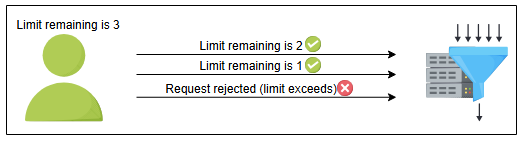
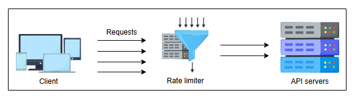

# Проектирование систем: Rate limiter

Давайте разберемся в основных деталях проектирования ограничителя скорости.

## Что такое ограничитель скорости?

**Rate limiter**, как следует из названия, устанавливает лимит на количество запросов, которые выполняет сервис. Он "дросселирует" (throttles) запросы, превышающие заранее определенный лимит. Например, если API сервиса настроено на прием 500 запросов в минуту от одного клиента, то при превышении этого лимита дальнейшие входящие запросы от этого клиента будут блокироваться.

## Зачем нам нужен ограничитель скорости?

Rate limiter обычно используется как защитный слой для сервисов, чтобы избежать их чрезмерного использования, как преднамеренного, так и непреднамеренного. Он также защищает сервисы от злоумышленных действий, нацеленных на уровень приложения, таких как **атаки типа "отказ в обслуживании" (denial-of-service, DOS)** и попытки подбора пароля методом грубой силы (brute-force).

> DoS - это атака, при которой клиент перегружает сервер трафиком, истощая ресурсы сервера (обработку и/или память) таким образом, что он не может обработать запрос законного пользователя.

Ниже приведен список сценариев, в которых можно использовать ограничители скорости, чтобы сделать сервис более надежным.

*   **Предотвращение исчерпания ресурсов:** Некоторые инциденты отказа в обслуживании вызваны ошибками в программном обеспечении или конфигурациях системы, что приводит к исчерпанию ресурсов. Такие атаки называют "дружественным огнем" (friendly-fire denial of service). Один из распространенных случаев использования ограничителей скорости — предотвращение исчерпания ресурсов, вызванного такими атаками, как преднамеренными, так и непреднамеренными.
*   **Управление политиками и квотами:** Также существует необходимость в ограничителях скорости для обеспечения справедливого и разумного использования ресурсов, когда они распределены между многими пользователями. Политика подразумевает применение лимитов на временной промежуток или выделенное количество (квоту).
*   **Контроль потока данных:** Ограничители скорости также могут использоваться в системах, где необходимо обрабатывать большой объем данных. Они контролируют поток данных для равномерного распределения нагрузки между различными машинами, избегая перегрузки одной машины.
*   **Избежание избыточных затрат:** Ограничение скорости также можно использовать для контроля стоимости операций. Например, организации могут использовать его, чтобы предотвратить выход экспериментов из-под контроля и избежать больших счетов. Некоторые поставщики облачных услуг также используют эту концепцию, предоставляя бесплатные (freemium) услуги до определенных лимитов, которые можно увеличить по запросу за дополнительную плату.

*Дросселирование количества запросов к API-серверам с помощью ограничителя скорости*

## Как мы будем проектировать ограничитель скорости?

В следующих уроках мы узнаем о следующем:

1.  **Требования:** Здесь мы обсудим функциональные и нефункциональные требования к ограничителю скорости. Мы также опишем типы дросселирования и места, где можно разместить ограничитель для эффективного выполнения его функций.
2.  **Высокоуровневое проектирование:** В этом разделе мы рассмотрим высокоуровневое проектирование, чтобы дать общее представление об ограничителе скорости.
3.  **Детальное проектирование:** В этом разделе мы обсудим детальное проектирование ограничителя скорости и объясним различные строительные блоки, участвующие в нем.
4.  **Алгоритмы ограничителя скорости:** В этом уроке мы объясним различные алгоритмы, которые играют жизненно важную роль в работе ограничителя скорости.
5.  **Тест** Для оценки вашего понимания ограничителей скорости в конце этой главы мы предоставили тест.

В следующем уроке давайте начнем с понимания требований и проектирования ограничителя скорости.