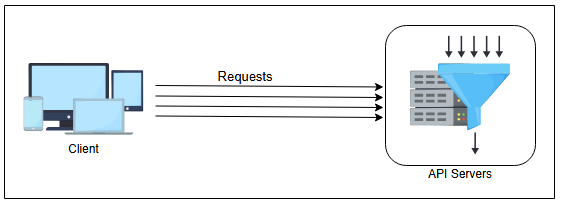
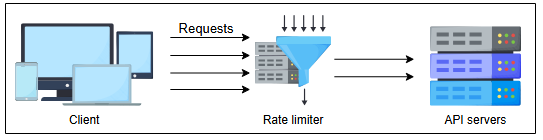

# Требования к проектированию Rate Limiter

Разберемся в требованиях и важных концепциях rate limiter.

## Требования

В этом уроке мы сосредоточимся на проектировании rate limiter со следующими функциональными и нефункциональными требованиями.

### Функциональные требования

*   Ограничивать количество запросов, которые клиент может отправить к API в течение определенного временного окна.
*   Сделать лимит запросов на временное окно настраиваемым.
*   Убедиться, что клиент получает сообщение (ошибку или уведомление) всякий раз, когда определенный порог превышается на одном сервере или на их совокупности.

### Нефункциональные требования

*   **Доступность:** По сути, rate limiter защищает нашу систему. Поэтому он должен быть высокодоступным.
*   **Низкая задержка:** Поскольку все запросы к API проходят через rate limiter, он должен работать с минимальной задержкой, не влияя на пользовательский опыт.
*   **Масштабируемость:** Наше проектирование должно быть высокомасштабируемым. Оно должно быть способно ограничивать скорость растущего числа запросов от клиентов со временем.

## Типы throttling

Rate limiter может выполнять три типа throttling.

1.  **Hard throttling:** Этот тип throttling устанавливает жесткий лимит на количество запросов к API. Таким образом, всякий раз, когда запрос превышает лимит, он отклоняется.
2.  **Soft throttling:** При soft throttling количество запросов может превышать предопределенный лимит на определенный процент. Например, если в нашей системе установлен лимит в 500 сообщений в минуту с возможностью превышения на 5%, мы можем позволить клиенту отправлять 525 запросов в минуту.
3.  **Elastic or dynamic throttling:** При этом типе throttling количество запросов может превышать предопределенный лимит, если у системы есть свободные ресурсы. Однако для верхнего предела не определен конкретный процент. Например, если наша система разрешает 500 запросов в минуту, она может позволить пользователю отправлять более 500 запросов при наличии свободных ресурсов.

## Где разместить rate limiter

Существует три разных способа размещения rate limiter.

1.  **На стороне клиента:** Разместить rate limiter на стороне клиента легко. Однако эта стратегия небезопасна, так как может быть легко подделана злоумышленниками. Кроме того, при таком подходе сложно применять конфигурацию на стороне клиента.
2.  **На стороне сервера:** Как показано на следующем рисунке, rate limiter размещается на стороне сервера. При таком подходе сервер получает запрос, который проходит через rate limiter, находящийся на сервере.

*Rate limiter, размещенный на стороне сервера*

3.  **В качестве промежуточного ПО (middleware):** В этой стратегии rate limiter действует как промежуточное ПО, осуществляя throttling запросов к API-серверам, как показано на следующем рисунке.

*Rate limiter в качестве промежуточного ПО*

Размещение rate limiter зависит от ряда факторов и является субъективным решением, основанным на технологическом стеке организации, инженерных ресурсах, приоритетах, плане, целях и так далее.

> **Примечание:** Многие современные сервисы используют API для предоставления своей функциональности клиентам. Конечные точки API могут быть хорошей точкой для ограничения входящего трафика от клиентов, поскольку весь трафик проходит через них.

## Две модели реализации rate limiter

Одного rate limiter может быть недостаточно для обработки огромного трафика для поддержки миллионов пользователей. Поэтому лучшим вариантом является использование нескольких rate limiter'ов в виде кластера независимых узлов. Поскольку будет множество rate limiter'ов с их соответствующими счетчиками (или их лимитом), есть два способа использования баз данных для хранения, извлечения и обновления счетчиков вместе с информацией о пользователях.

1.  **Rate limiter с централизованной базой данных:** В этом подходе rate limiter'ы взаимодействуют с централизованной базой данных, предпочтительно Redis или PostgreSQL. Преимущество этой модели заключается в том, что счетчики хранятся в централизованных базах данных. Таким образом, клиент не может превысить предопределенный лимит. Однако у этого подхода есть несколько недостатков. Он вызывает увеличение задержки, если огромное количество запросов обращается к централизованной базе данных. Другой серьезной проблемой является возможность возникновения состояний гонки (race conditions) при высококонкурентных запросах (или связанной с этим блокировки ресурсов).
2.  **Rate limiter с распределенной базой данных:** Использование независимого кластера узлов — это другой подход, при котором состояние ограничения скорости находится в распределенной базе данных. В этом подходе каждый узел должен отслеживать лимит скорости. Проблема этого подхода в том, что клиент может превысить лимит — по крайней мере, на мгновение, пока состояние собирается со всех узлов — при отправке запросов на разные узлы (rate limiter'ы). Чтобы обеспечить соблюдение лимита, мы должны настроить "прилипающие сессии" (sticky sessions) в балансировщике нагрузки, чтобы отправлять каждого потребителя ровно на один узел. Однако этот подход лишен отказоустойчивости и создает проблемы с масштабированием, когда узлы перегружаются.

Помимо двух вышеуказанных концепций, существует еще одна проблема: использовать ли глобальный счетчик, общий для всех входящих запросов, или индивидуальные счетчики для каждого пользователя. Например, алгоритм "ведро с токенами" может быть реализован двумя способами. В первом методе все запросы могут использовать общее количество токенов из одного ведра, тогда как во втором методе пользователям назначаются индивидуальные ведра. Выбор использования общих или отдельных счетчиков (или ведер) зависит от сценария использования и правил ограничения скорости.

> 1: **Вопрос:** Можно ли использовать балансировщик нагрузки в качестве rate limiter?
>
> 

>  
<b>Показать</b>

> Средства балансировки нагрузки играют важную роль в предотвращении перегрузки сервера приложений чрезмерным количеством запросов. Они достигают этого, либо отклоняя запросы в соответствии с заранее установленными ограничениями, либо направляя их в очередь для отложенной обработки. Важно подчеркнуть, что средства балансировки нагрузки обрабатывают все входящие запросы беспристрастно, без учета различных сложностей и длительности обработки, связанных с различными операциями. Например, некоторые операции в веб-сервисе могут выполняться быстро, в то время как другие могут занимать больше времени. Когда возникает необходимость контролировать количество запросов на определенные операции, более эффективным подходом является реализация этого контроля на уровне сервера приложений с использованием ограничителя скорости. Ограничитель скорости отлично разбирается в тонкостях отдельных операций и может выборочно накладывать ограничения по мере необходимости.
>  

>
>
> 2: **Вопрос:** Предположим, что клиент намерен отправлять запросы на определенный сервис, используя две виртуальные машины (ВМ), одна из которых использует VPN в другом регионе. Предположим, что идентификатор регулирования работает на основе учетных данных пользователя. Следовательно, идентификатор пользователя будет одинаковым для обоих сеансов. Более того, давайте предположим, что запросы от разных виртуальных машин могут поступать в разные центры обработки данных. Как будет работать регулирование, чтобы пользователь не превысил лимит скорости в этом сценарии?
>
> 

>  
<b>Показать</b>

> Для rate limiting входящих запросов у нас есть два разных варианта размещения rate limiter.
>
> **Rate limiter для каждого дата-центра:** Один из способов осуществлять throttle входящих запросов от пользователя — использовать rate limiting для каждого дата-центра. Каждый дата-центр будет иметь свой собственный rate limiter, который ограничивает входящие запросы. При таком подходе rate (количество или rate limit) относительно ниже. Следовательно, в единицу времени разрешается ограниченное количество запросов. Более того, этот подход обеспечивает меньшую задержку, поскольку запросы обычно направляются в ближайшие географически расположенные дата-центры. Часто задержка внутри дата-центра составляет менее одной миллисекунды, и на случай сбоя какого-либо канала доступны множественные резервные пути.
>
> **Общий rate limiter для нескольких дата-центров:** Другой подход заключается в использовании общего rate limiter для нескольких дата-центров. Таким образом, запросы, полученные от обеих ВМ (виртуальных машин), будут проходить throttle через единый rate limiter. Количество разрешенных запросов в этом случае выше. Однако этот подход относительно медленнее, так как перед направлением запроса в любой ближайший дата-центр он будет проходить через общий rate limiter. Задержка часто высока и изменчива между географически распределенными дата-центрами, и доступно не так много резервных путей.
>
> Если rate limiting применяется независимо в каждом дата-центре без глобальной координации, пользователи потенциально могут превысить лимит, распределяя запросы между несколькими дата-центрами. Чтобы предотвратить это, потребуется глобальный общий rate limiter (например, распределенное ведро с токенами), чтобы обеспечить соблюдение единого лимита для всех дата-центров.
>  

## Строительные блоки, которые мы будем использовать

Проектирование rate limiter использует следующие строительные блоки, которые мы обсуждали в начальных главах.

*Строительные блоки в проектировании rate limiter*

*   **Базы** данных используются для хранения правил, определенных поставщиком услуг, и метаданных пользователей, использующих сервис.
*   **Кэши** используются для кэширования правил и данных пользователей для частого доступа.
*   **Очереди** необходимы для хранения входящих запросов, разрешенных rate limiter'ом.

В следующем уроке мы сосредоточимся на высокоуровневом и детальном проектировании rate limiter на основе требований, обсужденных в этом уроке.