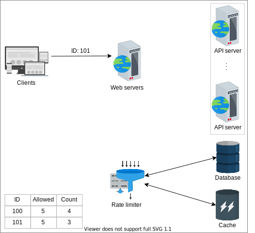

# Проектирование Rate Limiter


## <a id="high-level-design"></a>Высокоуровневое проектирование

Rate limiter может быть развернут как отдельный сервис, который будет взаимодействовать с веб-сервером, как показано на рисунке ниже. При получении запроса rate limiter предлагает, следует ли перенаправлять запрос на сервер. Rate limiter содержит правила, которым должен следовать каждый входящий запрос. Эти правила определяют лимит throttling для каждой операции. Давайте рассмотрим правило rate limiting от [Lyft](https://github.com/envoyproxy/ratelimit), который открыл исходный код своего компонента rate limiting.

```yaml
domain: messaging
descriptors:
   - key: message_type
     value: marketing
     rate_limit:
          unit: day
          request_per_unit: 5
```
*Правила rate limiting от Lyft*

В приведенном выше правиле rate limiting `unit` установлен на `day`, а `request_per_unit` — на `5`. Эти параметры определяют, что система может разрешить пять маркетинговых сообщений в день.

1) Запрос с идентификатором 101, полученный одним из веб-серверов
   


2) Запрос перенаправляется на устройство rate limiting
   


3) Если запрос удовлетворен, соответствующее количество увеличивается
   


4) Веб-сервер перенаправляет запрос на один из серверов API
   


5) Ответ отправляется обратно на веб-сервер после обработки запроса
   


6) Веб-сервер отправляет ответ соответствующему клиенту.
   


## <a id="detailed-design"></a>Детальное проектирование

Приведенное выше высокоуровневое проектирование не отвечает на следующие вопросы:

*   Где хранятся правила?
*   Как мы обрабатываем запросы, которые подверглись rate limiting?

В этом разделе мы сначала расширим высокоуровневую архитектуру, добавив несколько других важных компонентов. Мы также подробно объясним каждый компонент, как показано на следующем рисунке.


*Rate limiter принимает или отклоняет запросы на основе правил throttle*

Давайте обсудим каждый компонент, присутствующий в детальном проектировании rate limiter.

*   **База данных правил (Rule database)**: Это база данных, содержащая правила, определенные владельцем сервиса. Каждое правило указывает количество запросов, разрешенных для конкретного клиента в единицу времени.
*   **Извлекатель правил (Rules retriever)**: Это фоновый процесс, который периодически проверяет наличие изменений в правилах в базе данных. Кэш правил обновляется, если в существующие правила вносятся какие-либо изменения.
*   **Кэш правил throttle (Throttle rules cache)**: Кэш содержит правила, извлеченные из **базы данных правил**. Кэш обслуживает запрос к rate limiter быстрее, чем постоянное хранилище. В результате это повышает производительность системы. Таким образом, когда rate limiter получает запрос по ID (ключу), он проверяет ID по правилам в кэше.
*   **Принимающий решения (Decision-maker)**: Этот компонент отвечает за принятие решений на основе правил в кэше. Этот компонент работает на основе одного из алгоритмов rate limiting, которые обсуждаются в следующем уроке.
*   **Построитель идентификатора клиента (Client identifier builder)**: Этот компонент генерирует уникальный ID для запроса, полученного от клиента. Это может быть удаленный IP-адрес, логин или комбинация нескольких других атрибутов, из-за чего здесь нельзя использовать секвенсор. Этот ID рассматривается как ключ для хранения пользовательских данных в базе данных "ключ-значение". Таким образом, этот ключ передается **принимающему решения** для дальнейших сервисных решений.

В случае превышения предопределенного лимита API возвращают код ответа HTTP `429 Too Many Requests`, и к запросу применяется одна из следующих стратегий:

*   Отклонить запрос и вернуть клиенту определенный ответ, например, «слишком много запросов» или «сервис недоступен».
*   Если некоторые запросы подвергаются rate limiting из-за перегрузки системы, мы можем поместить эти запросы в очередь для последующей обработки.

### <a id="request-processing"></a>Обработка запросов

При получении запроса *построитель идентификатора клиента* идентифицирует запрос и перенаправляет его *принимающему решения*. Принимающий решения определяет сервисы, требуемые запросом, затем проверяет кэш на количество разрешенных запросов, а также правила, предоставленные владельцем сервиса. Если запрос не превышает лимит, он перенаправляется *обработчику запросов*, который отвечает за его обслуживание.

Принимающий решения принимает решения на основе алгоритмов throttling. Throttling может быть жестким (hard), мягким (soft) или эластичным (elastic). На основе **soft или elastic throttling** запросы разрешаются сверх установленного лимита. Эти запросы либо обслуживаются, либо помещаются в очередь и обслуживаются позже, при наличии ресурсов. Аналогично, если используется **hard throttling**, запросы отклоняются, и клиенту отправляется ответ с ошибкой.

> ℹ️ В случае сбоя rate limiter не может выполнять задачу throttling. В этих сценариях запрос следует **принять или отклонить**?
>
> <details>
> 
>  <summary><b>Показать</b></summary>
> В случае сбоя rate limiter запрос следует принять. Обоснование заключается в том, что система должна отдавать приоритет доступности и отказоустойчивости, особенно учитывая, что несколько rate limiter'ов на разных уровнях сервиса или балансировщик нагрузки могут справиться с нагрузкой. Инженерной команде необходимо быстро устранить сбой, поскольку rate limiter является критически важным компонентом.
>  </details>
### <a id="race-condition"></a>Состояние гонки (Race condition)

Существует вероятность возникновения состояния гонки в ситуации высокой конкуренции запросов. Это происходит при использовании подхода «get-then-set» (получить-затем-установить), когда текущий счетчик извлекается, увеличивается, а затем записывается обратно в базу данных. При использовании этого подхода могут поступить дополнительные запросы, которые сделают увеличенный счетчик недействительным. Это позволяет клиенту отправлять запросы с очень высокой скоростью, обходя контроль rate limiting. Чтобы избежать этой проблемы, можно использовать механизм блокировки, при котором только один процесс может обновлять счетчик в один момент времени, в то время как другие ждут освобождения блокировки. Поскольку этот подход может вызвать потенциальное узкое место, он значительно снижает производительность и плохо масштабируется.

Другой метод, который можно использовать, — это подход «set-then-get» (установить-затем-получить), при котором значение увеличивается очень производительным способом, избегая блокировки. Этот подход работает, если конкуренция минимальна. Однако можно использовать и другие подходы, где разрешенная квота делится на несколько частей и нагрузка распределяется между ними, или использовать сегментированные счетчики (sharded counters) для масштабирования.

> **Примечание:** Мы можем использовать сегментированные счетчики для rate limiting в условиях высококонкурентного трафика. Увеличивая количество сегментов, мы уменьшаем конкуренцию за запись. Поскольку нам нужно собирать счетчики со всех сегментов, чтение может замедлиться.

### <a id="a-rate-limiter-should-not-be-on-the-client-s-critical-path"></a>Rate limiter не должен находиться на критическом пути клиента

Представим реальный сценарий, когда миллионы запросов поступают на фронтенд-серверы. Каждый запрос будет извлекать, обновлять и записывать обратно счетчик в соответствующий кэш. После всех этих операций запрос отправляется дальше на обслуживание. Этот подход может вызвать задержку при большом количестве запросов. Чтобы избежать многочисленных вычислений на критическом пути клиента, мы должны разделить работу на офлайн- и онлайн-части.

Изначально, когда поступает запрос клиента, система просто проверяет соответствующий счетчик. Если он меньше максимального лимита, система разрешит запрос клиента. На втором этапе система обновляет соответствующий счетчик и кэш в офлайн-режиме. Для нескольких запросов это не окажет никакого влияния на производительность, но для миллионов запросов этот подход значительно ее повышает.

Давайте разберем подход с онлайн- и офлайн-обновлениями на примере. В следующей серии иллюстраций, когда поступает запрос, его ID перенаправляется в rate limiter, который проверит условие `if(request(ID).Count <= Max. Limit)`, извлекая данные из кэша. Для простоты предположим, что ID одного из запросов — 101, то есть `request(ID) = 101`. В следующей таблице показано количество запросов, сделанных каждым клиентом, и максимальное количество запросов в единицу времени, которое может сделать клиент.

| Request ID | Maximum Limit | Count |
| :---: | :---: | :---: |
| 100 | 5 | 4 |
| 101 | 5 | 3 |

Если условие истинно, rate limiter сначала ответит фронтенд-серверу сигналом `Allowed` (Разрешено). Соответствующий `count` и другая релевантная информация обновляются в офлайн-режиме на следующих шагах. Rate limiter записывает обновленные данные обратно в кэш. Следование этому подходу уменьшает задержку и позволяет избежать конкуренции, которую могли бы вызвать входящие запросы.

> **Примечание:** Мы видели форму rate limiting в сетевом протоколе TCP, где получатель может осуществлять throttle отправителя, объявляя размер окна (количество данных, которое получатель готов принять). Отправитель отправляет минимальное значение из окна перегрузки или объявленного окна. Многие формирователи сетевого трафика используют схожие механизмы для предоставления преференциального режима различным сетевым потокам.

## <a id="conclusion"></a>Заключение

В этом уроке мы обсудили проектирование rate limiter в распределенных системах. Давайте проанализируем нефункциональные требования, которые мы обещали в предыдущем уроке.

*   **Доступность:** Если один rate limiter выйдет из строя, будут доступны другие rate limiter'ы для обработки входящих запросов. Таким образом, устраняется единая точка отказа.
*   **Низкая задержка:** Наша система извлекает и обновляет данные каждого входящего запроса из кэша, а не из базы данных. Сначала входящие запросы перенаправляются, если они не превышают rate limit, а затем обновляются кэш и база данных.
*   **Масштабируемость:** Количество rate limiter'ов может быть увеличено или уменьшено в зависимости от количества входящих запросов в пределах установленного лимита.

Теперь, в свете вышеизложенного, наша система обеспечивает высокую доступность, низкую задержку и масштабируемость.