# Алгоритмы Rate Limiter

Разберемся в работе различных алгоритмов rate limiter.

## Алгоритмы для rate limiting

Задача rate limiter направляется высокоэффективными алгоритмами, каждый из которых имеет свои преимущества и недостатки. Однако всегда есть выбор: использовать один алгоритм или комбинацию алгоритмов в зависимости от того, что нам нужно в данный момент. Хотя используются и другие алгоритмы, помимо перечисленных ниже, мы рассмотрим следующие популярные алгоритмы.

*   Token bucket
*   Leaking bucket
*   Fixed window counter
*   Sliding window log
*   Sliding window counter

### Алгоритм Token bucket

Этот алгоритм использует аналогию ведра с предопределенной емкостью токенов. Ведро периодически пополняется токенами с постоянной скоростью. Токен можно рассматривать как пакет определенного размера. Таким образом, алгоритм проверяет наличие токена в ведре каждый раз, когда мы получаем запрос. Для дальнейшей обработки запроса должен быть хотя бы один токен.

Принцип работы алгоритма token bucket следующий:

Предположим, у нас есть предопределенный rate limit R, а общая емкость ведра — C.

1.  Алгоритм добавляет новый токен в ведро каждые 1/R секунды.
2.  Алгоритм отбрасывает новые поступающие токены, когда количество токенов в ведре равно общей емкости C.
3.  Если поступает N запросов и в ведре есть как минимум N токенов, токены потребляются, а запросы перенаправляются для дальнейшей обработки.
4.  Если поступает N запросов, а в ведре меньше токенов, то количество принятых запросов равно количеству доступных токенов в ведре.

Следующая иллюстрация представляет работу алгоритма token bucket.

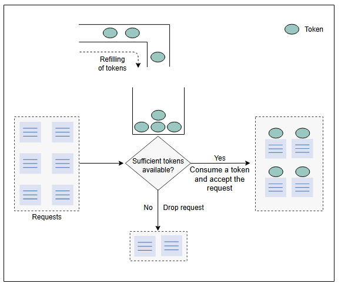

*Как работает алгоритм token bucket*

Следующая иллюстрация демонстрирует, как работает логика потребления токенов и rate limiting. В этом примере емкость ведра — три, и оно пополняется со скоростью три токена в минуту.

1. Изначально в ведре три токена. В течение минуты поступает запрос и потребляет один токен из ведра.

   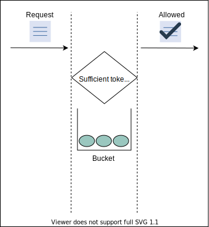

2. В течение той же минуты поступают еще два запроса и потребляют оставшиеся два токена.

   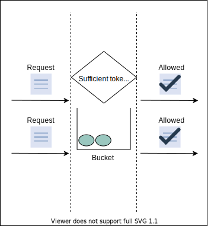

3. В течение той же минуты поступает еще один (четвертый) запрос. Запрос отклоняется, потому что ведро пустое.

   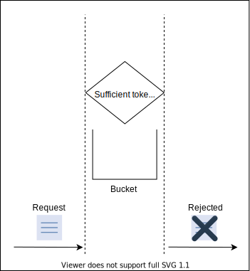

4. Пополнить ведро через одну минуту.

   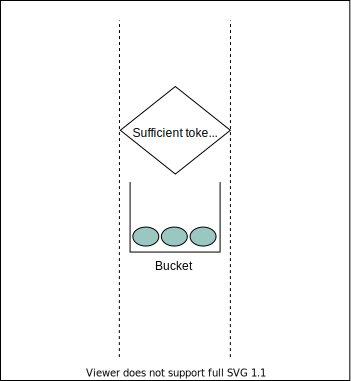
#### Основные параметры

Для реализации алгоритма token bucket нам требуются следующие основные параметры:

*   **Емкость ведра (C):** Максимальное количество токенов, которое может находиться в ведре.
*   **Rate limit (R):** Количество запросов, которое мы хотим ограничить в единицу времени.
*   **Скорость пополнения (1/R):** Промежуток времени, через который в ведро добавляется токен.
*   **Количество запросов (N):** Этот параметр отслеживает количество входящих запросов и сравнивает его с емкостью ведра.

#### Преимущества

*   Этот алгоритм может выдерживать всплеск трафика, пока в ведре достаточно токенов.
*   Он эффективен по памяти. Память, необходимая для алгоритма, номинальна из-за ограниченного количества состояний.

#### Недостатки

*   Выбор оптимального значения для основных параметров является сложной задачей.

> #### На заметку
> **Вопрос:** Помимо разрешения всплесков, может ли алгоритм token bucket превышать лимит на границах?
>
> 

>  
<b>Показать</b>

>
> Да, алгоритм token bucket иногда может приводить к превышению лимита на границах, что демонстрирует следующий пример:
>
> Рассмотрим сценарий с емкостью ведра, равной `3`, и количеством запросов, разрешенных в минуту, также равным `3`. Это дает скорость пополнения `0.33` минуты, что означает, что новый токен будет появляться каждые `0.33` минуты.
>
> На иллюстрации ниже, три токена были накоплены к концу первой минуты. В то же время, поступает всплеск запросов и потребляет все три токена, оставляя ведро пустым. В момент `1.33` минуты (при скорости пополнения `0.33`) в ведро добавляется новый токен. Одновременно поступает новый запрос и потребляет этот токен.
>
> Однако, если мы рассмотрим промежуток времени с `0.66` до `1.33` минуты, мы увидим, что всего было потреблено четыре токена.
>
> Этот пример показывает, что token bucket может превышать лимит на границах.
>  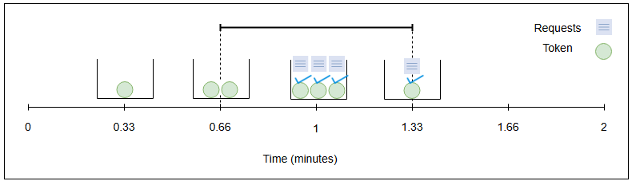
> 
> >  

### Алгоритм Leaking bucket

**Алгоритм leaking bucket** является вариантом алгоритма token bucket с небольшими изменениями. Вместо использования токенов, алгоритм leaking bucket использует ведро для хранения входящих запросов и обрабатывает их с постоянной скоростью на выходе. Этот алгоритм использует аналогию ведра с водой, которое протекает с постоянной скоростью. Аналогично, в этом алгоритме запросы поступают с переменной скоростью. Алгоритм обрабатывает эти запросы с постоянной скоростью в порядке "первым пришел — первым ушел" (FIFO).

Давайте посмотрим, как работает алгоритм leaking bucket на иллюстрации ниже:

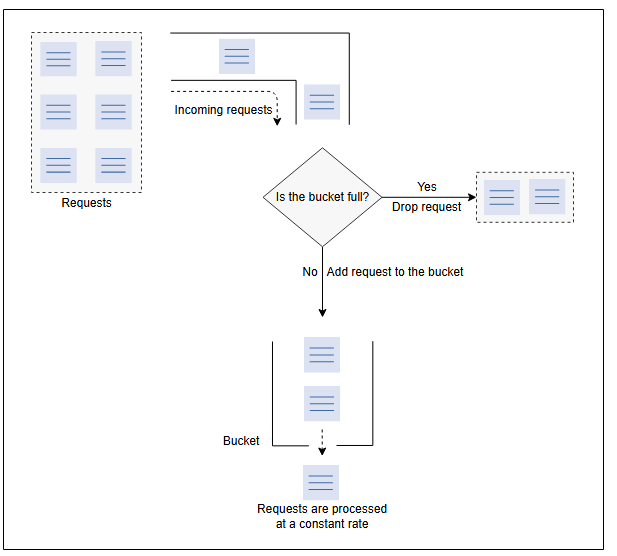
*Как работает алгоритм leaking bucket*

#### Основные параметры

Алгоритм leaking bucket требует следующих параметров.

*   **Емкость ведра (C):** Определяет максимальную емкость ведра. Алгоритм будет отбрасывать входящие запросы, когда ведро достигнет своего максимального лимита C.
*   **Скорость поступления (R{in}):** Этот параметр показывает скорость поступления запросов. Это переменная величина, которая зависит от приложения и характера запросов. Мы используем этот параметр для определения начальной емкости ведра.
*   **Скорость оттока (R{out}):** Определяет количество запросов, обрабатываемых в единицу времени.

#### Преимущества

*   Благодаря постоянной скорости оттока (R{out}), он избегает всплесков запросов, в отличие от алгоритма token bucket.
*   Этот алгоритм также эффективен по памяти, так как требует всего три состояния: скорость поступления (R{in}), скорость оттока (R{out}) и емкость ведра (C).
*   Поскольку запросы обрабатываются с фиксированной скоростью, он подходит для приложений со стабильной скоростью оттока.

#### Недостатки

*   Всплеск запросов может заполнить ведро, и если они не будут обработаны в указанное время, недавние запросы могут быть потеряны.
*   Определение оптимального размера ведра и скорости оттока является сложной задачей.

### Алгоритм Fixed window counter

Этот алгоритм делит время на фиксированные интервалы, называемые **окнами**, и назначает счетчик каждому окну. Когда в определенное окно поступает запрос, счетчик увеличивается на единицу. Как только счетчик достигает своего предела, новые запросы в этом окне отбрасываются.

Как показано на рисунке ниже, пунктирная линия представляет лимит в каждом окне. Если счетчик ниже лимита, запрос перенаправляется; в противном случае запрос отбрасывается.

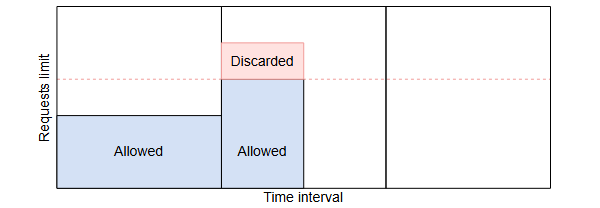
*Алгоритм Fixed window counter: отбрасывание запроса, превышающего лимит*

У этого алгоритма есть существенная проблема. Всплеск трафика, превышающий разрешенное количество запросов, может произойти на границах окна. На рисунке ниже система разрешает максимум десять запросов в минуту. Однако количество запросов в минутном окне с 01:30 до 02:30 составляет 20, что превышает разрешенное количество.

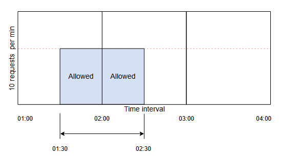
*Проблема граничного случая в алгоритме fixed window counter. Количество запросов за одну минуту с 01:30 до 02:30 превышает предопределенный лимит в 10 запросов в минуту.*

#### Основные параметры

Алгоритм fixed window counter требует следующих параметров:

*   **Размер окна (W):** Представляет размер временного окна. Это может быть минута, час или любой другой подходящий временной интервал.
*   **Rate limit (R):** Показывает количество запросов, разрешенных за одно временное окно.
*   **Количество запросов (N):** Этот параметр показывает количество входящих запросов за одно окно. Входящие запросы разрешаются, если N меньше или равно R.

#### Преимущества

*   Он также эффективен по памяти из-за ограничений на скорость запросов.
*   По сравнению с алгоритмами типа token bucket (которые отбрасывают новые запросы, если токенов недостаточно), этот алгоритм обслуживает новые запросы.

#### Недостатки

*   Постоянный всплеск трафика (вдвое превышающий количество разрешенных запросов на окно) на границах окон может вызвать потенциальное снижение производительности.

### Алгоритм Sliding window log

**Алгоритм sliding window log** отслеживает каждый входящий запрос. Когда поступает запрос, его время прибытия сохраняется в хэш-карте, обычно известной как лог. Логи сортируются по временным меткам входящих запросов. Запросы разрешаются в зависимости от размера лога и времени прибытия.

Основное преимущество этого алгоритма заключается в том, что он не страдает от граничных условий, в отличие от алгоритма **fixed window counter**.

Давайте разберемся, как работает алгоритм sliding window log, на иллюстрации ниже. Предположим, у нас максимальный rate limit — два запроса в минуту.

1. Новый запрос поступает в 01:00. Его время прибытия добавляется в лог, и запрос принимается. Временное окно отмечается с 01:00 до 02:00.
   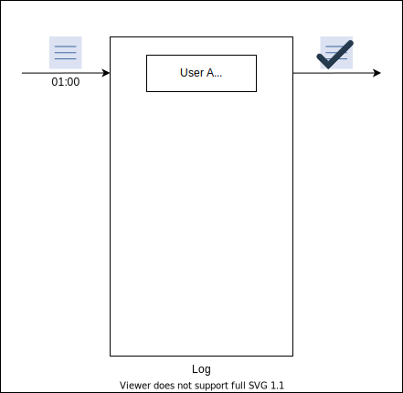

2. Еще один запрос поступает в 01:20, и его временная метка добавляется в лог. Поскольку размер лога меньше максимального rate limit, запрос разрешается.
   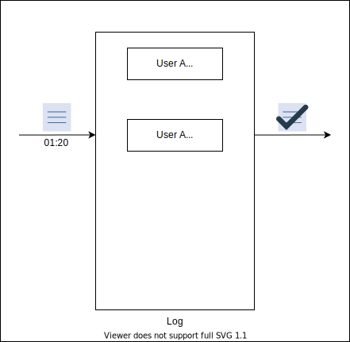

3. Третий запрос поступает в 01:45, и его временная метка добавляется в лог. Алгоритм отклоняет запрос, поскольку размер лога становится равным 3, что превышает максимальный лимит.
   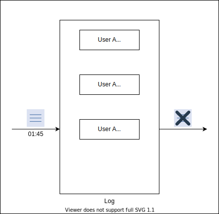

4. Новый запрос поступает в 02:25, и мы начинаем новое окно с этого момента. Мы сохраняем в логе одно последнее окно (с 01:25 до 02:25). Старые данные удаляются из лога, и его размер соответственно уменьшается.
   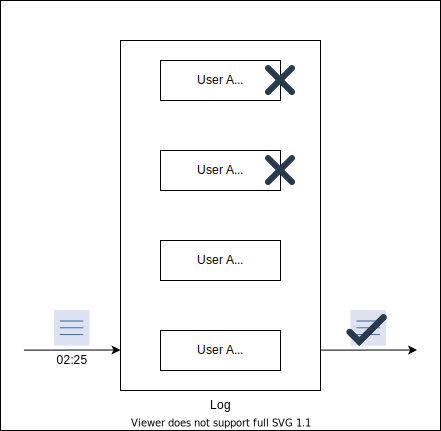
5. 
#### Основные параметры

Для реализации алгоритма sliding window log требуются следующие параметры:

*   **Размер лога (L):** Этот параметр аналогичен rate limit (R), так как он определяет количество запросов, разрешенных в определенном временном интервале.
*   **Время прибытия (T):** Этот параметр отслеживает временные метки входящих запросов и определяет их количество.
*   **Временной диапазон (T{r}):** Этот параметр определяет временной интервал. Временные метки старых запросов удаляются, если они не попадают в этот диапазон. Время начала окна определяется по первому входящему запросу и истекает через одну минуту. Аналогично, когда после истечения срока приходит другой запрос, диапазоны окон обновляются соответствующим образом.

#### Преимущества

*   Алгоритм не страдает от граничных условий фиксированных окон.

#### Недостатки

*   Он потребляет дополнительную память для хранения дополнительной информации — временных меток входящих запросов. Он хранит временные метки для обеспечения динамического окна, даже если запрос отклонен.

### Алгоритм Sliding window counter

В отличие от ранее описанного алгоритма с фиксированным окном, **алгоритм sliding window counter** не ограничивает запросы на основе фиксированных единиц времени. Этот алгоритм учитывает как алгоритм fixed window counter, так и sliding window log, чтобы сделать поток запросов более плавным. Давайте посмотрим на работу алгоритма на рисунке ниже.

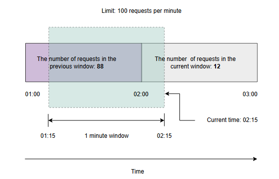
*Алгоритм sliding window counter, где зеленая заштрихованная область показывает скользящее окно в 1 минуту*

На рисунке выше у нас 88 запросов в предыдущем окне и 12 в текущем. Мы установили rate limit на 100 запросов в минуту. Кроме того, скользящее окно перекрывает 15 секунд текущего окна. Теперь предположим, что новый запрос поступает в 02:15. Мы решим, какой запрос принять или отклонить, используя математическую формулу:

Rate = R{p} \times \frac{time \ frame - overlap \ time}{time \ frame} + R{c}$

Здесь R{p} — это количество запросов в предыдущем окне, которое равно 88. 

R{c} — это количество запросов в текущем окне, которое равно 12. time \ frame в нашем случае составляет 60 секунд, а overlap \ time — 15 секунд.

Rate= 88 \times \frac{60-15}{60} + 12

Rate= 78 < 100

Поскольку 78 меньше 100, входящий запрос разрешен.

#### Основные параметры

Этот алгоритм относительно сложнее других, описанных выше. Он требует следующих параметров:

*   **Rate limit (R):** Определяет максимальное количество запросов, разрешенных за одно окно.
*   **Размер окна (W):** Этот параметр представляет размер временного окна, которое может быть минутой, часом или любым другим временным интервалом.
*   **Количество запросов в предыдущем окне (R{p}):** Определяет общее количество запросов, полученных в предыдущем временном окне.
*   **Количество запросов в текущем окне (R{c}):** Представляет количество запросов, полученных в текущем окне.
*   **Время перекрытия (O{t}):** Этот параметр показывает время перекрытия скользящего окна с текущим окном.

#### Преимущества

*   Алгоритм также эффективен по памяти из-за ограниченного количества состояний: количество запросов в текущем окне, количество запросов в предыдущем окне, процент перекрытия и так далее.
*   Он сглаживает всплески запросов и обрабатывает их с приблизительной средней скоростью на основе предыдущего окна.

#### Недостатки

*   Этот алгоритм предполагает, что количество запросов в предыдущем окне распределено равномерно, что не всегда возможно.

## Сравнение алгоритмов rate limiting

Два основных фактора, общих для всех алгоритмов rate limiting:

*   **Память:** Эта характеристика относится к количеству состояний, которые алгоритм должен поддерживать для нормальной работы. Например, если один алгоритм требует меньше переменных (состояний), чем другой, он более эффективен по памяти.
*   **Всплеск (Burst):** Относится к увеличению трафика в единицу времени, превышающему определенный лимит.

В следующей таблице показана эффективность по памяти и обработка всплесков трафика для всех алгоритмов, описанных в этом уроке.

### Сравнение алгоритмов Rate-limiting

| **Алгоритм** | **Эффективность по памяти** | **Разрешает всплески?** |
| :---: | :---: | :--- |
| Token bucket | Да | Да, разрешает всплеск трафика в пределах установленного лимита. |
| Leaking bucket | Да | Нет |
| Fixed window counter | Да | Да, разрешает всплески на границе временного окна и может превысить установленный лимит. |
| Sliding window log | Нет, для ведения лога требуется дополнительная память. | Да, разрешает всплески, когда окно пусто или почти пусто, хотя сглаживает трафик по мере заполнения окна. |
| Sliding window counter| Да, но требует относительно больше памяти, чем другие эффективные по памяти алгоритмы. | Сглаживает всплески |

> **Примечание:** Блокировки не всегда плохи при использовании вышеуказанных алгоритмов. Если конкуренция за блокировку невелика, ее получение занимает мало времени. Если у нас высокая конкуренция за блокировку, требуется тщательный анализ для управления ситуацией, возможно, путем сегментирования данных и использования нескольких/более гранулированных блокировок.

## Заключение

В этом уроке мы рассмотрели различные популярные алгоритмы rate limiting. Мы также осветили преимущества и недостатки этих алгоритмов. Каждый из этих алгоритмов может быть развернут в зависимости от выбора пользователя и типа сценария использования.