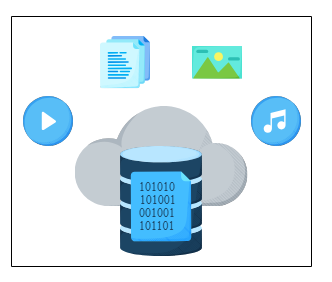

# Проектирование системы: Blob-хранилище

Краткое введение в blob-хранилища и подготовка к их проектированию.

## Что такое blob-хранилище?

**Blob-хранилище** — это решение для хранения неструктурированных данных. В нем можно хранить фотографии, аудио, видео, двоичные исполняемые файлы или другие мультимедийные объекты. Любой тип данных хранится как **blob-объект** (большой двоичный объект). Хранилище использует плоскую модель организации данных без иерархий, то есть без каталогов, подкаталогов и т. д.

В основном его используют приложения с особым бизнес-требованием, называемым **однократная запись, многократное чтение (WORM)**, которое гласит, что данные могут быть записаны только один раз, и никто не может их изменить. Так же, как в Microsoft Azure, blob-объекты создаются один раз и читаются многократно. Кроме того, эти blob-объекты нельзя удалить в течение определенного периода времени, а также их нельзя изменять для защиты критически важных данных.

*

Изображение: Blob-хранилище, хранящее и передающее большие неструктурированные файлы, такие как аудио, видео, изображения и документы*

> **Примечание:** Не обязательно, чтобы все приложения имели требование WORM. Однако мы предполагаем, что записанные blob-объекты не могут быть изменены. Вместо изменения при необходимости можно загрузить новую версию blob-объекта.

## Зачем использовать blob-хранилище?

Blob-хранилище является важным компонентом многих приложений с интенсивной обработкой данных, таких как YouTube, Netflix, Facebook и др. В таблице ниже показаны blob-хранилища, используемые некоторыми из самых известных приложений. Эти приложения ежедневно генерируют огромное количество неструктурированных данных. Им требуется решение для хранения, которое легко масштабируется, надежно и высокодоступно, чтобы они могли хранить большие медиафайлы. Поскольку объем данных постоянно растет, этим приложениям необходимо хранить неограниченное количество blob-объектов. По некоторым оценкам, YouTube требует более петабайта дополнительного хранилища в день. В такой системе, как YouTube, видео хранится в нескольких разрешениях. Кроме того, видео во всех разрешениях многократно реплицируется по разным дата-центрам и регионам для обеспечения доступности. Вот почему общий объем хранилища, необходимый для одного видео, не равен размеру загруженного видео.

| **Система** | **Blob-хранилище** |
| :--- | :--- |
| Netflix | S3 |
| YouTube | Google Cloud Storage |
| Facebook | Tectonic |

## Как спроектировать систему blob-хранилища?

Мы разделили процесс проектирования blob-хранилища на пять уроков и один тест.

1.  **Требования:** В этом уроке мы определим функциональные и нефункциональные требования к blob-хранилищу. Мы также оценим ресурсы, необходимые для нашей системы.
2.  **Проектирование:** Этот урок представляет высокоуровневое проектирование, проектирование API и детальное проектирование blob-хранилища, объясняя детали всех компонентов и рабочий процесс.
3.  **Аспекты проектирования:** В этом уроке мы обсудим некоторые важные аспекты проектирования. Например, мы узнаем о схеме базы данных, стратегии партиционирования, индексации blob-объектов, пагинации и репликации.
4.  **Оценка:** В этом уроке мы оценим наше blob-хранилище на основе наших требований.
5.  **Тест:** В этом уроке мы проверим понимание проектирования blob-хранилища.

Давайте начнем с требований к системе blob-хранилища.