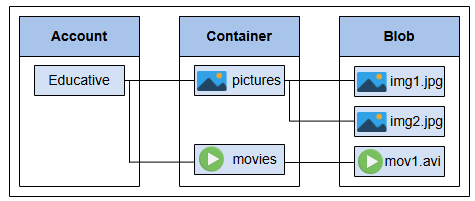
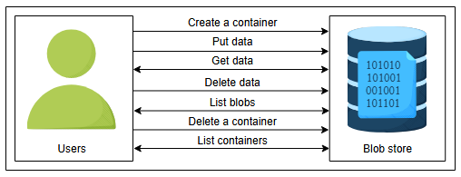
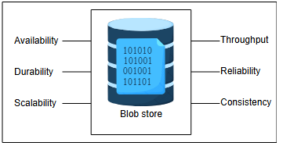
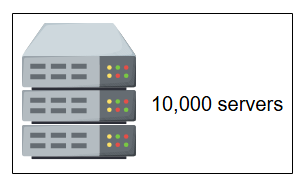
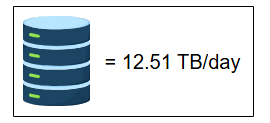
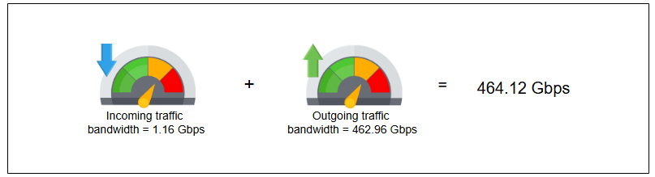

# Требования к проектированию Blob-хранилища

Определите требования и выполните расчеты для blob-хранилища.

## Требования

Давайте разберем функциональные и нефункциональные требования ниже:

### Функциональные требования

Вот функциональные требования к проектированию blob-хранилища:

*   **Создание контейнера:** Пользователи должны иметь возможность создавать контейнеры для группировки blob-объектов. Например, если приложению нужно хранить данные, специфичные для пользователя, оно должно иметь возможность хранить blob-объекты для разных учетных записей пользователей в разных контейнерах. Кроме того, пользователь может захотеть сгруппировать blob-объекты видео и отделить их от группы blob-объектов изображений. Один пользователь blob-хранилища может создать много контейнеров, и каждый контейнер может содержать много blob-объектов, как показано на иллюстрации ниже. Для простоты мы предполагаем, что нельзя создавать контейнер внутри другого контейнера.

Несколько контейнеров, связанных с одной учетной записью хранения, и несколько blob-объектов внутри одного контейнера*

*   **Размещение данных (Put):** Blob-хранилище должно позволять пользователям загружать blob-объекты в созданные контейнеры.
*   **Получение данных (Get):** Система должна генерировать URL для загруженного blob-объекта, чтобы пользователь мог позже получить к нему доступ по этому URL.
*   **Удаление данных:** Пользователи должны иметь возможность удалять blob-объекты. Если пользователь хочет хранить данные в течение определенного периода времени (время хранения), наша система должна поддерживать эту функциональность.
*   **Список blob-объектов:** Пользователь должен иметь возможность получить список blob-объектов внутри определенного контейнера.
*   **Удаление контейнера:** Пользователи должны иметь возможность удалять контейнер и все blob-объекты внутри него.
*   **Список контейнеров:** Система должна позволять пользователям получать список всех контейнеров под определенной учетной записью.

> Контейнер - это папка в файловой системе, используемая для группировки больших двоичных объектов. Не путайте этот контейнер с контейнером Docker.

*Изображение: Функциональные требования к blob-хранилищу*

### Нефункциональные требования

Вот нефункциональные требования к системе blob-хранилища:

*   **Доступность (Availability):** Наша система должна быть высокодоступной.
*   **Долговечность (Durability):** Данные, однажды загруженные, не должны быть потеряны, если пользователи явно не удалят их.
*   **Масштабируемость (Scalability):** Система должна быть способна обрабатывать миллиарды blob-объектов.
*   **Пропускная способность (Throughput):** Для передачи гигабайтов данных мы должны обеспечить высокую пропускную способность.
*   **Надежность (Reliability):** Поскольку сбои являются нормой в распределенных системах, наш проект должен оперативно обнаруживать сбои и восстанавливаться после них.
*   **Согласованность (Consistency):** Система должна быть строго согласованной. Разные пользователи должны видеть одно и то же представление blob-объекта.

Нефункциональные требования к blob-хранилищу

> **Вопрос:** Объясните концепцию итоговой согласованности (eventual consistency) в контексте blob-хранилищ. Приведите сценарий, где это может быть приемлемо, в виджете ниже.
> 

>  
<b>Показать</b>

> Если у нас реплицирована система и мы записываем в мастер узел и он асинхронно пишет во все дочерние узлы то чтение из почерних узлов этих данных будет eventual consistency 
>  

## Оценка ресурсов

Давайте оценим общее количество серверов, объем хранилища и пропускную способность, необходимые для системы blob-хранилища. Поскольку blob-объекты могут содержать самые разные данные, упоминание всех этих типов данных в нашей оценке может быть непрактичным. Поэтому мы будем использовать YouTube в качестве примера, который хранит видео и миниатюры в blob-хранилище. Кроме того, для завершения наших оценок мы сделаем следующие допущения.

**Допущения:**
*   Количество ежедневных активных пользователей, которые загружают или смотрят видео, составляет пять миллионов.
*   Количество запросов в секунду, которое может обработать один сервер blob-хранилища, составляет **500**.
*   Средний размер видео — 50 МБ.
*   Средний размер превью — 20 КБ.
*   Количество загружаемых видео в день — 250 000.
*   Количество запросов на чтение от одного пользователя в день — 20.

### Оценка количества серверов

Учитывая наше допущение об использовании ежедневных активных пользователей в качестве показателя количества запросов в секунду для пиковых нагрузок, мы получаем 5 миллионов запросов в секунду. Количество серверов, которое нам потребуется, учитывая 500 RPS для сервера blob-хранилища, рассчитывается по следующей формуле:

`Количество_серверов_в_пике = Количество_запросов_в_секунду / RPS_сервера`

`Количество_серверов_в_пике = 5 000 000 / 500 = 10 000 серверов`

*Изображение: Количество серверов, необходимых для системы blob-хранилища, предназначенной для хранения данных YouTube*

> **Примечание:** Наша пересмотренная оценка для сервера blob-хранилища составляет 500 RPS (вместо 64 000 RPS), чтобы учесть интенсивный ввод-вывод, характерный для сервера blob-хранилища, где операции обычно выполняются дольше.

### Оценка хранилища

Учитывая приведенные выше допущения, мы используем следующую формулу для расчета общего объема хранилища, необходимого YouTube за один день:

> `Общее_хранилище/день = Количество_видео/день × (Хранилище/видео + Хранилище/миниатюра)`

Подставляя числа из допущений в формулу, мы получаем `12.51 ТБ/день`, что является приблизительным объемом хранилища, необходимым YouTube в день для хранения одной копии загруженного видео в одном разрешении.

#### Общий объем хранилища, необходимый для хранения видео и миниатюр, загруженных за день на YouTube

| Кол-во видео в день | Хранилище на видео (МБ) | Хранилище на миниатюру (КБ) | Общее хранилище в день (ТБ) |
| :--- | :--- | :--- | :--- |
| 250000 | 50 | 20 | 12.51 |

### Оценка пропускной способности

Давайте оценим пропускную способность, необходимую для загрузки и извлечения данных из blob-хранилища.

**Входящий трафик:** Для оценки пропускной способности для входящего трафика мы учитываем общий объем загружаемых данных в день, что косвенно означает общий объем необходимого хранилища в день, который мы рассчитали выше. Объем данных, передаваемых на серверы в секунду, можно вычислить по следующей формуле:

> `Общая_пропускная_способность = Общее_хранилище_в_день / (24 × 60 × 60)`

#### Пропускная способность, необходимая для загрузки видео на YouTube

| Общее хранилище в день (ТБ) | Секунд в дне | Пропускная способность (Гбит/с) |
| :--- | :--- | :--- |
| 12.51 | 86400 | 1.16 |

**Исходящий трафик:** Поскольку blob-хранилище интенсивно используется для чтения, большая часть пропускной способности требуется для исходящего трафика. Учитывая вышеупомянутые допущения, мы рассчитываем пропускную способность для исходящего трафика по следующей формуле:

> `Общая_пропускная_способность = (Кол-во_активных_пользователей/день × Кол-во_запросов/пользователя/день × Общий_размер_данных) / Секунд_в_дне`

#### Пропускная способность, необходимая для скачивания видео с YouTube

| Кол-во активных пользователей в день | Кол-во запросов на пользователя | Размер данных (МБ) | Требуемая пропускная способность (Гбит/с) |
| :--- | :--- | :--- | :--- |
| 5000000 | 20 | 50 | 462.96 |

Сводка требований к пропускной способности системы blob-хранилища только для видео YouTube*

## Используемые строительные блоки

Мы используем следующие строительные блоки в проектировании нашей системы blob-хранилища:

*Изображение: Строительные блоки для проектирования blob-хранилища*

*   **Ограничитель скорости (Rate Limiter):** Ограничитель скорости необходим для контроля взаимодействия пользователей с системой.
*   **Балансировщик нагрузки (Load balancer):** Балансировщик нагрузки необходим для распределения нагрузки запросов на разные серверы.
*   **База данных (Database):** База данных используется для хранения метаданных blob-объектов.
*   **Мониторинг (Monitoring):** Мониторинг необходим для проверки устройств хранения и доступного на них места, чтобы при необходимости вовремя добавлять хранилище.

В этом уроке мы обсудили требования и оценки для системы blob-хранилища. В следующем уроке мы спроектируем систему blob-хранилища, следуя изложенным требованиям.