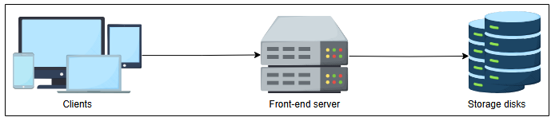
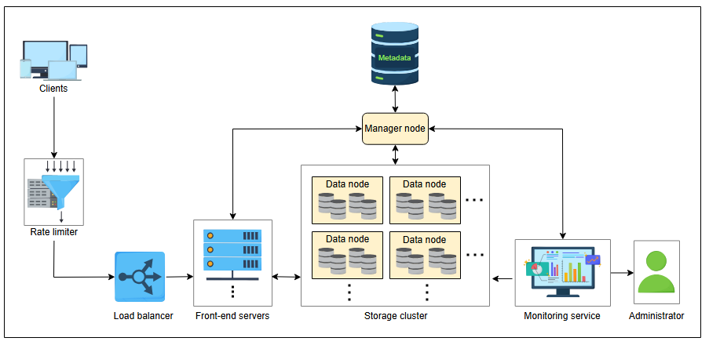

# Проектирование Blob-хранилища

Узнайте, как включить определенные требования в проект blob-хранилища.


## Высокоуровневое проектирование

Давайте определим и свяжем компоненты системы blob-хранилища. На высоком уровне компонентами являются клиенты, фронтенд-серверы и диски для хранения данных.


Высокоуровневое проектирование blob-хранилища

Запросы клиента поступают на фронтенд-серверы, которые их обрабатывают. Фронтенд-серверы сохраняют blob-объект клиента на подключенных к ним дисках хранения.

<a id="api-design"></a>
## Проектирование API

Давайте рассмотрим проектирование API blob-хранилища. Все перечисленные ниже функции могут выполняться только зарегистрированным и аутентифицированным пользователем. Для краткости мы не будем включать функциональность регистрации и аутентификации пользователей.

**Создание контейнера**

Операция `createContainer` создает новый контейнер в учетной записи вошедшего пользователя, от имени которого генерируется этот запрос.
```
createContainer(containerName)
```

| Параметр        | Описание                                                                            |
| :-------------- | :---------------------------------------------------------------------------------- |
| `containerName` | Это имя контейнера. Оно должно быть уникальным в пределах одной учетной записи хранения. |

**Загрузка blob-объектов**

Данные клиента хранятся в виде байтов в blob-хранилище. Данные можно поместить в контейнер с помощью следующего кода:
```
putBlob(containerPath, blobName, data)
```

| Параметр        | Описание                                                                                                                                                    |
| :-------------- | :---------------------------------------------------------------------------------------------------------------------------------------------------------- |
| `containerPath` | Это путь к контейнеру, в который мы загружаем blob. Он состоит из `accountID` и `containerID`.                                                               |
| `blobName`      | Это имя blob-объекта. Оно должно быть уникальным в пределах контейнера, иначе наша система присвоит более позднему загруженному blob-объекту номер версии. |
| `data`          | Это файл, который пользователь хочет загрузить в blob-хранилище.                                                                                                |

> **Примечание:** Этот API — лишь логический способ описания потребностей. Для реальной реализации мы можем использовать многоэтапный потоковый вызов, если размер данных очень велик.

**Скачивание blob-объектов**

Blob-объекты идентифицируются по их уникальному имени или ID.
```
getBlob(blobPath)
```

| Параметр   | Описание                                                               |
| :--------- | :--------------------------------------------------------------------- |
| `blobPath` | Это полный путь к данным или файлу, включая его уникальный ID.         |

**Удаление blob-объекта**

Операция `deleteBlob` помечает указанный blob для удаления. Фактическое удаление blob-объекта происходит во время сборки мусора.
```
deleteBlob(blobPath)
```

| Параметр   | Описание                                                      |
| :--------- | :------------------------------------------------------------ |
| `blobPath` | Это путь к blob-объекту, который пользователь хочет удалить. |

**Список blob-объектов**

Операция `listBlobs` возвращает список blob-объектов в указанном контейнере или пути.
```
listBlobs(containerPath)
```

| Параметр        | Описание                                                                      |
| :-------------- | :---------------------------------------------------------------------------- |
| `containerPath` | Это путь к контейнеру, из которого пользователь хочет получить список blob-объектов. |

**Удаление контейнера**

Операция `deleteContainer` помечает указанный контейнер для удаления. Контейнер и все находящиеся в нем blob-объекты удаляются позже во время сборки мусора.
```
deleteContainer(containerPath)
```

| Параметр        | Описание                                             |
| :-------------- | :--------------------------------------------------- |
| `containerPath` | Это путь к контейнеру, который пользователь хочет удалить. |

**Список контейнеров**

Операция `listContainers` возвращает список контейнеров в учетной записи blob-хранилища указанного пользователя.
```
listContainers(accountID)
```

| Параметр    | Описание                                                           |
| :---------- | :----------------------------------------------------------------- |
| `accountID` | Это ID пользователя, который хочет получить список своих контейнеров. |

> **Примечание:** API, используемые для извлечения blob-объектов, предоставляют метаданные, содержащие размер, номер версии, права доступа, имя и т. д.

<a id="detailed-design"></a>
## Детальное проектирование

Мы начинаем этот раздел с определения ключевых компонентов, необходимых для завершения проектирования нашего blob-хранилища. Затем мы рассмотрим, как эти компоненты взаимодействуют для выполнения наших функциональных требований.

<a id="components"></a>
### Компоненты

Вот список компонентов, которые мы используем в проектировании blob-хранилища:

*   **Клиент:** Пользователь или программа, выполняющая любую из указанных функций API.
*   **Ограничитель скорости (Rate limiter):** Ограничивает количество запросов на основе подписки пользователя или ограничивает количество запросов с одного IP-адреса в одно и то же время. Он не позволяет пользователям превышать предопределенный лимит.
*   **Балансировщик нагрузки (Load balancer):** Распределяет входящий сетевой трафик между группой серверов. Он также используется для перенаправления запросов в разные регионы в зависимости от местоположения пользователя, в разные дата-центры в пределах одного региона или на разные серверы в пределах одного дата-центра. **DNS-балансировка нагрузки** может использоваться для перенаправления запросов между различными регионами в зависимости от местоположения пользователя.
*   **Фронтенд-серверы:** Пересылают запросы пользователей на добавление или удаление данных на соответствующие серверы хранения.
*   **Узлы данных (Data nodes):** Хранят фактические данные blob-объектов. Возможно также, что они содержат часть данных blob-объекта. Blob-объекты разбиваются на небольшие части фиксированного размера, называемые **чанками (chunks)**. Узел данных может вмещать все чанки blob-объекта или хотя бы некоторые из них.
*   **Управляющий узел (Manager node):** Является основным компонентом, который управляет всеми узлами данных. Он хранит информацию о путях хранения и правах доступа к blob-объектам. Существует два типа прав доступа: частный и публичный. **Частный (private)** доступ означает, что blob-объект доступен только учетной записи, содержащей этот blob. **Публичный (public)** доступ означает, что любой может получить доступ к этому blob-объекту.
*   **Хранилище метаданных:** Распределенная база данных, используемая управляющим узлом для хранения всех метаданных. Метаданные состоят из метаданных учетной записи, метаданных контейнера и метаданных blob-объекта.
    *   ***Метаданные учетной записи*** содержат информацию об учетной записи каждого пользователя и контейнерах, принадлежащих каждой учетной записи.
    *   ***Метаданные контейнера*** состоят из списка blob-объектов в каждом контейнере.
    *   ***Метаданные blob-объекта*** состоят из информации о том, где хранится каждый blob. Метаданные blob-объекта подробно обсуждаются в следующем уроке.
*   **Служба мониторинга:** Отслеживает узлы данных и управляющий узел. Она оповещает администратора в случае сбоев дисков, требующих вмешательства человека. Она также получает информацию об общем доступном пространстве на дисках, чтобы предупредить администраторов о необходимости добавления новых дисков.
*   **Администратор:** Отвечает за обработку уведомлений от служб мониторинга и проведение плановых проверок всего сервиса для обеспечения надежности.

Архитектура взаимодействия этих компонентов показана на диаграмме ниже:



*Изображение: Детальное проектирование blob-хранилища*


### Рабочий процесс

Мы описываем рабочий процесс на основе базовых операций, которые можно выполнять в blob-хранилище. Мы предполагаем, что пользователь успешно вошел в систему и контейнер уже создан. Каждому пользователю и контейнеру присваивается уникальный ID. Пользователь выполняет следующие операции в определенном контейнере.

**Запись blob-объекта**

1.  Клиент генерирует запрос на загрузку blob. Если запрос клиента успешно проходит через ограничитель скорости, балансировщик нагрузки пересылает запрос клиента на один из фронтенд-серверов. Затем фронтенд-сервер запрашивает у управляющего узла, с какими узлами данных ему следует связаться для хранения blob.
2.  Управляющий узел присваивает blob уникальный ID с помощью системы генерации уникальных ID. Затем он разбивает blob большого размера на более мелкие чанки фиксированного размера и назначает каждому чанку узел данных, где этот чанк в конечном итоге будет храниться. Управляющий узел определяет объем доступного пространства на узлах данных с помощью **системы управления свободным пространством**.
3.  После определения сопоставления чанков с узлами данных фронтенд-серверы записывают чанки на назначенные узлы данных.
4.  Мы реплицируем каждый чанк для обеспечения избыточности. Все решения, касающиеся репликации чанков, принимаются на управляющем узле. Следовательно, управляющий узел также выделяет хранилище и узлы данных для хранения реплик.
5.  Управляющий узел сохраняет метаданные blob в хранилище метаданных. Мы подробно обсудим схему метаданных blob в следующем уроке.
6.  После записи blob клиенту возвращается полный путь к blob. Путь состоит из ID пользователя, ID контейнера, в который пользователь добавил blob, ID blob и уровня доступа к blob.

> **Вопрос для размышления**
>
> Что делает управляющий узел, если пользователь одновременно записывает два blob с одинаковым именем в один и тот же контейнер?
> <details>
>  <summary><b>Показать</b></summary>
> Управляющий узел сериализует такие операции и присваивает номер версии большому двоичному объекту, который загружается позже.
>  </details>
**Чтение blob-объекта**

1.  Когда запрос на чтение blob достигает фронтенд-сервера, он запрашивает у управляющего узла метаданные этого blob.
2.  Управляющий узел сначала проверяет, является ли blob частным или публичным, на основе пути к blob, и авторизованы ли мы для передачи этого blob.
3.  После авторизации blob управляющий узел ищет чанки для этого blob в метаданных и их сопоставления с узлами данных. Управляющий узел возвращает клиенту чанки и их сопоставления (узлы данных).
4.  Затем клиент считывает данные чанков с узлов данных.

> **Примечание:** Информация метаданных для чтения blob кэшируется на клиентской машине, так что в следующий раз, когда клиент захочет прочитать тот же blob, нам не придется нагружать управляющий узел. Кроме того, операция чтения клиента в следующий раз будет быстрее.

> **Вопрос для размышления**
>
> Предположим, управляющий узел перемещает данные с одного узла данных на другой из-за надвигающегося сбоя диска. У пользователя теперь будет устаревшая информация, если он будет использовать кэшированные метаданные для доступа к данным. Как мы справляемся с такими ситуациями?
> <details>
>  <summary><b>Показать</b></summary>
> В таких случаях клиентские вызовы завершаются ошибкой. Затем клиент очищает кэш и извлекает новую информацию о метаданных из узла manager.
>  </details>
**Удаление blob-объекта**

При получении запроса на удаление blob управляющий узел помечает этот blob как удаленный в метаданных и освобождает место позже с помощью сборщика мусора. Подробнее о сборщиках мусора мы узнаем в следующем уроке.

> **Вопрос для размышления**
>
> Можно ли считать управляющий узел единой точкой отказа? Если да, то как мы можем справиться с этой проблемой?
> <details>
>  <summary><b>Показать</b></summary>
> Да, потому что управляющий узел является центральной точкой хранилища больших двоичных объектов и единственной точкой отказа. Следовательно, вместо управляющего узла нам нужен резервный или теневой сервер.
>
> Метод, который мы используем для этого, называется checkpointing, что означает, что мы делаем снимки данных через разные промежутки времени. Снимок фиксирует состояние, данные, конфигурацию оборудования запущенного узла manager и сообщения, передаваемые между узлами manager и data. Он хранит журнал операций во внешнем хранилище или репозитории моментальных снимков. В случае сбоя управляющего узла автоматизированная система или администратор использует моментальный снимок для перезапуска этого управляющего узла из состояния, в котором произошел сбой, и воспроизводит журнал операций.
>  </details>
В следующем уроке мы поговорим об аспектах проектирования blob-хранилища.