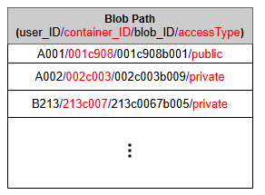
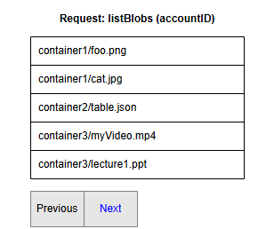

# Аспекты проектирования Blob-хранилища

Узнайте больше деталей о различных аспектах проектирования blob-хранилища.

## Введение

Несмотря на то, что мы подробно обсудили проектирование системы blob-хранилища и ее основные компоненты в предыдущем уроке, ряд интересных вопросов все еще требует ответов. Например, как мы храним большие blob-объекты? Храним ли мы их на одном диске, на одной машине или делим их на чанки? Сколько реплик blob-объекта следует создать для обеспечения надежности и доступности? Как быстро искать и извлекать blob-объекты? Это лишь некоторые из вопросов, которые могут возникнуть.

Этот урок посвящен этим важным аспектам проектирования. В таблице ниже кратко изложены цели этого урока.

#### Краткое содержание урока

| Раздел | Назначение |
| :--- | :--- |
| Метаданные Blob-объектов | Это метаданные, которые поддерживаются для обеспечения эффективного хранения и извлечения blob-объектов. |
| Партиционирование | Определяет, как blob-объекты разделяются между различными узлами данных. |
| Индексация Blob-объектов | Показывает, как эффективно искать blob-объекты. |
| Пагинация | Учит нас, как разработать метод извлечения ограниченного количества blob-объектов для улучшения читаемости и времени загрузки. |
| Репликация | Учит нас, как реплицировать blob-объекты, и говорит, сколько копий следует поддерживать для улучшения доступности. |
| Сборка мусора | Учит нас, как удалять blob-объекты без ущерба для производительности. |
| Потоковая передача | Учит нас, как передавать большие файлы по частям для обеспечения интерактивности для пользователей. |
| Кэширование | Показывает, как улучшить время отклика и пропускную способность. |

Прежде чем мы ответим на перечисленные выше вопросы, давайте посмотрим, как мы создаем уровни абстракции для пользователя, чтобы скрыть внутреннюю сложность blob-хранилища. Эти уровни абстракции также помогают нам принимать решения, связанные с проектированием.

Существует три уровня абстракции:

1.  **Учетная запись пользователя:** На этом уровне пользователи однозначно идентифицируются по своему `account_ID`. Blob-объекты, загруженные пользователями, хранятся в их контейнерах.
2.  **Контейнер:** У каждого пользователя есть набор контейнеров, которые все однозначно идентифицируются по `container_ID`. Эти контейнеры содержат blob-объекты.
3.  **Blob:** Этот уровень содержит информацию о blob-объектах, которые однозначно идентифицируются по их `blob_ID`. Этот уровень хранит информацию о метаданных blob-объектов, которая жизненно важна для достижения доступности и надежности системы.

Мы можем принимать решения о маршрутизации, хранении и шардинге на основе этих уровней. В таблице ниже эти уровни обобщены.

#### Иерархическая информация

| Уровень | Уникально идентифицируется | Информация | Шардируется по | Сопоставление |
| :--- | :--- | :--- | :--- | :--- |
| Учетная запись blob-хранилища пользователя | `account_ID` | список `container_ID` | `account_ID` | Учетная запись -> список контейнеров |
| Контейнер | `container_ID` | список `blob_ID` | `container_ID` | Контейнер -> список blob-объектов |
| Blob | `blob_ID` | {список чанков, chunkInfo: ID узлов данных,..} | `blob_ID` | Blob -> список чанков |

> **Примечание:** Мы генерируем уникальные ID для учетных записей пользователей, контейнеров и blob-объектов с помощью генератора уникальных ID.

Помимо хранения фактических данных blob-объектов, мы должны поддерживать некоторые метаданные для управления blob-хранилищем. Давайте посмотрим, что это за данные.

## Метаданные Blob-объектов

Когда пользователь загружает blob-объект, он разбивается на **чанки** небольшого размера, чтобы поддерживать хранение больших файлов, которые не могут поместиться в одном непрерывном месте, на одном узле данных или в одном блоке диска, связанного с этим узлом данных. Чанки одного blob-объекта затем хранятся на разных узлах данных, у которых достаточно свободного места для их хранения. В хранилище хранятся миллиарды blob-объектов. Управляющий узел должен хранить всю информацию о чанках blob-объекта и о том, где они хранятся, чтобы он мог извлекать чанки при чтении. Управляющий узел присваивает ID каждому чанку.

Информация о blob-объекте состоит из ID чанков и имени назначенного узла данных для каждого чанка. Мы разбиваем blob-объекты на чанки одинакового размера. Чанки реплицируются, чтобы они могли справляться со сбоями узлов данных. Следовательно, мы также храним ID реплик для каждого чанка. У нас есть доступ ко всей этой информации, относящейся к каждому blob-объекту.

Допустим, у нас есть blob-объект размером 128 МБ, и мы разбиваем его на два чанка по 64 МБ каждый. Метаданные для этого blob-объекта показаны в следующей таблице:

#### Метаданные Blob-объекта

| Чанк | ID узла данных | ID реплики 1 | ID реплики 2 | ID реплики 3 |
| :--- | :--- | :--- | :--- | :--- |
| 1 | d1b1 | r1b1 | r2b1 | r3b1 |
| 2 | d1b2 | r1b2 | r2b2 | r3b2 |

> **Примечание:** Как проектировщики, мы должны выбрать разумный размер чанка для данных blob. Мы можем решить оставить выбранный размер чанка фиксированным для всего blob-хранилища (то есть мы не хотим разрешать приложениям использовать разные размеры чанков для разных файлов, чтобы уменьшить сложность реализации). Если мы сделаем размер чанка слишком маленьким, это увеличит размер метаданных (часто на чанк), что нежелательно для нашего проекта с одним управляющим узлом. А если мы выберем слишком большой размер чанка, базовые диски могут быть не в состоянии записывать данные в смежные места, и мы можем получить более низкую производительность чтения/записи. Поэтому нам нужно найти разумный размер чанка, который удовлетворяет как потребности наших приложений, так и может обеспечить хорошую производительность от базового оборудования. Существует множество переменных, которые могут влиять на производительность чтения/записи, такие как размер чанка, тип базового хранилища (вращающиеся диски или флэш-диски), характеристики рабочей нагрузки (последовательное чтение/запись или случайное чтение/запись, операции с полным блоком данных или потоковое чтение/запись) и т. д. Предполагая, что мы используем вращающиеся диски, где сектор является единицей чтения и записи, полезно сделать размер чанка целочисленным кратным размеру сектора.

Мы поддерживаем три реплики для каждого блока. При записи blob-объекта управляющий узел определяет узлы данных и реплик с помощью своей системы управления свободным пространством. Помимо обработки сбоев узлов данных, узлы-реплики также используются для обслуживания запросов на чтение/запись, чтобы основной узел не был перегружен.

В приведенном выше примере размер blob-объекта кратен размеру чанка, поэтому управляющий узел может определить, сколько байтов читать для каждого чанка.

> **Вопрос для размышления:** Что, если размер blob-объекта не кратен нашему настроенному размеру чанка? Как управляющий узел узнает, сколько байтов читать для последнего чанка?
> 

>  
<b>Показать</b>

> Если размер большого двоичного объекта не кратен размеру блока, последний блок не будет заполнен.
>
> Узел manager также сохраняет размер каждого большого двоичного объекта, чтобы определить количество байт для чтения в последнем блоке
>
>  

## Партиционирование данных

Мы говорили о различных уровнях абстракции в blob-хранилище — уровне учетной записи, уровне контейнера и уровне blob. Хранятся и читаются миллиарды blob-объектов. Существует большое количество узлов данных, на которых мы храним эти blob-объекты. Если мы будем искать узлы данных, содержащие определенные blob-объекты, среди всех узлов данных, это будет очень медленный процесс. Вместо этого мы можем сгруппировать узлы данных и назвать каждую группу **партицией**. Мы поддерживаем таблицу карты партиций, которая содержит список всех blob-объектов в каждой партиции. Если мы распределим blob-объекты по разным партициям независимо от их ID контейнеров и ID учетных записей, мы столкнемся с проблемой, как показано на следующей иллюстрации:

*Изображение: Диапазонное партиционирование на основе ID blob-объектов*

Партиционирование на основе ID blob-объектов вызывает определенные проблемы. Например, blob-объекты в определенном контейнере или учетной записи могут находиться в разных партициях, что добавляет накладных расходов при чтении или перечислении blob-объектов, связанных с определенной учетной записью или контейнером.

Чтобы преодолеть описанную выше проблему, мы можем партиционировать blob-объекты на основе полного пути к blob. Ключом партиционирования здесь является комбинация ID учетной записи, ID контейнера и ID blob. Это помогает размещать blob-объекты для одного пользователя на одном сервере партиции, что повышает производительность.

> **Примечание:** **Сопоставления партиций** поддерживаются управляющим узлом, и эти сопоставления хранятся в распределенном хранилище метаданных.

## Индексация Blob-объектов

Поиск конкретных blob-объектов в море blob-объектов становится все труднее и отнимает больше времени с увеличением количества blob-объектов, загружаемых в хранилище. **Индекс blob-объектов** решает проблему управления и запросов к blob-объектам.

Для заполнения индекса blob-объектов мы определяем атрибуты тегов ключ-значение для blob-объектов при их загрузке. Мы используем несколько тегов, таких как имя контейнера, имя blob, дата и время загрузки, а также некоторые другие категории, например, blob-объект изображения или видео, и так далее.

Как показано на следующей иллюстрации, движок индексации blob-объектов считывает новые теги, индексирует их и предоставляет их для поиска в индексе blob-объектов:

*Изображение: Индексация и поиск blob-объектов*

Мы можем как категоризировать, так и сортировать blob-объекты с помощью индексации. Давайте посмотрим, как мы используем индексацию в пагинации.

## Пагинация для списков

**Вывод списка** — это возвращение пользователю списка blob-объектов в зависимости от введенного пользователем префикса. **Префикс** — это символ или строка, которые возвращают blob-объекты, имя которых начинается с этого символа или строки.

Пользователи могут захотеть получить список всех blob-объектов, связанных с определенной учетной записью, всех blob-объектов, присутствующих в определенном контейнере, или они могут захотеть получить список некоторых общедоступных blob-объектов на основе префикса. Проблема в том, что этот список может быть очень длинным. Мы не можем вернуть весь список пользователю за один раз. Таким образом, мы должны возвращать список blob-объектов по частям.

*Изображение: Пагинация*

Допустим, пользователь хочет получить список blob-объектов, связанных с его учетной записью, и всего с этой учетной записью связано 2000 blob-объектов. Поиск, возврат и загрузка слишком большого количества blob-объектов за один раз влияют на производительность. Именно здесь важна пагинация. Мы можем вернуть первые пять результатов и предоставить пользователям кнопку `next`. При каждом нажатии кнопки `next` возвращаются следующие пять результатов. Это называется **пагинация**.

Владельцы приложений устанавливают количество возвращаемых результатов в зависимости от следующих факторов:

*   Сколько времени, по их мнению, пользователи должны ждать ответа на запрос.
*   Сколько результатов они могут вернуть за это время.

Мы показали пять результатов на странице, что является очень небольшим числом. Мы используем это число только для целей визуализации.

> **Вопрос для размышления:** Как мы решаем, какие пять blob-объектов вернуть первыми из 2000?
> 

>  
<b>Показать</b>

> Здесь мы используем индексацию для сортировки и категоризации больших двоичных объектов. Мы должны сделать это заранее, пока храним большие двоичные объекты. В противном случае при возврате списка пользователю возникнет проблема. Там могут быть миллионы или миллиарды больших двоичных объектов, и мы не сможем быстро отсортировать их при получении запроса списка.
>  

Для пагинации нам нужен **токен продолжения (continuation token)** в качестве отправной точки для части списка, которая будет возвращена следующей. Токен продолжения — это строковый токен, который включается в ответ на запрос, если общее количество запрошенных результатов превышает максимальное количество результатов, которые мы можем вернуть за один раз. В результате он служит указателем, позволяя повторному запросу продолжить с того места, где мы остановились.

## Репликация

**Репликация** выполняется на двух уровнях для обеспечения доступности и строгой согласованности. Чтобы поддерживать строгую согласованность данных, мы синхронно реплицируем данные между узлами, которые используются для обслуживания запросов на чтение, сразу после выполнения операции записи. Для обеспечения доступности мы можем реплицировать данные в разные регионы или дата-центры после выполнения операции записи. Мы не обслуживаем запрос на чтение из другого дата-центра или регионов, пока не реплицируем туда данные.

Вот два уровня репликации:

*   *Синхронная репликация* внутри кластера хранения.
*   *Асинхронная репликация* между дата-центрами и регионами.

### Синхронная репликация внутри кластера хранения

**Кластер хранения** состоит из `N` стоек узлов хранения, каждая из которых сконфигурирована как домен отказа с избыточной сетью и питанием.

Мы обеспечиваем, чтобы все данные, записанные в кластер хранения, оставались долговечными внутри этого кластера. Управляющий узел поддерживает достаточное количество реплик данных на узлах в разных доменах отказа, чтобы обеспечить долговечность данных внутри кластера в случае сбоя диска, узла или стойки.

> **Примечание:** Эта внутрикластерная репликация выполняется на критическом пути запросов на запись клиента.

Успех может быть возвращен клиенту после того, как запись была синхронно реплицирована внутри этого кластера хранения. Это позволяет выполнять **быстрые записи**, потому что:

*   Мы реплицируем данные внутри кластера хранения, где все узлы находятся рядом, что снижает задержку.
*   Мы используем встроенное копирование данных, где мы используем избыточные сетевые пути для параллельного копирования данных на все реплики.

Этот метод репликации помогает поддерживать согласованность и доступность данных внутри кластера хранения.

### Асинхронная репликация между дата-центрами и регионами

Дата-центры blob-хранилища находятся в разных регионах — например, в Азиатско-Тихоокеанском регионе, Европе, восточной части США и др. В каждом регионе у нас есть более одного дата-центра, расположенных в разных местах, так что если один дата-центр выйдет из строя, у нас есть другие дата-центры в том же регионе, чтобы вмешаться и обслуживать запросы пользователей. В каждом регионе есть как минимум три дата-центра, каждый из которых находится на расстоянии нескольких миль для защиты от локальных событий, таких как пожары, наводнения и т. д.

Количество копий blob-объекта называется **коэффициентом репликации**. В большинстве случаев коэффициента репликации, равного **трем**, достаточно.

*Изображение: Регионы и зоны доступности. Темно-желтый — это основные данные, светло-желтый — реплики.*

Мы храним три копии blob-объекта. Одна — это локальная копия внутри дата-центра в основном регионе для защиты от сбоев серверных стоек и дисков. Вторая копия blob-объекта размещается в другом дата-центре в том же регионе для защиты от пожара или наводнения в дата-центре. Третья копия размещается в дата-центре другого региона для защиты от региональных катастроф.

## Сборка мусора при удалении blob-объекта

Поскольку чанки blob-объектов размещаются на разных узлах данных, удаление со многих разных узлов занимает время, и заставлять клиента ждать, пока это не будет сделано, — нежизнеспособный вариант. Из-за оптимизации задержки в реальном времени мы на самом деле не удаляем blob-объект из blob-хранилища по запросу на удаление. Вместо этого мы просто помечаем blob-объект как «УДАЛЕННЫЙ» в метаданных, чтобы сделать его недоступным для пользователя. Blob-объект удаляется позже после ответа на запрос пользователя на удаление.

Пометка blob-объекта как удаленного, но не фактическое его удаление в данный момент, вызывает внутренние несоответствия метаданных, что означает, что объекты продолжают занимать место в хранилище, которое должно быть свободным. Эти несоответствия метаданных не влияют на пользователя. Например, для blob-объекта, помеченного как удаленный в метаданных, у нас все еще есть записи о чанках этого blob-объекта в метаданных. Узлы данных все еще хранят чанки этого blob-объекта. Поэтому у нас есть служба под названием **сборщик мусора**, которая позже очищает несоответствия метаданных. Удаление blob-объекта приводит к освобождению связанных с ним чанков. Однако может быть заметная временная задержка между временем удаления blob-объекта пользователем и временем соответствующего увеличения свободного места в blob-хранилище. Мы можем смириться с этой заметной временной задержкой, потому что взамен мы получаем преимущество быстрого ответа в реальном времени на запрос пользователя на удаление blob-объекта.

Весь процесс удаления показан на следующей иллюстрации:

1) В хранилище больших двоичных объектов загружены три больших двоичных объекта. На диске 1 хранятся все три больших двоичных
   объекта

2) Пользователь отправляет запрос на удаление большого двоичного объекта с идентификатором b903
   

3) API удаления больших двоичных объектов просматривает таблицу больших двоичных объектов, чтобы удалить b903
   

4) Запись для большого двоичного объекта b903 удаляется из таблицы больших двоичных объектов, чтобы никто больше не мог получить доступ к этому большому двоичному объекту. Сборщик мусора собирает запись большого двоичного объекта
   

5) После пометки большого двоичного объекта как удаленного в API удаления больших двоичных объектов отправляется подтверждение
   

6) API удаления больших двоичных объектов быстро сообщает пользователю, что большой двоичный объект был удален
   

7) Запрос пользователя был обработан быстро, но имеются несоответствия в метаданных. Позже сборщик мусора устранит эти несоответствия
   

8) Сборщик мусора удаляет байты, записанные для b903, с диска 1
   

9) Процесс узла данных, запущенный на диске, обновляет узел метаданных о последнем списке больших двоичных объектов, который у него есть
   

10) Узел метаданных обновляет таблицу информации о диске. Несоответствия были устранены
    

## Потоковая передача файла

Для потоковой передачи файла нам нужно определить, сколько байтов разрешено считывать за один раз. Допустим, мы каждый раз считываем `X` байт. В первый раз мы считываем первые `X` байт, начиная с 0-го байта (от `0` до `X-1`), а в следующий раз — следующие `X` байт (от `X` до `2X-1`).

> **Вопрос для размышления:** Как мы узнаем, какие байты мы прочитали первыми, а какие нужно прочитать следующими?
> 

>  
<b>Показать</b>

> Мы можем использовать значение смещения, чтобы отслеживать байт, с которого нам нужно начать чтение снова.
>  

## Кэширование blob-хранилища

Кэширование может происходить на нескольких уровнях. Ниже приведены некоторые примеры:

*   Метаданные чанков blob-объекта кэшируются на стороне клиента при первом чтении. Клиент может напрямую обращаться к узлам данных, не связываясь с управляющим узлом, чтобы прочитать тот же blob-объект во второй раз.
*   На **фронтенд-серверах** мы кэшируем карту партиций и используем ее для определения, на какой сервер партиции пересылать каждый запрос.
*   Часто используемые чанки кэшируются на **управляющем узле**, что помогает нам эффективно передавать большие объекты потоком. Это также снижает количество операций ввода-вывода диска.

> **Примечание:** Кэширование blob-хранилища обычно выполняется с помощью **CDN**. Служба blob-хранилища Azure кэширует общедоступные blob-объекты в сети доставки контента Azure до истечения TTL (время жизни) этого blob-объекта. Исходный сервер определяет TTL, а CDN определяет его из заголовка `Cache-Control` в HTTP-ответе от исходного сервера.

Мы рассмотрели факторы проектирования, которые следует учитывать при проектировании blob-хранилища. Теперь мы оценим то, что мы спроектировали.